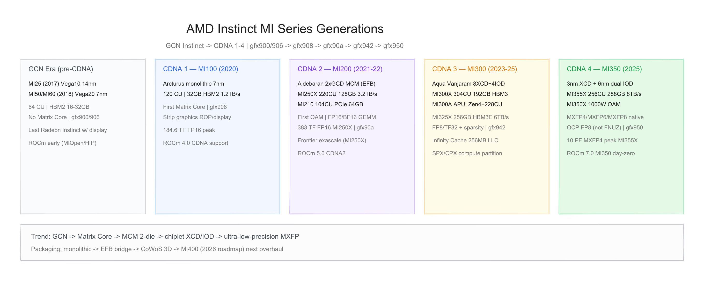
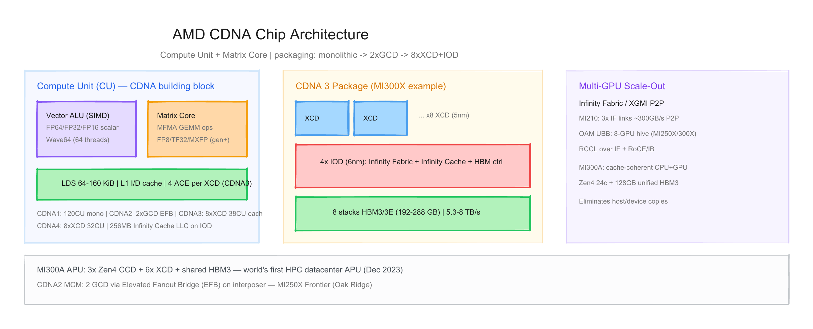
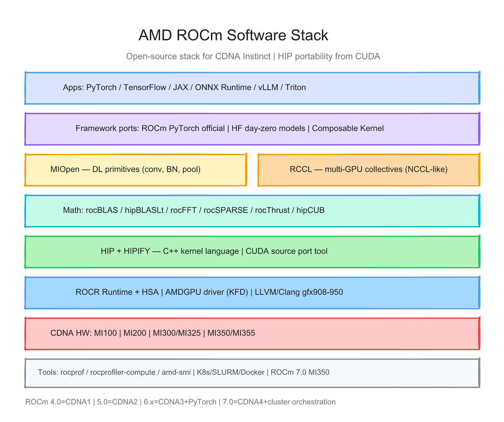

# AMD Instinct MI 系列每代芯片的硬件与软件调研报告

> 截至日期：2026 年 6 月 26 日。AMD Instinct **MI 系列**是数据中心 GPU/APU 加速器产品线，自 2017 年起从 **GCN（Graphics Core Next）** 演进到专用计算架构 **CDNA（Compute DNA）**。公开硅代际：**GCN Instinct（MI25/MI50/MI60）→ CDNA 1（MI100）→ CDNA 2（MI210/MI250/MI250X）→ CDNA 3（MI300A/MI300X/MI325X）→ CDNA 4（MI350X/MI355X）**；软件以开源 **ROCm** 栈为核心，**HIP** 提供 CUDA 可移植性。本报告按「硬件架构 + 软件栈」梳理代际差异，并给出三张架构图。

---

## 一、世代总览

| 阶段 | 芯片 | 架构 | 工艺 | 封装 | CU / Matrix | 内存 | 峰值带宽 | 峰值算力（公开） | 形态 | 发布 |
|---|---|---|---|---|---|---|---|---|---|---|
| **GCN** | **MI25** | GCN 5.0 (Vega10) | **14nm** | Monolithic | **64** CU | **16 GB** HBM2 | **484 GB/s** | FP16 **24.6 TF** | PCIe | **2017-06** |
| **GCN** | **MI50/MI60** | GCN 5.1 (Vega20) | **7nm** | Monolithic | **60/64** CU | **16–32 GB** HBM2 | **1.0 TB/s** | FP16 **59 TOPS** (MI60) | PCIe 4.0 | **2018-11** |
| **CDNA 1** | **MI100** | CDNA (Arcturus) | **7nm** | Monolithic | **120** CU | **32 GB** HBM2 | **1.2 TB/s** | FP16 **184.6 TF** | PCIe 4.0 | **2020-11** |
| **CDNA 2** | **MI210** | CDNA 2 (Aldebaran) | **6nm** | **1× GCD** | **104** CU | **64 GB** HBM2e | **1.6 TB/s** | FP16 **181 TF** | PCIe 4.0 | **2022-03** |
| **CDNA 2** | **MI250/MI250X** | CDNA 2 | **6nm** | **2× GCD** MCM | **208/220** CU | **128 GB** HBM2e | **3.2 TB/s** | FP16 **383 TF** (250X) | **OAM** | **2021-11** |
| **CDNA 3** | **MI300A** | CDNA 3 (Antares) | **5nm+6nm** | **6× XCD + 3× Zen4** | **228** CU + **24** CPU核 | **128 GB** HBM3 统一 | **5.3 TB/s** | FP16 **980 TF** (sparse 1.96 PF) | **APU SH5** | **2023-12** |
| **CDNA 3** | **MI300X** | CDNA 3 (Aqua Vanjaram) | **5nm+6nm** | **8× XCD + 4× IOD** | **304** CU | **192 GB** HBM3 | **5.3 TB/s** | FP8 **2.6 PF** (sparse 5.2 PF) | **OAM** | **2023 H2** |
| **CDNA 3** | **MI325X** | CDNA 3 | 同 MI300 | 同 MI300 | **304** CU | **256 GB** HBM3E | **6 TB/s** | FP8 **2.6 PF** | OAM | **2024 Q4** |
| **CDNA 4** | **MI350X** | CDNA 4 | **3nm+6nm** | **8× XCD + 2× IOD** | **256** CU | **288 GB** HBM3E | **8 TB/s** | FP8 **4.6 PF** | OAM | **2025-06** |
| **CDNA 4** | **MI355X** | CDNA 4 | 同 MI350 | 同 MI350 | **256** CU | **288 GB** HBM3E | **8 TB/s** | **MXFP4 10 PF** | OAM | **2025-06** |
| **规划** | **MI400** | 下一代 | — | — | — | — | — | — | — | **2026E** |

**命名注意**：
- **CDNA** 与 **RDNA**（游戏/工作站）为 AMD GPU 两条产品线；Instinct MI 自 MI100 起走 CDNA。
- **MI200 系列**在文档中常写 **MI2XX**，含 MI210（单 die PCIe）、MI250/MI250X（双 die OAM）。
- **MI325X** 为 MI300X 的 **HBM3E 容量/带宽 refresh**，架构仍为 CDNA 3（gfx942）。
- **LLVM target**：gfx900/906（GCN）→ gfx908（CDNA1）→ gfx90a（CDNA2）→ gfx942（CDNA3）→ gfx950（CDNA4）。

代际间关键趋势：**剥离图形单元 → Matrix Core → 双 die MCM → 多 chiplet XCD/IOD + Infinity Cache → 统一内存 APU → MXFP4/6 超低精度**；软件 **ROCm 与 CDNA 代际同步**，PyTorch 官方包与 Hugging Face 合作深化。

---

## 二、硬件架构演进

### 2.1 设计哲学 — GPGPU + Matrix Core，对标 NVIDIA CUDA 生态

AMD Instinct 走 **SIMD Vector ALU + 专用 Matrix Core（MFMA）** 的 GPGPU 路线，与 NVIDIA Tensor Core 类似但指令集为 **AMD MFMA**。相对专用 AI 芯片（Cerebras、Graphcore 等），MI 系列强调：

| 维度 | AMD Instinct MI | 典型专用 AI 加速器 |
|---|---|---|
| 编程模型 | **HIP/CUDA 可移植** + 开源 ROCm | 厂商专有编译器/图编译 |
| 内存 | **HBM** + 片上 **Infinity Cache**（CDNA3+） | 片上 SRAM 或 HBM 为主 |
| 扩展 | **Infinity Fabric / XGMI** + **RCCL** | 专有互联 |
| 形态 | PCIe / OAM / APU | 多为 appliance 或 OAM |
| 精度演进 | FP64 HPC 保留 → FP8/TF32 → **MXFP4/6** | 常聚焦 FP8/INT8 |

> 「The building block for AMD ROCm is HIP… a single codebase using HIP will produce high-performance code for GPUs from AMD and other companies.」（[CDNA 3 White Paper](https://www.amd.com/content/dam/amd/en/documents/instinct-tech-docs/white-papers/amd-cdna-3-white-paper.pdf)）

### 2.2 GCN 时代 — MI25 / MI50 / MI60（2017–2018）

Instinct 初代基于 **Vega** 游戏架构改造，仍称 **Radeon Instinct**，保留显示输出能力（MI60 为末代）。

| 项目 | MI25 | MI50 | MI60 |
|---|---|---|---|
| 架构 | GCN 5.0 Vega10 | GCN 5.1 Vega20 | GCN 5.1 Vega20 |
| CU / SP | 64 / 4096 | 60 / 3840 | 64 / 4096 |
| 内存 | 16 GB HBM2 | 16/32 GB HBM2 | 32 GB HBM2 |
| FP64 速率 | 1/16 峰值 | **1/2** 峰值 | **1/2** 峰值 |
| TDP | 300 W | 300 W | 300 W |
| LLVM | gfx900 | gfx906 | gfx906 |

**意义**：验证 Instinct 品牌与 HBM 数据中心形态；**无 Matrix Core**，AI 算力依赖 FP16 向量单元。ROCm 早期已支持 MIOpen/HIP，但 CDNA 专用优化尚未出现。

### 2.3 CDNA 1 — MI100 / Arcturus（2020）

2020 年 11 月发布，**CDNA 架构首颗量产硅**（[Wikipedia CDNA](https://en.wikipedia.org/wiki/CDNA_(microarchitecture))）。

| 项目 | MI100 |
|---|---|
| Die | Arcturus **750 mm²**，**25.6B** 晶体管 |
| CU | **120**（每 CU 含 **Matrix Core**） |
| 内存 | **32 GB** HBM2，**4096-bit**，**1.2 TB/s** |
| 峰值 | FP16 **184.6 TF**；FP64 **23.1 TF** |
| 互联 | PCIe 4.0 ×16 |
| 移除 | ROP、显示引擎、图形 cache 等；保留 **VCN** 视频解码 |
| TDP | 300 W |

**Matrix Core**：类似 NVIDIA Volta Tensor Core，支持矩阵乘加（MFMA）；CDNA 1 支持 FP32 GEMM 但 **无 FP16/BF16 GEMM、无 TF32/FP8**（[ROCm CDNA 性能模型](https://rocm.docs.amd.com/projects/rocprofiler-compute/en/develop/conceptual/cdna/cdna-performance-model.html)）。

### 2.4 CDNA 2 — MI210 / MI250 / MI250X / Aldebaran（2021–2022）

CDNA 2 引入 **MCM 双 Graphics Compute Die（GCD）**，通过 **Elevated Fanout Bridge（EFB）** 互连（[CDNA 2 White Paper](https://www.amd.com/content/dam/amd/en/documents/instinct-business-docs/white-papers/amd-cdna2-white-paper.pdf)）。

| 项目 | MI210 | MI250 | MI250X |
|---|---|---|---|
| GCD 数 | **1** | **2** | **2** |
| CU | **104** | **208** | **220** |
| 内存 | **64 GB** HBM2e | **128 GB** HBM2e | **128 GB** HBM2e |
| 带宽 | **1.6 TB/s** | **3.2 TB/s** | **3.2 TB/s** |
| 形态 | **PCIe** 卡 | **OAM**（首个 OCP OAM Instinct） | OAM |
| TDP | 300 W | 560 W | 560 W |
| FP16 峰值 | 181 TF | 362 TF | **383 TF** |

**系统意义**：
- **MI250X** 驱动 **Frontier**（Oak Ridge）成为首台 **Exascale** 超算（与 EPYC CPU + Infinity Fabric 缓存一致性）。
- **MI210** 将 CDNA 2 带入标准 **PCIe 服务器**，3× **Infinity Fabric** 链路可达 **~300 GB/s P2P**。
- Matrix Core 新增 **FP16/BF16/INT8 GEMM** 全速率支持。

### 2.5 CDNA 3 — MI300A / MI300X / MI325X（2023–2025）

CDNA 3 采用 **异构 chiplet + 3D 封装**（CoWoS/InFO），单 package **最多 13 颗 die**（8× **XCD** + 4× **IOD** + 可选 CPU die）（[CDNA 3 White Paper](https://www.amd.com/content/dam/amd/en/documents/instinct-tech-docs/white-papers/amd-cdna-3-white-paper.pdf)）。

**XCD（Accelerator Complex Die，5nm）**：
- 每 XCD **38 活跃 CU**（40 物理，2 禁用 yield），**4 ACE**，**4 MB L2**
- 共 **304 CU**（MI300X/MI325X）

**IOD（6nm）**：
- **Infinity Fabric** 交换、**HBM3/3E 控制器**、**256 MB Infinity Cache（LLC）**
- 支持 **cache coherency**

| 项目 | MI300X | MI300A | MI325X |
|---|---|---|---|
| GPU CU | **304** | **228**（减 25% 换 CPU） | **304** |
| CPU | — | **24× Zen 4**（3 CCD） | — |
| 内存 | **192 GB** HBM3 | **128 GB** HBM3 **统一** | **256 GB** HBM3E |
| 带宽 | **5.3 TB/s** | **5.3 TB/s** | **6 TB/s** |
| FP8 峰值 | **2.6 PF**（sparse **5.2 PF**） | **1.96 PF** FP16 sparse | 同 MI300X 级 |
| TDP | 750 W | 550 W（液冷 760 W） | 1000 W |
| 新精度 | **FP8（FNUZ）**、**TF32**、**结构化稀疏** | 同左 | HBM3E refresh |

**MI300A APU**：全球首款高性能数据中心 **APU**，CPU/GPU **共享 HBM 地址空间**，消除 host/device 拷贝；El Capitan（LLNL）等超算采用。

**分区模式**（MI300X/MI325X/MI35XX）：
- **Compute Partition**：SPX（默认单分区）/ CPX（每 XCD 逻辑设备）/ DPX 等
- **Memory Partition（NPS）**：NPS1 / NPS2 / NPS4，控制 HBM stack 可见性（[ROCm compute-memory modes](https://rocm.blogs.amd.com/software-tools-optimization/compute-memory-modes/README.html)）
- **MI210 不支持** 计算/内存分区

### 2.6 CDNA 4 — MI350X / MI355X（2025）

2025 年 6 月发布（[MI355X 产品页](https://www.amd.com/en/products/accelerators/instinct/mi350/mi355x.html)），**gfx950**。

| 项目 | MI350X | MI355X |
|---|---|---|
| 工艺 | TSMC **3nm** XCD + **6nm** IOD | 同左 |
| CU | **256**（8× XCD × 32 CU） | 256 |
| 内存 | **288 GB** HBM3E | 288 GB HBM3E |
| 带宽 | **8 TB/s** | 8 TB/s |
| TDP | 1000 W | **1400 W** |
| 新精度 | **MXFP8/6/4**（OCP microscaling） | 同左，MXFP4/6 **10 PF** 峰值 |
| FP8 | **OCP FP8**（非 CDNA3 的 FNUZ） | 5 PF OCP-FP8 |
| TF32 | **移除硬件**，改 BF16 软件模拟 | 同左 |

**相对 MI325X**：MI355X 算力约 **2×**（FP16/FP8），原生 **FP4/FP6** 支持大模型长上下文（vendor 称单卡可达 **4.2T 参数** 叙事 vs MI325X **1.8T**）。

**MI400**：AMD 公开路线图 **2026** 下一代架构大改（[ServeTheHome](https://www.servethehome.com/amd-instinct-mi325x-launched-and-the-mi355x-is-coming/)），细节未披露。

---

## 三、软件栈演进

### 3.1 核心原则 — 开源 ROCm + HIP 可移植

ROCm 是 **以开源为主** 的分层软件栈：驱动 → HSA/ROCR → HIP/编译器 → 数学/ML 库 → 框架（[What is ROCm](https://rocm.docs.amd.com/en/docs-7.2.0/what-is-rocm.html)）。

### 3.2 栈内关键组件

| 层级 | 组件 | 作用 |
|---|---|---|
| 框架 | **PyTorch ROCm**、TensorFlow ROCm、JAX、ONNX Runtime | 用户训练/推理入口 |
| ML 库 | **MIOpen** | conv/BN/pool/activation 等 DL 原语 |
| 集合通信 | **RCCL** | AllReduce/AllGather 等，NCCL API 兼容 |
| 高性能 GEMM | **Composable Kernel**、hipBLASLt | 融合 kernel、LLM 算子 |
| 可移植层 | **HIP** + **HIPIFY** | CUDA → HIP 源码迁移 |
| 运行时 | **ROCR**、AMDGPU/KFD 驱动 | 内核提交、内存管理 |
| 编译 | **LLVM/Clang** | gfx908/90a/942/950 后端 |
| 工具 | rocprof、rocprofiler-compute、**amd-smi** |  profiling、分区管理 |

### 3.3 ROCm 版本 × CDNA 代际里程碑

| ROCm 版本 | 时期 | 硬件支持 | 里程碑 |
|---|---|---|---|
| **1.x–2.x** | 2016–2019 | GCN Instinct | HIP 诞生；HIPIFY 演示 Caffe/Torch7 移植 |
| **3.0** | ~2020 | GCN + 早期 CDNA | **Infinity Fabric**；**RCCL** 发布；PyTorch upstream |
| **4.0** | ~2021 | **CDNA 1 / MI100** | 官方 CDNA 架构支持 |
| **5.0** | ~2022 | **CDNA 2 / MI200** | PyTorch **官方包** |
| **6.x** | 2023–2025 | **CDNA 3 / MI300** | Hugging Face 合作；PyTorch 2.0 day-zero；Frontier 1T 参数训练 |
| **7.0** | 2025 | **CDNA 4 / MI350** | MI350 系列完整支持；集群编排增强 |

（来源：[AMD ROCm 产品页](https://www.amd.com/en/products/software/rocm.html)、[GitHub ROCm](https://github.com/ROCm/ROCm/)）

### 3.4 框架与生态

| 能力 | 说明 |
|---|---|
| **PyTorch** | `pip install torch` ROCm 构建；MI300/MI350 推理优化文档（[ROCm for AI](https://rocm.docs.amd.com/en/develop/how-to/rocm-for-ai/inference-optimization/workload.html)） |
| **vLLM / Triton** | LLM serving 与 kernel 编写社区支持持续增强 |
| **HIP 可移植** | 同一 HIP 源码可目标 AMD/NVIDIA（通过 hipcc 或 HIPIFY） |
| **容器/K8s** | Docker、Kubernetes、SLURM 集成（ROCm 3.0+ 叙事） |
| **虚拟化** | AMD Instinct Virtualization Driver；MI300 **SR-IOV** + 分区 |

### 3.5 硬件代际 × 软件能力矩阵

| 能力 | MI100 | MI200 | MI300/MI325 | MI350/MI355 |
|---|---|---|---|---|
| HIP / HIPIFY | ✅ | ✅ | ✅ | ✅ |
| MIOpen FP16/BF16 | 部分 | ✅ GEMM | ✅ + FP8 | ✅ + MXFP |
| RCCL 多卡 | ✅ | ✅ | ✅ | ✅ |
| Composable Kernel | 早期 | ✅ | ✅ LLM 主力 | ✅ |
| PyTorch 官方 wheel | — | ✅ | ✅ day-zero | ✅ ROCm 7 |
| TF32 硬件 | ❌ | ❌ | ✅ | ❌（SW） |
| FP8 | ❌ | ❌ | ✅ FNUZ | ✅ OCP |
| MXFP4/6 | ❌ | ❌ | ❌ | ✅ |
| GPU 分区 | ❌ | ❌ MI210 | ✅ SPX/CPX/NPS | ✅ |
| CPU+GPU 统一内存 | ❌ | ❌ | ✅ MI300A | — |

---

## 四、设计哲学的五次转向

**第一次（GCN Instinct，2017–2018）**：用 **Vega + HBM** 进入数据中心，MI50/MI60 强化 **FP64 1/2 速率** 争 HPC；仍保留图形能力，**无 Matrix Core**。

**第二次（CDNA 1 / MI100，2020）**：**计算专用硅**——剥离图形、引入 **Matrix Core**；对标 NVIDIA V100/A100 时代的 HPC+AI 双用途。

**第三次（CDNA 2 / MI200，2021–2022）**：**MCM 扩展**——双 GCD + OAM 形态；**Frontier Exascale** 证明 AMD 多卡扩展；MI210 下沉 PCIe 主流服务器。

**第四次（CDNA 3 / MI300，2023–2025）**：**Chiplet 异构集成**——8× XCD + Infinity Cache + **MI300A APU 统一内存**；**FP8/TF32/稀疏** 对齐 LLM 训练浪潮；**MI325X** 以容量取胜（256 GB HBM3E）。

**第五次（CDNA 4 / MI350，2025）**：**超低精度 MXFP4/6** + **288 GB / 8 TB/s** 内存墙；OCP FP8 对齐行业标准；为 **2026 MI400** 架构大改铺路。

---

## 五、与外部生态及验证缺口

**生态**
- 超算：**Frontier**（MI250X）、**El Capitan**（MI300A）、**HPE Cray** 等
- 云/OEM：Microsoft Azure、Meta、Oracle 等公开采用 MI300 系列（vendor 新闻）
- 相对 NVIDIA：**ROCm/HIP 可移植**是主要差异化；生态广度仍落后 CUDA

**相对竞争格局**
- 优势：**开源栈**、**HBM 容量**（MI325X 256 GB、MI355X 288 GB）、**APU 统一内存**、**FP64 HPC** 传统强项
- 风险：ROCm 版本碎片化、部分框架算子 lag、**peak TFLOPS 与 real workload** 差距、MI 系列 **无 crucible-notes 级 internals 文档**

**本报告标注的验证缺口**
1. **MI25/MI8/MI6** 等更早期 Instinct 本报告仅摘要，未展开软件支持生命周期
2. **MI325X** 与 **MI300X** 共用 gfx942/153B 晶体管计数，差异主要在 **HBM3E 与 TDP**
3. **CDNA 4** 移除 **TF32 硬件**——ROCm 文档称改 **BF16 软件模拟**（[ROCm workload doc](https://rocm.docs.amd.com/en/develop/how-to/rocm-for-ai/inference-optimization/workload.html)）
4. **4.2T / 1.8T 参数** 为 vendor 逻辑叙事，依赖 MXFP 与 KV cache 假设
5. **MI400** 无公开 microarchitecture 细节
6. 第三方站点（Flopper.io 等）算力表与 AMD 官方 datasheet 偶有 **FP16 口径** 差异
7. **gfx942 MI300A** CU 228 vs MI300X 304 的精确 partition 映射以 amd-smi 为准

---

## 六、参考来源

- [ROCm GPU Architecture Specs](https://rocm.docs.amd.com/en/docs-7.1.0/reference/gpu-arch-specs.html)
- [ROCm CDNA Performance Model (CDNA1–4)](https://rocm.docs.amd.com/projects/rocprofiler-compute/en/develop/conceptual/cdna/cdna-performance-model.html)
- [CDNA 3 White Paper PDF](https://www.amd.com/content/dam/amd/en/documents/instinct-tech-docs/white-papers/amd-cdna-3-white-paper.pdf)
- [CDNA 2 White Paper PDF](https://www.amd.com/content/dam/amd/en/documents/instinct-business-docs/white-papers/amd-cdna2-white-paper.pdf)
- [Wikipedia CDNA](https://en.wikipedia.org/wiki/CDNA_(microarchitecture))
- [Wikipedia AMD Instinct](https://en.wikipedia.org/wiki/AMD_Instinct)
- [AMD ROCm 产品页](https://www.amd.com/en/products/software/rocm.html)
- [What is ROCm](https://rocm.docs.amd.com/en/docs-7.2.0/what-is-rocm.html)
- [GitHub ROCm](https://github.com/ROCm/ROCm/)
- [MI355X 产品页](https://www.amd.com/en/products/accelerators/instinct/mi350/mi355x.html)
- [MI210 产品页](https://www.amd.com/en/products/accelerators/instinct/mi200/mi210.html)
- [ROCm MI300/MI350 Workload Optimization](https://rocm.docs.amd.com/en/develop/how-to/rocm-for-ai/inference-optimization/workload.html)
- [ROCm Compute/Memory Partition Modes](https://rocm.blogs.amd.com/software-tools-optimization/compute-memory-modes/README.html)
- [ServeTheHome MI325X/MI355X](https://www.servethehome.com/amd-instinct-mi325x-launched-and-the-mi355x-is-coming/)
- [HPCwire MI355X analysis](https://www.hpcwire.com/2024/10/15/on-paper-amds-new-mi355x-makes-mi325x-look-pedestrian/)

---

## 附：架构图索引

| 图 | 预览 | 源文件 |
|---|---|---|
| MI 世代演进（GCN → CDNA1–4） | `assets/amd_mi_hw_generations.png` | `assets/amd_mi_hw_generations.excalidraw` |
| CDNA 芯片架构（CU/Matrix Core + XCD/IOD + 多卡） | `assets/amd_mi_chip_architecture.png` | `assets/amd_mi_chip_architecture.excalidraw` |
| ROCm 软件栈 | `assets/amd_mi_software_stack.png` | `assets/amd_mi_software_stack.excalidraw` |
