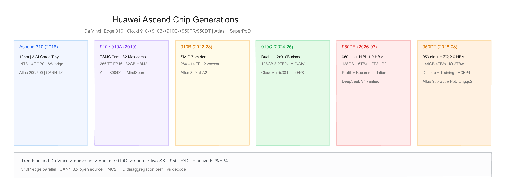
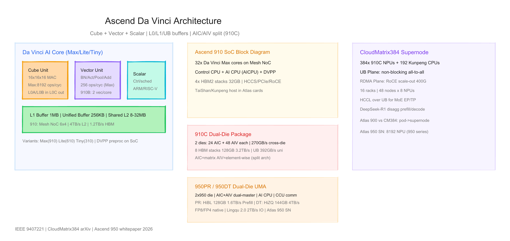
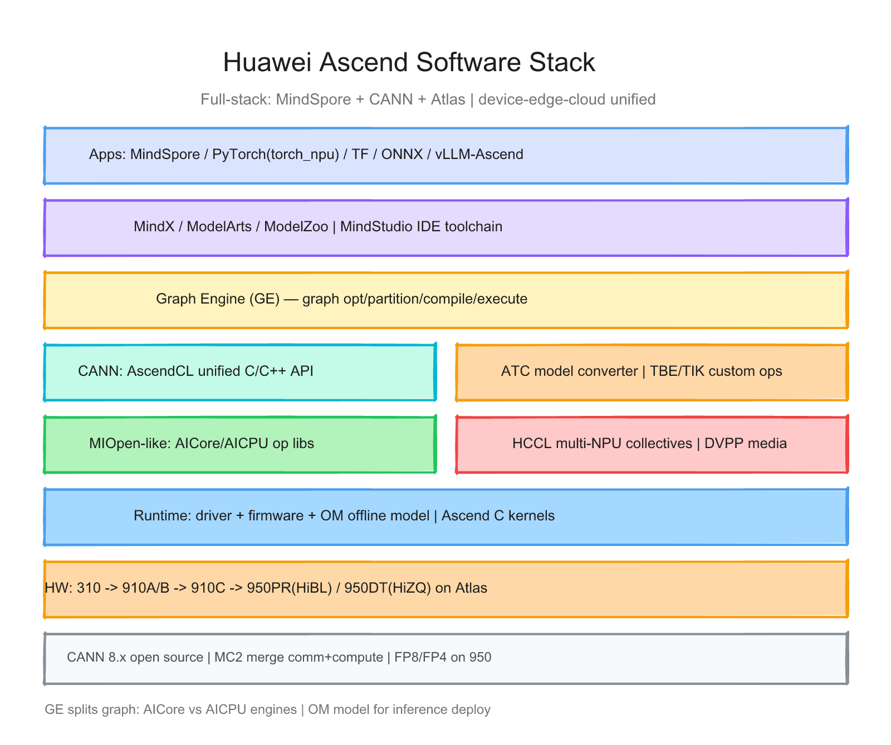

# 华为昇腾（Ascend）每代芯片的硬件与软件调研报告

> 截至日期：2026 年 6 月 26 日。华为 **Ascend（昇腾）** 是面向端、边、云的全场景 AI 处理器系列，统一基于自研 **Da Vinci（达芬奇）** 架构。公开硅代际分两条主线：**边缘推理 Ascend 310 系列（310 → 310P）** 与 **数据中心 Ascend 910 系列（910/910A → 910B → 910C → 950PR/950DT）**；系统产品为 **Atlas** 模块/卡/服务器/集群，超节点 **CloudMatrix384**（910C）与 **Atlas 950**（950 系列）为 scale-up 基座。软件为 **CANN + MindSpore** 全栈，多卡通信 **HCCL**，图编译 **Graph Engine（GE）**。本报告按「硬件架构 + 软件栈」梳理代际差异，并给出三张架构图。

---

## 一、世代总览

| 阶段 | 芯片 | 定位 | 工艺 | AI Core | 内存 | 峰值带宽 | 峰值算力（公开） | 典型产品 | 发布 |
|---|---|---|---|---|---|---|---|---|---|
| **Edge Gen1** | **Ascend 310** | 边缘推理 SoC | **12nm** TSMC | **2** Da Vinci | DDR4 片外 | — | INT8 **16 TOPS** / FP16 **8 TF** | Atlas 200/500 | **2018-11** |
| **Cloud Gen1** | **Ascend 910 / 910A** | 训练/推理 | **7nm** TSMC | **32** Max | **32 GB** HBM2 | **1.2 TB/s** | FP16 **256 TF** / INT8 **512 TOPS** | Atlas 800/900 | **2019-08** |
| **Edge Gen2** | **Ascend 310P** | 推理卡/边缘增强 | — | **8** | **24–48 GB** LPDDR4X | **~205 GB/s** | FP16 **70 TF** (310P3) | Atlas 300I/V Pro | **~2021** |
| **Cloud Gen2** | **Ascend 910B1–B4** | 国产训练/推理 | **SMIC 7nm** | **20–25** 活跃核 | **32–64 GB** HBM2e | **392–1600 GB/s**† | FP16 **280–414 TF** | Atlas 800T/I A2 | **2022–2023** |
| **Cloud Gen3** | **Ascend 910C** | 双 die 旗舰 | SMIC 7nm **dual-die** | **24 AIC + 48 AIV**/die ×2 | **128 GB** HBM‡ | **3.2 TB/s** 封装 | FP16 约 **2×910B**（无官方单卡表） | CloudMatrix384 | **2024–2025** |
| **Cloud Gen4** | **Ascend 950PR** | Prefill / 推荐 | 950 **dual-die UMA** | **AIC+AIV+AI CPU+CCU** | **128 GB** HiBL 1.0 | **1.6 TB/s** | FP8 **1 PFLOPS** | Atlas 950 | **2026-03 量产** |
| **Cloud Gen4** | **Ascend 950DT** | Decode / 训练 | 同 950 die | 同左 | **144 GB** HiZQ 2.0 | **4 TB/s** | FP8 **2 PF**；MXFP4 **~4 PF**§ | Atlas 950 / 华为云 | **2026-08 云** |
| **规划** | **Ascend 960 / 970** | 下一代 | — | — | — | — | 一年一代（HC 2025） | — | **2027–2028E** |

† 910B 四 SKU 带宽差异大：B4 为 32GB/推理向；B1–B3 为 64GB 训练向；CSET 称最高 **1600 GB/s** HBM2e（四 stack × 400 GB/s）。  
‡ [CloudMatrix384 论文](https://arxiv.org/html/2506.12708v2) 称 910C 封装 **8×16 GB** stack；第三方有 96 GB 叙事——以论文为准并标注缺口。

**命名注意**：
- 第一代 **910** 在业内在实体清单后常称 **910A**（TSMC）；**910 Pro/Premium** 等为同代 SKU binning（[CSET](https://cset.georgetown.edu/publication/pushing-the-limits-huaweis-ai-chip-tests-u-s-export-controls/)）。
- **910B** 为第二代产品线名；型号 **910B1/B2/B3/B4** 按 FP16 算力与显存分级，**非**简单工艺后缀。
- **910C** 为 **双 die 封装**（2×910B-class），非独立新 microarchitecture 名称；die 内 **AIC（矩阵）与 AIV（向量）分离**。
- **950PR / 950DT** 共用 **Ascend 950 计算 die**（**一芯双构**），差异在 **HiBL 1.0 vs HiZQ 2.0** 自研 HBM 封装；**PR = Prefill+Recommendation**，**DT = Decode+Training**（[华为 Connect 2025 徐直军 keynote](https://www.huawei.com/en/news/2025/9/hc-xu-keynote-speech)）。
- **950** 为 **第三代达芬奇**演进，向 **SIMD/SIMT 双模** 靠拢；CANN 内部代号 **「David」**（Tier 3 源码引用）。
- Da Vinci Core 分 **Max / Lite / Tiny** 三档（8192/4096/512 Cube ops/cycle），910 用 Max，310 用 Tiny/Lite（[DaVinci 架构论文 PDF](https://pdfs.semanticscholar.org/78b6/d0b2a12de2e7c106e8b4a81a6b29cf5c47b7.pdf)）。

§ **950DT MXFP4 ~4 PFLOPS** 为白皮书/媒体口径；华为官方 keynote 列 **FP8/MXFP8/MXFP4/HiF8**，未统一单表。

代际间关键趋势：**统一 Da Vinci → SMIC 国产化 → dual-die 910C → 950 一芯双构 + 原生 FP8/FP4 → PD 分离 Prefill/Decode 专用片 → 灵衢 2.0 超节点**；软件 **CANN 8.x 开源 + MC² 通算融合 + DeepSeek 协同优化**。



---

## 二、硬件架构演进

### 2.1 设计哲学 — Da Vinci 三维计算 + 全场景可扩展

Da Vinci 将神经网络算子映射为三类基础计算模式（[Springer Atlas 章节](https://link.springer.com/chapter/10.1007/978-981-19-2879-6_6)）：

| 单元 | 对应计算 | 作用 |
|---|---|---|
| **Cube（3D）** | 矩阵乘（GEMM/Conv） | 脉动阵列 16×16×16，主力算力 |
| **Vector（2D）** | 逐元素、激活、BN、Pool | 消化 Cube 输出 |
| **Scalar（1D）** | 控制流、地址、调度 | 类似 MCU |

片上存储层次（[Polito 论文](https://webthesis.biblio.polito.it/27690/1/tesi.pdf)）：
- **L0A / L0B / L0C**：Cube 操作数与部分和
- **Unified Buffer（UB）**：~256 KB，向量单元工作区
- **L1 Buffer**：~1 MB，软件可控 scratchpad
- **L2**：910 上 **32 MB** 共享（310 为 **8 MB**）

相对 NVIDIA GPU：Ascend 走 **DSA + 图编译** 路线，**无 CUDA 原生**；相对 Cerebras/Graphcore：**HBM + Da Vinci Core**，依赖 **HCCL/UB** 做 scale-out。

### 2.2 Ascend 310 — 边缘首颗商用 SoC（2018）

2018 年 11 月 WIC 发布（[PR Newswire](https://www.prnewswire.com/in/news-releases/huawei-chips-unlock-new-era-of-artificial-intelligence-699933311.html)），2019 年 Q2 量产。

| 项目 | Ascend 310 |
|---|---|
| 工艺 | **12nm** |
| AI Core | **2** Da Vinci（Tiny/Lite 级） |
| L2 | **8 MB** 共享 |
| 算力 | INT8 **16 TOPS**；FP16 **8 TFLOPS** |
| 功耗 | **≤8 W** |
| 媒体 | **DVPP**（H.264/H.265 编解码） |
| 内存 | **DDR4** 双通道片外 |
| 产品 | Atlas **200** 模块、**500** 智能小站、**300I** 推理卡早期版 |

**意义**：证明 Da Vinci **从 8W 到 350W** 的可扩展性；CANN/MindSpore 生态起点。

### 2.3 Ascend 910 / 910A — 数据中心 Gen1（2019）

2019 年 8 月正式发布（[Huawei 新闻](https://newswire.telecomramblings.com/2019/08/q-6/)），IEEE **Hot Chips 2020** 详述架构（[9407221](https://ieeexplore.ieee.org/document/9407221)）。

| 项目 | Ascend 910 |
|---|---|
| 工艺 | TSMC **7nm**（7+ EUV 叙事） |
| AI Core | **32× Da Vinci Max** |
| NoC | **6×4 Mesh**，每核 128 GB/s 读写 |
| L2 / 片上 SRAM | **32 MB** L2 + 共 **~84 MB** SRAM |
| HBM | **32 GB HBM2**，**4× stack**，**1228 GB/s** |
| 算力 | FP16 **256 TFLOPS**；INT8 **512 TOPS** |
| TDP | **310 W**（低于预告 350W） |
| 每 Core | **1 Matrix + 1 Vector** 单元 |
| 互联 | **HCCS**、PCIe 4.0、RoCE v2 |
| 产品 | Atlas **300T** 训练卡、**800** 训练服务器、**900** 集群（最高 **4096** 节点叙事） |

**系统规模**：Atlas 900 PoD 单柜 **>20 PFLOPS FP16**（[Medium 综述](https://medium.com/@huaweiclouddevelper/a-brief-introduction-to-huawei-ascend-cloud-cbef8f25bc34)）；TechInsights 称 ResNet-50 512 芯片集群达 A100 约 **90% MLPerf**（Tier 2）。



### 2.4 Ascend 910B — 国产化 Gen2（2022–2023）

2020 年实体清单后 TSMC 断供；**910B** 转 **SMIC 7nm（N+1/N+2）**，约 2022 文档出现、2023 规模出货（[CSET](https://cset.georgetown.edu/publication/pushing-the-limits-huaweis-ai-chip-tests-u-s-export-controls/)）。

**相对 910A 的关键硬件变化**：
| 变化 | 说明 |
|---|---|
| 活跃 AI Core | **20–25**（低于 910A 的 30–32）— 疑为良率/产能 |
| Vector 单元 | 每核 **2× Vector**（910A 为 1×）— 缓解 Cube 后瓶颈 |
| 片上 memory | **约 2×** L0/L1/L2 总量 |
| HBM | **HBM2e**，最高 **64 GB**，带宽最高 **~1600 GB/s** |
| 峰值口径 | 910B 将 **Matrix+Vector** 均计入峰值（910A 仅 Matrix） |

**四档 SKU**（综合 [云擎天下](https://www.omniyq.com/sys-nd/153.html)、[AI柠檬](https://blog.ailemon.net/2025/05/24/huawei-ascend-npu-params-for-ai/)，Tier 2–3）：

| 型号 | FP16 TFLOPS | 显存 | 整机 | 场景 |
|---|---|---|---|---|
| **910B4** | 280 | 32 GB | Atlas **800I** A2 | 推理/边缘训练 |
| **910B3** | 313 | 64 GB | Atlas **800T** A2 | 智算中心主力 |
| **910B2** | 376 | 64 GB | Atlas 800T A2 | 高精度训练 |
| **910B1** | 414 | 64 GB | HuaKun AT900 A2 液冷 | 超算/大模型集群 |

CSET 分析：910A→910B 名义 +80 TFLOPS 中约 **50% 来自提频**、**25% 来自额外 Vector**、**25% 来自峰值统计口径变化**；真实硬件提升约 **+60 TFLOPS**。

**软件**：CANN 5.x/6.x 全面支持；**torch_npu**、**HCCL** 成为大模型训练标配；**Ascend C** 自定义算子（映射 Cube/Vector 指令）。

### 2.5 Ascend 310P — 边缘/推理 Gen2（2021–2022）

310 的增强版，面向 **Atlas 300I/V** 推理卡；**8 AI Core**，配 **LPDDR4X**（非 HBM）。

| 项目 | 310P / 310P3（典型） |
|---|---|
| AI Core | **8** |
| 算力 | INT8 **140 TOPS**；FP16 **70 TFLOPS** |
| 内存 | **24–48 GB** LPDDR4X，~**205 GB/s** |
| 功耗 | **72 W** 级 |
| 产品 | Atlas **300I Pro/Duo**、**300V Pro** |

与 910 系列互补：310P 走 **成本/功耗**；910B 走 **吞吐/显存**。

### 2.6 Ascend 910C — Dual-Die + 超节点 Gen3（2024–2025）

2024 年 flagship；**双 die 合封** 两枚 910B-class 计算 die，共享 **8 组 HBM**（[CloudMatrix384 arXiv](https://arxiv.org/html/2506.12708v2)）。

| 项目 | Ascend 910C（论文口径） |
|---|---|
| 封装 | **Dual-die**，cross-die **270 GB/s**/方向（合计 540 GB/s） |
| 每 die 计算 | **24 AIC**（矩阵）+ **48 AIV**（向量）— **AIC/AIV 物理分离** |
| 内存 | **128 GB** on-package（8×16 GB），**3.2 TB/s** 聚合 |
| 精度 | FP16/BF16/INT8；**无原生 FP8**—INT8 量化模拟 FP8 效率 |
| 互联 | **UB Plane** 单向 **392 GB/s**/die；**RDMA** 200 Gbps/die |
| 系统 | **CloudMatrix384**：384 NPU + 192 Kunpeng CPU，**UB 全网状** |
| 应用 | **DeepSeek-R1** 671B 在 CM384 部署（prefill **6688 tok/s/NPU** 论文值） |

**CloudMatrix384** 架构要点：
- **12 计算柜 + 4 通信柜**，48 节点 × 8 NPU
- **UB** 机间带宽衰减 **<3%**；专为 **MoE EP**、分布式 KV cache 设计
- 相对 NVIDIA GB200 NVL72：华为走 **「单卡弱 × 卡数多 × UB 强」** 补偿路线（[SemiAnalysis 综述](https://www.fibermall.com/blog/semianalysis-of-huawei-cloudmatrix-910c.htm)，Tier 2）

**910C 争议点**：TechInsights 称 die 可能含 **2020 前 TSMC 囤货**（[SemiWiki](https://semiwiki.com/forum/threads/techinsights-teardown-huawei-ascend-910c-still-contains-cpu-dies-from-tsmc-from-2020.23737/)）；CSET 称 910C1 核心数从 50 降至 24 与 910B1 对齐——**命名与规格在量产中调整**。

### 2.7 Ascend 950PR / 950DT — 一芯双构 Gen4（2025–2026）

2025 年 9 月 **Huawei Connect** 徐直军发布 **Ascend 950 系列**（[官方 keynote](https://www.huawei.com/en/news/2025/9/hc-xu-keynote-speech)）；2026 年 6 月 **架构白皮书** 公开更多细节（[新浪科技](https://finance.sina.com.cn/tech/roll/2026-06-12/doc-iniazyeh5485624.shtml)）。950 为 **第三代达芬奇** 演进，核心策略 **「一芯双构」**：**同一 Ascend 950 计算 die**，搭配不同自研 HBM 封装形成 **PR / DT** 两款芯片，分别服务 LLM **Prefill vs Decode/Training**（PD 分离），避免「一张通用卡打天下」。

**封装与 die 拓扑**（综合 [AI前线/SemiAnalysis 引用](https://www.163.com/dy/article/KV89V9N005566ZHB.html)，Tier 2–3）：

| 项目 | 说明 |
|---|---|
| 计算 die | **Ascend 950 die** × **2**，**dual-die UMA** |
| die 互连 | 高带宽总线直连；OS 视其为 **单一设备**（非两块需显式 P2P 的卡） |
| 执行单元 | **AIC**（矩阵/GEMM/Attention proj/FFN）+ **AIV**（激活/Norm/后处理）**物理分离**、**dual-master** 并行 |
| 控制 | **AI CPU**：片上 **ARM64**，处理分支/动态 shape，避免 host 往返 |
| 通信 | **CCU**：专用集合通信引擎，支持远端读+规约+本地写，与计算重叠 |
| 编程 | **SIMD/SIMT 双模**；访存粒度 **512B→128B**（白皮书叙事，稀疏效率 +30%） |
| 互联 | **灵衢 2.0（Lingqu 2.0）**；**HiLink** 每端口 **4×112 Gbps**；整芯片 IO 峰值 **2 TB/s** |
| 精度 | **FP32/FP16/BF16/FP8/HiF8/INT8/MXFP8/MXFP4**（950 首次 **原生 FP8 硬件**，相对 910C） |

**950PR — Prefill & Recommendation**（算力密集、访存带宽需求相对较低）：

| 项目 | 950PR |
|---|---|
| 内存 | **HiBL 1.0** 自研 HBM（低成本叙事，对标 HBM3e/4e 降 CAPEX） |
| 容量 / 带宽 | **128 GB** / **1.6 TB/s**（低配 **112 GB** 同带宽，白皮书） |
| 算力 | FP8 **1 PFLOPS**（Tier 2 聚合） |
| 精度 | **FP8 / MXFP8 / HiF8** |
| 场景 | LLM **Prefill**、KV cache 生成；电商/内容 **推荐** 高并发 |
| 状态 | **2026 年 3 月** 规模量产（官方/媒体一致） |
| 客户 | **DeepSeek V4** 等已验证（[Reuters/AI前线](https://www.163.com/dy/article/KV89V9N005566ZHB.html)，Tier 2） |

**950DT — Decode & Training**（访存/互联带宽敏感）：

| 项目 | 950DT |
|---|---|
| 内存 | **HiZQ 2.0（朱雀）** 高性能自研 HBM |
| 容量 / 带宽 | **144 GB** / **4 TB/s**（低配 **96 GB** 同带宽，白皮书） |
| 片间互联 | **2 TB/s**（相对 PR 显著提升） |
| 算力 | FP8 **2 PFLOPS**；**MXFP4 ~4 PFLOPS**（白皮书/媒体） |
| 精度 | **FP8 / MXFP8 / MXFP4 / HiF8** |
| 场景 | **Decode** 逐 token 生成（KV cache 带宽瓶颈）；**大模型训练** |
| 状态 | **2026 年 8 月** 华为云上线（较原 Q4 提前）；Q4 规模量产叙事并存 |
| 系统 | **Atlas 950 超节点**；灵衢 2.0 支持 **8192 卡** 规模（vendor PPT 级） |

**相对 910C 的关键跃迁**：

| 维度 | 910C | 950 系列 |
|---|---|---|
| FP8 硬件 | ❌（INT8 模拟） | ✅ 原生 |
| FP4 / MXFP4 | ❌ | ✅（950DT） |
| 内存 | 外购 HBM stack | **HiBL / HiZQ 自研 HBM** |
| AIC/AIV | 分离（910C die 级） | 分离 + **dual-master** + **AI CPU** + **CCU** |
| 产品策略 | 单 SKU 通用 | **PR/DT 场景专用** |
| 互联 | UB + RDMA | **灵衢 2.0** + 2 TB/s chip IO |

**软件协同**：CANN **8.5** 引入 **MC²（Merged Compute-Communication）** 通算融合；SemiAnalysis 对 **950DT 跑 DeepSeek V4 decode** 做 trace，称模型侧 **部分与 Ascend 推理协同设计**（Tier 2，需独立验证）。CANN 于 **2025-08 开源**（[AI前线](https://www.163.com/dy/article/KV89V9N005566ZHB.html)）。

### 2.8 路线图与其他 SKU

| 项目 | 状态 |
|---|---|
| **Ascend 610** | 中端训练/推理芯片，Da Vinci Lite，公开资料少 |
| **Ascend 910D** | 早期传闻 **4-die、5nm、FP8**；功能可能被 **950 系列吸收/取代** |
| **Ascend 960 / 970** | HC 2025 规划 **2027 / 2028** 后续系列，「一年一代、算力翻倍」 |
| **Kirin NPU** | 消费端 Da Vinci 衍生，**非 Ascend 品牌**，本报告不展开 |

---

## 三、软件栈演进

### 3.1 全栈分层 — 从 CANN 到 MindSpore 到行业应用

华为 Ascend 软件遵循 **「芯片使能 → 框架 → 应用使能」**（[MindSpore 教程](https://www.mindspore.cn/tutorials/en/r2.6.0rc1/beginner/introduction.html)）：

```
应用 / ModelArts / MindX
        ↓
MindSpore（+ PyTorch torch_npu / TF 端口）
        ↓
Graph Engine（GE）— 图优化、拆分、编译
        ↓
CANN（AscendCL / ATC / TBE / 算子库 / HCCL / DVPP）
        ↓
驱动 + 固件 + OM 离线模型
        ↓
Ascend 310 / 310P / 910A / 910B / 910C / 950PR / 950DT
```



### 3.2 CANN 核心组件

| 组件 | 作用 |
|---|---|
| **AscendCL** | 统一 C/C++ API：设备管理、内存、模型加载、推理执行 |
| **ATC（Ascend Tensor Compiler）** | ONNX/TF/Caffe 等 → **OM** 离线模型 |
| **TBE / TIK / Ascend C** | 自定义算子；TBE-DSL 与 TBE-TIK 两档开发模式 |
| **算子库** | AICore 高性能算子 + **AICPU** 回退算子 |
| **HCCL** | Huawei Collective Communication Library，对标 NCCL |
| **DVPP** | 图像/视频预处理硬件加速 |
| **Profiler** | msProf / MindStudio 性能分析 |

**GE（Graph Engine）** 为 MindSpore 内置子模块（[GitHub graphengine](https://github.com/Ascend/graphengine)），六步流水线：
1. **图准备** — InferShape、AllReduce 聚合
2. **图拆分** — 按 AICore / AICPU 引擎切子图
3. **子图优化** — 算子融合、常量折叠
4. **图编译** — 生成 device 可执行图
5. **图加载**
6. **图执行**

### 3.3 CANN / 框架版本里程碑

| 里程碑 | 时间 | 内容 |
|---|---|---|
| **CANN 1.0** | HC 2018 | 与 Ascend 310 同步发布 |
| **MindSpore** | 2019-08 | 与 Ascend 910 同步开源发布 |
| **CANN 3.0** | HAI 2020 | 异构统一；**一套代码 10+ 形态**（[Huawei 新闻](https://www.huawei.com/en/news/2020/8/huawei-hai-ascend)） |
| **MindStudio 2.0** | 2020 | 算子→训练→推理→部署全链路 IDE |
| **MindX 1.0** | 2020 | 行业应用使能；ModelZoo |
| **CANN 5.x–6.x** | 2022–2024 | 910B 全面支持；大模型算子库 |
| **CANN 7.x / 8.0** | 2024–2025 | 910C / CloudMatrix；集群编排 |
| **CANN 8.x 开源** | **2025-08** | CANN 开源发布；950 **David** 代号支持 |
| **CANN 8.5 + MC²** | **2025–2026** | **Merged Compute-Communication**；950DT MoE EP 融合算子 |
| **torch_npu** | 2023+ | PyTorch 原生 Ascend 后端，补 MindSpore 外生态 |
| **vLLM-Ascend / MindIE** | 2024–2025 | LLM serving 专用栈 |
| **DeepSeek V4 on 950** | **2026** | V4 与 950 **协同设计** 叙事；950PR 量产 + 950DT 云 |

### 3.4 编程与部署路径

| 路径 | 流程 | 适用 |
|---|---|---|
| **MindSpore 原生** | Python 构图 → GE 编译 → Ascend 执行 | 华为云/国产化项目 |
| **PyTorch + torch_npu** | 现有 PT 代码 → NPU 后端 | 生态迁移主力 |
| **ONNX → ATC → OM** | 跨框架导出 → 离线推理 | 边缘/生产推理 |
| **Ascend C 自定义算子** | 直接编程 Cube/Vector | 性能关键 kernel |
| **HCCL 分布式** | 多卡 AllReduce/AllGather | 910 集群训练 |

**与 CUDA 栈对比**：无设备端 C++ kernel 直接 launch 的 CUDA 体验；需经 **GE/ATC 编译** 或 **CANN 算子库**；优势是 **软硬协同融合** 与 **国产化合规**。

### 3.5 硬件代际 × 软件能力矩阵

| 能力 | 310 | 910A | 910B | 310P | 910C | 950PR | 950DT |
|---|---|---|---|---|---|---|---|
| CANN / AscendCL | ✅ | ✅ | ✅ | ✅ | ✅ | ✅ | ✅ |
| MindSpore | ✅ | ✅ | ✅ | ✅ | ✅ | ✅ | ✅ |
| GE 图编译 | ✅ | ✅ | ✅ | ✅ | ✅ | ✅ | ✅ |
| HCCL 多卡 | 有限 | ✅ | ✅ | — | ✅ UB | ✅ 灵衢2.0 | ✅ |
| DVPP | ✅ 主力 | ✅ | ✅ | ✅ | ✅ | ✅ | ✅ |
| PyTorch torch_npu | 部分 | ✅ | ✅ 主力 | ✅ | ✅ | ✅ | ✅ |
| FP8 硬件 | ❌ | ❌ | ❌ | ❌ | ❌ | ✅ | ✅ |
| FP4 / MXFP4 | ❌ | ❌ | ❌ | ❌ | ❌ | ❌ | ✅ |
| Ascend C 自定义算子 | 后期 | ✅ | ✅ 主力 | ✅ | ✅ | ✅ | ✅ |
| LLM 框架（vLLM 等） | — | 部分 | ✅ | 推理 | ✅ CM384 | ✅ Prefill | ✅ Decode |
| MC² 通算融合 | — | — | — | — | — | 部分 | ✅ |
| 虚拟化分区 | — | 有限 | SR-IOV 1VF | — | 发展中 | — | — |

---

## 四、设计哲学的五次转向

**第一次（2018–2019，310 + 910）**：**Da Vinci 统一架构**——从 8W 边缘到 256 TF 云端同一套 Cube/Vector/Scalar；**Atlas 全场景产品矩阵** + **MindSpore/CANN** 同步发布，对标 NVIDIA GPU + CUDA。

**第二次（2020–2022，实体清单 + 910B）**：**国产化 survival 设计**——SMIC 7nm 减核、双 Vector、改峰值统计；软件强化 **HCCL** 与 **torch_npu**，用 **集群规模** 补单卡差距。

**第三次（2021–2022，310P + CANN 3.0）**：**推理/productization**——310P 抬升边缘算力；CANN 3.0 **一套代码多端部署**；MindStudio/MindX 降低行业落地门槛。

**第四次（2024–2025，910C + CloudMatrix384）**：**超节点 scale-up**——dual-die 堆叠 + **UB 全网状**；系统级与 NVIDIA NVL72/GB200 对位；**DeepSeek-R1** 级 LLM 证明 **disaggregated prefill/decode + MoE EP** 软件栈 maturity。

**第五次（2025–2026，950PR/950DT + 灵衢 2.0）**：**一芯双构 PD 分离**——同 die、不同 **HiBL/HiZQ** 内存；**原生 FP8/FP4** 补齐 910C 精度缺口；**AIC/AIV/AI CPU/CCU 四单元** + **MC²** 通算融合；**DeepSeek V4** 与 950 **协同设计** 推动国产推理成本叙事。

---

## 五、与外部生态及验证缺口

**生态**
- 客户：百度、腾讯、科大讯飞、三大运营商智算、各地 AI 创新中心（公开报道）
- 框架：**MindSpore 为主 + PyTorch 追赶**；国际 Hugging Face 原生支持弱于 CUDA
- 制造：**SMIC 7nm 产能/良率** 约束 910B/910C 出货量（Tier 2/3 传闻 20%→40%+）

**相对 NVIDIA 的能力边界**
- 优势：**国产化全栈**、**950 自研 HBM（HiBL/HiZQ）**、**PD 分离专用片**、**CloudMatrix/Atlas 950 超节点**、**政府/运营商采购**
- 风险：**无 CUDA 原生**、910 系 **FP8 硬件缺失**（950 补齐）、单卡算力仍落后 1–2 代、**910C die 来源** 地缘政治敏感、**950 峰值算力多为白皮书口径**

**本报告标注的验证缺口**
1. **910A** 五款型号（A/Pro/Premium/B/B Pro）公开规格不完整
2. **910B1–B4** 算力表多来自 Tier 2–3 聚合，**华为官网未统一发布对比表**
3. **910C** 单卡 FP16 峰值无官方 datasheet；论文给 die 级 AIC/AIV，非整卡 TFLOPS
4. **910C HBM 容量**：论文 **128 GB** vs 第三方 **96 GB** 不一致
5. **910C die 来源**（TSMC 囤货 vs 纯 SMIC）存在 teardown 争议
6. **950PR/950DT** 峰值 TFLOPS、**MXFP4 4 PF** 多为白皮书/Tier 2；**112GB/96GB 低配 SKU** 未广泛出货验证
7. **950 dual-die UMA**、**CCU/MC²** 行为以 SemiAnalysis trace 为主，缺独立 benchmark
8. **DeepSeek V4 协同设计** 为双方叙事，边界未公开
9. **910D** 与 **950** 路线图重叠，910D 是否取消未官方确认
10. **610** 芯片公开架构细节不足
11. MLPerf、DeepSeek 吞吐多为 **特定集群配置**，不可直接 extrapolate 到单卡

---

## 六、参考来源

- [Huawei Ascend 910 发布（2019）](https://newswire.telecomramblings.com/2019/08/q-6/)
- [Ascend 310 WIC 获奖（2018）](https://www.prnewswire.com/in/news-releases/huawei-chips-unlock-new-era-of-artificial-intelligence-699933311.html)
- [Connect 2018 Ascend 预告](https://www.datacenterdynamics.com/en/news/connect-2018-huawei-introduce-ai-chip-range-called-ascend/)
- [IEEE Ascend 910 架构（9407221）](https://ieeexplore.ieee.org/document/9407221)
- [DaVinci Scalable Architecture PDF](https://pdfs.semanticscholar.org/78b6/d0b2a12de2e7c106e8b4a81a6b29cf5c47b7.pdf)
- [Springer — Atlas AI Computing Solution Ch.6](https://link.springer.com/chapter/10.1007/978-981-19-2879-6_6)
- [Polito Thesis — Ascend 310/910](https://webthesis.biblio.polito.it/27690/1/tesi.pdf)
- [TechInsights — Ascend 910 分析](https://www.techinsights.com/ko/node/58189)
- [CSET — 910 vs 910B](https://cset.georgetown.edu/publication/pushing-the-limits-huaweis-ai-chip-tests-u-s-export-controls/)
- [Huawei CANN 3.0 发布（2020）](https://www.huawei.com/en/news/2020/8/huawei-hai-ascend)
- [MindSpore 全栈介绍](https://www.mindspore.cn/tutorials/en/r2.6.0rc1/beginner/introduction.html)
- [Graph Engine GitHub](https://github.com/Ascend/graphengine)
- [CloudMatrix384 arXiv 论文](https://arxiv.org/html/2506.12708v2)
- [SemiAnalysis CM384 综述](https://www.fibermall.com/blog/semianalysis-of-huawei-cloudmatrix-910c.htm)
- [Medium — Ascend Cloud 综述](https://medium.com/@huaweiclouddevelper/a-brief-introduction-to-huawei-ascend-cloud-cbef8f25bc34)
- [910B SKU 对比（Tier 3）](https://www.omniyq.com/sys-nd/153.html)
- [NPU 参数汇总（Tier 3）](https://blog.ailemon.net/2025/05/24/huawei-ascend-npu-params-for-ai/)
- [Huawei Connect 2025 — Ascend 950PR/950DT keynote（徐直军）](https://www.huawei.com/en/news/2025/9/hc-xu-keynote-speech)
- [昇腾 950 架构白皮书报道（2026-06）](https://finance.sina.com.cn/tech/roll/2026-06-12/doc-iniazyeh5485624.shtml)
- [950DT 指令级拆解 / SemiAnalysis 引用（Tier 2）](https://www.163.com/dy/article/KV89V9N005566ZHB.html)
- [950 双版本发布 — 中关村在线](https://ai.zol.com.cn/1195/11955311.html)
- [950 系列深度解析 — 技术栈](https://jishuzhan.net/article/1970905759824789505)

---

## 附：架构图索引

| 图 | 预览 | 源文件 |
|---|---|---|
| 昇腾世代演进（310→910→910B→910C→950PR/DT） | `assets/ascend_hw_generations.png` | `assets/ascend_hw_generations.excalidraw` |
| Da Vinci 芯片架构 + CloudMatrix384 | `assets/ascend_chip_architecture.png` | `assets/ascend_chip_architecture.excalidraw` |
| CANN / MindSpore 软件栈 | `assets/ascend_software_stack.png` | `assets/ascend_software_stack.excalidraw` |
