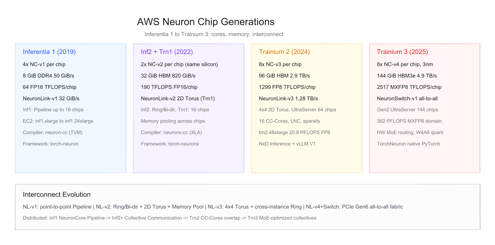
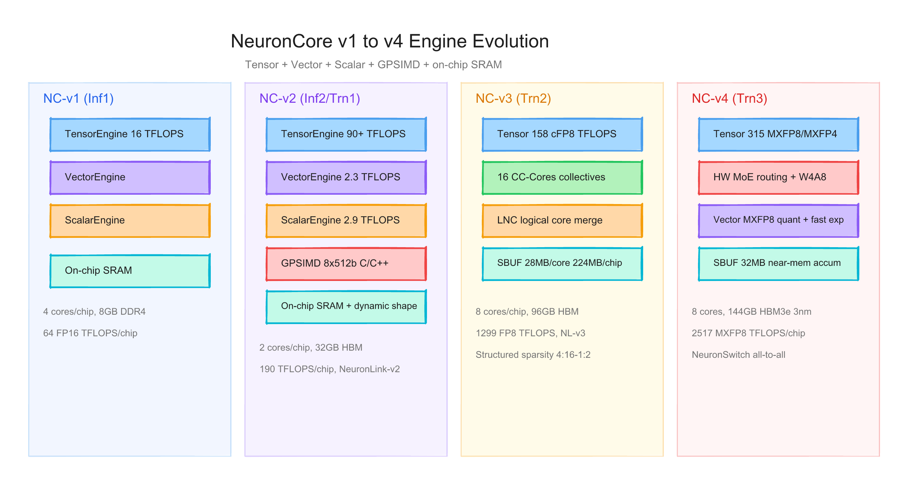
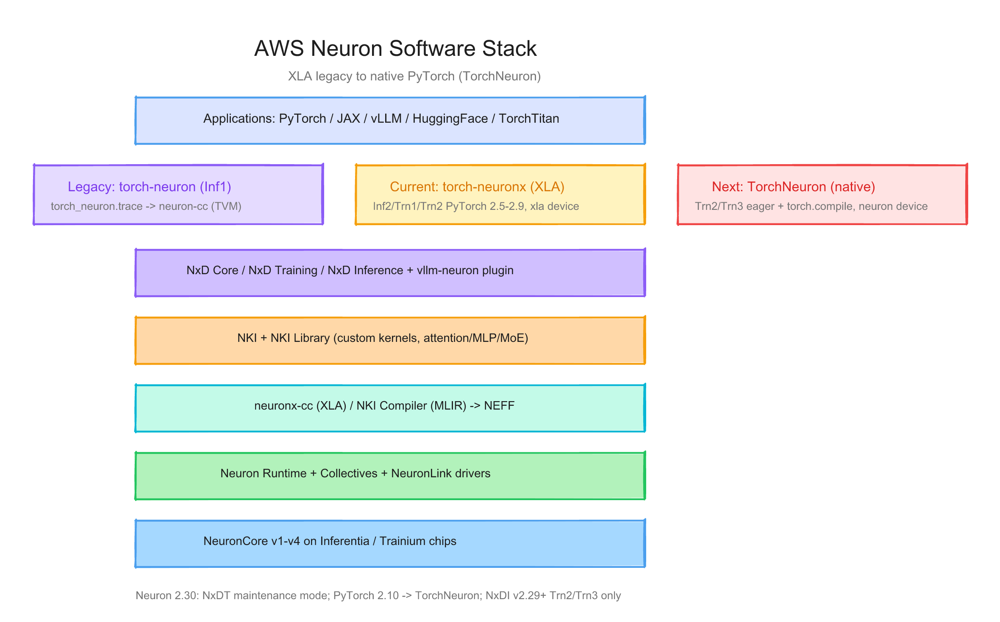

# AWS Neuron 每代芯片的硬件与软件调研报告

> 截至日期：2026 年 6 月 26 日。AWS Neuron 是 Amazon 自研 AI 加速器家族，包含 **Inferentia**（推理）与 **Trainium**（训练/推理）两条产品线，由 **Neuron SDK** 统一编程。截至本期，已公开 5 代芯片：Inferentia 1、Inferentia 2、Trainium 1、Trainium 2、Trainium 3；NeuronCore 计算单元从 v1 演进到 v4。本报告按「硬件架构 + 软件栈」两条线梳理每代差异，并给出三张架构图。

---

## 一、世代总览

| 产品 | AWS 代际称谓 | NeuronCore | 工艺 | 每芯片 Core 数 | 设备内存 | 主用途 | GA 时间 |
|---|---|---|---|---|---|---|---|
| Inferentia 1 | 第 1 代 inference chip | v1 | — | 4 | 8 GiB DDR4 | CNN/NLP 推理 | 2019 |
| Inferentia 2 | 第 2 代 ML chip | v2 | — | 2 | 32 GiB HBM | 生成式 AI 推理 | 2022 |
| Trainium 1 | 第 2 代 ML chip（同 v2 硅） | v2 | — | 2 | 32 GiB HBM | 大模型训练 | 2022 |
| Trainium 2 | 第 3 代 ML chip | v3 | — | 8 | 96 GiB HBM | 训练 + frontier 推理 | 2024-12 |
| Trainium 3 | 第 4 代 ML chip | v4 | **3nm** | 8 | 144 GiB HBM3e | MoE / reasoning / serving | 2025 re:Invent |

**命名注意**：AWS 文档中的「第 N 代 purpose-built ML chip」与产品名 Inferentia N / Trainium N 并不一一对应——Inferentia 2 与 Trainium 1 共享 **NeuronCore-v2** 硅，服务器级互联密度不同；Trainium 2/3 才是独立的新代硅。

代际间最关键的趋势：**DDR4 → HBM → HBM3e**；**NeuronCore 从 4→2→8**（单芯片 Core 密度先降后升）；**NeuronLink 从 point-to-point Pipeline → 2D Torus → NeuronSwitch all-to-all**；软件从 **TVM 图编译（torch-neuron）→ XLA（torch-neuronx）→ 原生 PyTorch（TorchNeuron）**。



---

## 二、硬件架构演进

### 2.1 Inferentia 1（Inf1，2019）

**整体结构**：每颗 Inferentia 芯片含 **4 个 NeuronCore-v1**，共享 **8 GiB DDR4**（50 GiB/s 带宽）。NeuronCore-v1 是独立异构计算单元，含 **Tensor / Vector / Scalar** 三引擎 + 片上 SRAM（编译器管理），**无 GPSIMD**。

**NeuronCore-v1 引擎**（[NeuronCore-v1 Architecture](https://awsdocs-neuron.readthedocs-hosted.com/en/v2.28.1/about-neuron/arch/neuron-hardware/neuron-core-v1.html)）：
- **TensorEngine**：systolic array，GEMM/CONV；每 Core **16 TFLOPS FP16/BF16**
- **VectorEngine**：256 FP ops/cycle；LayerNorm、Pooling 等
- **ScalarEngine**：512 FP ops/cycle；GELU、Sigmoid、Exp 等

**芯片规格**（[Inferentia Architecture](https://awsdocs-neuron.readthedocs-hosted.com/en/latest/about-neuron/arch/neuron-hardware/inferentia.html)）：
> *"Four NeuronCore-v1 cores, delivering 128 INT8 TOPS and 64 FP16/BF16 TFLOPS"*  
> *"8GiB of device DRAM memory, with 50 GiB/sec of bandwidth"*

**多芯片并行**：Inf1 独有 **Neuron Core Pipeline**——编译期将计算图分片到多个 NeuronCore，权重缓存在片上 SRAM，请求以流水线方式跨 Core 执行（最多 16 芯片 / 64 Core）。**NeuronLink-v1** 带宽 **32 GiB/s/chip**（[Inf1 EC2 Architecture](https://awsdocs-neuron.readthedocs-hosted.com/en/latest/general/arch/neuron-hardware/inf1-arch.html)）。

**EC2 实例**：`inf1.xlarge`（1 芯片）到 `inf1.24xlarge`（16 芯片，1024 FP16 TFLOPS）。

### 2.2 Inferentia 2（Inf2，2022）

**整体结构**：每颗 Inferentia2 芯片含 **2 个 NeuronCore-v2**，共享 **32 GiB HBM**（820 GiB/s）。相对 Inf1，算力约 **3×**、内存带宽约 **16×**。

**NeuronCore-v2 新增**（[NeuronCore-v2 Architecture](https://awsdocs-neuron.readthedocs-hosted.com/en/latest/about-neuron/arch/neuron-hardware/neuron-core-v2.html)）：
- **GPSIMD Engine**：8 个 512-bit 可编程向量处理器，可执行 C/C++ 自定义算子
- **动态 shape / 控制流** ISA 扩展
- TensorEngine **>90 TFLOPS FP16/BF16**（6× vs v1）；VectorEngine **2.3 TFLOPS FP32**（10× vs v1）

**芯片规格**（[Inferentia2 Architecture](https://awsdocs-neuron.readthedocs-hosted.com/en/latest/about-neuron/arch/neuron-hardware/inferentia2.html)）：
> *"Two NeuronCore-v2 cores, delivering 380 INT8 TOPS, 190 FP16/BF16/cFP8/TF32 TFLOPS, and 47.5 FP32 TFLOPS."*  
> *"32GiB of high-bandwidth device memory (HBM), with 820 GiB/sec of bandwidth."*  
> *"1 TB/sec of DMA bandwidth, with inline memory compression/decompression."*

**多芯片并行**：**NeuronLink-v2** + **Collective Communication**（AllReduce / AllGather）替代 Inf1 的 Pipeline。`inf2.48xlarge` 上 12 芯片呈 **Ring 拓扑**；其他多芯片实例为双向互联（[Collective Communication](https://awsdocs-neuron.readthedocs-hosted.com/en/v2.25.0/general/arch/neuron-features/collective-communication.html)）。

**EC2 实例**：`inf2.xlarge`（1 芯片，190 TFLOPS）到 `inf2.48xlarge`（12 芯片，2280 TFLOPS）。

### 2.3 Trainium 1（Trn1 / Trn1n，2022）

**与 Inf2 的关系**：Trainium 与 Inferentia2 **共享 NeuronCore-v2 硅**——每芯片 2 Core、32 GiB HBM、190 TFLOPS。差异在 **服务器级布局**：Trainium 芯片的 NeuronLink-v2 互联数量是 Inf2 的 **2×**，且每实例芯片数更多（[AWS accelerator hardware review](https://aws.amazon.com/blogs/machine-learning/a-review-of-purpose-built-accelerators-for-financial-services/)）。

**芯片规格**（[Trainium Architecture](https://awsdocs-neuron.readthedocs-hosted.com/en/latest/about-neuron/arch/neuron-hardware/trainium.html)）：
> *"16 x Trainium chips (each Trainium include 2 x NeuronCore-v2). Trainium is the second generation purpose-built Machine Learning accelerator from AWS."*

**关键服务器特性**：
- **NeuronLink-v2 2D Torus** 拓扑（`trn1.32xlarge` 16 芯片）
- **Memory Pooling**：16 芯片 HBM 统一寻址，跨芯片共享 512 GiB 设备内存
- **Stochastic Rounding**、可编程舍入模式（RNE / Stochastic）
- **Trn1n.32xlarge**：NeuronLink 带宽 **768 GiB/s/chip**（Trn1 的 2×）+ EFA **1600 Gbps**

**EC2 实例**：`trn1.2xlarge`（1 芯片）到 `trn1.32xlarge`（16 芯片，**3.4 PFLOPS** FP16/BF16，[Trn1 GA Blog](https://aws.amazon.com/blogs/aws/amazon-ec2-trn1-instances-for-high-performance-model-training-are-now-available/)）。

### 2.4 Trainium 2（Trn2，2024-12 GA）

**整体结构**：每颗 Trainium2 芯片含 **8 个 NeuronCore-v3**，共享 **96 GiB HBM**（2.9 TB/s 带宽）。引入 **Logical NeuronCore Configuration (LNC)**——可将多个物理 Core 的计算与内存资源合并为一个逻辑 Core。

**NeuronCore-v3**（[NeuronCore-v3 Architecture](https://awsdocs-neuron.readthedocs-hosted.com/en/latest/about-neuron/arch/neuron-hardware/neuron-core-v3.html)）：
- 每 Core **28 MB SBUF**（芯片级 224 MB，Trn1 的 4.7×）
- TensorEngine：**158 cFP8 TFLOPS** / **79 BF16/FP16/TF32 TFLOPS**；支持 **Structured Sparsity**（4:16 至 1:2）
- **16 CC-Cores**：硬件编排 collective communication，计算与通信 overlap

**芯片规格**（[Trainium2 Architecture](https://awsdocs-neuron.readthedocs-hosted.com/en/latest/about-neuron/arch/neuron-hardware/trainium2.html)）：
> *"Every Trainium2 chip contains eight NeuronCore-V3 cores."*  
> *"Eight NeuronCore-v3 that collectively deliver: 1,299 FP8 TFLOPS, 667 BF16/FP16/TF32 TFLOPS, 2,563 FP8/FP16/BF16/TF32 sparse TFLOPS, 181 FP32 TFLOPS"*  
> *"96 GiB of device memory with 2.9 TB/sec of bandwidth."*

**相对 Trn1 的提升**（同文档对比表）：FP8 算力 **6.7×**；HBM 容量 **3×**；NeuronLink-v3 带宽 **3.3×**（1.28 TB/s/chip）；Memory Pool 从 16 芯片扩至 **64 芯片**。

**系统拓扑**：
- `trn2.48xlarge`：16 芯片 **4×4 2D Torus**，单实例 **20.8 PFLOPS FP8**
- **Trn2 UltraServer**：4 个 `trn2u.48xlarge` = **64 芯片**，跨实例 Ring 互联，**83.2 PFLOPS FP8**

### 2.5 Trainium 3（Trn3，2025 re:Invent）

**整体结构**：AWS **首款 3nm AI 芯片**，每颗含 **8 个 NeuronCore-v4**，**144 GiB HBM3e**（4.9 TB/s）。

**NeuronCore-v4**（[NeuronCore-v4 Architecture](https://awsdocs-neuron.readthedocs-hosted.com/en/latest/about-neuron/arch/neuron-hardware/neuron-core-v4.html)）：
- 每 Core **32 MB SBUF**，引入 **near-memory accumulation**（DMA 单次传输完成 read-add-write）
- TensorEngine：**315 MXFP8/MXFP4 TFLOPS**（OCP 微缩放浮点格式）；79 BF16/FP16/TF32 TFLOPS
- VectorEngine 新增 **MXFP8 在线量化**（MLP 层间）和 **4× 吞吐的 fast exp()**（attention 加速）
- 芯片级 **MoE 硬件路由**、**W4A8 量化** 加速

**芯片规格**（[Trainium3 Architecture](https://awsdocs-neuron.readthedocs-hosted.com/en/latest/about-neuron/arch/neuron-hardware/trainium3.html)）：
> *"Trainium3 is the fourth-generation purpose-built Machine Learning chip from AWS. A Trainium3 device contains eight NeuronCore-v4 cores."*  
> *"Eight NeuronCore-v4 cores that collectively deliver: 2,517 MXFP8/MXFP4 TFLOPS, 671 BF16/FP16/TF32 TFLOPS, 2,517 FP16/BF16/TF32 sparse TFLOPS, 183 FP32 TFLOPS"*  
> *"144 GiB of device memory, with 4.9 TB/sec of bandwidth."*

**互联架构重大变化**：Trn3 **弃用 point-to-point 2D Torus**，改用 **NeuronSwitch-v1 + PCIe Gen6 switched fabric → All-to-All**（[Trn3 EC2 Architecture](https://awsdocs-neuron.readthedocs-hosted.com/en/latest/about-neuron/arch/neuron-hardware/trn3-arch.html)）：
> *"Trn3 UltraServers use a PCIe switch-based interconnect architecture for all chip-to-chip communication, both within and across servers. This replaces the point-to-point NeuronLink topology used in previous generations."*

**UltraServer 规模**：
| 配置 | 芯片数 | MXFP8 TFLOPS | 设备内存 |
|---|---|---|---|
| Trn3 Gen1 UltraServer | 64 | ~161 PFLOPS | ~9 TB |
| Trn3 Gen2 UltraServer | **144** | ~**362 PFLOPS** | ~20 TB |

NeuronLink-v4 带宽 **2.56 TB/s/chip**；NeuronSwitch 互联带宽为 Trn2 UltraServer 的 **2×**。



---

## 三、软件栈演进

### 3.1 核心原则：统一 NEFF 产物 + 三代 PyTorch 路线

AWS Neuron SDK 是所有 Inferentia / Trainium 的统一编程栈（[AWS Neuron Documentation](https://awsdocs-neuron.readthedocs-hosted.com/en/latest/index.html)）。无论哪条编译路线，最终产物均为 **NEFF**（Neuron Executable File Format），由 **Neuron Runtime** 加载到 NeuronCore 执行。

PyTorch 集成经历三代（[About PyTorch on AWS Neuron](https://awsdocs-neuron.readthedocs-hosted.com/en/latest/frameworks/torch/about/index.html)）：

| 路线 | 时期 | 硬件 | 编译器 | 特点 |
|---|---|---|---|---|
| **torch-neuron** | 2019–2026 | Inf1 | `neuron-cc` (TVM) | 图 trace 推理专用；Neuron 2.27+ 停止 Inf1 支持 |
| **torch-neuronx** | 2022– | Inf2, Trn1–Trn3 | `neuronx-cc` (XLA) | 训练+推理；PyTorch 2.5–2.9；lazy tensor |
| **TorchNeuron** | 2025– | Trn2, Trn3 | `neuronx-cc` + Neuron Backend | 原生 PrivateUse1 → `neuron` device；eager + `torch.compile` |

> *"TorchNeuron represents a fundamental architectural shift from XLA-based compilation to native PyTorch integration through the PrivateUse1 device backend mechanism."*  
> — [About PyTorch on AWS Neuron](https://awsdocs-neuron.readthedocs-hosted.com/en/latest/frameworks/torch/about/index.html)

### 3.2 Inferentia 1 软件栈

**编译流程**：
```
PyTorch Module → torch_neuron.trace() → 图分区 → neuron-cc (TVM) → NEFF 嵌入 TorchScript → Runtime → NeuronCore-v1
```

- 可在 CPU 实例离线编译（指定 `--neuroncore-pipeline-cores N`）
- 适合固定 shape 推理；**不支持训练**
- Neuron 2.27+ 停止 Inf1 AMI/venv 支持，进入归档维护

### 3.3 Inferentia 2 / Trainium 1 软件栈（XLA 主力期）

**推理**：`torch_neuronx.trace()` 或 XLA lazy tensor → `neuronx-cc compile --target=inf2|trn1` → NEFF。

**训练**：`import torch_xla.core.xla_model as xm`；模型 `.to('xla')` → lazy 构图 → XLA 编译 → Neuron Collectives 跨 chip/node all-reduce。

**分布式库 NxD**（[NeuronX Distributed](https://awsdocs-neuron.readthedocs-hosted.com/en/latest/libraries/neuronx-distributed/index-training.html)）：
- **NxD Core**：TP / PP / DP / Sequence Parallel / Context Parallel / ZeRO-1
- **NxD Training**：turnkey Llama/GPT 预训练、SFT、LoRA（YAML 配置 + PyTorch Lightning）
- **NxD Inference**：continuous batching、speculative decoding、KV cache、TP/SP

**框架生态**：PyTorch、JAX、HuggingFace Optimum Neuron、PyTorch Lightning。JAX 开发者可通过 Neuron 部署到 Inferentia / Trainium。

### 3.4 Trainium 2 软件栈

Trn2 是 **NxD Inference + vLLM** 和 **NKI 自定义内核** 的主战场。

**vLLM 集成**（[vLLM on Neuron](https://awsdocs-neuron.readthedocs-hosted.com/en/latest/libraries/nxd-inference/vllm/index.html)）：
- 插件仓库：[vllm-project/vllm-neuron](https://github.com/vllm-project/vllm-neuron)
- vLLM V1 架构 → 替换 model execution 层 → 后端 `neuronx-distributed-inference`
- 支持 continuous batching、prefix caching、Eagle speculative decoding
- Neuron 2.29+：**官方 vLLM/NxDI 仅支持 Trn2/Trn3**（Inf2/Trn1 需 pin SDK 2.28）

**NKI（Neuron Kernel Interface）**（[NKI Documentation](https://awsdocs-neuron.readthedocs-hosted.com/en/latest/nki/index.html)）：
- 类 Triton/NumPy 的 tile 级 Python 内核语言；绕过编译器前 3 阶段直达后端 IR
- **NKI Library**：预优化 attention / MLP / MoE / normalization 内核
- Neuron 2.30 → NKI **0.4.0**（Trn3 专属 ISA 扩展）

**Neuron 2.27 里程碑**（[What's New](https://awsdocs-neuron.readthedocs-hosted.com/en/latest/about-neuron/whats-new.html)）：
- Trn3 (`Trn3`) 实例支持
- **TorchNeuron** 原生 PyTorch 后端发布
- NKI Compiler 开源（Apache 2.0，MLIR 基础）
- vLLM V1 集成、Neuron Explorer 统一 profiling

### 3.5 Trainium 3 软件栈（原生 PyTorch 时代）

**TorchNeuron 执行路径**（[Native PyTorch for AWS Trainium](https://awsdocs-neuron.readthedocs-hosted.com/en/latest/frameworks/torch/pytorch-native-overview.html)）：

**Eager 模式**：
```
Python 逐 op → PyTorch Dispatcher → Neuron ATen backend → 异步队列 + Adaptive Eager Fusion
```

**torch.compile 模式**：
```
@torch.compile(backend="neuron")
→ TorchDynamo 捕获 bytecode → FX Graph (forward + AOT Autograd backward)
→ Neuron Backend 降为 Neuron IR（可含 NKI custom ops）
→ Neuron Compiler 硬件优化 → Trainium 指令
```

**分布式**：原生 **FSDP / DTensor / DDP / TP**（非 XLA API）；与 PyTorch 社区栈对齐，TorchTitan 可零改 eager 运行。设备语义：并行单位是 **NeuronCore**（非 GPU）。

**软件栈切换节点**（Neuron 2.29/2.30）：
- PyTorch **2.9 → 2.10**：XLA → TorchNeuron（计划全面切换）
- **NxDT / NxD Core 训练 API 进入 maintenance mode**；新训练推荐 TorchNeuron + 原生 FSDP
- NKI 命名空间：`neuronxcc.nki.*` → `nki.*`
- Profiler 迁移至 **Neuron Explorer**



### 3.6 软件栈 × 硬件能力矩阵

| 能力 | Inf1 | Inf2 | Trn1 | Trn2 | Trn3 |
|---|---|---|---|---|---|
| torch-neuron | ✅ | ❌ | ❌ | ❌ | ❌ |
| torch-neuronx (XLA) | ❌ | ✅ | ✅ | ✅ | ✅（2.9 止） |
| TorchNeuron (native) | ❌ | ❌ | ❌ | ✅ 推荐 | ✅ 推荐 |
| neuron-cc | ✅ | ❌ | ❌ | ❌ | ❌ |
| neuronx-cc | ❌ | ✅ | ✅ | ✅ | ✅ |
| NxD Training | ❌ | 有限 | ✅ | ✅ | ✅（维护） |
| NxD Inference / vLLM | ❌ | ✅ ≤2.28 | ✅ ≤2.28 | ✅ | ✅ |
| NKI 自定义内核 | ❌ | 基础 | ✅ | ✅ | ✅ + v4 ISA |

---

## 四、设计哲学的三次转向

**第一次（Inf1 → Inf2/Trn1）**：从「专用推理 ASIC」到「可编程 ML 加速器」。NeuronCore-v2 引入 GPSIMD、动态 shape、HBM、Collective Communication——同一份硅同时服务推理（Inf2）和训练（Trn1）。

**第二次（Trn1 → Trn2）**：从「够用的大模型训练」到「frontier 模型 scale-up」。Core 数 2→8、FP8 主力精度、CC-Cores 通信 overlap、LNC 逻辑核合并、UltraServer 64 芯片 domain。Trn2 是 AWS 第一款能在单实例跑 Llama 3.1 405B 推理的芯片。

**第三次（Trn2 → Trn3）**：从「2D Torus 点对点互联」到「NeuronSwitch all-to-all fabric」。3nm 工艺、MXFP8/MXFP4 微缩放格式、MoE 硬件路由——互联架构专为 MoE 和 autoregressive serving 优化。软件同步切换到原生 PyTorch（TorchNeuron），降低 XLA 迁移摩擦。

---

## 五、与外部生态的关系

- **Annapurna Labs**（Amazon 2015 收购）：Neuron 芯片设计主体。
- **EC2 实例**：Inf1/Inf2/Trn1/Trn2 为标准 EC2；Trn3 目前仅以 **UltraServer** 形式提供（无单芯片通用实例）。
- **UltraCluster 3.0**：Trn3 scale-out 网络，支持数十万芯片 non-blocking 互联。
- **开源**：TorchNeuron（[aws-neuron/torch-neuronx](https://github.com/aws-neuron/torch-neuronx)）、NxD（[aws-neuron/neuronx-distributed](https://github.com/aws-neuron/neuronx-distributed)）、NKI Compiler（Apache 2.0）、vLLM 插件（[vllm-project/vllm-neuron](https://github.com/vllm-project/vllm-neuron)）。
- **竞品参照**：Google TPU、Nvidia GPU（H100/B200）、AMD MI300、Meta MTIA——AWS Neuron 的独特优势是 **与 AWS 云深度集成**（EC2 按需、EFA、UltraCluster）和 **Inferentia/Trainium 推理+训练统一栈**。

---

## 六、参考来源

- [AWS Neuron architecture guides](https://awsdocs-neuron.readthedocs-hosted.com/en/latest/general/arch/index.html)
- [Inferentia 1 芯片](https://awsdocs-neuron.readthedocs-hosted.com/en/latest/about-neuron/arch/neuron-hardware/inferentia.html)
- [Inferentia 2 芯片](https://awsdocs-neuron.readthedocs-hosted.com/en/latest/about-neuron/arch/neuron-hardware/inferentia2.html)
- [Trainium 1 芯片](https://awsdocs-neuron.readthedocs-hosted.com/en/latest/about-neuron/arch/neuron-hardware/trainium.html)
- [Trainium 2 芯片](https://awsdocs-neuron.readthedocs-hosted.com/en/latest/about-neuron/arch/neuron-hardware/trainium2.html)
- [Trainium 3 芯片](https://awsdocs-neuron.readthedocs-hosted.com/en/latest/about-neuron/arch/neuron-hardware/trainium3.html)
- [NeuronCore-v1 / v2 / v3 / v4](https://awsdocs-neuron.readthedocs-hosted.com/en/latest/about-neuron/arch/neuron-hardware/neuron-core-v4.html)
- [About PyTorch on AWS Neuron](https://awsdocs-neuron.readthedocs-hosted.com/en/latest/frameworks/torch/about/index.html)
- [Native PyTorch for AWS Trainium (TorchNeuron)](https://awsdocs-neuron.readthedocs-hosted.com/en/latest/frameworks/torch/pytorch-native-overview.html)
- [What's New in AWS Neuron SDK](https://awsdocs-neuron.readthedocs-hosted.com/en/latest/about-neuron/whats-new.html)
- [vLLM on Neuron](https://awsdocs-neuron.readthedocs-hosted.com/en/latest/libraries/nxd-inference/vllm/index.html)
- [Trn1 GA Blog (2022)](https://aws.amazon.com/blogs/aws/amazon-ec2-trn1-instances-for-high-performance-model-training-are-now-available/)
- [AWS Trainium product page](https://aws.amazon.com/ai/machine-learning/trainium/)

---

## 附：架构图索引

本报告配套三张架构图，已 inline 在对应章节中。源文件（可编辑）和 PNG 预览均位于 `assets/`：

| 图 | 预览 | 源文件 |
|---|---|---|
| 芯片世代演进（Inf1→Trn3） | `assets/aws_neuron_hw_generations.png` | `assets/aws_neuron_hw_generations.excalidraw` |
| NeuronCore v1→v4 引擎演进 | `assets/aws_neuron_neuroncore_evolution.png` | `assets/aws_neuron_neuroncore_evolution.excalidraw` |
| 软件栈层级 | `assets/aws_neuron_software_stack.png` | `assets/aws_neuron_software_stack.excalidraw` |
