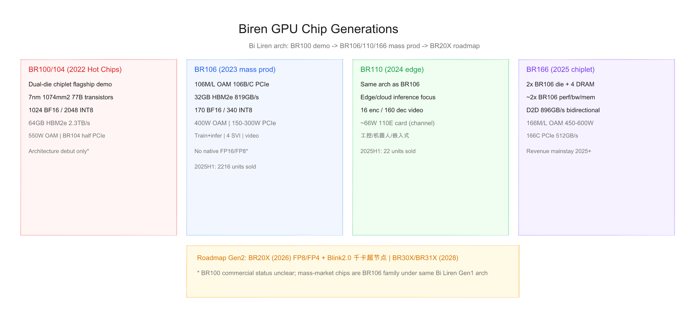
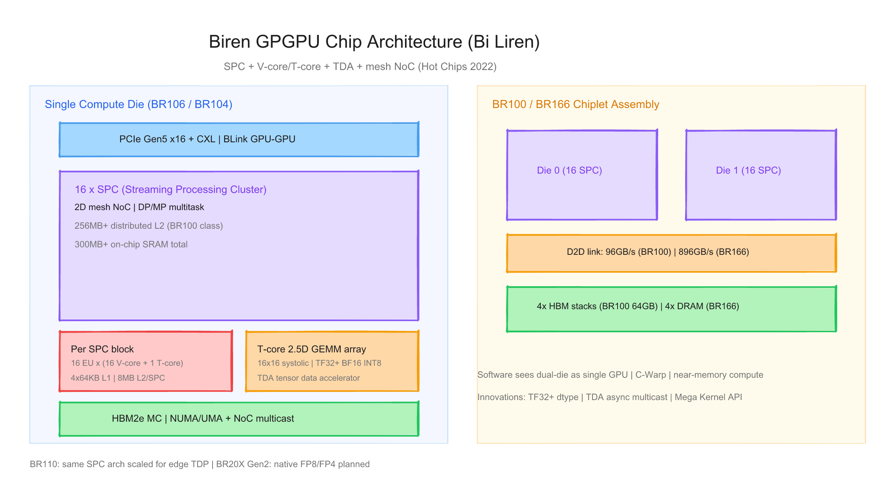
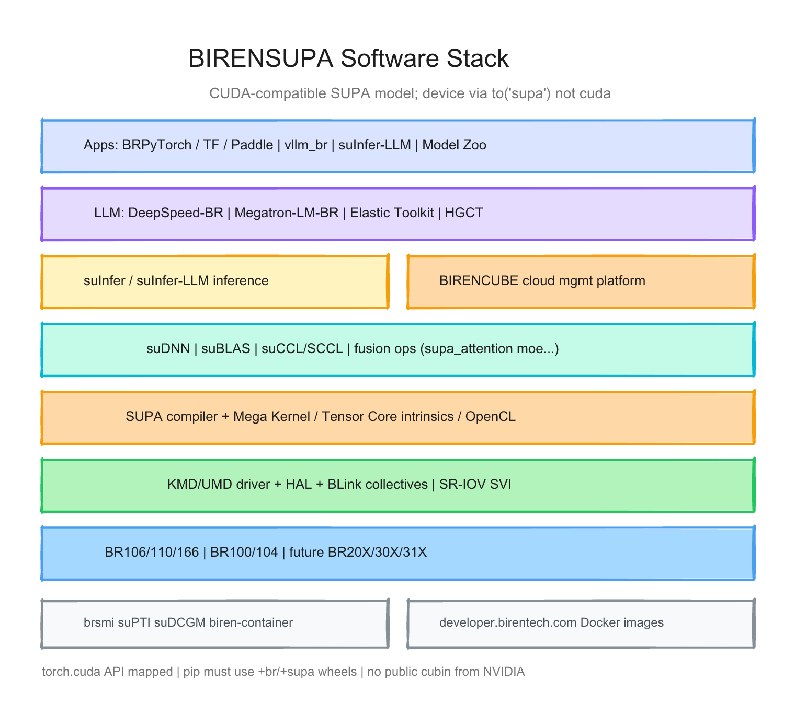

# 壁仞科技（Biren）每代 GPU 的硬件与软件调研报告

> 截至日期：2026 年 6 月 26 日。壁仞科技（上海壁仞科技股份有限公司）成立于 2019 年，定位 **GPGPU** 与智能计算整体解决方案，核心架构为自研 **壁立仞（Bi Liren）** 第一代 GPGPU 架构。2022 年 [Hot Chips 34](https://hc34.hotchips.org/assets/program/conference/day1/GPU%20HPC/HC2022.BirenTech.MikeHong.LingjieXu.v01.pdf) 发布旗舰 **BR100**；量产产品线为 **BR106**（2023）、**BR110**（2024）、**BR166**（2025）。软件栈 **BIRENSUPA** 在 API 层高度兼容 CUDA，设备命名空间为 **`supa`**。本报告按「硬件架构 + 软件栈」梳理已发布/量产代际，并给出三张架构图。

---

## 一、世代总览

| 阶段 | 芯片/SKU | 架构 | 工艺/封装 | 显存 | 峰值算力（公开） | TDP/形态 | 主用途 | 状态 |
|---|---|---|---|---|---|---|---|---|
| **旗舰演示** | **BR100** / **BR104** | 壁立仞 Gen1 | 7nm chiplet CoWoS | 64 GB HBM2e | 1024 BF16 / 2048 INT8 | 550W OAM / 300W PCIe | 数据中心训推 | 2022 Hot Chips；**未作主力量产 SKU** |
| **Gen1 量产** | **BR106** 系列 | 壁立仞 Gen1 | 7nm | 32 GB HBM2e | BF16 **170** / INT8 **340** | 150–400W OAM/PCIe | 云训推 | **2023-01 量产** |
| **Gen1 边缘** | **BR110** | 同 BR106 架构 | 7nm | （未公开容量） | 多精度（未公开 TFLOPS） | ~66W 级* | 边端/云推理 | **2024-10 量产** |
| **Gen1 Chiplet** | **BR166** 系列 | 2×BR106 die | chiplet + 4 DRAM | ~2× BR106 | ~2× BR106 | 450–600W OAM | 大模型训推 | **2025-08/12 量产** |
| **Gen2 规划** | **BR20X** | 第二代架构 | — | 更大更快* | FP8/FP4 原生* | Blink2.0 超节点 | 云训推 | **2026E 商用** |
| **Gen3 规划** | **BR30X / BR31X** | — | — | — | — | — | 云/边 | **2028E** |

\* BR110 功耗来自渠道对 **壁砺 110E** 的报道；Gen2 规格来自 [港交所招股书](https://www1.hkexnews.hk/listedco/listconews/sehk/2026/0102/11974286/sehk25121700449_c.pdf)。

**命名注意**：对外品牌为 **壁砺™（BR 系列）**；**BR100 产品线**下实际量产芯片为 **BR106（单 die）** 与 **BR166（双 die）**，另含边缘 **BR110**——并非四代独立架构，而是 **同代架构的不同 SKU + chiplet 组合**（[OFweek 分析](https://www.ofweek.com/ai/2026-06/ART-201712-12003-30691465.html)）。

代际间关键趋势：**Hot Chips 双 die PFLOPS 叙事 → 单 die BR106 商业化 → chiplet BR166 翻倍 → Gen2 BR20X 补 FP8/FP4 与超节点**；软件从 **SUPA/CUDA 兼容** 演进到 **vllm_br + suInfer-LLM + 千卡集群工具**。

---

## 二、硬件架构演进

### 2.1 壁立仞（Bi Liren）架构 — Hot Chips 2022 定稿

壁仞在 [Hot Chips 2022](https://hc34.hotchips.org/assets/program/conference/day1/GPU%20HPC/HC2022.BirenTech.MikeHong.LingjieXu.v01.pdf) 首次完整披露 **BR100** GPGPU：**7nm TSMC、1074 mm²、770 亿晶体管、CoWoS 2.5D chiplet**，双 compute die 在软件层呈现为 **单 GPU**（[HPCwire](https://www.hpcwire.com/aiwire/2022/08/23/chinese-startup-biren-details-br100-gpu/)）。

**层级结构**（[EE Times](https://www.eetimes.com/biren-emerges-from-stealth-with-gpgpu-offering/)）：

| 层级 | 组成 |
|---|---|
| **SPC** | Streaming Processing Cluster；BR100 每 die **16 SPC**，共 32 SPC |
| **EU** | Execution Unit；每 SPC **16 EU**，可拆为 4/8/16 EU 的 CU |
| **V-core** | 16× SIMT 通用矢量核；BatchNorm/ReLU 等 |
| **T-core** | Tensor Engine；2.5D GEMM systolic array |
| **TDA** | Tensor Data Accelerator；异步数据搬运 |
| **缓存** | 每 EU 40KB TLR；4×64KB L1/SPC；分布式 **L2 最高 8MB/SPC**；整芯片 **>300MB SRAM** |
| **互连** | 2D mesh NoC；**NUMA/UMA + multicast**；C-Warp 控制 |

> 「Each EU has 16 × streaming processing cores (V-core), 1 × tensor engine (T-core).」

**数据类型创新**：自研 **TF32+**（相对 TF32 更高精度与吞吐）；支持 BF16/FP16/INT8/INT4 等；**不支持 FP64**（AI 负载导向）。

**BR100 旗舰规格**（Hot Chips / [Wccftech 汇总](https://wccftech.com/birentech-china-most-powerful-gpu-biren-br100-architecture-disclosed-2-8x-faster-than-nvidia-ampere/)）：

| 项目 | BR100 (OAM) | BR104 (PCIe) |
|---|---|---|
| 结构 | **2× compute die** + 4× HBM | **1× die** |
| 算力 | 2048 INT8 / 1024 BF16 / 512 TF32+ / 256 FP32 | **约一半** |
| 显存 | 64 GB HBM2e，**2.3 TB/s** | 32 GB 级* |
| 主机接口 | **PCIe Gen5 ×16 + CXL** | PCIe |
| 片间 | D2D **96 GB/s**（die-to-die） | — |
| GPU 互联 | **BLink™ 512 GB/s**（8×8 端口） | — |
| TDP | **550 W** OAM | **300 W** |
| 视频 | 64 路编码 / 512 路解码 @1080P30 | 减半* |

\* BR104 细节多来自「半颗 BR100」推断，官方 Hot Chips 页以 BR100 为主。

**定位**：对标 Ampere A100/H100 叙事；vendor 称 INT8 性能达国际旗舰 **~3×**（[EENews Europe](https://www.eenewseurope.com/en/chinese-chiplet-based-gpu-claims-performance-record/)）——**独立 benchmark 未在本报告验证**。

### 2.2 量产 Gen1 — BR106（2023）

**整体结构**：BR100 架构的 **单 die 商业化版本**（行业分析普遍将 BR106 视为 BR100 单芯落地，[OFweek](https://www.ofweek.com/ai/2026-06/ART-201712-12003-30691465.html)）。2020 年启动研发，2021 流片，**2023 年 1 月量产**（[招股书](https://www1.hkexnews.hk/listedco/listconews/sehk/2026/0102/11974286/sehk25121700449_c.pdf)）。

**壁砺 106M 规格**（[模力方舟文档](https://ai.gitee.com/docs/compute/clusters_gpu/biren_gpu) + 招股书硬件表）：

| 项目 | 壁砺 106M (OAM) | 壁砺 106L | 壁砺 106B | 壁砺 106C |
|---|---|---|---|---|
| 显存 | **32 GB HBM2e** | 同左 | 同左 | 同左 |
| 带宽 | **819 GB/s** | — | — | — |
| 算力 | TF32+ **85** / BF16 **170** / INT8 **340** | 同左 | 同左 | 同左 |
| 互联 | **256 GB/s** 双向（4 端口） | 256 GB/s | **192 GB/s** PCIe | **128 GB/s** |
| TDP | **400 W** | **400 W** 液冷 | **300 W** | **150 W** |
| 视频 | 32 编 / **256** 解 @1080P30 | 同左 | 同左 | 推理向 |
| 虚拟化 | **4 SVI** + 国密一级安全引擎 | 同左 | 同左 | 同左 |

> 「BR106是一款专为大规模计算而设计的GPGPU芯片……支持多达4个独立安全虚拟实例。」（招股书）

**精度限制**（模力方舟实测文档，Tier 3）：
- **不支持原生 FP16、FP8**（训练靠 BF16/TF32+；大模型 INT4 量化推理靠 vllm_br）
- Warp 同步：`__syncwarp()`；跨 Block 用 Mega Kernel

**销量**：2024 年 **9344** 颗、2025 上半年 **2216** 颗（招股书）。

### 2.3 量产 Gen1 — BR110（2024，边缘推理）

**整体结构**：与 BR106 **相同架构**，面向 **边缘及云推理**；2022 流片，**2024 年 10 月量产**。

| 维度 | 公开信息 |
|---|---|
| 定位 | 工控、机器人、嵌入式；经济高效低功耗 |
| 视频 | **16** 路编码 / **160** 路解码 @1080P30 |
| 安全 | 4 SVI + 硬件安全引擎 |
| 软件 | 开箱即用 BIRENSUPA |

**规格缺口**：2022 年后官网/招股书 **不再公布与 BR106 可比的峰值 TFLOPS 表**；渠道称 **壁砺 110E** TDP 约 **66W**（Tier 2）。

**销量**：2024 年 **298** 颗、2025 上半年仅 **22** 颗——边缘场景拓展慢于 BR106（[与非网](https://www.eefocus.com/article/1933950.html)）。

### 2.4 量产 Gen1 Chiplet — BR166（2025）

**整体结构**：**2× BR106 裸晶 + 4× DRAM** 共封装；性能在算力、内存、视频、互联上约为 BR106 **2 倍**（招股书）。

| 项目 | 壁砺 166M (风冷 OAM) | 166L (液冷) | 166C (PCIe) |
|---|---|---|---|
| D2D 带宽 | **896 GB/s** 双向 | 同左 | — |
| GPU 互联 | **576 GB/s** | **576 GB/s** | **512 GB/s** |
| TDP | **450 W** | **550 W** | （推理向） |
| 视频 | **64** 编 / **512** 解 | 同左 | 同左 |
| 量产 | 2025-08 | 2025-08 | 2025-12 |

> 「两颗BR106裸晶之间的D2D双向带宽可高达896GB/s，确保两个裸晶之间高速的内部数据交互。」

**定位**：2025 年起 **收入主力**（行业分析）；面向大模型训推与千卡智算集群（2024 年交付 **5G 新通话千卡集群** 等案例，[21 经济网](https://www.21jingji.com/article/20251223/herald/746792a6cf4bfe5bcc9d1ff7089242cb.html)）。

### 2.5 规划 Gen2/Gen3 — BR20X / BR30X / BR31X

**BR20X**（第二代架构，**2026E 商用**）：
- 原生 **FP8、FP4**（补 Gen1 最大短板，[OFweek](https://www.ofweek.com/ai/2026-06/ART-201712-12003-30691465.html)）
- 更大更快内存、更高互联带宽
- **Blink2.0** 自研协议，超节点 **千卡 scale-up**（[东吴证券研报](https://pdf.dfcfw.com/pdf/H3_AP202606231823766194_1.pdf?1782225522000.pdf=)）
- 状态：架构设计完成，物理设计与流片验证中

**BR30X / BR31X**（**2028E**）：云训推 / 边缘推理；可行性分析阶段。

---

## 三、软件栈演进

### 3.1 核心原则：BIRENSUPA = CUDA 兼容 API + 自研编译链

**BIRENSUPA™**（BIREN Scalable Unified Parallel Architecture）为壁仞全栈软件品牌（[Hot Chips 2022](https://hc34.hotchips.org/assets/program/conference/day1/GPU%20HPC/HC2022.BirenTech.MikeHong.LingjieXu.v01.pdf)），分层：**驱动 → 库 → 编程平台 → ML 框架 → 解决方案**（招股书）。

> 「Developers who are familiar with CUDA can easily write code for SUPA.」（CTO Mike Hong，Hot Chips 2022）

**设备模型**：Python 侧 `import torch_br` 后使用 **`to('supa')`** / `device="supa"`，**不是** `cuda`（[模力方舟](https://ai.gitee.com/docs/compute/clusters_gpu/biren_gpu)）。`torch.cuda.*` API **映射兼容**，但 wheel 须带 **`+br` / `+supa`** 后缀，**禁止** `pip install torch` 覆盖公版。

### 3.2 核心组件映射

| NVIDIA | BIRENSUPA | 说明 |
|---|---|---|
| CUDA Driver | KMD / UMD / HAL | 驱动 + 虚拟化（SR-IOV SVI） |
| nvcc | **SUPA 编译器** + OpenCL | 自研工具链 |
| cuDNN | **suDNN** | DNN 算子 |
| cuBLAS | **suBLAS** | 线性代数 |
| NCCL | **suCCL / SCCL** | 多卡集合通信；叠加 **BLink** |
| TensorRT | **suInfer / suInfer-LLM** | 推理引擎 |
| nvidia-smi | **brsmi** | 设备监控 |
| Nsight | **suPTI / suTX / suProfiler** | 性能分析 |
| Container Toolkit | **biren-container-toolkit** | 容器 GPU |
| DCGM | **suDCGM** | 集群健康监控 |

文档入口：[developer.birentech.com](https://developer.birentech.com/Document_search.html)

### 3.3 框架与 LLM 生态

**训练**  
- **BRPyTorch**（`torch_br`）：PyTorch 1.10–2.7 对应多版 BRPyTorch（模力方舟版本表）  
- **DeepSpeed-BR**、**Megatron-LM-BR**、**Transformer-BR**  
- **Elastic Toolkit**：千卡级故障检测与分钟级恢复（招股书）  
- **HGCT**：异构 GPU 协同训练（壁仞 + 第三方 GPGPU 混训）

**推理**  
- **vllm_br**（如 `0.11.0+br1xx`）：PagedAttention、INT4 量化、LoRA  
- **suInfer-LLM**：官方 LLM 推理服务  
- 融合算子：`supa_attention`、`supa_moe_router`、`supa_swiglu`、`supa_rmsnorm` 等

**其他框架**  
- TensorFlow、PaddlePaddle（Hot Chips / 招股书）  
- **Model Zoo**：预优化模型托管  
- **BIRENCUBE**：多云多租户调度平台

**BR106M 已验证模型**（模力方舟，Tier 1 平台文档）：Qwen3 系列、FLUX.1、SD3.5、Whisper、ChatTTS 等。

### 3.4 互联软件栈

**BLink / Blink2.0**  
- Gen1：**64 GB/s × 4–8 通道**，GPU-GPU 直连（招股书）  
- 中国首家单机 **8 卡 full-mesh** GPGPU（vendor claim）  
- Gen2 **Blink2.0** 支撑 BR20X 超节点千卡 scale-up

### 3.5 硬件代际 × 软件里程碑

| 里程碑 | 目标硬件 | 内容 |
|---|---|---|
| BIRENSUPA 1.0 | BR100/104 | Hot Chips 发布；SUPA 编程模型 |
| 量产栈 | **BR106** | 2023 商用；106M 集群部署 |
| 边缘栈 | **BR110** | 2024 量产；同 SUPA 栈 |
| Chiplet 栈 | **BR166** | 2025 量产；双 die 透明单 GPU |
| vllm_br | BR106/166 | LLM serving；INT4/FlashAttention |
| Gen2 栈 | **BR20X** | FP8/FP4 kernel；Blink2.0 超节点 |

### 3.6 软件栈 × 硬件矩阵

| 能力 | BR106 | BR110 | BR166 | BR20X (plan) |
|---|---|---|---|---|
| BIRENSUPA / SUPA | ✅ | ✅ | ✅ | 规划中 |
| BRPyTorch | ✅ 主力 | ✅ | ✅ | — |
| vllm_br / suInfer-LLM | ✅ 主力 | 部分 | ✅ | — |
| BF16 训练 | ✅ | 推理为主 | ✅ | ✅ |
| FP16 原生 | ❌* | ❌* | ❌* | — |
| FP8/FP4 原生 | ❌ | ❌ | ❌ | ✅ 规划 |
| DeepSpeed/Megatron-BR | ✅ | — | ✅ | — |
| 4 SVI 虚拟化 | ✅ | ✅ | ✅ | — |
| biren-container + K8s | ✅ | ✅ | ✅ | — |

\* 模力方舟文档明确 **FP16/FP8 暂不支持**；以 BF16/TF32+/INT8/INT4 为主。

---

## 四、设计哲学的三次转向

**第一次（BR100 / Hot Chips 2022）**：**高举高打**——chiplet 突破 reticle limit、PFLOPS 级 BF16 叙事、TF32+ 与 TDA/NoC multicast 等架构创新，确立「中国 GPGPU 对标 NVIDIA 数据中心」的技术形象。

**第二次（BR106 → BR110 → BR166 商业化）**：**落地与分 SKU**——单 die BR106 走量（运营商/智算中心）；BR110 切边缘；BR166 用 chiplet **翻倍** 追大模型 without 全新架构；**BIRENSUPA + 千卡集群** 系统交付。

**第三次（BR20X / Blink2.0 超节点）**：**补精度与 scale-up**——Gen1 缺 **FP8/FP4** 成为大模型效率短板；Gen2 原生低精度 + 更大内存/互联 + **超节点**，对标 Hopper/Blackwell 世代集群战。

---

## 五、与外部生态及验证缺口

**生态**  
- 客户：运营商、智算中心、金融、互联网主权 AI 项目；2025 年 H1 营收 **10.35 亿元**（招股书）  
- 开发者：[developer.birentech.com](https://developer.birentech.com/Document_Hardware.html)  
- 开源：vllm_br 生态；PyTorch 插件 `torch_br`

**相对 NVIDIA 的能力边界**  
- 优势：SUPA **CUDA 风格迁移**、BR106/166 已规模出货、chiplet 工程、千卡交付案例  
- 风险：**Gen1 无 FP8**、BR100 峰值叙事与 BR106 量产规格差距大、**torch 版本强绑定**、CSP 大规模订单弱于运营商集采（[OFweek Tier 2](https://www.ofweek.com/ai/2026-06/ART-201712-12003-30691465.html)）

**本报告标注的验证缺口**  
1. **BR100 OAM** 是否规模量产/出货 — 公开信息指向 **BR106 为实际商用芯**  
2. **BR110** 缺官方算力/显存表；仅渠道功耗  
3. **BR104** 详细规格未在招股书产品表出现  
4. Hot Chips **vs A100 2.8×** 为 vendor benchmark，无 Tier 4 独立复现  
5. **BR166** 绝对 TFLOPS 招股书未列（仅「2× BR106」）  
6. **BR20X** 仅路线图，无硅级参数

---

## 六、参考来源

- [Hot Chips 2022 BR100 PDF](https://hc34.hotchips.org/assets/program/conference/day1/GPU%20HPC/HC2022.BirenTech.MikeHong.LingjieXu.v01.pdf)
- [HPCwire：BR100 报道](https://www.hpcwire.com/aiwire/2022/08/23/chinese-startup-biren-details-br100-gpu/)
- [EE Times：架构细节](https://www.eetimes.com/biren-emerges-from-stealth-with-gpgpu-offering/)
- [Wccftech：BR100 规格汇总](https://wccftech.com/birentech-china-most-powerful-gpu-biren-br100-architecture-disclosed-2-8x-faster-than-nvidia-ampere/)
- [壁仞港交所招股书（2026-01）](https://www1.hkexnews.hk/listedco/listconews/sehk/2026/0102/11974286/sehk25121700449_c.pdf)
- [模力方舟：壁砺 106M 文档](https://ai.gitee.com/docs/compute/clusters_gpu/biren_gpu)
- [壁仞开发者社区文档索引](https://developer.birentech.com/Document_search.html)
- [36氪：产品路线图](https://www.36kr.com/p/3606531620095239)
- [21 经济网：上市与 BR166](https://www.21jingji.com/article/20251223/herald/746792a6cf4bfe5bcc9d1ff7089242cb.html)
- [OFweek：BR100 产品线分析](https://www.ofweek.com/ai/2026-06/ART-201712-12003-30691465.html)
- [与非网：销量与定位](https://www.eefocus.com/article/1933950.html)

---

## 附：架构图索引

| 图 | 预览 | 源文件 |
|---|---|---|
| GPU 世代演进（BR100→106→110→166→20X） | `assets/biren_gpu_hw_generations.png` | `assets/biren_gpu_hw_generations.excalidraw` |
| 芯片架构（SPC/EU/T-core + Chiplet） | `assets/biren_gpu_chip_architecture.png` | `assets/biren_gpu_chip_architecture.excalidraw` |
| BIRENSUPA 软件栈层级 | `assets/biren_gpu_software_stack.png` | `assets/biren_gpu_software_stack.excalidraw` |
