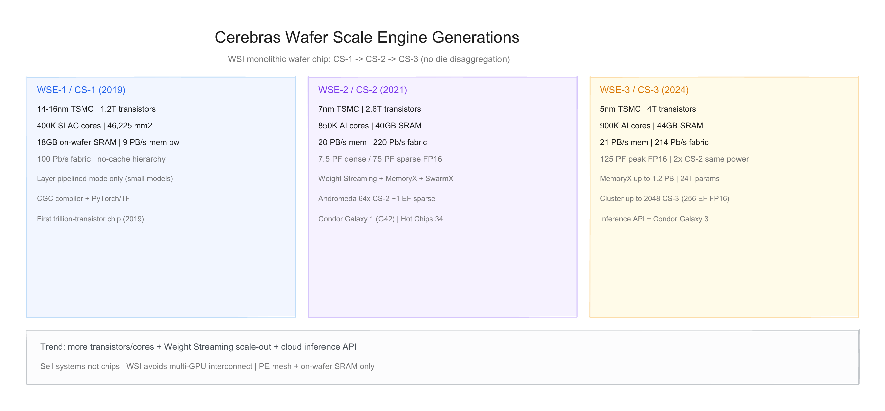
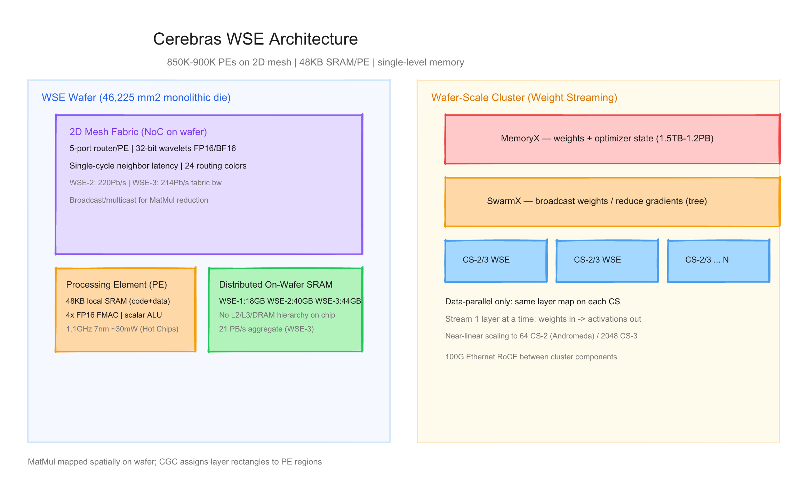
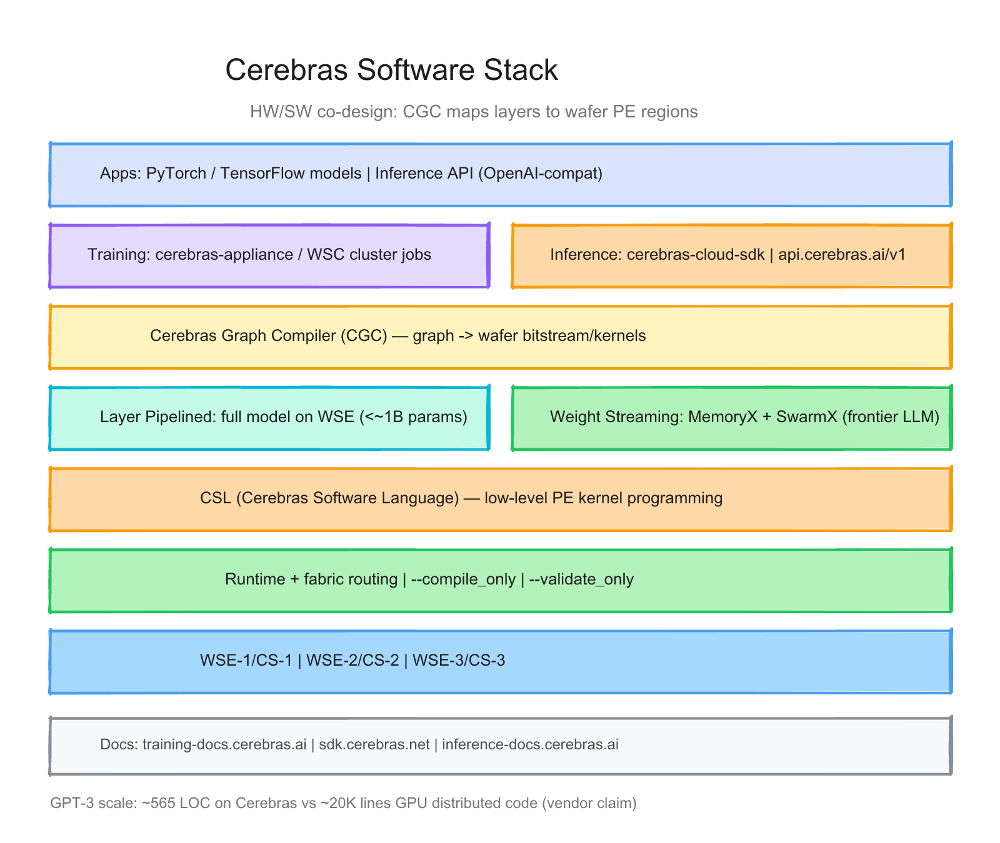

# Cerebras 每代 Wafer Scale Engine 的硬件与软件调研报告

> 截至日期：2026 年 6 月 26 日。Cerebras Systems 成立于 2015 年，走 **晶圆级集成（Wafer-Scale Integration, WSI）** 路线：将整片 300mm 硅晶圆刻成 **单颗 monolithic die**（约 46,225 mm²），而非多 die chiplet 拼装。三代 **Wafer Scale Engine（WSE-1/2/3）** 分别驱动 **CS-1/CS-2/CS-3** 系统；软件以 **Cerebras Graph Compiler（CGC）** 将 PyTorch/TensorFlow 图映射到 wafer 上的 PE 区域，支持 **Layer Pipelined** 与 **Weight Streaming** 两种执行模式。2024 年起 **Cerebras Inference** 云 API 面向 LLM 推理。本报告按「硬件架构 + 软件栈」梳理三代差异，并给出三张架构图。

---

## 一、世代总览

| 阶段 | 芯片 | 系统 | 工艺 | 晶体管 | AI Core | 片上 SRAM | 内存带宽 | 峰值算力（公开） | 主用途 | 发布 |
|---|---|---|---|---|---|---|---|---|---|---|
| **Gen1** | **WSE-1** | **CS-1** | 14–16nm* | **1.2T** | **400K** SLAC | **18 GB** | **9 PB/s** | 未列官方 PFLOPS† | 中小模型训练/推理 | **2019-08** |
| **Gen2** | **WSE-2** | **CS-2** | **7nm** | **2.6T** | **850K** | **40 GB** | **20 PB/s** | FP16 **7.5 PF** dense / **75 PF** sparse | 大模型训练 + Weight Streaming | **2021-04** |
| **Gen3** | **WSE-3** | **CS-3** | **5nm** | **4T** | **900K** | **44 GB** | **21 PB/s** | **125 PF** peak FP16‡ | 前沿 LLM 训推 + 云推理 | **2024-03** |

\* WSE-1 工艺：官方早期材料写 **16nm**（[Overview PDF](https://8968533.fs1.hubspotusercontent-na2.net/hubfs/8968533/Cerebras-Systems-Overview.pdf)），[arxiv 对比论文](https://arxiv.org/html/2503.11698v1) 写 **14nm**——以 TSMC 代际表述差异处理。  
† WSE-1 datasheet 未给出与 WSE-2/3 可比的峰值 PFLOPS 表。  
‡ **125 PFLOPS** 来自 [WSE-3 发布稿](https://www.cerebras.ai/press-release/cerebras-announces-third-generation-wafer-scale-engine) 与 [EE Times](https://www.eetimes.com/cerebras-third-gen-wafer-scale-chip-doubles-performance/)（FP16）；WSE-2 官方区分 **dense 7.5 PF** 与 **sparse 75 PF**（[架构 Deep Dive](https://www.cerebras.ai/blog/cerebras-architecture-deep-dive-first-look-inside-the-hw-sw-co-design-for-deep-learning)）。

**命名注意**：Cerebras **不卖裸片**，只售 **CS 系统**（机柜级 appliance）；集群品牌含 **Condor Galaxy**（与 G42 合作）、**Andromeda**（64×CS-2 实测集群）等。互联 fabric 带宽：**WSE-1 100 Pb/s → WSE-2 220 Pb/s → WSE-3 214 Pb/s**（[WSE-2/3 Datasheet](https://8968533.fs1.hubspotusercontent-na2.net/hubfs/8968533/Datasheets/WSE-3%20Datasheet.pdf)）。

代际间关键趋势：**更多晶体管/核心 + 更大片上 SRAM 带宽 → Weight Streaming 解耦 MemoryX/SwarmX → CS-3 2× 性能同功耗 → 推理云 API**；软件从 **仅 Layer Pipelined** 演进到 **Weight Streaming 千卡/万卡级 data-parallel**。

---

## 二、硬件架构演进

### 2.1 设计哲学 — 整片 Wafer 即一颗芯片

Cerebras 的核心赌注：**避免多 GPU/NPU 片间互联瓶颈**。传统加速器将 reticle 限制下的 die 重复数百颗，用 NVLink/InfiniBand 连接；Cerebras 在 wafer 上刻 **~850K–900K 个 Processing Element（PE）**，以 **2D mesh fabric** 互连，**无 L2/L3/片外 DRAM 层次**——每 PE 仅 **48KB 本地 SRAM**（[Hot Chips 34 Deep Dive](https://8968533.fs1.hubspotusercontent-na2.net/hubfs/8968533/IEEE%20Micro%202023-03%20Hot%20Chips%2034%20Cerebras%20Architecture%20Deep%20Dive.pdf)）。

| 维度 | Cerebras WSE | 典型 GPU 集群 |
|---|---|---|
| 芯片形态 | **单 wafer monolithic die** | 多 die + 板间/机间互联 |
| 内存层次 | **仅 PE-local SRAM** | HBM + L2 + 主机 DRAM |
| 并行模型 | 空间映射 MatMul 到 wafer 区域 | SIMT + NCCL 集合通信 |
| 扩展 | **Weight Streaming + SwarmX** data-parallel | 张量/流水线/专家并行 |
| 稀疏 | 硬件加速 unstructured sparsity | 依赖结构化稀疏/软件 |

> 「The WSE has 18 Gigabytes of on-chip memory accessible by its core in one clock cycle… no-cache, no-overhead, compute cores.」（[WSE-1 发布稿](https://www.cerebras.ai/press-release/cerebras-systems-unveils-the-industrys-first-trillion-transistor-chip)）

### 2.2 Processing Element（PE）与 Mesh Fabric

**PE 结构**（Hot Chips 34，以 WSE-2 / 7nm 为例）：

| 组件 | 规格 |
|---|---|
| 面积 | ~**38,000 µm²** |
| 本地内存 | **48 KB SRAM**（代码 + 数据，其他 PE 不可直接访问） |
| 算力单元 | Scalar + **4× FP16 FMAC**（张量 MAC） |
| 逻辑 | ~**110K** 标准单元 |
| 频率 / 功耗 | **1.1 GHz**，峰值 ~**30 mW**/PE |
| 互连 | **5-port router**：E/W/N/S + 连 PE 的 RAMP |

**Fabric**：
- **2D mesh**，相邻 PE **单周期** 传递 **32-bit wavelet**（16-bit 数据 + 16-bit 路由元数据）
- 数据包优化为 **FP16/BF16** 神经网络训练
- **24 条静态 routing colors**，支持 broadcast/multicast（MatMul 归约）
- WSE-1 称 core 为 **SLAC™（Sparse Linear Algebra Core）**；WSE-2/3 统称 **AI-optimized cores**

**MatMul 映射**：CGC 将层映射为 wafer 上矩形 PE 区域；权重行广播、激活/feature map 空间分布；支持极大矩阵（vendor 称 **100K×100K** 无需分块，[Deep Dive](https://www.cerebras.ai/blog/cerebras-architecture-deep-dive-first-look-inside-the-hw-sw-co-design-for-deep-learning)）。

### 2.3 Gen1 — WSE-1 + CS-1（2019）

2019 年 8 月发布，**业界首颗万亿晶体管芯片**（[Press Release](https://www.cerebras.ai/press-release/cerebras-systems-unveils-the-industrys-first-trillion-transistor-chip)）。

| 项目 | WSE-1 / CS-1 |
|---|---|
| 硅面积 | **46,225 mm²**（约 56× 最大 GPU die） |
| 晶体管 | **1.2 trillion** |
| Core | **400,000 SLAC** |
| 片上内存 | **18 GB** 分布式 SRAM |
| 内存带宽 | **9 PB/s**（Overview PDF 亦写 9.6 PB/s） |
| Fabric 带宽 | **100 Pb/s** |
| 形态 | CS-1：**15U**，约占 **1/3 标准机柜**；12×100GbE 数据输入 |
| 软件 | **Layer Pipelined** 为主；CGC + PyTorch/TensorFlow |

**意义**：证明 WSI 可量产；整模型可驻留片上 SRAM（当时规模模型），消除片外内存墙。

### 2.4 Gen2 — WSE-2 + CS-2（2021）

2021 年 4 月发布 CS-2（[Wikipedia](https://en.wikipedia.org/wiki/Cerebras_Systems)），[WSE-2 Datasheet](https://8968533.fs1.hubspotusercontent-na2.net/hubfs/8968533/WSE-2%20Datasheet.pdf) 定稿规格：

| 项目 | WSE-2 / CS-2 |
|---|---|
| 工艺 | **TSMC 7nm** |
| 晶体管 | **2.6 trillion** |
| Core | **850,000** |
| 片上内存 | **40 GB** SRAM |
| 内存带宽 | **20 PB/s** |
| Fabric 带宽 | **220 Pb/s** |
| 峰值算力 | **7.5 PFLOPS** FP16 dense；**75 PFLOPS** FP16 sparse（10× 稀疏加速） |
| 系统 | CS-2：**15U**；**~15 kW** 量级（与 CS-3 同 envelope，[EE Times](https://www.eetimes.com/cerebras-third-gen-wafer-scale-chip-doubles-performance/)） |
| 模型规模叙事 | 单系统支持 **>120 trillion parameters**（Weight Streaming + MemoryX，vendor） |

**集群扩展（Gen2 里程碑）**：
- **MemoryX**：外置权重/优化器状态存储（1.5TB / 12TB SKU，后扩展）
- **SwarmX**：树形 broadcast/reduce fabric，连接 MemoryX 与多 CS-2
- **Andromeda**：**64× CS-2**，**54M+ cores**，**>1 EFLOPS sparse**；GPT-3/J/NeoX **近线性扩展**（[Weight Streaming 白皮书](https://8968533.fs1.hubspotusercontent-na2.net/hubfs/8968533/Virtual%20Booth%20Docs/CS%20Weight%20Streaming%20White%20Paper%20111521.pdf)）
- **Condor Galaxy 1（CG-1）**：与 **G42** 合作的 wafer-scale 超算（[Hot Chips 2023 Cluster PDF](https://hc2023.hotchips.org/assets/program/conference/day2/ML%20training/HC2023.Session5.ML_Training.Cerebras.Sean_Lie.final_v02.pdf)）

### 2.5 Gen3 — WSE-3 + CS-3（2024）

2024 年 3 月发布（[Press Release](https://www.cerebras.ai/press-release/cerebras-announces-third-generation-wafer-scale-engine)），[WSE-3 Datasheet](https://8968533.fs1.hubspotusercontent-na2.net/hubfs/8968533/Datasheets/WSE-3%20Datasheet.pdf)：

| 项目 | WSE-3 / CS-3 |
|---|---|
| 工艺 | **TSMC 5nm** |
| 晶体管 | **4 trillion** |
| Core | **900,000**（更大 PE 设计） |
| 片上内存 | **44 GB** SRAM |
| 内存带宽 | **21 PB/s** |
| Fabric 带宽 | **214 Pb/s** |
| 峰值算力 | **125 PFLOPS** peak AI（FP16，[EE Times](https://www.eetimes.com/cerebras-third-gen-wafer-scale-chip-doubles-performance/)） |
| 性能/功耗 | **2× CS-2**，**相同功耗与价格点**（vendor） |
| 外存 | MemoryX：**1.5TB / 12TB / 24TB / 36TB / 120TB / 1.2PB** |
| 集群 | 最多 **2048 CS-3** → **256 EFLOPS FP16** 叙事 |
| 模型 | 单逻辑地址空间 **24 trillion parameters**（无需分区/refactor，vendor） |

**系统与商业**：
- **Condor Galaxy 3**：首台 CS-3 超算，2024 Q2 投运（[CS-3 Blog](https://www.cerebras.ai/blog/cerebras-cs3)）
- **Dallas 8 EFLOPS** 数据中心（[IEEE Spectrum](https://spectrum.ieee.org/cerebras-chip-cs3)）
- **Time 2024 最佳发明**（Wikipedia）
- 与 **Qualcomm** 推理合作（10× 性价比 narrative，Tier 2）

**尚无 WSE-4 公开发布**——截至本报告仅三代 WSE 硅。

---

## 三、软件栈演进

### 3.1 核心原则：CGC 将神经网络「画」在 Wafer 上

Cerebras 软件栈是 **硬件协同设计** 产物：用户提交 PyTorch/TensorFlow 代码 → **Cerebras Graph Compiler（CGC）** 提取计算图 → 匹配 **Cerebras Software Platform kernels** → 生成 **bitstream**（层到 PE 矩形的映射 + fabric 路由）。

文档入口：
- 训练集群：[training-docs.cerebras.ai](https://training-docs.cerebras.ai) / [training-api.cerebras.ai](https://training-api.cerebras.ai)
- 低层 SDK：[sdk.cerebras.net](https://sdk.cerebras.net)（**CSL**）
- 推理云：[inference-docs.cerebras.ai](https://inference-docs.cerebras.ai)

### 3.2 两种执行模式

| 模式 | 适用 | 权重位置 | 多 CS 扩展 |
|---|---|---|---|
| **Layer Pipelined（LP）** | 小模型（**<~1B** 参数，可整模型驻留 WSE SRAM） | 全程在 **WSE 片上** | 早期 **Original Installation**；R1.9 前 WSC 支持，后主推 WS |
| **Weight Streaming（WS）** | 超大模型（单层权重可进 WSE，全模型不行） | **MemoryX**；**逐层 stream** 到 WSE | **SwarmX** data-parallel；**纯 data parallel**，无 tensor parallel 复杂度 |

**Weight Streaming 运行时**（[官方文档](https://training-docs.cerebras.ai/rel-2.10.0/concepts/weight-streaming-execution)）：
1. Forward：MemoryX → SwarmX → WSE 加载 **一层** 权重，计算激活
2. Backward：再次 stream 权重，WSE 算 weight gradients → SwarmX reduce → MemoryX 更新
3. 多 CS 系统：**相同 layer mapping**，各系统处理不同 data batch

> 「Training a one-trillion parameter model on the CS-3 is as straightforward as training a one billion parameter model on GPUs.」（[WSE-3 PR](https://www.cerebras.ai/press-release/cerebras-announces-third-generation-wafer-scale-engine)——vendor claim）

**编译 flags**：
- `--validate_only`：检查层映射计划
- `--compile_only`：只编译不运行

### 3.3 核心组件

| 组件 | 作用 |
|---|---|
| **CGC（Cerebras Graph Compiler）** | 图 → wafer kernels；选 layout/吞吐优化 |
| **CSL（Cerebras Software Language）** | PE 级 kernel；`layout`/`@set_color_config` 配置 fabric 路由（[SDK](https://sdk.cerebras.net/computing-with-cerebras)） |
| **Runtime** | 加载 bitstream；驱动 wavelet 数据流 |
| **MemoryX** | 权重 + optimizer state 持久存储 |
| **SwarmX** | Broadcast weights / reduce gradients；100G Ethernet RoCE |
| **Compile Report** | PE 利用率、compute utilization、kernel 周期估算 |

**框架支持**：**PyTorch**、**TensorFlow**（训练 appliance）；非 CUDA 移植——需 Cerebras 工具链编译。

### 3.4 推理软件栈（2024+）

Cerebras 将 CS-3 能力 **云化** 为 **Cerebras Inference**：

| 项目 | 说明 |
|---|---|
| API | **OpenAI 兼容**：`baseURL=https://api.cerebras.ai/v1` |
| SDK | **`cerebras-cloud-sdk`**（Python/Node）；[PyPI](https://pypi.org/project/cerebras-cloud-sdk/) |
| 模型 | gpt-oss-120b、zai-glm-4.7、Qwen 等（平台托管） |
| 性能叙事 | 最高 **~3000 tokens/s**（vendor/marketing，Tier 2） |
| 参数 | `reasoning_effort`、`reasoning_format` 等扩展字段 |

这与 **训练 appliance** 是 **两条产品路径**：训练客户买 CS 系统/集群；推理开发者调用云 API，无需直接接触 CGC。

### 3.5 硬件代际 × 软件里程碑

| 里程碑 | 硬件 | 内容 |
|---|---|---|
| CGC 1.0 + LP | WSE-1 / CS-1 | 2019；整图 pipeline 到 wafer |
| Weight Streaming | WSE-2 / CS-2 | 2021；MemoryX + SwarmX；GPT 级模型 |
| WSC 文档体系 | CS-2 集群 | training-api/docs 分支；`--compile_only` |
| CS-3 + 大 MemoryX | WSE-3 | 2024；1.2PB / 24T params |
| **cerebras-cloud-sdk** | CS-3 云 | 2024–2025；OpenAI-compat 推理 API |
| CSL 2.x | 全代 | PE 级自定义算子 |

### 3.6 软件栈 × 硬件矩阵

| 能力 | CS-1 (WSE-1) | CS-2 (WSE-2) | CS-3 (WSE-3) |
|---|---|---|---|
| Layer Pipelined | ✅ 主力 | ✅ | ✅ |
| Weight Streaming | — | ✅ **主力** | ✅ |
| MemoryX / SwarmX | — | ✅ 1.5–12TB+ | ✅ 至 **1.2PB** |
| PyTorch / TF 训练 | ✅ | ✅ | ✅ |
| CSL 自定义 kernel | ✅ | ✅ | ✅ |
| 云推理 API | — | — | ✅ |
| 最大集群（公开） | 较小 | **64 CS-2** Andromeda | **2048 CS-3**（规划/叙事） |

---

## 四、设计哲学的三次转向

**第一次（WSE-1 / CS-1，2019）**：**WSI 可行性**——用整 wafer SRAM + mesh 消除片间互联；400K SLAC 核证明「单芯片 = 集群算力」；软件 Layer Pipelined 把模型当 **流水线** 刻在 wafer 上。

**第二次（WSE-2 / Weight Streaming，2021）**：**内存解耦**——模型参数超越 40GB 片上 SRAM 后，**MemoryX + SwarmX** 逐层 stream；**纯 data-parallel** 扩展，避开 GPU 式 tensor/pipeline parallel 编程地狱；Andromeda 64 节点 **近线性** scaling 成为关键证据。

**第三次（WSE-3 + 推理云，2024）**：**前沿规模 + 商业化双轨**——5nm、125 PFLOPS、1.2PB 外存支撑 **24T 参数**叙事；同时 **Inference API** 把 wafer 算力包装为开发者熟悉的 OpenAI 接口，切入 LLM serving 市场。

---

## 五、与外部生态及验证缺口

**生态**
- 客户：G42（Condor Galaxy）、TotalEnergies、nference、NCSA、Leibniz 超算中心等（[Wikipedia](https://en.wikipedia.org/wiki/Cerebras_Systems)）
- 不卖芯片 → 无法像 NVIDIA 一样形成 OEM/云厂商广泛生态
- 训练需 **Cerebras 托管/私有 appliance**；推理可走 **公有云 API**

**相对 GPU 集群的能力边界**
- 优势：片上 **PB/s 级** SRAM 带宽、MatMul 空间映射、Weight Streaming **简化超大模型 data-parallel**、稀疏算力 narrative
- 风险：**单 vendor 锁定**、WSI _yield/成本不透明、**125 PF 与 75 PF sparse 口径**需区分 dense/sparse、benchmark 多来自 vendor、**非 CUDA** 无法直接迁移现有 GPU 代码

**本报告标注的验证缺口**
1. **WSE-1** 缺与 WSE-2 对等的官方 PFLOPS 表；工艺 14nm vs 16nm 表述不一
2. **WSE-3 125 PFLOPS** 是 dense 还是 peak/sparse-equivalent——EE Times 写 FP16，datasheet 未细分
3. **EE Times** 写 WSE-3「42GB SRAM」与 datasheet **44GB** 不一致
4. **>120T / 24T parameters** 为 vendor 逻辑内存叙事，非单芯片物理 SRAM
5. **3000 tok/s**、**8 EFLOPS Dallas** 等缺 Tier 4 独立复现
6. **WSE-4** 无公开路线图细节
7. CS 系统 **精确标价/功耗** 多为估算（[arxiv 表](https://arxiv.org/html/2503.11698v1) Tier 2）

---

## 六、参考来源

- [WSE-1 发布稿](https://www.cerebras.ai/press-release/cerebras-systems-unveils-the-industrys-first-trillion-transistor-chip)
- [Cerebras Systems Overview PDF](https://8968533.fs1.hubspotusercontent-na2.net/hubfs/8968533/Cerebras-Systems-Overview.pdf)
- [WSE-2 Datasheet PDF](https://8968533.fs1.hubspotusercontent-na2.net/hubfs/8968533/WSE-2%20Datasheet.pdf)
- [WSE-3 Datasheet PDF](https://8968533.fs1.hubspotusercontent-na2.net/hubfs/8968533/Datasheets/WSE-3%20Datasheet.pdf)
- [WSE-3 发布稿](https://www.cerebras.ai/press-release/cerebras-announces-third-generation-wafer-scale-engine)
- [架构 Deep Dive Blog](https://www.cerebras.ai/blog/cerebras-architecture-deep-dive-first-look-inside-the-hw-sw-co-design-for-deep-learning)
- [Extreme-Scale AI 架构公告](https://www.cerebras.ai/blog/announcing-the-cerebras-architecture-for-extreme-scale-ai)
- [CS-3 Blog](https://www.cerebras.ai/blog/cerebras-cs3)
- [Hot Chips 34 Deep Dive PDF](https://8968533.fs1.hubspotusercontent-na2.net/hubfs/8968533/IEEE%20Micro%202023-03%20Hot%20Chips%2034%20Cerebras%20Architecture%20Deep%20Dive.pdf)
- [Hot Chips 2023 Cluster PDF](https://hc2023.hotchips.org/assets/program/conference/day2/ML%20training/HC2023.Session5.ML_Training.Cerebras.Sean_Lie.final_v02.pdf)
- [Weight Streaming 白皮书 PDF](https://8968533.fs1.hubspotusercontent-na2.net/hubfs/8968533/Virtual%20Booth%20Docs/CS%20Weight%20Streaming%20White%20Paper%20111521.pdf)
- [Weight Streaming 官方文档](https://training-docs.cerebras.ai/rel-2.10.0/concepts/weight-streaming-execution)
- [Layer Pipelined 官方文档](https://training-api.cerebras.ai/en/latest/original/cerebras-basics/cerebras-execution-modes.html)
- [CSL SDK 概念](https://sdk.cerebras.net/computing-with-cerebras)
- [IEEE Spectrum WSE-3](https://spectrum.ieee.org/cerebras-chip-cs3)
- [EE Times CS-3](https://www.eetimes.com/cerebras-third-gen-wafer-scale-chip-doubles-performance/)
- [arxiv GPU 对比论文](https://arxiv.org/html/2503.11698v1)
- [Wikipedia Cerebras](https://en.wikipedia.org/wiki/Cerebras_Systems)
- [Inference 文档](https://inference-docs.cerebras.ai/resources/openai)
- [cerebras-cloud-sdk PyPI](https://pypi.org/project/cerebras-cloud-sdk/)

---

## 附：架构图索引

| 图 | 预览 | 源文件 |
|---|---|---|
| WSE 世代演进（WSE-1→2→3 / CS-1→3） | `assets/cerebras_wse_hw_generations.png` | `assets/cerebras_wse_hw_generations.excalidraw` |
| 芯片架构（PE mesh + MemoryX/SwarmX 集群） | `assets/cerebras_wse_chip_architecture.png` | `assets/cerebras_wse_chip_architecture.excalidraw` |
| 软件栈（CGC / LP / WS / 推理 API） | `assets/cerebras_wse_software_stack.png` | `assets/cerebras_wse_software_stack.excalidraw` |
