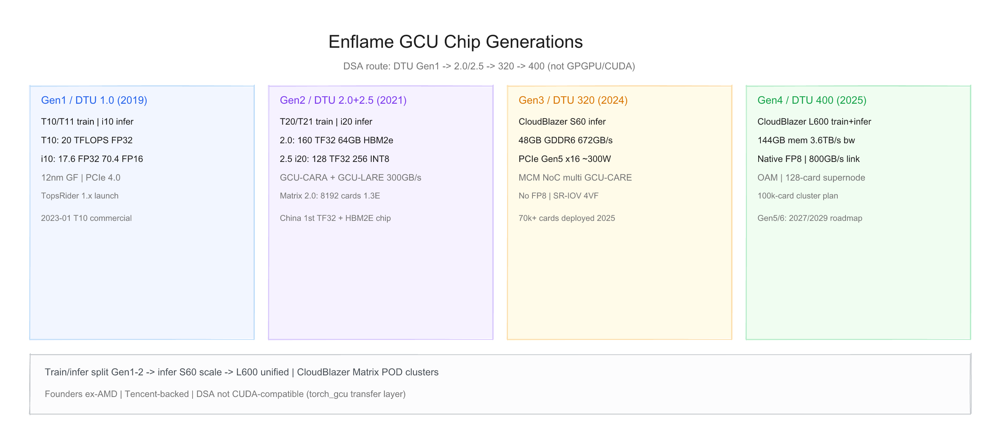
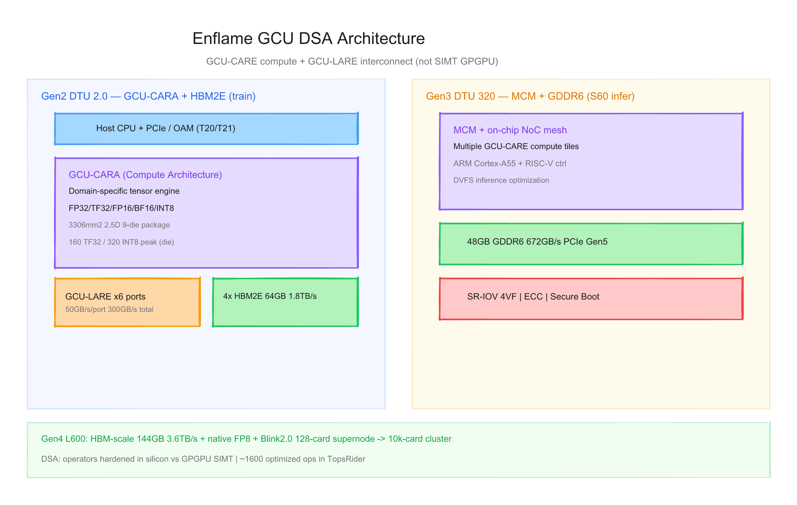
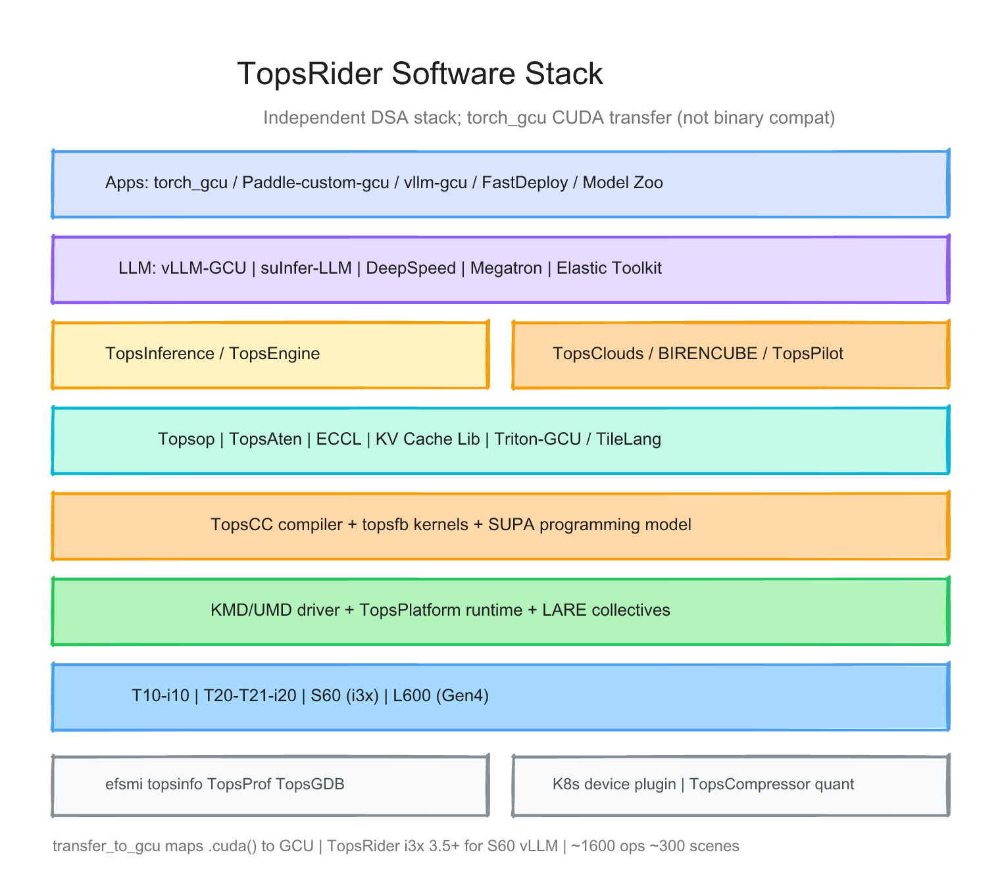

# 燧原科技（Enflame）每代 GCU 的硬件与软件调研报告

> 截至日期：2026 年 6 月 26 日。燧原科技（上海燧原科技股份有限公司）成立于 2018 年，创始团队来自 AMD，腾讯为主要投资方与客户。公司走 **领域专用架构（DSA）** 路线，**非 GPGPU / 非原生 CUDA 兼容**；自研芯片品牌 **邃思（DTU/GCU）**，加速卡品牌 **云燧 / CloudBlazer**，软件栈 **驭算 TopsRider**。截至 2025 年已完成 **四代架构、五款云端芯片**（训推分 SKU）；2026 年 1 月递交科创板 IPO，拟募资 60 亿元投向 **第五代 / 第六代** 芯片。本报告按「硬件架构 + 软件栈」梳理已发布/量产代际，并给出三张架构图。

---

## 一、世代总览

| 阶段 | 芯片/架构 | 加速卡 SKU | 工艺/封装 | 显存 | 峰值算力（公开） | TDP/形态 | 主用途 | 状态 |
|---|---|---|---|---|---|---|---|---|
| **Gen1 训** | **邃思 1.0** | **云燧 T10** / T11* | 12nm GF | — | FP32 **20** TFLOPS | PCIe 训练卡 | 云端训练 | **2019-12 发布；2023-01 商用** |
| **Gen1 推** | 邃思 1.0（推） | **云燧 i10** | 12nm GF | — | FP32 **17.6** / BF16 **70.4** | ~150W PCIe 4.0 | 云端推理 | **2020-12 发布** |
| **Gen2 训** | **邃思 2.0** | **云燧 T20** / **T21** OAM | 12nm GF；2.5D 9-die | **64 GB HBM2e** 1.8TB/s | FP32 **40** / TF32 **160** / INT8 **320** | T20 略低于 die 峰值* | 训练 + 集群 | **2021-07 发布；2021 底量产** |
| **Gen2 推** | **邃思 2.5** | **云燧 i20** | 12nm；2.5D 5-die | **16 GB HBM2e** 819GB/s | FP32 **32** / TF32 **128** / INT8 **256** | PCIe 4.0 | 云端推理 | **2021-12 发布** |
| **Gen3 推** | **邃思 320 / GCU320** | **CloudBlazer S60** | MCM + NoC | **48 GB GDDR6** 672GB/s | FP32/FP16/BF16/INT8（峰值表缺口†） | ~**300W** FHFL PCIe **Gen5** | 大模型推理 | **2024 量产；7万+卡部署** |
| **Gen4 训推** | **邃思 400** | **CloudBlazer L600** OAM | — | **144 GB** 3.6TB/s | **原生 FP8**（绝对 TFLOPS 缺口†） | OAM；800GB/s 互联 | 训推一体 | **2025-07 发布** |
| **Gen5/6 规划** | 第五代 / 第六代 | — | — | — | 对标国际高端* | Blink2.0 超节点* | 大规模训练 | **2027E / 2029E** |

\* **T11**：与 T20/T21 同期发布的 OAM 训练模组，公开规格少于 T20/T21（[第一财经](https://www.yicai.com/news/101103178.html)）。  
\* **T20 vs die**：T20 卡级峰值 TF32 **134.4** / FP32 **33.6** / INT8 **268.8**，低于裸片标称（[与非网](https://www.eefocus.com/article/498969.html)）。  
† **S60 / L600** 公开材料多强调带宽与 FP8，缺完整官方峰值算力表。  
\* Gen5/6 来自 [科创板招股书](https://static.sse.com.cn/stock/disclosure/announcement/c/202604/002175_20260416_BH8W.pdf) 与 [腾讯新闻](https://news.qq.com/rain/a/20260609A032LX00)。

**命名注意**：对外常称 **GCU（General Compute Unit）**；架构块在 Gen2 为 **GCU-CARA**（Compute Architecture for AI），Gen3 S60 公开材料称 **GCU-CARE** 多核阵列；互联为 **GCU-LARE**（Link Architecture for scale-out）。与壁仞/摩尔线程等 **GPGPU + CUDA 兼容** 路线不同，燧原强调 **算子硬化 DSA**。

代际间关键趋势：**训推分 SKU（Gen1–2）→ 推理 GDDR6 MCM 规模化（S60）→ 训推一体 + 原生 FP8 + 超节点（L600）→ 十万卡集群（Gen4 系统）**；软件从 **TopsRider 1.x + 鉴算** 演进到 **torch_gcu + vllm-gcu + TopsRider i3x**。

---

## 二、硬件架构演进

### 2.1 技术路线 — DSA 而非 SIMT GPGPU

燧原自始选择 **领域专用架构（DSA）**：针对 AI 张量运算定制数据流与指令集，通过 **GCU-CARA/CARE** 硬化常用算子，而非 NVIDIA 式 SIMT + 通用 CUDA 生态（[与非网 WAIC 2025](https://www.eefocus.com/article/1870798.html)）。招股书将与华为昇腾、寒武纪并列为 **非 GPGPU** 国产云端 AI 路线。

**与 GPGPU 对比（设计层）**：

| 维度 | 燧原 GCU (DSA) | 典型 GPGPU |
|---|---|---|
| 编程模型 | TopsCC / SUPA 风格 + **torch_gcu 迁移层** | CUDA / ROCm 原生 |
| 架构块 | GCU-CARA/CARE 张量引擎 + GCU-LARE 互联 | SPC/SM + NVLink |
| 精度策略 | Gen1–3 **无 FP8**；Gen4 L600 **原生 FP8** | Hopper 起 FP8 标配 |
| 集群 | CloudBlazer Matrix / ESL 超节点 | InfiniBand + NCCL |

### 2.2 Gen1 — 邃思 1.0（2019–2020）

**训练 — 云燧 T10**（2019 年 12 月，[36氪](https://36kr.com/p/1020274791925001)）：
- 中国首款云端 AI **训练**加速卡；**12nm 格罗方德**
- 单精度 **FP32 20 TFLOPS**
- 配合 **驭算 TopsRider 1.0** 与 **CloudBlazer Matrix 1.0** 千卡集群
- **2023 年 1 月** 宣布进入商用（招股书 / 公开报道）

**推理 — 云燧 i10**（2020 年 12 月，[腾讯新闻](https://news.qq.com/rain/a/20201221A0AHHL00)）：

| 项目 | 规格 |
|---|---|
| 接口 | **PCIe 4.0** 单槽 |
| 算力 | FP32 **17.6** TFLOPS；BF16/FP16 **70.4** TFLOPS |
| 功耗 | 最大 **150W** |
| 软件 | 首发 **鉴算 TopsInference**；支持 TF / PyTorch / **ONNX** |

> 「云燧i10与云燧T10以及“驭算TopsRider”软件平台搭配，可实现算法模型在数据中心训推一体化的快速生产部署。」

**Gen1 意义**：完成 **训练 T10 + 推理 i10** 双线，确立 TopsRider + Matrix 集群交付模式；算力规模小于后续 Gen2，但验证了 DSA 云端落地路径。

### 2.3 Gen2 训练 — 邃思 2.0 + GCU-CARA / GCU-LARE（2021）

2021 年 7 月 WAIC 发布 **邃思 2.0**、**云燧 T20**（PCIe 训练卡）、**云燧 T21**（OAM 模组）（[ECCN](https://news.eccn.com/news_2021070813355482.htm)、[钛媒体](https://www.tmtpost.com/5461004.html)）。

**芯片级规格**：

| 项目 | 邃思 2.0 |
|---|---|
| 工艺 | **12nm GF FinFET** |
| 封装 | **2.5D**，57.5×57.5mm（**3306 mm²**），**9 颗 die** 集成 |
| 算力 | FP32 **40** / TF32 **160** / BF16·FP16 **160** / INT8 **320** TOPS |
| 存储 | **4× HBM2E**，最高 **64 GB**，带宽 **1.8 TB/s** |
| 互联 | **GCU-LARE**：**6×50 GB/s** 端口，双向 **300 GB/s** |
| 架构 | **GCU-CARA** 全域计算架构；**国内首款 TF32 + HBM2E** |

**卡级差异**（T20 相对裸片降频/降规格，[与非网](https://www.eefocus.com/article/498969.html)）：

| SKU | TF32 | FP32 | INT8 |
|---|---|---|---|
| **T21 OAM** | 160 TFLOPS | 40 TFLOPS | 320 TOPS |
| **T20 PCIe** | 134.4 TFLOPS | 33.6 TFLOPS | 268.8 TOPS |

**集群**：**CloudBlazer Matrix 2.0** 最高 **8192 卡**、约 **1.3 EFLOPS** 单精度集群（[ECCN](https://news.eccn.com/news_2021070813355482.htm)）；之江实验室、成都/宜昌/庆阳等智算中心有 Gen2 落地案例（[EET-China WAIC 2025](https://www.eet-china.com/news/202507309451.html)）。

### 2.4 Gen2 推理 — 邃思 2.5 + 云燧 i20（2021）

2021 年 12 月发布，距 T20 仅 5 个月（[IT之家](https://www.ithome.com/0/591/109.htm)、[美通社](https://www.prnasia.com/story/344141-1.shtml)）。

| 项目 | 邃思 2.5 / i20 |
|---|---|
| 工艺 | **12nm**；die **55×55mm** |
| 架构 | 第二代 **GCU-CARA** |
| 封装 | **2.5D**，5 颗芯片 |
| 算力 | FP32 **32** / TF32 **128** / BF16·FP16 **128** / INT8 **256** TOPS |
| 存储 | **2× HBM2E 16 GB**，带宽 **819 GB/s**（vendor 称业内最大推理卡带宽） |
| 接口 | **PCIe 4.0** |
| 特性 | 虚拟化、动态节能；相对 i10 浮点 **1.8×**、整型 **3.6×** |

### 2.5 Gen3 推理 — 邃思 320 / GCU320 + CloudBlazer S60（2024）

第三代 **推理向** 产品，2024 年下半年量产（[百度百科 S60](https://baike.baidu.com/item/%E7%87%A7%E5%8E%9FS60/67341897)、[EET-China](https://www.eet-china.com/news/202507309451.html)）。

| 项目 | S60 / GCU320 |
|---|---|
| 架构 | **MCM** + 片上 **NoC**；多 **GCU-CARE** 计算核 |
| 控制 | **ARM Cortex-A55** + **RISC-V** |
| 显存 | **48 GB GDDR6**，**672 GB/s**（14 Gbps） |
| 接口 | **PCIe Gen5 ×16**；12V 16pin |
| 精度 | FP32 / FP16 / BF16 / INT8；**不支持 FP8** |
| 功耗 | 典型 **~300W**；FHFL 双槽（1064g） |
| 虚拟化 | **SR-IOV 4VF**、ECC、Secure Boot |
| 部署 | 截至 2025–2026：**7万+卡**（WAIC 2025）；订单/出货 **10万+片**（百科/模力方舟） |

> COO 张亚林回顾：「2020 第一代千卡；2022 第二代训推；**2024 第三代 S60**」（[EET-China](https://www.eet-china.com/news/202507309451.html)）。

**注意**：模力方舟文档将 S60 误标为「2021 年、邃思 2.0」（[模力方舟 ef_gpu](https://ai.gitee.com/docs/compute/clusters_gpu/ef_gpu)）——与官方 **Gen3 / 2024 / GCU320** 矛盾，**本报告以 Gen3 为准**。

### 2.6 Gen4 训推一体 — 邃思 400 + CloudBlazer L600（2025）

2025 年 7 月发布（[DRAMeXchange / 界面](https://www.dramx.com/News/IC/20250728-38864.html)、[电子发烧友](https://www.elecfans.com/rengongzhineng/6888637.html)）。

| 项目 | L600 / 邃思 400 |
|---|---|
| 定位 | **训推一体**；面向大模型训练 + 高性能推理 |
| 存储 | **144 GB** 容量，**3.6 TB/s** 带宽 |
| 互联 | **800 GB/s** 卡间互联 |
| 精度 | **国内首创原生 FP8**（Gen1–3 均无 FP8） |
| 形态 | **OAM** 模组 |
| 系统 | **云燧 OGX400**：单机 8×OAM 全互联，1152GB / 28.8TB/s 单机存储带宽；**云燧 ESL** 超节点：单节点最高 **64 卡** 全带宽互联（液冷） |
| 集群 | 推进 **万卡 → 十万卡**；对标 narrative 为 H20 级（Tier 2 媒体） |

### 2.7 规划 Gen5 / Gen6

科创板 IPO 募投 **60 亿元** 主要用于第五代、第六代 AI 芯片研发及产业化（[招股书 PDF](https://static.sse.com.cn/stock/disclosure/announcement/c/202604/002175_20260416_BH8W.pdf)）：
- **第五代**：预计 **2027** 年推出（[腾讯新闻](https://news.qq.com/rain/a/20260609A032LX00)）
- **第六代**：预计 **2029** 年（同左；部分材料亦写 2028，以招股书问询稿为准）
- 目标：对标国际高端、支撑 **大规模训练** 与 **Blink2.0 类超节点** 扩展（WAIC 2025 口径）

---

## 三、软件栈演进

### 3.1 核心原则：TopsRider = 独立 DSA 栈 + CUDA 风格迁移层

**驭算 TopsRider™** 为燧原全栈软件品牌，分层：**驱动 → TopsCC 编译器 → Topsop/TopsAten → 框架插件 → 集群/推理引擎**（招股书 + 官方文档）。

> 「与 CUDA 架构不同，GCU 拥有独立的底层逻辑。」（[模力方舟 S60 文档](https://ai.gitee.com/docs/compute/clusters_gpu/ef_gpu)）

**迁移策略**：`import torch_gcu` + `from torch_gcu import transfer_to_gcu` 将 **`.cuda()` 映射到 GCU**——**不是**二进制 CUDA 兼容，也 **不能** 直接运行未适配的 CUDA kernel（[Qwen3 GCU 示例](https://github.com/QwenLM/Qwen3/blob/bac19d60/examples/gcu-support/README.md)）。

### 3.2 核心组件映射

| 层级 | 燧原组件 | 说明 |
|---|---|---|
| 驱动 / 运行时 | **TopsPlatform**、KMD/UMD | 设备管理、上下文 |
| 编译器 | **TopsCC** + topsfb | DSA 内核编译 |
| 算子库 | **Topsop**、**TopsAten** | 约 **1600** 算子、**300+** 场景（vendor） |
| 集合通信 | **ECCL** | 多卡 AllReduce 等；配合 GCU-LARE |
| 推理引擎 | **鉴算 TopsInference** / **TopsEngine** | Gen1 起；图优化、量化、ONNX |
| 监控 | **efsmi**、**topsinfo**、TopsProf | 类似 nvidia-smi |
| 容器 / K8s | device plugin、TopsClouds | 集群调度 |
| 量化 | **TopsCompressor** | AWQ/INT8 等 |

### 3.3 框架与 LLM 生态

**PyTorch**  
- **`torch_gcu`**：`device="gcu"` 或 `transfer_to_gcu` 后沿用 `.cuda()` 写法  
- Wheel 须带 **`+gcu` / `+torch.*.gcu`** 后缀，须从燧原软件包安装  

**大模型推理**  
- **[vllm-gcu](https://github.com/EnflameTechnology/vllm-gcu)**：基于 vLLM **0.9.2**，面向 **S60**；需 **TopsRider i3x 3.5+**；启动 **`--device=gcu`**  
- 依赖：`flash_attn`、`topsgraph`、`xformers`、`eccl`、`topsaten` 等 GCU 专用包  
- 支持 Qwen、LLaMA、Gemma、DeepSeek 等；FP16/BF16/GPTQ/AWQ/INT8  

**其他框架**  
- **PaddlePaddle**：`paddle-custom-gcu`（官方文档）  
- **FastDeploy**、Model Zoo（模力方舟适配表）  
- Gen2 起：**DeepSpeed**、**Megatron** 等训练栈（TopsRider 2.x 宣传）

**S60 已验证模型**（模力方舟 Tier 3 平台文档，节选）：Qwen2.5/3 系列、DeepSeek、GLM、Yi、Gemma、InternLM 等；大模型多机需集群申请。

### 3.4 硬件代际 × 软件里程碑

| 里程碑 | 目标硬件 | 内容 |
|---|---|---|
| TopsRider 1.0 | T10 / i10 | 2019–2020；鉴算 TopsInference 首发 |
| TopsRider 2.x | T20/T21/i20 | 2021；GCU-LARE 集群；Matrix 2.0 |
| TopsRider i3x 3.x+ | **S60** | 2024–2025；torch_gcu 2.6/2.7；**vllm-gcu** |
| Gen4 栈 | **L600** | 2025；**FP8** kernel；OGX/ESL 超节点 |
| Gen5/6 栈 | 规划 | 大规模训练、Blink2.0 互联软件 |

### 3.5 软件栈 × 硬件矩阵

| 能力 | T10/i10 | T20/T21/i20 | **S60** | **L600** |
|---|---|---|---|---|
| TopsRider | 1.x | 2.x | **i3x 3.5+** | Gen4 栈 |
| torch_gcu | 早期 | ✅ | ✅ **主力** | 规划中 |
| vllm-gcu | — | — | ✅ **主力** | 扩展中 |
| TopsInference | ✅ | ✅ | ✅ | ✅ |
| ECCL 多卡 | Matrix 1.0 | Matrix 2.0 | ✅ | ESL 超节点 |
| FP8 原生 | ❌ | ❌ | ❌ | ✅ |
| SR-IOV | i10 虚拟化 | i20 | **4VF** | — |
| Paddle-custom-gcu | 部分 | 部分 | ✅ | — |

---

## 四、设计哲学的三次转向

**第一次（Gen1 邃思 1.0，2019–2020）**：**DSA 立旗**——不走 GPGPU 跟风，以 GCU-CARA + 自主指令集做云端训推双线；T10 千卡 + i10 推理 + 鉴算引擎，确立「芯片 + Matrix 集群 + TopsRider」交付范式。

**第二次（Gen2 邃思 2.0/2.5，2021–2022）**：**算力与带宽跃迁**——3306mm² 超大训练 die、**TF32 + HBM2E**、GCU-LARE **300GB/s**；推理 i20 以 **819GB/s** 打带宽牌；Matrix 2.0 推 **E 级**叙事；训推 **分 SKU** 精细化。

**第三次（Gen3 S60 → Gen4 L600，2024–2025）**：**推理规模化 → 训推统一 + FP8**——S60 用 **GDDR6 + MCM + PCIe Gen5** 换成本与部署效率，**7万–10万卡** 落地；L600 补 **FP8** 与 **144GB/3.6TB/s**，OGX/ESL 指向 **十万卡**；软件从迁移层走向 **vllm-gcu 生产级 LLM serving**。

---

## 五、与外部生态及验证缺口

**生态**  
- 客户：**腾讯**（2025 年营收占比约 **83.79%**，持股约 **20%**——招股书 Tier 1）  
- 智算：庆阳万卡推理、无锡亿芯、之江/成都/宜昌等  
- 开源：[EnflameTechnology/vllm-gcu](https://github.com/EnflameTechnology/vllm-gcu)  
- 文档：[support.enflame-tech.com](https://support.enflame-tech.com)（TopsRider 安装手册）

**相对 NVIDIA / GPGPU 国产友商的能力边界**  
- 优势：**S60 推理出货规模大**、DSA 能效叙事、腾讯场景深度、**L600 FP8** 补齐训练精度  
- 风险：**非 CUDA 原生**、迁移仍依赖 torch_gcu/vllm 专用 wheel、**Gen1–3 无 FP8**、训练 SKU 声量弱于推理、**客户集中度极高**

**本报告标注的验证缺口**  
1. **T11** 缺公开算力/显存表  
2. **S60** 峰值 INT8/TF32 **无统一官方表**；模力方舟 **代际年份错误**（写 2021/2.0）  
3. **L600** FP8/TFLOPS 绝对值多为 **Tier 2 媒体**，缺 Hot-Chips 级架构 PDF  
4. Gen2 **T20 vs T21** 降频差异需以具体 SKU  BIOS/驱动为准  
5. **GCU-CARA vs GCU-CARE** 命名在 Gen2/Gen3 文献不完全一致  
6. **Gen5/6** 仅路线图，无硅级参数  
7. WAIC vendor **benchmark vs NVIDIA** 未独立复现（Tier 4）

---

## 六、参考来源

- [ECCN：邃思 2.0 发布](https://news.eccn.com/news_2021070813355482.htm)
- [第一财经：邃思 2.0 量产](https://www.yicai.com/news/101103178.html)
- [与非网：邃思 2.0 规格](https://www.eefocus.com/article/498969.html)
- [钛媒体 WAIC 2021](https://www.tmtpost.com/5461004.html)
- [腾讯新闻：云燧 i10](https://news.qq.com/rain/a/20201221A0AHHL00)
- [IT之家 / 美通社：邃思 2.5 / i20](https://www.ithome.com/0/591/109.htm)
- [21ic：i20 详解](https://www.21ic.com/a/916916.html)
- [EET-China：WAIC 2025 S60/L600](https://www.eet-china.com/news/202507309451.html)
- [与非网：S60 7万卡](https://www.eefocus.com/article/1870798.html)
- [百度百科：S60](https://baike.baidu.com/item/%E7%87%A7%E5%8E%9FS60/67341897)
- [DRAMeXchange：L600 发布](https://www.dramx.com/News/IC/20250728-38864.html)
- [电子发烧友：L600 与 ESL](https://www.elecfans.com/rengongzhineng/6888637.html)
- [InfoQ：IPO 与四代架构](https://www.infoq.cn/article/OLS2A0uPEfmqoktKKGWg)
- [上交所招股书 PDF](https://static.sse.com.cn/stock/disclosure/announcement/c/202604/002175_20260416_BH8W.pdf)
- [模力方舟：S60 开发与 torch_gcu](https://ai.gitee.com/docs/compute/clusters_gpu/ef_gpu)
- [GitHub：vllm-gcu](https://github.com/EnflameTechnology/vllm-gcu)
- [Qwen3 GCU 示例](https://github.com/QwenLM/Qwen3/blob/bac19d60/examples/gcu-support/README.md)

---

## 附：架构图索引

| 图 | 预览 | 源文件 |
|---|---|---|
| GCU 世代演进（Gen1→L600→Gen5/6） | `assets/enflame_gcu_hw_generations.png` | `assets/enflame_gcu_hw_generations.excalidraw` |
| DSA 芯片架构（GCU-CARA/LARE + S60 MCM） | `assets/enflame_gcu_chip_architecture.png` | `assets/enflame_gcu_chip_architecture.excalidraw` |
| TopsRider 软件栈层级 | `assets/enflame_gcu_software_stack.png` | `assets/enflame_gcu_software_stack.excalidraw` |
