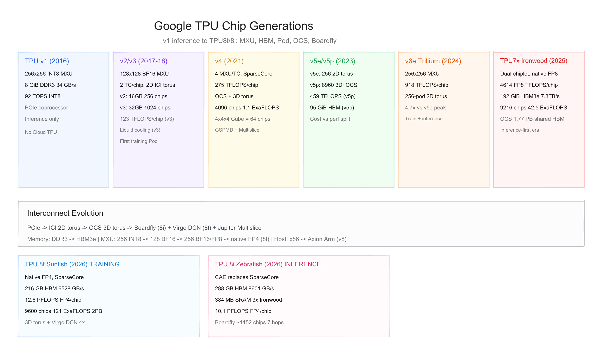
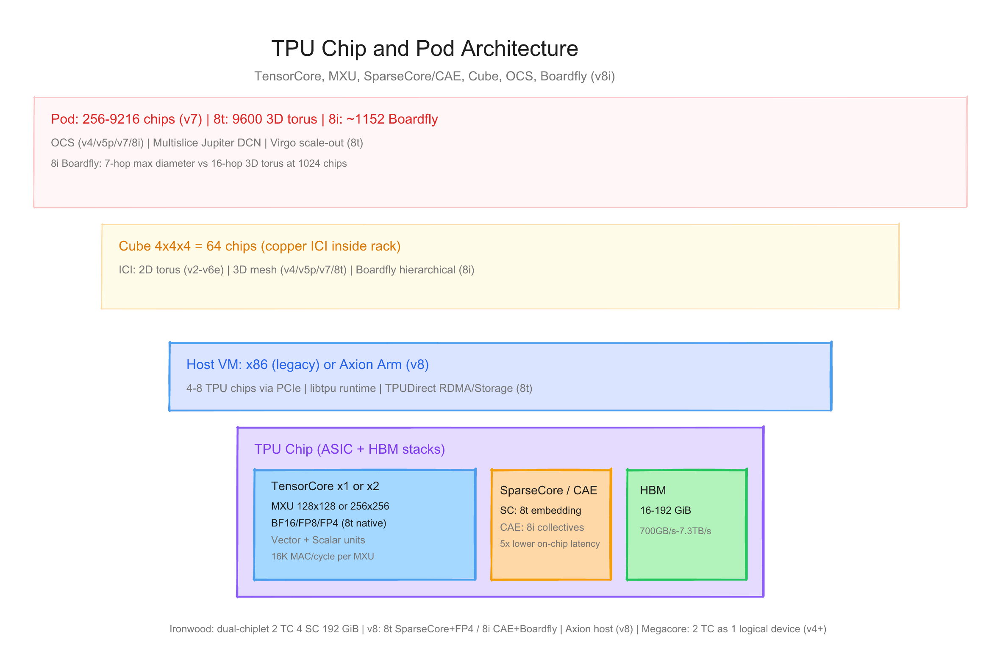
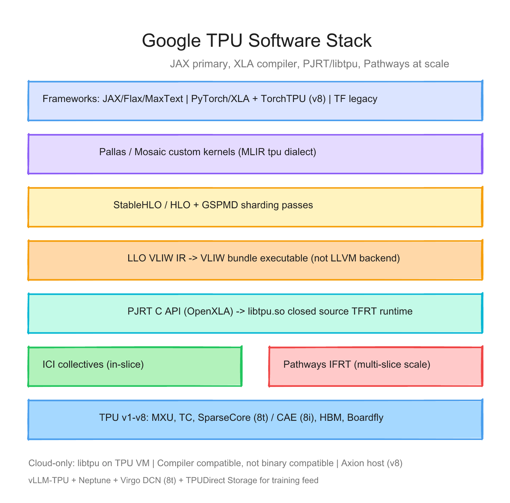

# Google TPU 每代芯片的硬件与软件调研报告

> 截至日期：2026 年 6 月 27 日。Google TPU（Tensor Processing Unit）是 Google 自研、面向矩阵运算的 AI 加速器家族，2016 年首代内部部署，2017 年起通过 **Cloud TPU** 对外租用。公开世代从 **TPU v1**（推理协处理器）演进到 **TPU7x / Ironwood**（2025），并于 **2026 年 4 月 Cloud Next** 首次将第八代拆分为 **TPU 8t（Sunfish，训练）** 与 **TPU 8i（Zebrafish，推理）** 两条 purpose-built 产品线。本报告按「硬件架构 + 软件栈」两条线梳理每代差异，并给出三张架构图。

---

## 一、世代总览

| 产品 | 年份 | MXU 规模 | TC/Chip | HBM/Chip | Peak/Chip | Pod 规模 | 拓扑 | OCS |
|---|---|---|---|---|---|---|---|---|
| **TPU v1** | 2016 | 256×256 INT8 | 1 MXU | 8 GiB DDR3 | 92 TOPS INT8 | 无 | PCIe | 无 |
| **TPU v2** | 2017 | 128×128 BF16 | 2 TC | 16 GiB | ~45 TFLOPS | 256 chips | 2D torus | 无 |
| **TPU v3** | 2018 | 128×128, 2 MXU/TC | 2 TC | 32 GiB | 123 TFLOPS | 1024 chips | 2D torus | 无 |
| **TPU v4** | 2021 | 128×128, 4 MXU/TC | 2 TC | 32 GiB | 275 TFLOPS | 4096 chips | 3D torus | **48× OCS** |
| **TPU v5e** | 2023 | 128×128, 4 MXU/TC | 1 TC | 16 GiB | 197 TFLOPS | 256 chips | 2D torus | 无 |
| **TPU v5p** | 2023 | 128×128, 4 MXU/TC | 2 TC | 95 GiB | 459 TFLOPS | 8960 chips | 3D torus | OCS |
| **TPU v6e (Trillium)** | 2024 | **256×256** | 1 TC | 32 GiB | 918 TFLOPS | 256 chips | 2D torus | 无 |
| **TPU7x (Ironwood)** | 2025 | 256×256, dual-chiplet | 2 TC | **192 GiB** | **4614 FP8** TFLOPS | **9216** chips | 3D torus | OCS |
| **TPU 8t (Sunfish)** | 2026 | 256×256, **native FP4** | 2 TC | **216 GB** | **12.6 FP4** PFLOPS | **9600** chips | 3D torus | OCS + **Virgo DCN** |
| **TPU 8i (Zebrafish)** | 2026 | 256×256 + **CAE** | 2 TC | **288 GB** | **10.1 FP4** PFLOPS | **~1152** chips | **Boardfly** | OCS |

**命名注意**：Cloud 实例 `v3-128` 等数字指 **TensorCore 数量**（128 TC = 64 chips）；v5e/v5p/v6e/v7 改用 machine type（`ct5lp-*`、`ct6e-*`、`ct7x-*`）。v5 分 **efficient（v5e）** 与 **performance（v5p）** 两条产品线；**v8 首次按训练/推理拆成两颗芯片（8t / 8i）**，代号 Sunfish / Zebrafish。

代际间最关键的趋势：**DDR3 → HBM → HBM3e**；**MXU 从 256×256 INT8 到 128×128 BF16 再到 256×256 BF16/FP8/FP4**；**Pod 从 256 扩至 9600 芯片（8t）**；**互联从 2D torus → OCS 光交换 3D torus → Boardfly 分层全连接（8i）→ Virgo DCN scale-out**；**SparseCore（训练 embedding）与 CAE（推理 collective）按 workload 分叉**；软件栈以 **XLA 为不变编译器核心**，框架从 TensorFlow 转向 **JAX + PJRT/libtpu**，v8 起 **TorchTPU 原生 PyTorch preview**。



---

## 二、硬件架构演进

### 2.1 TPU v1（2016）— 推理专用协处理器

**整体结构**：PCIe 外挂 ASIC，核心为 **256×256 INT8 systolic array**（65,536 MAC），峰值 **92 TOPS**。片上 **28 MiB** 软件管理存储；片外 **8 GiB DDR3**（~34 GB/s）。**无 HBM、无 Pod、无训练能力**。

> *"The heart of the TPU is a 65,536 8-bit MAC matrix multiply unit that offers a peak throughput of 92 TeraOps/second (TOPS) and a large (28 MiB) software-managed on-chip memory."*  
> — [In-Datacenter Performance Analysis of a TPU (ISCA 2017)](https://arxiv.org/pdf/1704.04760)

**设计哲学**：weight-stationary systolic array；deterministic execution（满足 99th-percentile latency）；极简微架构（无 cache、无 OoO）。2015 起 Google 内部部署，占 datacenter NN inference 约 95%。

**Cloud**：未作为 Cloud TPU 商用（首代 Cloud TPU 为 v2）。

### 2.2 TPU v2（2017）— 首款 Cloud TPU / 训练超算

**整体结构**：引入 **bfloat16**（与 FP32 同动态范围）、**HBM**、**TensorCore** 概念。每芯片 **2 个 TensorCore**，每 TC 含 **128×128 MXU**（BF16 乘、FP32 累加）。峰值 ~**45 TFLOPS/chip**；**16 GiB HBM**，**700 GB/s**（相对 v1 DDR3 **20× 带宽**）。

**系统拓扑**：**ICI 2D torus**，**256-chip Pod** → **11.5 PFLOPS**，4 TB HBM。4 chips/board，多 board 经 ICI 组成 Pod。

> *"A big focus of ours was not just the affordability of building something to do training but also to get the scale. So we built an interconnected machine — our first TPU pod — with 256 TPU chips connected with a very high-bandwidth, custom interconnect."*  
> — [TPU transformation: 10 years of AI chips](https://cloud.google.com/transform/ai-specialized-chips-tpu-history-gen-ai)

**Cloud 实例**：`v2-8`（4 chips）到 `v2-512`（256 chips）。文档：[TPU v2](https://docs.cloud.google.com/tpu/docs/v2)

**相对 v1 创新**：训练 + 推理；HBM 替代 DDR3；ICI Pod 超算；完整 XLA 编译栈；SparseCore 协同设计起点。

### 2.3 TPU v3（2018）— 液冷 + 1024-chip Pod

**整体结构**：v2 架构深化——每 TC **2 个 MXU**（共 4 MXU/chip）；时钟 700→940 MHz；**32 GiB HBM**，900 GB/s；峰值 **123 TFLOPS/chip**（BF16）。

**系统拓扑**：Pod 扩至 **1024 chips** → **>100 PFLOPS**；仍 **2D torus**；引入 **液冷**；All-reduce 340 TB/s。

> *"TPUv3 supercomputer (1024 chips): >100 petaflops, 32 TB HBM, liquid cooled"*  
> — [HotChips 2019 Cloud TPU Tutorial](https://old.hotchips.org/hc31/HC31_T3_Cloud_TPU_Codesign.pdf)

**Cloud 实例**：`v3-8` … `v3-2048`（数字 = TensorCore 数）。文档：[TPU v3](https://cloud.google.com/tpu/docs/v3)

### 2.4 TPU v4（2021）— OCS 光交换 + 4096-chip Superpod

**整体结构**：架构分水岭。每 TC **4 个 128×128 MXU**；两 TC 共享 **128 MiB CMEM**；峰值 **275 TFLOPS/chip**；32 GiB HBM，1200 GB/s；**6 条 ICI link/chip**。

**SparseCore**：数据流处理器，加速 embedding / 推荐模型 sparse 操作；v4 上 embedding 性能约为 CPU 的 **5–7×**。

**系统拓扑**：
- **4096 chips** → **1.1 ExaFLOPS**
- **4×4×4 Cube** = 64 chips/rack，柜内铜缆 ICI
- **48× Palomar OCS**（136×136 port）动态重配 **3D torus**（~10s 级 job 重配）
- OCS 成本 **<5% CapEx, <3% power**

> *"48 OCSes connect the 48 pairs of cables from 64 4³ blocks (each 64 chips), yielding the desired total of 4096 TPU v4 chips."*  
> — [TPU v4: An Optically Reconfigurable Supercomputer (ISCA 2023)](https://arxiv.org/pdf/2304.01433)

**Cloud 实例**：`v4-8` … `v4-4096`；支持 twisted torus（+40–70% bisection BW）。文档：[TPU v4](https://docs.cloud.google.com/tpu/docs/v4)

**软件里程碑**：**GSPMD** 生产化；**Multislice**（ICI + DCN）；**Megacore**（2 物理 TC 逻辑合一）。



### 2.5 TPU v5e（2023）— 成本效率 / 256-chip 2D Pod

**整体结构**：第五代「efficient」分支。每芯片 **1 TensorCore**，**4 MXU/TC**；峰值 **197 TFLOPS** BF16；**16 GiB HBM**，800 GiB/s；**256-chip 2D torus Pod**（无 OCS）。

> *"Peak compute per chip (bf16): 197 TFLOPs... TPU Pod size: 256 chips... Interconnect topology: 2D torus"*  
> — [TPU v5e Documentation](https://docs.cloud.google.com/tpu/docs/v5e)

**定位**：推理与中规模训练；风冷；TCO 优化（文档 TCO 系数 0.65×）。

**Cloud**：`ct5lp-hightpu-1t/4t/8t`（serving）；训练拓扑 4×4 … 16×16。

### 2.6 TPU v5p（2023）— 性能旗舰 / 8960-chip 3D Pod

**整体结构**：第五代「performance」。**2 TC/chip**，**4 SparseCore/chip**；**95 GiB HBM**，2765 GB/s；峰值 **459 TFLOPS** BF16/FP8（FP8 为 emulated）；ICI **1200 GB/s** bidirectional。

**系统拓扑**：**8960 chips**（140 cubes）；最大单 job **6144 chips**；**3D torus + OCS**；Multislice 最多 **18432 chips**。

> *"Each TPU v5p pod composes together 8,960 chips over our highest-bandwidth inter-chip interconnect (ICI) at 4,800 Gbps/chip in a 3D torus topology."*  
> — [Introducing Cloud TPU v5p and AI Hypercomputer](https://cloud.google.com/blog/products/ai-machine-learning/introducing-cloud-tpu-v5p-and-ai-hypercomputer)

**定位**：Gemini 级 frontier LLM 预训练；相对 v4 **2.8× 训练速度**（Google 官方对比）。

### 2.7 TPU v6e / Trillium（2024）— 256×256 MXU

**整体结构**：第六代。**MXU 扩至 256×256**（各 65,536 MAC）；1 TC/chip，2 MXU/TC；**2 SparseCore/chip**；峰值 **918 TFLOPS** BF16；32 GiB HBM，1638 GB/s。

> *"An MXU is composed of either 256 x 256 (TPU v6e and TPU7x) or 128 x 128 (TPU versions prior to v6e) multiply-accumulators in a systolic array."*  
> — [TPU System Architecture](https://cloud.google.com/tpu/docs/system-architecture-tpu-vm)

> *"Trillium TPUs achieve an impressive 4.7X increase in peak compute performance per chip compared to TPU v5e."*  
> — [Introducing Trillium](https://cloud.google.com/blog/products/compute/introducing-trillium-6th-gen-tpus)

**系统拓扑**：256-chip 2D torus Pod；Multislice 经 Jupiter DCN 扩至数万芯片。

**Cloud**：`ct6e-standard-1t/4t/8t`；`v6e-8` 单 VM 8 chips 优化推理 serving。

### 2.8 TPU7x / Ironwood（2025）— Native FP8 + 9216-chip

**整体结构**：第七代，**3nm 级设计**（Google 称首款为 inference 时代设计）。**Dual-chiplet**：2 chiplets/chip，D2D 互连；每 chiplet 1 TC + 2 SC + 96 GB HBM。整芯片 **192 GiB HBM3e**，**7.37 TB/s**；**4 SparseCore/chip**。

**算力**：**4614 TFLOPS FP8**（native，非 emulated）；**2307 TFLOPS BF16**；Pod 聚合 **42.5 ExaFLOPS FP8**（9216 chips）。

> *"Each individual chip boasts peak compute of 4,614 TFLOPs... scaled to 9,216 chips per pod for a total of 42.5 Exaflops"*  
> — [Ironwood: The first Google TPU for the age of inference](https://blog.google/innovation-and-ai/infrastructure-and-cloud/google-cloud/ironwood-tpu-age-of-inference/)

> *"9216 Ironwood chips share memory per pod with optical circuit switches (OCS)... Directly addressable shared HBM memory capacity of 1.77 PB"*  
> — [Hot Chips 2025 Ironwood deck](https://hc2025.hotchips.org/assets/program/conference/day2/61_Google_Ironwood-Final.pdf)

**系统拓扑**：9216 chips（144 cubes）；3D torus + OCS；**1.77 PB** Pod 级可寻址共享 HBM；液冷；**2× perf/W vs Trillium**。

**软件注意**：JAX 将 **1 physical chip 暴露为 2 devices**（每 chiplet 一 device）。

**Cloud**：`ct7x` 系列；文档：[TPU7x](https://docs.cloud.google.com/tpu/docs/tpu7x)

### 2.9 TPU 8t / TPU 8i（2026）— 首次训练/推理双轨 + Agentic Era

**发布背景**：2026 年 4 月 **Google Cloud Next '26** 宣布第八代 TPU，**首次将产品线拆为两颗 purpose-built 芯片**——此前 v5 的 v5e/v5p 分叉仍在同一「代」内，v8 则是代际层面的训练/推理 specialization。Google 称面向 **agentic AI**（多步推理、MoE serving、RL 采样、world models 训练）设计；与 Google DeepMind 协同 codesign。预计 **2026 年内 GA**（[官方 blog](https://blog.google/innovation-and-ai/infrastructure-and-cloud/google-cloud/eighth-generation-tpu-agentic-era/)）；部分 Tier 2 报道提及 **TSMC 2nm、2027 年底** 外部客户大规模部署时间线（[The Next Web](https://thenextweb.com/news/google-ironwood-tpu-inference-cloud-next)，未独立验证）。

| 维度 | TPU 8t（Sunfish，训练） | TPU 8i（Zebrafish，推理） |
|---|---|---|
| **主攻 workload** | 大规模 pre-training、embedding-heavy | post-training、sampling、serving、MoE 推理、agentic RL |
| **网络拓扑** | **3D torus**（延续 Ironwood 训练路径） | **Boardfly** 分层全连接（非 torus） |
| **专用加速器** | **SparseCore** + LLM Decoder Engine | **CAE**（Collectives Acceleration Engine） |
| **HBM** | **216 GB**，6528 GB/s | **288 GB**，8601 GB/s（~1.3× 8t） |
| **片上 SRAM（Vmem）** | 128 MB | **384 MB**（3× Ironwood） |
| **峰值算力** | **12.6 PFLOPS FP4** | **10.1 PFLOPS FP4** |
| **ICI 带宽** | **2×** Ironwood | **19.2 Tb/s**（2× Ironwood） |
| **Pod 规模** | **9600 chips** → **121 ExaFLOPS**、**2 PB** 共享 HBM | **~1152 chips**（36 groups × 8 boards，最多 1024 active） |
| **CPU Host** | **Axion Arm**（弃 x86 host） | **Axion Arm**（2× host/server，NUMA） |

#### 2.9.1 TPU 8t — 训练超算

**整体结构**：在 Ironwood 训练路径上继续放大 scale-up。**Native FP4** 进入 MXU（block-scale 量化在 MXU 内完成，消除 VPU overhead）；**VPU/MXU overlap** 加强，减少 layernorm/softmax 暴露时间。保留 **SparseCore**  offload embedding lookup 与 data-dependent all-gather，避免 zero-op 瓶颈。

**系统拓扑**：
- **9600-chip superpod**：**121 ExaFLOPS** 算力、**2 PB** 共享 HBM、**2× ICI** 带宽
- **Virgo Network**（scale-out DCN）：扁平两层 non-blocking fabric，**4× DCN 带宽** vs Ironwood；单 DC 可连 **134,000 TPU 8t**（47 Pbps bisection）；跨 DC **100 万+ chips** 单 logical training cluster（Pathways + JAX）
- **TPUDirect RDMA / TPUDirect Storage**：HBM ↔ NIC / Managed Lustre **10T** 直连，绕过 CPU host；存储访问较 Ironwood **10×**（官方 claim）

> *"TPU 8t delivers up to 2.7x performance-per-dollar improvement over Ironwood TPU for large-scale training."*  
> — [TPU 8t and TPU 8i technical deep dive](https://cloud.google.com/blog/products/compute/tpu-8t-and-tpu-8i-technical-deep-dive)

> *"We can now turn months of training into weeks with the power of 1 million+ TPU chips in a single cluster, orchestrated by Pathways and JAX."*  
> — [AI infrastructure at Next '26](https://cloud.google.com/blog/products/compute/ai-infrastructure-at-next26)

**RAS**：目标 **>97% goodput**——实时 telemetry、ICI 故障自动 reroute、OCS 无人工干预重配。

**设计伙伴 / 工艺**（Tier 2，待验证）：报道称 **Broadcom** 参与 Sunfish 设计、**TSMC 2nm**；8-high → **12-high HBM3e** stack 带来约 **30%** 更高内存带宽（[The Next Web](https://thenextweb.com/news/google-ironwood-tpu-inference-cloud-next)）。

#### 2.9.2 TPU 8i — 推理与 reasoning 专用

**整体结构**：用 **SRAM + HBM 容量** 换部分峰值 FLOPS，打破 inference **memory wall**。每 chip **2 TC**（on-core die）+ **1 CAE**（chiplet die），**取代 Ironwood 的 4 SparseCore**——CAE offload all-reduce / all-gather 等 collective，on-chip collective 延迟 **5×** 降低。

**Boardfly 拓扑**（取代 3D torus）：
- **Building Block**：4-chip tray 内 ICI ring
- **Group**：8 boards 铜缆全连接
- **Pod**：36 groups 经 **OCS** 全连接；任意 chip-to-chip **最多 7 hops**（同规模 3D torus 约 **16 hops** → 网络直径 **-56%**）
- 设计灵感来自 **Dragonfly** 高基数拓扑，优化 MoE / reasoning 的 **all-to-all** 模式

> *"By tripling on-chip SRAM to 384 MB and increasing high-bandwidth memory (HBM) to 288 GB, it breaks the memory wall, hosting massive KV Caches entirely on silicon."*  
> — [AI infrastructure at Next '26](https://cloud.google.com/blog/products/compute/ai-infrastructure-at-next26)

> *"TPU 8i delivers up to 80% performance-per-dollar improvement over Ironwood TPU, particularly at low-latency targets for large MoE models."*  
> — [TPU 8 technical deep dive](https://cloud.google.com/blog/products/compute/tpu-8t-and-tpu-8i-technical-deep-dive)

**能效**：8t / 8i 相对 Ironwood **2× performance-per-watt**；8i 推理 **80% better $/perf**；第四代液冷维持高功率密度。

**Cloud**：`ct8t-*` / `ct8i-*` 系列（machine type 命名待 GA 文档确认）；当前可通过 interest form 预约。

---

## 三、软件栈演进

### 3.1 核心原则：XLA 不变 + 编译器兼容、非二进制兼容

Google TPU 软件栈的**不变量**是 **XLA（Accelerated Linear Algebra）** 编译器：框架图 → StableHLO/HLO → 设备后端 → 可执行体。硬件从 v2 到 Ironwood **微架构高度稳定**，Google 刻意选择 **编译器兼容、非二进制兼容**——换代需 **重编译**，不能复用旧 executable。

**中文要点**（[Ironwood codesigned stack blog](https://cloud.google.com/blog/products/compute/inside-the-ironwood-tpu-codesigned-ai-stack)）：性能来自 **XLA 开箱优化** + **Pallas/Mosaic 手写 kernel** 双轨。



### 3.2 TPU v1 软件栈

- **TensorFlow + XLA 起步**；推理图编译
- 无公开训练 Pod 栈；PCIe coprocessor 模型

### 3.3 TPU v2/v3 软件栈 — XLA/HLO/LLO 定型

**编译分层**（[OpenXLA XLA architecture](https://openxla.org/xla/architecture)）：
- **HLO**：后端无关 IR；fusion、layout、GSPMD 等通用优化
- **LLO**：TPU 专用 VLIW IR；随 silicon 变宽 bundle、MXU 槽位

**框架**：TensorFlow graph → XLA HLO bridge 为原始路径；Pod 级 SPMD 训练。

**限制**（[Intro to Cloud TPU](https://cloud.google.com/tpu/docs/intro-to-tpu)）：**静态 shape**（变 shape 需重编译）；batch/feature 维宜 **128 倍数**；矩阵/MXU 导向 workload 友好。

### 3.4 TPU v4/v5 软件栈 — GSPMD + Multislice + PJRT

**GSPMD**（[论文](https://arxiv.org/abs/2105.04663)）：XLA HLO transformation pass，自动分片 + 插入 AllReduce/AllGather/ReduceScatter。

**Multislice**（[文档](https://cloud.google.com/tpu/docs/multislice-introduction)）：跨 Pod slice 经 **DCN（Jupiter）** 扩展；XLA 自动生成 inter-slice collective。

**Megacore**：v4+ 上 2 物理 TensorCore 对 JAX 呈现为 **1 logical device**。

**PJRT**（[Open Source Blog 2024](https://opensource.googleblog.com/2024/03/pjrt-plugin-to-accelerate-machine-learning.html)）：OpenXLA 统一 device 插件 API；JAX **唯一**运行时接口；PyTorch/XLA **PJRT 默认**（`PJRT_DEVICE=TPU`）。

**运行时**：**`libtpu.so`**（闭源，TPU VM 预装）— XLA TPU backend + TFRT + ICI/DCN collectives。

### 3.5 TPU v6e / Ironwood / v8 软件栈 — JAX AI Stack + Pathways + TorchTPU

**JAX 为主框架**（[JAX AI stack on Cloud TPU](https://cloud.google.com/tpu/docs/jax-ai-stack)）：

| 层 | 组件 |
|---|---|
| 框架 | JAX / Flax / MaxText / MaxDiffusion |
| 优化 | Optax / Orbax / Grain |
| 自定义 kernel | **Pallas / Mosaic** / Tokamax |
| 编译 | **XLA** |
| 分布式运行时 | **Pathways**（超大规模） |
| 推理 | vLLM-TPU、Neptune Serving Engine |

**Pathways**（[Pathways on Cloud intro](https://cloud.google.com/ai-hypercomputer/docs/workloads/pathways-on-cloud/pathways-intro)）：**非编译器**，是单控制器 **IFRT 运行时**——一个 JAX client 编排跨数千~数万芯片；内部用于 Gemini 训练。

**PyTorch/XLA**：`torch_xla` trace → 同一 XLA+libtpu；SPMD via `mark_sharding`；相对 JAX 功能/性能常滞后。

**TorchTPU（v8 preview）**：**原生 PyTorch** 支持进入 preview（[Next '26 公告](https://cloud.google.com/blog/products/compute/ai-infrastructure-at-next26)）——模型 **无需改写** 即可上 TPU，支持 **Eager Mode** 等原生 PyTorch 特性；与 **vLLM-TPU** 并列，强化「开放框架」叙事。

**v8 硬件-软件协同**（[technical deep dive](https://cloud.google.com/blog/products/compute/tpu-8t-and-tpu-8i-technical-deep-dive)）：
- **Pallas/Mosaic** 一等公民支持 **CAE**（8i）与 **SparseCore**（8t）手写 kernel
- **XLA** 自动处理 Boardfly 拓扑与 CAE 同步，Ironwood 上跑的 JAX/PyTorch/Keras 代码 **可 scale 到 v8**（需重编译，非 binary compat）
- **Virgo Network** 带宽目标来自 trillion-parameter 训练并行度需求；Boardfly / 384 MB SRAM 分别针对 reasoning 模型通信与 KV cache  footprint codesign

**Pallas 编译路径**：Python kernel → Mosaic TPU compiler → MLIR `tpu` dialect → lower 到 LLO，与 XLA 代码 **链接在同一 executable**。

### 3.6 编译流水线（HLO → LLO → Executable）

```
Framework (JAX/PyTorch/TF)
    → StableHLO / HLO
    → ~97 HLO passes (fusion, GSPMD, layout, scheduling)
    → HLO → LLO (MXU emitters: vmatprep/vmatmul/vmatres)
    → VLIW Bundle pack
    → libtpu runtime → TPU hardware
```

TPU **不用 LLVM 作为最终后端**，而是 **LLO → VLIW bundle bytes**。Pallas kernel 经 `kCustomCall` 旁路导入。

**Internals 参考**（Tier 2，未独立验证）：[crucible-notes libtpu wiki](https://gh.evko.io/crucible-notes/libtpu/) 描述六代 silicon 在单 binary 内（jellyfish→pufferfish→viperfish→ghostlite→Ironwood），VLIW bundle 宽度 v2/v3 **41B** → v4 **51B** → v5+ **64B**。查阅规范见 `rules/skills/reference_crucible_notes.md`。

### 3.7 软件 × 硬件能力矩阵

| 能力 | v1 | v2/v3 | v4 | v5e/v5p | v6e | Ironwood | 8t / 8i |
|---|---|---|---|---|---|---|---|
| TensorFlow + XLA | ✅ | ✅ 主力 | ✅ | ✅ | ✅ | ✅ 遗产 | ✅ 遗产 |
| JAX + XLA | — | ✅ | ✅ 首选 | ✅ | ✅ 首选 | ✅ 首选 | ✅ 首选 |
| PyTorch/XLA + PJRT | — | 实验 | ✅ | ✅ | ✅ | ✅ | ✅ |
| **TorchTPU 原生 PyTorch** | — | — | — | — | — | — | ✅ preview |
| GSPMD 自动分片 | — | 实验 | ✅ | ✅ | ✅ | ✅ | ✅ |
| Multislice | — | — | ✅ | ✅ | ✅ | ✅ | ✅ |
| Pathways | — | — | 内部 | 内部 | Cloud 路径 | ✅ GA 路径 | ✅ 百万 chip cluster |
| Pallas/Mosaic | — | — | 实验 | ✅ | ✅ 成熟 | ✅ 协同设计 | ✅ CAE/SC 一等公民 |
| SparseCore XLA 路由 | — | 基础 | ✅ | ✅ v5p 4/chip | ✅ 2/chip | ✅ 4/chip | ✅ 8t |
| **CAE collective offload** | — | — | — | — | — | — | ✅ 8i |
| vLLM-TPU / NSE serving | — | — | — | — | ✅ | ✅ | ✅ |
| **TPUDirect Storage/RDMA** | — | — | — | — | — | — | ✅ 8t |
| **Virgo DCN fabric** | — | — | — | — | — | — | ✅ 8t |

### 3.8 Cloud-only 限制

| 事实 | 说明 |
|---|---|
| **无零售 TPU** | 仅 GCE / GKE / Vertex AI 租用 |
| **libtpu 闭源** | 只能在 Cloud TPU VM 运行 |
| **Edge TPU ≠ Cloud TPU** | Coral 用 Edge TPU Compiler / LiteRT，**不**走 XLA/libtpu |
| **无 binary compat** | 换代需重编译 |
| **静态 shape** | 动态 shape 模型不适配 |

---

## 四、设计哲学的三次转向

**第一次（v1 → v2/v3）**：从「推理 PCIe 协处理器」到「训练超算 Pod」。引入 BF16、HBM、ICI 2D torus；设计哲学是 **10–20% 优化空间换 2–8 年架构灵活性**（Jouppi 原话：tensor math 不变，不过度特化）。

**第二次（v3 → v4/v5p）**：从「固定 2D torus」到 **OCS 可重构 3D 网络 + SparseCore + GSPMD 软件协同**。v4 是 optical switching 分水岭；软件上 Multislice 让编译器自动处理跨 slice 通信。

**第三次（v5 分叉 → v6e/Ironwood）**：从「训练优先」到 **训练/推理双轨 + inference-first**。v5e/v6e 走 256-pod 2D 性价比；v5p/Ironwood 走 9K-chip 3D+OCS frontier；Ironwood 以 **native FP8、dual-chiplet、1.77 PB Pod 共享内存** 服务 thinking models 与 decode-heavy serving。

**第四次（Ironwood → v8）**：从「单芯片兼顾训练/推理」到 **代际内两颗专用硅（8t / 8i）+ 专用网络拓扑（3D torus vs Boardfly）+ 专用加速器（SparseCore vs CAE）**。训练侧押注 **native FP4、Virgo scale-out、TPUDirect 喂数、百万 chip Pathways**；推理侧押注 **384 MB SRAM + 288 GB HBM 片上 KV cache、CAE 5× 降 collective 延迟、Boardfly 7-hop 直径**。Host 全面切换 **Axion Arm**，系统级 codesign 取代「x86 host + TPU accelerator」组合。

---

## 五、与外部生态的关系

- **Analytical Engines**：TPU 仅云租用，与 NVIDIA GPU（零售+云）、AWS Trainium（云）、Meta MTIA（内部）形成不同商业模式。
- **OpenXLA**：XLA、StableHLO、PJRT 开源；**TPU backend（libtpu）闭源**。
- **框架**：JAX 为 Google 叙事中心；PyTorch/XLA 官方支持但次要；TensorFlow 遗产。
- **竞品参照**：[Google's Training Supercomputers v2→Ironwood (arXiv:2606.15870)](https://arxiv.org/pdf/2606.15870) 强调 MXU/HBM/ICI 三代架构 **高度稳定**，与 NVIDIA 频繁换代形成对比；v8 在 **拓扑与加速器类型** 上首次按 workload 硬分叉，稳定性叙事需重新评估。
- **v8 竞争窗口**：Trainium3、NVIDIA Vera Rubin 预计先于 v8 外部 GA 建立部署（Tier 2 分析）；Google 以 **2.7× 训练 $/perf（8t）**、**80% 推理 $/perf（8i）** 回应。
- **Internals 社区**：[crucible-notes libtpu](https://gh.evko.io/crucible-notes/libtpu/) 逆向 wiki（best-guess，非权威）。

---

## 六、参考来源

- [TPU System Architecture (Google Cloud)](https://cloud.google.com/tpu/docs/system-architecture-tpu-vm)
- [TPU v1 ISCA 2017 论文](https://arxiv.org/pdf/1704.04760)
- [TPU v2 Cloud 文档](https://docs.cloud.google.com/tpu/docs/v2)
- [TPU v3 Cloud 文档](https://cloud.google.com/tpu/docs/v3)
- [TPU v4 ISCA 2023 论文](https://arxiv.org/pdf/2304.01433)
- [TPU v4 Cloud 文档](https://docs.cloud.google.com/tpu/docs/v4)
- [TPU v5e / v5p 文档](https://docs.cloud.google.com/tpu/docs/v5e)
- [TPU v6e (Trillium) 文档](https://docs.cloud.google.com/tpu/docs/v6e)
- [TPU7x (Ironwood) 文档](https://docs.cloud.google.com/tpu/docs/tpu7x)
- [TPU 8t and TPU 8i technical deep dive](https://cloud.google.com/blog/products/compute/tpu-8t-and-tpu-8i-technical-deep-dive)
- [Eighth-generation TPU announcement (Google Blog)](https://blog.google/innovation-and-ai/infrastructure-and-cloud/google-cloud/eighth-generation-tpu-agentic-era/)
- [AI infrastructure at Next '26](https://cloud.google.com/blog/products/compute/ai-infrastructure-at-next26)
- [Ironwood Blog](https://blog.google/innovation-and-ai/infrastructure-and-cloud/google-cloud/ironwood-tpu-age-of-inference/)
- [Ironwood Hot Chips 2025](https://hc2025.hotchips.org/assets/program/conference/day2/61_Google_Ironwood-Final.pdf)
- [JAX AI stack on Cloud TPU](https://cloud.google.com/tpu/docs/jax-ai-stack)
- [GSPMD 论文](https://arxiv.org/abs/2105.04663)
- [Pathways on Cloud](https://cloud.google.com/ai-hypercomputer/docs/workloads/pathways-on-cloud/pathways-intro)
- [OpenXLA XLA architecture](https://openxla.org/xla/architecture)
- [TPU transformation: 10 years](https://cloud.google.com/transform/ai-specialized-chips-tpu-history-gen-ai)
- [Training Supercomputers v2→Ironwood (arXiv)](https://arxiv.org/pdf/2606.15870)

---

## 附：架构图索引

本报告配套三张架构图，已 inline 在对应章节中。源文件（可编辑）和 PNG 预览均位于 `assets/`：

| 图 | 预览 | 源文件 |
|---|---|---|
| 芯片世代演进（v1→v8） | `assets/google_tpu_hw_generations.png` | `assets/google_tpu_hw_generations.excalidraw` |
| 芯片/Pod 层级架构 | `assets/google_tpu_chip_architecture.png` | `assets/google_tpu_chip_architecture.excalidraw` |
| 软件栈层级 | `assets/google_tpu_software_stack.png` | `assets/google_tpu_software_stack.excalidraw` |
