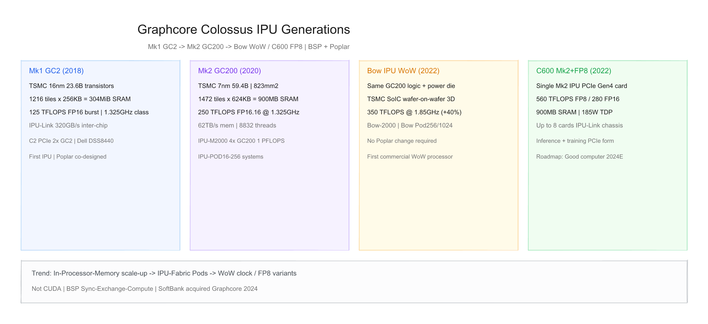
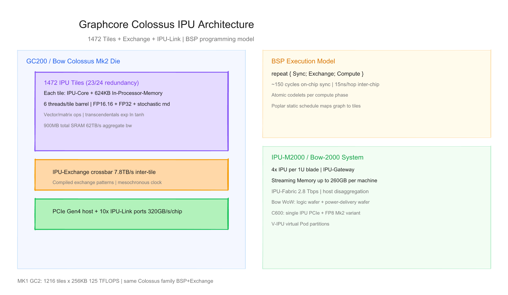
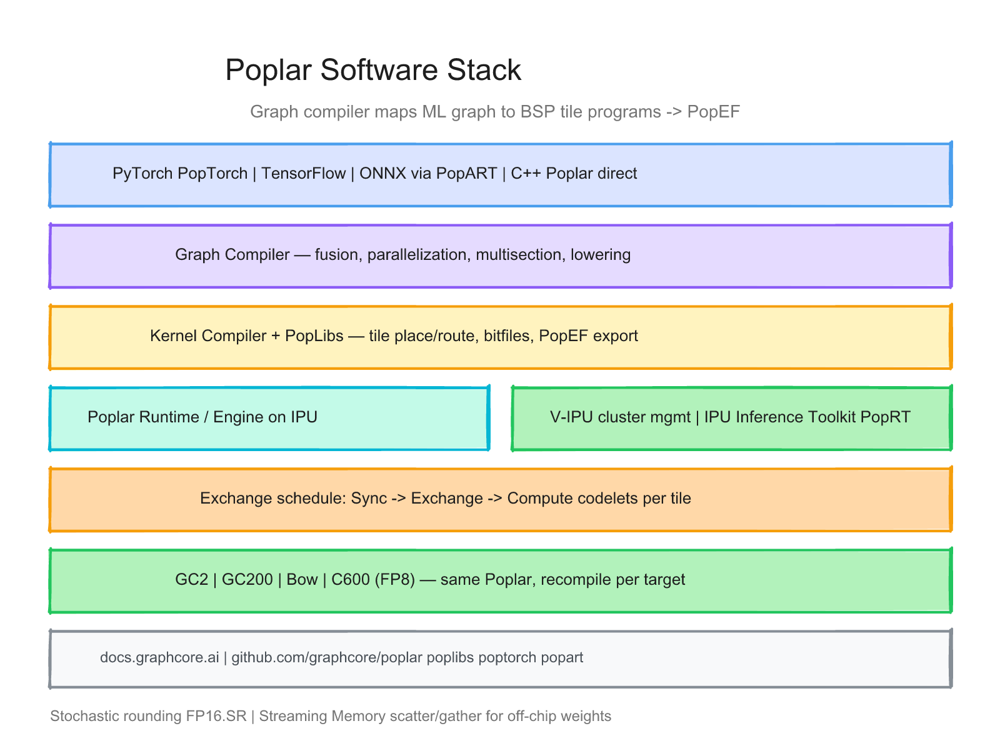

# Graphcore 每代 IPU 的硬件与软件调研报告

> 截至日期：2026 年 6 月 26 日。Graphcore（英国布里斯托）成立于 2016 年，走 **Bulk Synchronous Parallel（BSP）+ 片上 In-Processor-Memory** 路线：自研 **Colossus 架构 IPU（Intelligence Processing Unit）**，与 GPU 的 SIMT kernel 循环不同，由 **Poplar** 将 ML 图静态编译为 tile 上的 **Sync → Exchange → Compute** 程序。公开硅代际：**Mk1 GC2（2018）→ Mk2 GC200（2020）→ Bow WoW（2022，同架构提频）→ C600（2022，Mk2+FP8 PCIe）**；系统线 **C2 / IPU-M2000 / Bow-2000 / Bow Pod / C600**。2024 年 **SoftBank 收购** Graphcore；**Good™ computer**（8192 IPU、10 EFLOPS 规划）截至本报告 **未量产**。本报告按「硬件架构 + 软件栈」梳理代际差异，并给出三张架构图。

---

## 一、世代总览

| 阶段 | 芯片 | 架构 | 工艺 | 晶体管 | Tiles × SRAM | 峰值算力 | 系统形态 | 发布/状态 |
|---|---|---|---|---|---|---|---|---|
| **Mk1** | **GC2** | Colossus Mk1 | **16nm** | **23.6B** | **1216 × 256KB** ≈304MiB | **125** TFLOPS FP16 burst | **C2** PCIe（2×GC2）| **2018** 量产 |
| **Mk2** | **GC200** | Colossus Mk2 | **7nm** | **59.4B** | **1472 × 624KB** ≈900MB | **250** TFLOPS FP16.16 | **IPU-M2000**（4×）| **2020** |
| **Mk2 WoW** | **Bow IPU** | Mk2 + 电源 die | 7nm + **SoIC WoW** | ≈同 GC200 | 同 GC200 | **350** TFLOPS mixed | **Bow-2000** / **Bow Pod** | **2022** 发货 |
| **Mk2 FP8** | **C600** | Mk2 微架构变体 | 7nm | 同 Mk2 级 | 1472 / 900MB | **560** FP8 / **280** FP16 TFLOPS | **PCIe Gen4** 单卡 | **2022** |
| **规划** | **Good 世代 IPU** | WoW 下一代 | — | — | — | **10+ EFLOPS** 系统 | **Good computer** 8192 IPU | **2024E 未交付** |

**命名注意**：**GC2** = **Mk1** 芯片（非「第 2 代」）；**GC200** = **Mk2**。**Bow** 与 **GC200** 逻辑 die **架构兼容**，仅 **Wafer-on-Wafer** 叠电源 wafer 提频（[WoW 发布](https://www.graphcore.ai/posts/the-wow-factor-graphcore-systems-get-huge-power-and-efficiency-boost)）。**C600** 为 **Mk2 + FP8** 的 **PCIe 形态**，非独立架构代际（[Glossary](https://docs.graphcore.ai/projects/graphcore-glossary/en/latest/)）。

代际间关键趋势：**tile 数与每 tile SRAM 增大 → IPU-POD 规模扩展 → WoW 提频 / FP8 衍生 SKU → Good 超算路线图（搁置）**；软件 **Poplar 全栈一贯**，Bow **无需改代码**。

---

## 二、硬件架构演进

### 2.1 设计哲学 — BSP + 内存邻近计算

Graphcore 核心命题：**ML 性能受 memory bandwidth 限制**，应把 **SRAM 放在每个计算核旁**，用 **编译期确定的 exchange** 替代运行时 cache 一致性（[Hot Chips 2021](https://hc33.hotchips.org/assets/program/conference/day2/HC2021.Graphcore.SimonKnowles.v04.pdf)）。

| 维度 | Graphcore IPU | 典型 GPU |
|---|---|---|
| 并行模型 | **BSP**：Sync / Exchange / Compute | SIMT warp + kernel launch |
| 内存 | **In-Processor-Memory** 每 tile | HBM + L2 + 寄存器 |
| 互联 | **IPU-Exchange** + **IPU-Link** | NVLink / PCIe |
| 编程 | **Poplar 静态编译** 交换图 | CUDA 动态调度 |
| 精度 | FP16.16、**FP16.SR**（随机舍入）、FP32；C600 **FP8** | FP16/BF16/FP8（Hopper+） |

> 「Tile processors execute asynchronously until they need to exchange data… Bulk Synchronous Parallel (BSP): repeat { Sync; Exchange; Compute }.」（Hot Chips 2021）

### 2.2 Tile / IPU-Core 微架构

**Tile 结构**（Mk2，Hot Chips 2021）：

| 组件 | 说明 |
|---|---|
| **IPU-Core** | 每 tile 多线程 barrel；**6 线程**（C600 文档：8832 线程/chip） |
| **指令** | 32b，单/双发射；MAIN + AUX 双执行路径 |
| **算力** | 向量/矩阵单元；**exp, ln, tanh** 等超越函数；随机数 |
| **In-Processor-Memory** | Mk1：**256KB/tile**；Mk2：**624KB/tile** |
| **冗余** | Mk2：**23/24 tile** 冗余 |

**片上互联**：
- **IPU-Exchange**：crossbar，Mk1/Mk2 均 **~7.8 TB/s inter-tile**（Hot Chips 表）
- **全局时钟**：Mk2 **1.325 GHz** mesochronous；Bow **1.85 GHz**
- **片间**：**IPU-Link** **320 GB/s duplex/chip**（10 端口级）

### 2.3 Mk1 — GC2 + C2（2018）

[Hot Chips 2021](https://hc33.hotchips.org/assets/program/conference/day2/HC2021.Graphcore.SimonKnowles.v04.pdf) 与 [Dell 白皮书](https://www.graphcore.ai/hubfs/Lead%20gen%20assets/DSS8440%20IPU%20Server%20White%20Paper_2020.pdf)：

| 项目 | GC2 / Mk1 |
|---|---|
| 工艺 | **TSMC 16nm**（N16） |
| 晶体管 | **23,647,173,309** active |
| Tiles | **1216** @ **256 KiB** → **304 MiB** SRAM |
| 算力 | **125 TFLOPS** FP16 burst；**31 TFLOPS** FP32 burst |
| 内存带宽 | **62 TB/s** aggregate（与 Mk2 同级叙事） |
| 片间 | **320 GB/s** inter-chip |

**C2 PCIe 卡**（[Glossary](https://docs.graphcore.ai/projects/graphcore-glossary/en/latest/)）：
- **2× GC2**，合计 **~250 TFLOPS** mixed precision
- **192 GB/s** 卡内 IPU-Link；**128 GB/s** 卡间
- **300 W** TDP

**系统**：Dell **DSS8440**（8× C2，>2 PFLOPS 叙事）；2018 年底开始向早期客户发货（[techSPARK](https://techspark.co/blog/2018/11/27/graphcore-ships-its-first-colossus-chip-for-machine-learning/)）。

### 2.4 Mk2 — GC200 + IPU-M2000（2020）

[Hot Chips 2021](https://hc33.hotchips.org/assets/program/conference/day2/HC2021.Graphcore.SimonKnowles.v04.pdf) 定稿：

| 项目 | GC200 / Mk2 |
|---|---|
| 工艺 | **TSMC 7nm**；**823 mm²** |
| 晶体管 | **59,334,610,787** active |
| Tiles | **1472** @ **624 KiB** → **896 MiB**（营销 **900 MB**） |
| 时钟 | **1.325 GHz** |
| 算力 | **250 TFLOPS** FP16.16；**62 TFLOPS** FP32 |
| 内存带宽 | **62 TB/s**；inter-tile **7.8 TB/s** |
| TDP | **~300 W**/chip（Hot Chips 对比表） |

**IPU-M2000**（[Glossary](https://docs.graphcore.ai/projects/graphcore-glossary/en/latest/)）：
- **1U** 刀片，**4× GC200** → **1 PFLOPS**
- **Streaming Memory** 最高 **260 GB**；**IPU-Fabric 2.8 Tbps**
- **IPU-Gateway** 支持 **host disaggregation**
- 组成 **IPU-POD16 / 64 / 128 / 256** 等

**相对 Mk1**：官方称 **8× 真实应用性能**（[产品页](https://www.graphcore.ai/products/ipu)）；Hot Chips 表：Mk2 Pod16 **4000 TFLOPS FP16** vs DGX A100 **2496 TFLOPS**（vendor 对比，Tier 1）。

### 2.5 Bow IPU — WoW 封装（2022）

2022 年 3 月发布（[HPCwire](https://www.hpcwire.com/2022/03/03/graphcore-launches-wafer-on-wafer-bow-ipu/)，[SemiAnalysis](https://semianalysis.com/2022/03/03/graphcore-announces-worlds-first/)）：

| 项目 | Bow vs GC200 |
|---|---|
| 逻辑 die | **与 GC200 架构兼容**（1472 tiles，900MB SRAM） |
| 封装 | **TSMC SoIC Wafer-on-Wafer**：逻辑 wafer + **电源 delivery wafer**（deep trench capacitors） |
| 频率 | **1.325 → 1.85 GHz**（+40%） |
| 算力 | **250 → 350 TFLOPS** mixed precision |
| 能效 | **+16%** perf/W（vendor） |
| 软件 | **Poplar 无需修改** |

**Bow-2000**：4× Bow IPU → **1.4 PFLOPS** / 1U  
**Bow Pod**：Pod16 → Pod1024（**350 PFLOPS** 叙事）

**意义**：全球首个 **量产 WoW** 处理器（TSMC 先锋客户）；**非新架构代际**，属 **Mk2 系统优化**。

### 2.6 C600 — Mk2 + FP8 PCIe（2022）

[C600 Datasheet PDF](https://www.graphcore.ai/hubfs/assets/pdf/C600-IPU-Processor-PCIe-Card.pdf)：

| 项目 | C600 |
|---|---|
| 形态 | **PCIe Gen4** 双槽全高；**185 W** TDP |
| 芯片 | **单 Mk2 IPU** + **FP8** 支持 |
| Tiles / SRAM | **1472** / **900 MB** |
| 算力 | **560 TFLOPS FP8**；**280 TFLOPS FP16**；**70 TFLOPS FP32** |
| 频率 | **1.5 GHz**（datasheet） |
| 互联 | **128 GB/s** IPU-Link（32 lane）；单 chassis **最多 8 卡** |

**定位**：数据中心 **可配置 PCIe** 推理/训练加速；与 **Bow Pod 整机** 互补。

### 2.7 规划 — Good™ Computer（未交付）

2022 年路线图（[官方 Post](https://www.graphcore.ai/posts/graphcore-announces-roadmap-to-ultra-intelligence-ai-supercomputer)）：
- **8192** 下一代 WoW IPU；**>10 EFLOPS**；**4 PB** 内存、**>10 PB/s** 带宽
- 支持 **500 trillion parameters**；标价 **~$120M**
- 目标 **2024** 交付——**截至 2026 年 6 月无公开量产信息**（Tier 4 缺口）

2024 年 **SoftBank 完成收购** Graphcore（媒体报道），Good 与下一代 IPU 路线图 **未再按原时间表更新**。

---

## 三、软件栈演进

### 3.1 核心原则：Poplar 图编译 + BSP  lowering

**Poplar® SDK** 与 Colossus **协同设计**（[SDK Overview](https://docs.graphcore.ai/projects/sdk-overview/en/latest/overview.html)）：

**编译链**（[Compiler Overview](https://docs.graphcore.ai/projects/sdk-overview/en/latest/overview.html)、[Programmer's Guide](https://docs.graphcore.ai/projects/ipu-programmers-guide/en/latest/programming_model.html)）：

1. **前端**：PopTorch / TensorFlow-for-IPU / PopART（ONNX）/ C++ Poplar
2. **Graph Compiler**：融合、并行化、multisection、算子 → kernel lowering
3. **Kernel Compiler + PopLibs**：PCU/PMU 映射 → per-tile 程序 + **exchange 调度**
4. **输出**：**PopEF**（二进制 + IO 元数据 + 硬件信息）或运行时加载
5. **Runtime**：Poplar Engine 在 IPU 上执行 BSP 阶段

> 「Programs are always fully compiled… lowered into sync, exchange and compute matching IPU chip execution.」（IPU Programmer's Guide）

### 3.2 核心组件

| 组件 | 作用 |
|---|---|
| **libpoplar / Poplar** | C++ 图 API；tensor view；device 映射 |
| **PopLibs** | Gemm、elementwise、reduction 等优化 kernel（[GitHub](https://github.com/graphcore/poplibs)） |
| **PopTorch** | PyTorch IPU 后端（[GitHub](https://github.com/graphcore/poptorch)） |
| **PopART** | ONNX 导入/构建/训练/推理（[User Guide](https://docs.graphcore.ai/projects/popart-user-guide/en/latest/intro.html)） |
| **TensorFlow for IPU** | TF1/TF2 端口 |
| **PopEF** | 统一模型交换格式 |
| **IPU Inference Toolkit** | **PopRT**：ONNX → 优化 → PopEF；Serving 集成 |
| **V-IPU** | 集群分区、**vPOD** 虚拟 Pod 管理 |

### 3.3 编程模型要点

**BSP 三阶段**（Hot Chips 2021）：
- **Sync**：硬件全局 barrier（片上 ~150 cycles；片间 ~15 ns/hop）
- **Exchange**：编译确定的 tile 间数据移动（Exchange spine）
- **Compute**：每 tile 执行 **codelet** 列表

**内存模型**：
- Tile **disjoint memory**——无统一共享地址空间
- 大模型权重：**Streaming Memory**（IPU-Machine 板载 DRAM）+ scatter/gather
- **Stochastic Rounding（FP16.SR）**：训练数值特性

**与 GPU 迁移**：需 **PopTorch/PopART 端口**；**非 CUDA 二进制兼容**。

### 3.4 硬件代际 × 软件里程碑

| 里程碑 | 硬件 | 内容 |
|---|---|---|
| Poplar 1.0 | GC2 | 2018；C2 与 DSS8440 |
| Poplar + Mk2 | GC200 | 2020；IPU-M2000 / POD |
| 同二进制兼容 | **Bow** | 2022；提频无需重编译 |
| **FP8** kernel | **C600** | 2022；低精度推理/训练 |
| PopEF / Inference Toolkit | GC200+ | 生产部署标准化 |
| V-IPU | Pod 系统 | 多租户 vPOD |

### 3.5 软件栈 × 硬件矩阵

| 能力 | GC2 | GC200 | Bow | C600 |
|---|---|---|---|---|
| Poplar / PopLibs | ✅ | ✅ | ✅ 同 GC200 | ✅ |
| PopTorch | ✅ | ✅ | ✅ | ✅ |
| PopART / ONNX | ✅ | ✅ | ✅ | ✅ |
| TensorFlow IPU | ✅ | ✅ | ✅ | ✅ |
| FP8 | ❌ | ❌ | ❌ | ✅ |
| FP16.SR 训练 | ✅ | ✅ | ✅ | ✅ |
| PCIe 单机多卡 | C2 | — | — | ✅ 8× |
| Pod / Bow Pod | 早期 POD | IPU-POD | Bow Pod | — |
| V-IPU | 部分 | ✅ | ✅ | 视部署 |

---

## 四、设计哲学的三次转向

**第一次（GC2 / Mk1，2018）**：**BSP + 片上 SRAM**——1216 tile 把 **304 MiB** 分布在计算旁；C2 双芯卡证明 **IPU-Link 扩展**；Poplar 与硅 **co-design** 立旗。

**第二次（GC200 / Mk2，2020）**：**scale-out 机器智能**——7nm、900MB SRAM、1472 tile；**IPU-M2000 + POD256** 与 **Streaming Memory** 把 IPU 从 PCIe 卡推向 **数据中心 Pod**；相对 Mk1 **8× 应用性能**叙事。

**第三次（Bow WoW + C600 + Good 路线图，2022）**：**封装与 SKU 分化**——Bow 用 **WoW** 同架构 +40% 性能；C600 用 **FP8 + PCIe** 切入灵活部署；Good computer 指向 **8192 IPU 超算**——但 **2024 未交付**，公司进入 **SoftBank 时代**，产品重心转向生存与推理 niche。

---

## 五、与外部生态及验证缺口

**生态**
- 客户：DOE、云（Cirrascale、G-Core）、戴尔/联想等 OEM 服务器；中国/新加坡 C600 预购（2022 PR）
- 开源：poplar、poplibs、poptorch、popart on GitHub
- **2024 SoftBank 收购** 后独立上市路线终止（媒体报道，Tier 2）

**相对 NVIDIA 的能力边界**
- 优势：**极高片上 SRAM 带宽**、BSP 确定性、Bow **WoW 首创**、C600 **FP8** 低功耗卡
- 风险：**非 CUDA**、市场份额小、Good 未交付、**MK1/MK2 峰值 TFLOPS 低于同期 GPU 纸面**但 vendor 强调 **real-world / TCO**、benchmark 多来自 Graphcore

**本报告标注的验证缺口**
1. **GC2 早期宣传**（100 GFlops/core 等）与 **Hot Chips 125 TFLOPS/chip** 不一致——以 Hot Chips 为准
2. **Bow** 是否独立计为「第 3 代硅」——官方定义为 **Mk2 + WoW**，本报告不将其列为新架构代
3. **Good computer** 2024 交付承诺 **未兑现**
4. **C600 vs Bow** 同 Mk2 家族但 **频率/算力数字不同**（1.5 GHz vs 1.85 GHz）
5. SoftBank 收购后 **下一代 IPU（Izanagi 等）** 公开细节不足，未纳入本报告 silicon 表
6. Pod vs DGX **TCO 对比** 为 vendor 口径（Tier 1–2）

---

## 六、参考来源

- [Hot Chips 2021 Colossus Mk2 PDF](https://hc33.hotchips.org/assets/program/conference/day2/HC2021.Graphcore.SimonKnowles.v04.pdf)
- [Graphcore Glossary](https://docs.graphcore.ai/projects/graphcore-glossary/en/latest/)
- [IPU 产品页](https://www.graphcore.ai/products/ipu)
- [Dell DSS8440 白皮书 PDF](https://www.graphcore.ai/hubfs/Lead%20gen%20assets/DSS8440%20IPU%20Server%20White%20Paper_2020.pdf)
- [WoW / Bow 发布文](https://www.graphcore.ai/posts/the-wow-factor-graphcore-systems-get-huge-power-and-efficiency-boost)
- [HPCwire Bow 报道](https://www.hpcwire.com/2022/03/03/graphcore-launches-wafer-on-wafer-bow-ipu/)
- [SemiAnalysis WoW 分析](https://semianalysis.com/2022/03/03/graphcore-announces-worlds-first/)
- [C600 Datasheet PDF](https://www.graphcore.ai/hubfs/assets/pdf/C600-IPU-Processor-PCIe-Card.pdf)
- [C600 官方文档](https://docs.graphcore.ai/projects/C600-datasheet/en/latest/overview.html)
- [C600 发布文](https://www.graphcore.ai/posts/graphcore-launches-c600-pcie-card-for-ai-compute)
- [Good computer 路线图](https://www.graphcore.ai/posts/graphcore-announces-roadmap-to-ultra-intelligence-ai-supercomputer)
- [Poplar SDK Overview](https://docs.graphcore.ai/projects/sdk-overview/en/latest/overview.html)
- [Poplar Compiler Overview](https://docs.graphcore.ai/projects/poplar-user-guide/en/latest/overview.html)
- [IPU Programmer's Guide — Programming Model](https://docs.graphcore.ai/projects/ipu-programmers-guide/en/latest/programming_model.html)
- [PopART User Guide](https://docs.graphcore.ai/projects/popart-user-guide/en/latest/intro.html)
- [IPU Inference Toolkit Architecture](https://docs.graphcore.ai/projects/ipu-inference-toolkit-user-guide/en/latest/ipu_inference_toolkit_architecture.html)
- [techSPARK GC2 发货](https://techspark.co/blog/2018/11/27/graphcore-ships-its-first-colossus-chip-for-machine-learning/)

---

## 附：架构图索引

| 图 | 预览 | 源文件 |
|---|---|---|
| IPU 世代演进（GC2→GC200→Bow→C600） | `assets/graphcore_ipu_hw_generations.png` | `assets/graphcore_ipu_hw_generations.excalidraw` |
| Colossus 芯片架构（Tile/BSP/IPU-M2000） | `assets/graphcore_ipu_chip_architecture.png` | `assets/graphcore_ipu_chip_architecture.excalidraw` |
| Poplar 软件栈层级 | `assets/graphcore_ipu_software_stack.png` | `assets/graphcore_ipu_software_stack.excalidraw` |
