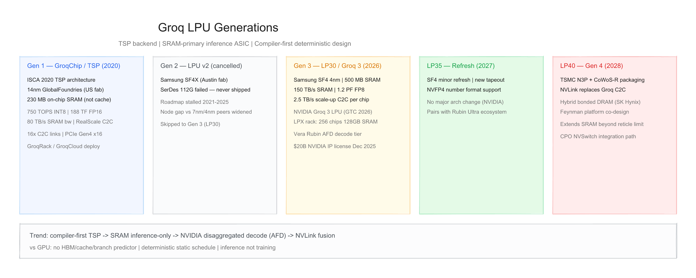
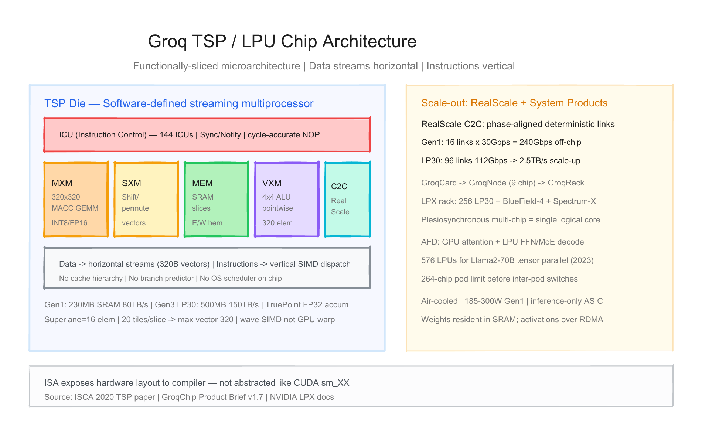
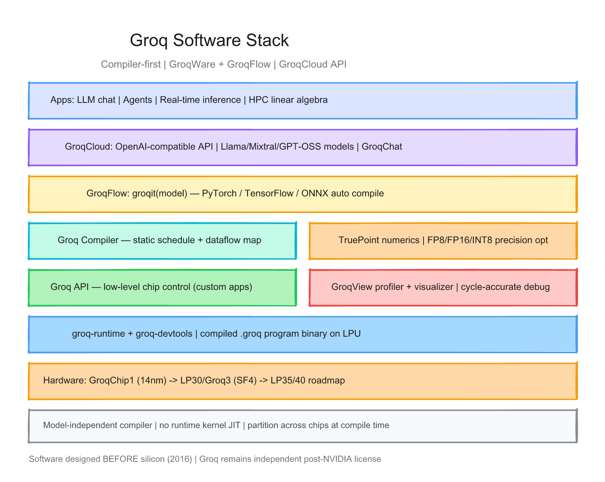

# Groq LPU 每代芯片的硬件与软件调研报告

> 截至日期：2026 年 6 月 26 日。Groq, Inc.（2016，Mountain View）由前 Google TPU 工程师 Jonathan Ross 创立，专做 **AI 推理 ASIC**——**Language Processing Unit（LPU）**，后端为 **Tensor Streaming Processor（TSP）**。与 NVIDIA GPU 的 HBM + 动态调度不同，LPU 以 **片上 SRAM 作主存**、**编译器静态调度**、**确定性执行** 为核心，只做 **推理** 不做训练。公开硅代际：**Gen1 GroqChip/TSP（14nm，2020 量产）→ Gen2（SF4X，未量产）→ Gen3 LP30/Groq 3（SF4，2026）→ LP35（2027）→ LP40（2028）**。2025 年 12 月 NVIDIA **200 亿美元非独占 IP 许可** 后，LP30 纳入 **Vera Rubin** 平台的 **LPX 推理机架**。Groq 公司仍独立运营，**GroqCloud** 继续服务。本报告按「硬件架构 + 软件栈」梳理代际差异，并给出三张架构图。Groq **无** crucible-notes 覆盖，走常规产品级调研。

---

## 一、世代总览

| 阶段 | 代号 | 芯片/SKU | 工艺 | 片上 SRAM | 算力（公开） | SRAM 带宽 | 片间互联 | 形态 | 状态 |
|---|---|---|---|---|---|---|---|---|---|
| **Gen1** | **TSP / GroqChip 1** | GroqChip™ | **GF 14nm** | **230 MB** | **750 TOPS** INT8；**188 TF** FP16 | **80 TB/s** | **RealScale** 16×C2C @30Gbps | GroqCard/Node/Rack | **2020 量产** |
| **Gen2** | LPU v2 | — | **Samsung SF4X** | — | — | — | 112G SerDes（失败） | — | **未量产** |
| **Gen3** | **LP30 / Groq 3** | NVIDIA Groq 3 LPU | **Samsung SF4** | **500 MB** | **1.2 PFLOPS** FP8 | **150 TB/s** | **2.5 TB/s** scale-up | LPX 机架 | **2026 GTC** |
| **Refresh** | **LP35** | — | SF4（新 tapeout） | ~500 MB | +**NVFP4** | 同 LP30 级 | Groq C2C | — | **2027 H2** |
| **Gen4** | **LP40** | — | **TSMC N3P** + CoWoS-R | SRAM + **hybrid DRAM** | — | — | **NVLink**（替 C2C） | Feynman 平台 | **2028** |

**系统级规格（LPX 机架，Gen3）**：

| 项目 | LPX Rack |
|---|---|
| LPU 数量 | **256× LP30** |
| 聚合 SRAM | **128 GB**（256×500 MB） |
| 聚合 SRAM 带宽 | **40 PB/s**（vendor） |
| Scale-up 带宽 | **640 TB/s** / rack |
| 主机 | 32× 1U tray：CPU + BlueField-4 + Fabric Logic |
| DDR5 扩展 | **12 TB** / rack（KV cache 等） |
| 平台 | **NVIDIA Vera Rubin** + **AFD** 解耦推理 |

**命名注意**：
- **LPU** 为产品/架构品牌；**TSP** 为 ISCA 2020 论文中的处理器微架构名。
- **Gen2 被跳过**对外产品编号直接到 **Groq 3 / LP30**（SemiAnalysis）。
- **GroqCloud** 是云服务品牌，底层跑 LPU 集群；API 与 GroqWare 本地编译栈是两条开发者路径。
- ISCA 2020 首颗 TSP 论文记载 **220 MiB** SRAM；产品 brief v1.7 为 **230 MB**——本报告以 **230 MB** 产品规格为准。

代际间关键趋势：**编译器先于硅 → 14nm 验证确定性流架构 → SerDes 挫折 → SF4 密度跃迁 → NVIDIA 许可后并入 Rubin 解耦推理（AFD）→ LP40 融合 NVLink 与 3D 内存**。



---

## 二、硬件架构演进

### 2.1 设计哲学 — 软件优先 + 确定性流处理

Groq 与 NVIDIA GPU 的分野是 **推理专用、编译器主导、SRAM 近存**，而非通用 SIMT + HBM：

| 维度 | Groq LPU | NVIDIA GPU |
|---|---|---|
| 目标 | **仅推理**（LLM decode 等） | 训练 + 推理 |
| 内存 | **SRAM 主存**（非 cache） | **HBM** + 多级 cache |
| 调度 | **编译期静态**、周期精确 | 硬件动态调度、warp |
| 确定性 | **无** cache miss / 分支预测抖动 | 非确定性 tail latency |
| 编程 | **Groq 编译器**映射数据流 | CUDA + cuDNN |
| 扩展 | **RealScale C2C**、plesiosync | NVLink/NVSwitch |
| 训练 | ❌ | ✅ |

> 「We didn't touch chip design until the compiler's architecture was designed.」（[Groq LPU Explained](https://groq.com/blog/the-groq-lpu-explained)）

**四原则**（Groq 官方）：**可编程流水线（assembly line）**、**确定性**、**片上内存**、**直接片间连接**。



### 2.2 TSP 微架构 — 功能切片（Functionally-Sliced）

Groq **ISCA 2020** 论文 *Think Fast: A Tensor Streaming Processor* 定义了 LPU 后端（[PDF](http://groq.humain.ai/wp-content/uploads/2020/06/ISCA-TSP.pdf)）：

| 切片 | 全称 | 作用 |
|---|---|---|
| **ICU** | Instruction Control Unit | 取指、**Sync/Notify** 片内屏障、**NOP(N)** 周期精确延迟 |
| **MXM** | Matrix Execution Module | **320×320** MACC 阵列；INT8/FP16 GEMM |
| **VXM** | Vector Execution Module | 4×4 ALU mesh；逐元素运算 |
| **SXM** | Switch Execution Module | 向量重排、permute |
| **MEM** | Memory Module | 东西半球 **SRAM slice**；并行读写 |
| **C2C** | Chip-to-Chip | **Send/Receive** 320B 向量跨芯片 |

**数据流 vs 指令流**：
- **张量/数据**：沿 die **水平**「传送带」流动（stream）
- **指令**：沿 **垂直** 方向 SIMD 下发到各 slice
- **Superlane** = 16 元素；每 slice **20 tile** → 最大向量 **320** 元素
- **无** 传统 core、**无** L1/L2 cache、**无** 分支预测、**无** OS 级硬件调度

**TruePoint**：中间累加 **100 bit**，在多种输入位宽下保持无损精度（vendor 叙事）。

### 2.3 Gen1 — GroqChip 1 / TSP（2020）

首款量产硅（[GroqChip Product Brief v1.7](https://groq.humain.ai/wp-content/uploads/2024/08/GroqChip%E2%84%A2-Processor-Product-Brief-v1.7.pdf)）：

| 项目 | GroqChip 1 |
|---|---|
| 工艺 | **GlobalFoundries 14nm**（美国制造叙事） |
| Die | ~**725 mm²**；Marvell 后端（SemiAnalysis） |
| SRAM | **230 MB** on-die（**主存**，非 cache） |
| 算力 | **750 TOPS** INT8；**188 TFLOPS** FP16/BF16 @900 MHz |
| 带宽 | **80 TB/s** on-die memory bandwidth |
| MXM | **320×320** fused dot-product |
| ALU | **5,120** Vector ALUs |
| 数值 | INT8/16/32；VXM FP16/FP32；TruePoint |
| 互联 | **16× RealScale C2C**；**PCIe Gen4 x16** |
| 功耗 | TDP **215 W**；Max **300 W**；Avg **185 W** |
| 时钟 | **900 MHz** 标称 |

**RealScale**（[TechDoc Scalability](https://groq.humain.ai/GroqDocs/TechDoc_Scalability.pdf)）：
- 点对点、**相位对齐**、固定延迟，编译器可静态安排 Send/Recv
- 单 link **15 GB/s** 每方向（4 lane × 30 Gbps）；GroqCard **11 links** → **330 GB/s**
- 相对 PCIe Gen4 **5.1×** 带宽（brief 叙事）

**系统产品**：
- **GroqCard** → **GroqNode**（9 chip）→ **GroqRack**（多 node）
- 2023 **Llama-2 70B**：约 **576 LPUs** tensor parallel（~9 rack × 3 pod 叙事）
- 单 pod 约 **264 chip** 为常见扩展上限，更大需 pod 间 switch（Tier 3 讨论）

### 2.4 Gen2 — LPU v2（未量产）

| 项目 | 状态 |
|---|---|
| 工艺 | **Samsung SF4X**（奥斯汀 fab，美国叙事延续） |
| 投资 | Samsung 参与 Groq **Series D**（2024–2025） |
| 失败原因 | **C2C SerDes 112 Gbps 未达标**，芯片无法正常工作（[SemiAnalysis GTC 2026](https://newsletter.semianalysis.com/p/nvidia-the-inference-kingdom-expands)） |
| 影响 | 2021–2025 路线图停滞；相对 7nm/4nm 竞品节点差距拉大 |

**意义**：Groq 对外直接跳到 **Gen3 LP30**，Gen2 无公开 SKU。

### 2.5 Gen3 — LP30 / NVIDIA Groq 3 LPU（2026）

2026 年 3 月 **GTC** 发布，NVIDIA 以 **200 亿美元 IP 许可 + 团队雇佣**（非传统并购）加速产品化（[Tom's Hardware](https://www.tomshardware.com/pc-components/gpus/nvidia-groq-3-lpu-and-groq-lpx-racks-join-rubin-platform-at-gtc-sram-packed-accelerator-boosts-every-layer-of-the-ai-model-on-every-token)）：

| 项目 | LP30 / Groq 3 LPU |
|---|---|
| 工艺 | **Samsung SF4**（4nm） |
| 设计 | **Groq 原生**，NVIDIA 未改架构（SemiAnalysis） |
| SRAM | **500 MB** / chip |
| 算力 | **1.2 PFLOPS FP8**（矩阵面积远小于 GPU） |
| SRAM 带宽 | **150 TB/s** / chip（~45× H100 HBM 带宽叙事） |
| Scale-up | **96 links × 112 Gbps** → **2.5 TB/s** bidirectional |
| 封装 | **单片** monolithic，无需 CoWoS |
| 对比 Gen1 | SRAM **~2.2×**；算力主要来自 **节点缩放** |

**LPX 机架**（[NVIDIA Groq 3 LPX](https://www.nvidia.com/en-sg/data-center/lpx/)）：
- **256 LPU** → **128 GB** 聚合 SRAM、**40 PB/s** 聚合 SRAM 带宽
- 每 tray：**8–16 LP30** + **Granite Rapids** CPU + **BlueField-4** + Fabric Expansion Logic
- **12 TB DDR5** / rack 存 KV cache；Spectrum-X scale-out
- 目标：**agentic AI**、高交互 decode、**AFD** 中与 Rubin GPU 分工

**AFD（Attention-FFN Disaggregation）**：
- **Prefill / Attention**：GPU（算力+大 HBM）
- **Decode / FFN / MoE**：LPU（SRAM 带宽、确定性低延迟）
- 中间 activation 经 **NIXL RDMA** / Spectrum-X 传输

### 2.6 LP35 / LP40 路线图

| 产品 | 时间 | 要点 |
|---|---|---|
| **LP35** | **2027 H2** | SF4 **小改版** tapeout；增加 **NVFP4**；无大架构变动 |
| **LP40** | **2028** | **TSMC N3P** + **CoWoS-R**；**NVLink** 替 Groq C2C；**hybrid bonded DRAM**（SK Hynix）扩展容量；与 **Feynman** 平台协同设计 |
| **Groq LP35 LPU** | 2027 | NVIDIA roadmap 独立 LPU 线（与 GPU 并列年度发布） |

---

## 三、软件栈演进

### 3.1 全栈分层 — 编译器即运行时

```
应用 / GroqChat / Agent 服务
        ↓
GroqCloud OpenAI-compatible API（云端托管）
        ↓
PyTorch / TensorFlow / ONNX 模型
        ↓
GroqFlow：groqit(model, inputs) 一键编译
        ↓
Groq Compiler：图划分、静态调度、片间 Send/Recv、精度选择
        ↓
TruePoint / FP8·FP16·INT8 数值策略 | Transformer/MoE 分区
        ↓
Groq API（细粒度控制）| GroqView 可视化/Profiling
        ↓
groq-runtime：加载 .groq 程序 | groq-devtools 构建
        ↓
GroqChip1 / LP30 LPU 硬件
```



入口：[GroqDocs](https://console.groq.com/docs/overview) | [GroqFlow GitHub](https://github.com/groq/groqflow) | [GroqWare Brief v1.5](https://groq.sa/wp-content/uploads/2022/10/GroqWare%E2%84%A2-Suite-Product-Brief-v1.5.pdf)

### 3.2 核心组件

| 组件 | 作用 |
|---|---|
| **Groq Compiler** | 与 TSP 协同设计；接受 PyTorch/TF/ONNX；**模型无关**编译器 |
| **GroqFlow** | 高层工具链；`groqit()` 自动编译+运行 |
| **groq-devtools** | 构建、编译工具包 |
| **groq-runtime** | 在 LPU 上加载执行编译产物 |
| **Groq API** | 低级 chip 控制，支持自定义非 DL 线性代数 |
| **GroqView** | Profiler + 可视化；调试静态 schedule |
| **TruePoint** | 高精度累加；配合 FP8 等低精度权重 |
| **GroqCloud API** | `https://api.groq.com/openai/v1`；OpenAI SDK 兼容 |

### 3.3 编译模型要点

- **静态调度**：编译器决定 **每一 cycle** 的运算与数据移动；运行时 **无 kernel JIT**
- **多芯片**：编译期完成 **tensor parallel** 划分与 **C2C Send/Recv** 时间表
- **Plesiosynchronous**：多芯片时钟对齐，视为 **单一逻辑 core**
- **MoE/大模型**：权重分片驻留 SRAM；**activation** 跨 chip/rack 流动（2025 起 MoE 优化博客）
- **限制**：新模型/arch 需 **编译器支持** 而非写 CUDA kernel；极端动态 shape 不友好

### 3.4 GroqWare / GroqCloud 里程碑

| 阶段 | 时期 | 里程碑 |
|---|---|---|
| **GroqWare 1.x** | 2020–2022 | GroqChip1 量产；Compiler + API + GroqView；PyTorch/TF/ONNX |
| **GroqFlow** | 2022+ | 开源 `groqflow`；pip 安装；proof points |
| **GroqCloud** | 2024 | 商用推理云；Llama/Mixtral；**300+ tok/s** Llama2-70B 叙事 |
| **Scale-out** | 2024–2025 | 108k+ LPU 部署计划；多 datacenter |
| **NVIDIA 许可** | **2025-12** | IP 许可；Jonathan Ross 等入 NVIDIA；Groq **独立**运营 |
| **LP30/LPX** | **2026 GTC** | 纳入 Vera Rubin；AFD 参考设计 |
| **LP35/40** | 2027–2028 | NVFP4 → NVLink + 3D DRAM |

### 3.5 硬件代际 × 软件能力矩阵

| 能力 | GroqChip1 | LP30 | LP35 | LP40 |
|---|---|---|---|---|
| Groq Compiler | ✅ | ✅ 增强 FP8 | ✅ NVFP4 | ✅ NVLink 后端 |
| GroqFlow / groqit | ✅ | ✅ | ✅ | 规划 |
| GroqCloud | ✅ | ✅ + Rubin 集成 | ✅ | ✅ |
| PyTorch/ONNX | ✅ | ✅ | ✅ | 规划 |
| 静态多芯片 schedule | ✅ RealScale | ✅ 2.5TB/s C2C | ✅ | ✅ NVLink |
| TruePoint | ✅ | ✅ | ✅ | 规划 |
| FP8 推理 | 有限 | ✅ 1.2 PF | ✅ | 规划 |
| NVFP4 | ❌ | ❌ | ✅ | ✅ |
| 训练 | ❌ | ❌ | ❌ | ❌ |
| CUDA 兼容 | ❌ | ❌ | ❌ | ❌ |

---

## 四、设计哲学的四次转向

**第一次（2016–2020，Compiler-first TSP）**：先设计 **编译器与 ISA**，再流片 **14nm GroqChip**；用 **功能切片 + 流式数据** 替代多核 + cache；证明 **确定性推理** 可产品化。

**第二次（2020–2023，GroqCloud 商业化）**：**GroqRack** 规模部署；**Llama-2 70B** 等 benchmark 确立 **tokens/s** 叙事；软件栈从 GroqWare 扩展到 **GroqFlow + 云 API**；暴露 **SRAM 容量** 约束（需数百 chip 跑 70B）。

**第三次（2024–2025，停滞与许可）**：**Gen2 SerDes 失败** 导致硅代际空窗；**GroqCloud** 与 caps 扩张；**NVIDIA 200 亿美元许可**——Groq 技术进入 **Rubin 生态**，公司保持独立。

**第四次（2026+，解耦推理 AFD）**：**LP30/LPX** 不与 GPU 竞争全能，而做 **decode/FFN 专用层**；**LP40** 走向 **NVLink + 3D DRAM**，从独立互联走向 **NVIDIA 机架标准**。

---

## 五、与外部生态及验证缺口

**生态**
- 云：**GroqCloud** 对外 API；NVIDIA **Vera Rubin + LPX** 企业级
- 模型：Llama、Mixtral、Whisper 等；**OpenAI 兼容** 降低迁移成本
- 研究：DOE **NAIRR** 试点；FEDML 分布式 agent 试验
- 竞争：Google **TPU**（训练+批推理）、**SambaNova**、**Cerebras**、GPU **TensorRT-LLM**

**相对 GPU 的能力边界**
- 优势：**SRAM 带宽**、**确定性 tail latency**、**每 token 能耗**（vendor 称 1–3 J vs H100 10–30 J，70B/576 chip 配置）、**风冷**
- 风险：**模型必须分片**；**prefill 弱**；**无训练**；**生态远小于 CUDA**；**单片 500 MB** 无法独立部署生产 LLM

**本报告标注的验证缺口**
1. **Gen2** 无公开 die photo/spec，仅 SemiAnalysis 等 Tier 2 报道 SerDes 失败
2. **LP30 1.2 PF FP8** 为 vendor peak；**real decode tok/s** 依 batch/AFD 配置变化大
3. **40 PB/s、640 TB/s** 等为机架级加总，非单 chip 可比对指标
4. **576 chip / Llama-70B** 为 2023 特定 partitioning；MoE/FP8 下 chip 数会变
5. **10× vs GPU** 为架构级/vendor 叙事，Independent **Artificial Analysis** 等仅覆盖 **GroqCloud 延迟**，非全面对标 H100
6. **LP40 hybrid DRAM** 无 silicon 实测
7. **NVIDIA 许可** 后 GroqWare 与 NVIDIA 栈 **分工/合并** 路线未完全公开
8. **GroqCloud** 与 **自托管 GroqWare** 编译产物是否同源未在 Tier 1 完全说明

---

## 六、参考来源

- [Groq LPU Architecture](https://groq.com/lpu-architecture)
- [What is a Language Processing Unit?](https://groq.com/blog/the-groq-lpu-explained)
- [GroqChip Processor Product Brief v1.7 PDF](https://groq.humain.ai/wp-content/uploads/2024/08/GroqChip%E2%84%A2-Processor-Product-Brief-v1.7.pdf)
- [GroqWare Suite Product Brief v1.5 PDF](https://groq.sa/wp-content/uploads/2022/10/GroqWare%E2%84%A2-Suite-Product-Brief-v1.5.pdf)
- [ISCA 2020 TSP Paper PDF](http://groq.humain.ai/wp-content/uploads/2020/06/ISCA-TSP.pdf)
- [RealScale Scalability TechDoc PDF](https://groq.humain.ai/GroqDocs/TechDoc_Scalability.pdf)
- [GroqFlow GitHub](https://github.com/groq/groqflow)
- [GroqDocs Overview](https://console.groq.com/docs/overview)
- [NVIDIA Groq 3 LPX](https://www.nvidia.com/en-sg/data-center/lpx/)
- [Tom's Hardware GTC 2026 Groq 3](https://www.tomshardware.com/pc-components/gpus/nvidia-groq-3-lpu-and-groq-lpx-racks-join-rubin-platform-at-gtc-sram-packed-accelerator-boosts-every-layer-of-the-ai-model-on-every-token)
- [SemiAnalysis GTC 2026 Inference Kingdom](https://newsletter.semianalysis.com/p/nvidia-the-inference-kingdom-expands)
- [ServerSimply Pascal–Blackwell（GPU 对比背景）](https://www.serversimply.com/blog/evolution-of-nvidia-data-center-gpus)
- [Introl Groq LPU Guide 2025](https://introl.com/blog/groq-lpu-infrastructure-ultra-low-latency-inference-guide-2025)
- [Spheron Groq 3 LPU Explained 2026](https://www.spheron.network/blog/nvidia-groq-3-lpu-explained/)
- [DCD NVIDIA Roadmap GTC 2026](https://www.datacenterdynamics.com/en/news/nvidia-updates-data-center-product-roadmap-following-lpu-launch-at-gtc-2026/)

---

## 附：架构图索引

| 图 | 预览 | 源文件 |
|---|---|---|
| LPU 世代演进（GroqChip1 → LP30 → LP35/40） | `assets/groq_lpu_hw_generations.png` | `assets/groq_lpu_hw_generations.excalidraw` |
| TSP 功能切片 + RealScale/LPX 集群 | `assets/groq_lpu_chip_architecture.png` | `assets/groq_lpu_chip_architecture.excalidraw` |
| GroqWare / GroqFlow / GroqCloud 软件栈 | `assets/groq_lpu_software_stack.png` | `assets/groq_lpu_software_stack.excalidraw` |
