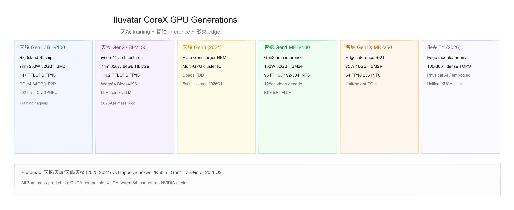
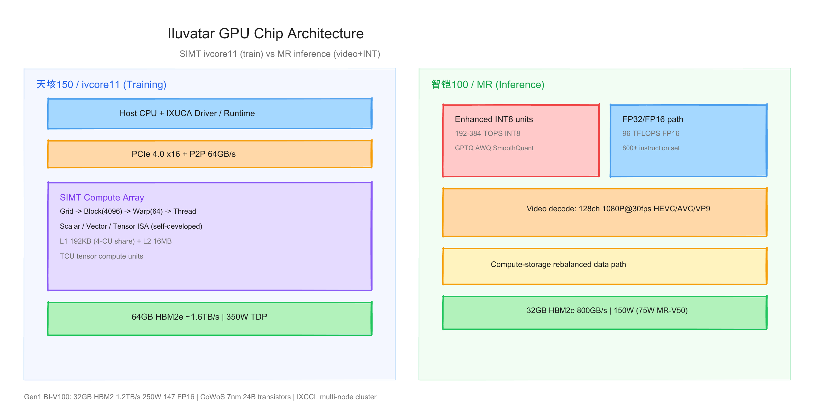
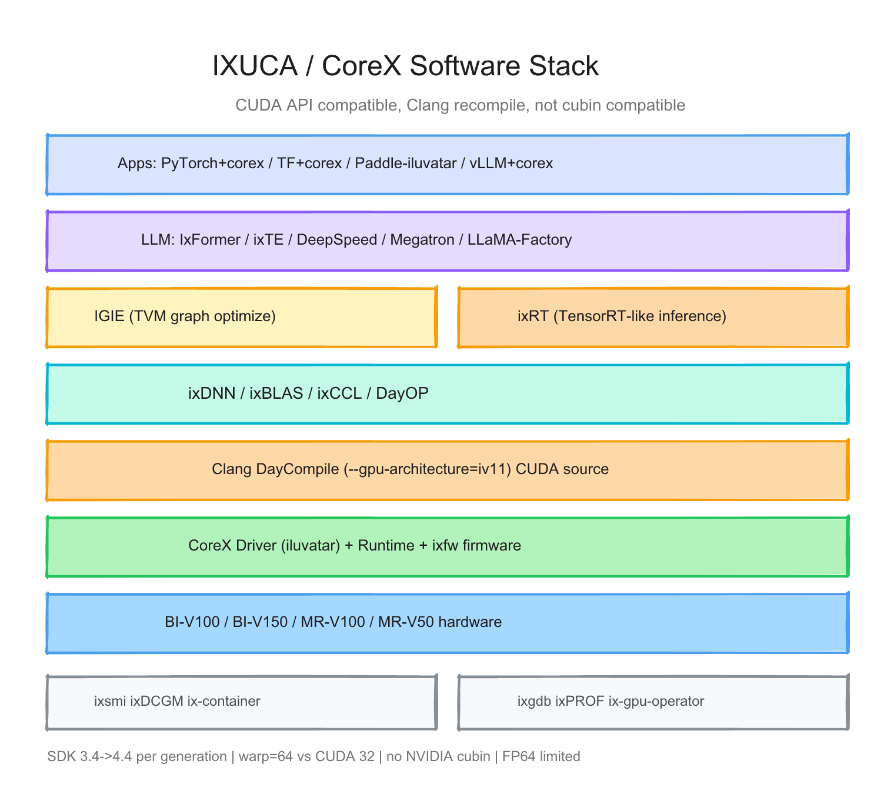

# 天数智芯（Iluvatar CoreX）每代 GPU 的硬件与软件调研报告

> 截至日期：2026 年 6 月 26 日。天数智芯（Iluvatar CoreX）成立于 2015 年，是中国首家实现「训练 + 推理」通用 GPGPU 双量产的设计公司。产品线分 **天垓**（训练）、**智铠**（推理）、**彤央**（边端）三条线，软件栈 **IXUCA（天数智算）** 在 API 层兼容 CUDA，但需 Clang 重编译。截至 2025 年上半年，累计交付 **5.2 万+** 片通用 GPU。本报告按「硬件架构 + 软件栈」梳理已量产与已发布代际，并给出三张架构图。

---

## 一、世代总览

| 产品线 | Gen | 芯片/卡 SKU | 架构 | 工艺 | TDP | 显存 | FP16 峰值 | 状态 |
|---|---|---|---|---|---|---|---|---|
| **天垓** | Gen 1 | BI / **BI-V100** | Big Island | 7nm | 250W | 32GB HBM2 | 147 TFLOPS | 2021 量产 |
| **天垓** | Gen 2 | ivcore11 / **BI-V150** | ivcore11 | 7nm | 350W | 64GB HBM2e | ~192 TFLOPS* | 2023-Q4 量产 |
| **天垓** | Gen 3 | （未公开芯片名） | — | — | — | 更大 HBM | — | 2024-Q3 发布；**2026-Q1 预期量产** |
| **智铠** | Gen 1 | MR / **MR-V100** | 第 2 代 GPU 架构 | 7nm | 150W | 32GB HBM2e | 96 TFLOPS | 2023-02 量产 |
| **智铠** | Gen 1X | MR / **MR-V50** | 同 Gen 1 低功耗 SKU | 7nm | 75W | 16GB HBM2e | 64 TFLOPS | 2023-02 量产 |
| **彤央** | — | TY1000/1100/1200 | 边端模组/SoC | — | — | — | 100–300T 稠密算力† | 2026-01 发布 |

\* Gen 2 峰值算力来自渠道/社区汇总，[官网产品页](https://www.iluvatar.com/productDetails?fullCode=cpjs-yj-xlxl-tg150) 未列 TFLOPS 数字。  
† 彤央为系统级稠密算力 claim，非 HBM 数据中心 GPU datasheet。

**命名注意**：内部代号 **BI（Big Island）** 对应天垓 Gen 1，不等于独立「BI 系列」——Gen 2 已演进到 **ivcore11（天垓150）**。智铠 **MR** 为推理芯片代号。

代际间最关键的趋势：**训练卡显存 32→64GB、TDP 250→350W**；**推理线独立第二代架构 + 视频解码 + INT8 强化**；软件 **CoreX SDK 3.4→4.4**，大模型靠 **vLLM+corex + IxFormer/ixTE**；硬件 **7nm 全线**，Gen 3 引入 **PCIe Gen5 + 集群互联升级**。

---

## 二、硬件架构演进

### 2.1 天垓 Gen 1 — Big Island / 天垓100（BI-V100，2021）

**整体结构**：国内首款量产 7nm 通用 GPGPU。芯片代号 **BI（Big Island）**，采用 **2.5D CoWoS** 封装 + 自研 Interposer，集成约 **240 亿** 晶体管。

**规格**（[发布稿](https://news.mydrivers.com/1/749/749058.htm)、[官网 BI-V100](https://www.iluvatar.com/productDetails?fullCode=cpjs-yj-xlxl-tg100)）：

| 项目 | 参数 |
|---|---|
| 工艺 | 7nm FinFET（台积电） |
| TDP | 250W（板级） |
| 显存 | 32GB HBM2，带宽 **1.2 TB/s** |
| FP32 / FP16 / INT8 | 37 / **147** / **295** TFLOPS/TOPS |
| 接口 | PCIe 4.0 ×16 |
| 互联 | 主控/片间各 **64 GB/s 双向** P2P |

> 「它采用业界领先的台积电7nm FinFET制造工艺、2.5D CoWoS封装技术……整合32GB HBM2内存、存储带宽达1.2TB……FP16/BF16性能147TFlops。」

**架构块**：
- **Compute**：SIMT 可伸缩分层计算引擎；自研标量/矢量/张量指令集；混合精度 FP32/FP16/BF16/INT
- **Memory**：HBM2 32GB
- **Interconnect**：PCIe 4.0 + 专有 P2P；可选 **OAM** 形态（300–450W 系统方案）

**定位**：**AI 训练**（ResNet/YOLO/BERT 等）；亦支持 GPC/科学计算。2021 年 3 月发布，9 月量产——实现国产 GPGPU **从 0 到 1**（[官网](https://www.iluvatar.com/)）。

### 2.2 天垓 Gen 2 — 天垓150 / ivcore11（BI-V150，2023-Q4 量产）

**整体结构**：架构代号 **ivcore11**（编译器 `--gpu-architecture=iv11`）。相对 Gen 1：**显存翻倍、功耗 +40%、微架构升级**。

**规格**（[招股书](https://www.hkexnews.hk/listedco/listconews/sehk/2025/1230/2025123000020_c.pdf)、[产品说明书](https://www.iluvatar.com/productDetails?fullCode=cpjs-yj-xlxl-tg150)、[模力方舟文档](https://moark.com/docs/compute/clusters_gpu/iluvatar/iluvatar_BI-V150_gpu)）：

| 项目 | 参数 |
|---|---|
| 工艺 | 7nm |
| TDP | **350W** |
| 显存 | **64GB HBM2e**（~1.6 TB/s*） |
| FP16 / INT8 | **~192 TFLOPS** / **~384 TOPS*** |
| 接口 | PCIe 4.0 ×16；P2P 64 GB/s |
| 线程模型 | **Warp=64**（CUDA 为 32）；Block 最大 **4096** 线程 |

> 「天垓Gen 2配备扩展容量的高速内存，并以350W TDP运行。整型精度性能及架构效率得以增强，与前一代产品相比，提供了更高的应用效能。」

**微架构**（[ByteMLPerf 官方测评](https://www.iluvatar.com/newsDetails?code=ByteMLPerfsctszxGPGPUqlljsjxcxsf&topicId=495)）：
- **L2 16MB**；**L1 192KB**（4 个计算单元共享）
- 多级缓存 + 共享内存；卡间经 PCIe-Switch 互联

**定位**：大模型 **训练/微调/推理**；支持 LLaMA、Qwen、DeepSpeed、Megatron、**vLLM**（[官网](https://www.iluvatar.com/productDetails?fullCode=cpjs-yj-xlxl-tg150)）。

### 2.3 天垓 Gen 3（2024-Q3 发布，未量产）

**公开信息**（[招股书](https://www.hkexnews.hk/listedco/listconews/sehk/2025/1230/2025123000020_c.pdf)）：

> 「天垓Gen 3支持大型AI模型计算的前沿高精度算力需求，具备更大的内存容量，并采用最新的PCIe Gen5等国际标准接口。该芯片大幅提升点对点通讯带宽，并支持多卡架构。」

- **预计 2026 年 Q1 量产**
- 芯片名、HBM 容量、峰值算力 **尚未公开**

### 2.4 智铠 Gen 1 — 智铠100（MR-V100，2022-12 发布）

**整体结构**：基于 **第二代通用 GPU 架构**（推理向），**800+ 条**通用指令集；强化 INT 计算与 **视频编解码**。

**规格**（[智铠发布会](https://m.zhidx.com/news/37015.html)、[官网智铠页](https://www.iluvatar.com/productDetails?fullCode=cpjs-yj-tlxltt-zk100)）：

| 项目 | 参数 |
|---|---|
| TDP | **150W**（单槽全长全高） |
| 显存 | 32GB HBM2e，**800 GB/s** |
| FP32 / FP16 / INT8 | 24 / **96 TFLOPS** / **192–384 TOPS**‡ |
| 视频 | **128 路** 1080P@30fps 解码（HEVC/AVC/VP9/AVS2） |
| 互联 | PCIe 4.0；P2P **64 GB/s** |

‡ INT8：**192 TOPS**（规格书）与 **384 TOPS**（发布会）并存，可能为稀疏/峰值口径差异。

**架构特点**：
- **计算-存储再平衡**数据通路
- 内置视频引擎（训练卡不具备同等视频块）
- 支持 GPTQ、AWQ、SmoothQuant；**vLLM / TGI** 推理

**变体**：**MR-V100 DUO** 双 GPU 单卡，高并发推理/视频 AI。

### 2.5 智铠 Gen 1X — 智铠50（MR-V50）

**规格**（[官网](https://www.iluvatar.com/productDetails?fullCode=cpjs-yj-tlxltt-zk100)）：

| 项目 | 参数 |
|---|---|
| TDP | **75W** |
| 显存 | **16GB HBM2e** |
| FP32 / FP16 / INT8 | 16 / 64 TFLOPS / **256 TOPS** |
| 形态 | **半长半高单槽** PCIe |

**定位**：边缘/嵌入式（工控、贩卖机、端侧视频+语音）；与 MR-V100 **同代架构、不同功耗 SKU**。

### 2.6 彤央 TY 系列（2026-01）

**定位**：边端 **物理 AI / 具身智能** 模组与终端（TY1000/1100/1200），稠密算力 **100T–300T**（厂商 claim）。与数据中心 HBM GPU **不同品类**；软件宣称与云端 **IXUCA 统一**。

**在研 roadmap**（招股书/媒体）：智铠 Gen 2/3、天垓 Gen 4/5；架构路线 **天枢/天璇/天玑/天权**（2025–2027，对标 Hopper→Rubin 叙事）。

---

## 三、软件栈演进

### 3.1 核心原则：IXUCA = CUDA API 兼容 + 自主编译链

天数智芯软件栈品牌为 **IXUCA（天数智算软件栈）**，安装包称 **CoreX SDK**（`corex-installer-*.run`，默认 `/usr/local/corex`）。

**策略**：CUDA **编程模型 + API 层兼容**；**必须**用天数 Clang **重编译** `.cu` 源码；**不能**运行 NVIDIA **cubin**。

### 3.2 CUDA 生态组件映射

| NVIDIA | IXUCA / CoreX | 说明 |
|---|---|---|
| CUDA Driver/Runtime | DayChip Driver / CoreX Runtime | 内核模块 `iluvatar` |
| **nvcc** | **Clang / DayCompile** | `bin/clang++`，`--gpu-architecture=iv11` |
| cuDNN | **ixDNN** | DNN 算子 |
| cuBLAS | **ixBLAS** | 线性代数 |
| NCCL | **ixCCL** | 多卡/多机集合通信 |
| TensorRT | **ixRT** + **IGIE** | 双推理引擎 |
| nvidia-smi | **ixsmi** | 设备监控 |
| Container Toolkit | **ix-container-toolkit** | 容器 GPU |

参考：[DeepSpark 社区](https://github.com/Deep-Spark/DeepSpark)、[模力方舟 BI-V150 文档](https://moark.com/docs/compute/clusters_gpu/iluvatar/iluvatar_BI-V150_gpu)

### 3.3 与 NVIDIA CUDA 的关键差异（硬约束）

| 维度 | NVIDIA | 天数智芯 |
|---|---|---|
| 二进制兼容 | cubin/ptx 可分发 | **仅源码 + Clang 重编译** |
| **Warp size** | **32** | **64**（warp 原语需适配） |
| Block 最大线程 | 1024 | **4096** |
| FP64 | 完整 | **有限**，建议 FP32 |
| 预定义宏 | `__NVCC__` | **`__ILUVATAR__`** |
| PyTorch | PyPI 公版 | **厂商 whl**（如 `2.7.1+corex.4.4.0`） |

社区迁移实践：[InfiniTensor iluvatar doc](https://github.com/LearningInfiniTensor/.github/blob/main/server/iluvatar/doc.md)

### 3.4 硬件代际 × SDK 里程碑

| CoreX 版本 | 目标硬件 | 软件里程碑 |
|---|---|---|
| **3.4.0** | BI 早期 / 回退基线 | PyTorch **1.8** 时代；IXUCA 初版 |
| **4.1.1** | **BI-V150** | ivcore11 专用 firmware + toolkit |
| **4.2.0** | **MR50/MR100** | 推理 whl、IGIE/ixRT 完善 |
| **4.3.0** | BI + MR | **LLM Docker**；DeepSpark 百模型 |
| **4.4.0** | BI150/150S + MR | PyTorch **2.7.1**、**vLLM 0.11**、Qwen3/DeepSeek-V3.1 |

知识库：[ixkb.iluvatar.com.cn](https://ixkb.iluvatar.com.cn:9443/) · SDK 下载：[资源中心](https://support.iluvatar.com/#/ProductLine?id=2)

### 3.5 框架支持

**PyTorch（主路径）**  
- 保留 `torch.cuda.*` API；禁止 `pip install` 覆盖公版 torch  
- BI-V150 @ 4.4：**PyTorch 2.7.1+corex.4.4.0**、**vLLM 0.11.2+corex**  
- 分布式：DeepSpeed、Megatron-LM、LLaMA-Factory、**ixTE**（TransformerEngine 类 FP8/MoE）

**PaddlePaddle**  
- [Paddle-iluvatar](https://github.com/PaddlePaddle/Paddle-iluvatar) 自定义设备  
- BI-V100 通过飞桨 **II 级→III 级**兼容（15→51+ 模型）

**TensorFlow**  
- 适配版 **TF 2.16.2+corex.4.4.0**；声量低于 PyTorch

### 3.6 推理与大模型生态

| 组件 | 作用 |
|---|---|
| **IGIE** | TVM 图优化；CV/NLP 传统模型；Triton 后端 |
| **ixRT** | 自研推理 RT；动态 shape、INT8/FP16 |
| **IxFormer** | 大模型推理/训练优化 |
| **ixTE** | FP8 GEMM、MoE、RMSNorm（BI-150） |
| **vLLM+corex** | LLM serving 主力 |
| **DeepSparkHub / DeepSparkInference** | 开源训练/推理模型库 |

**天垓150 大模型验证**（[模力方舟](https://moark.com/docs/compute/clusters_gpu/iluvatar/iluvatar_BI-V150_gpu)）：Qwen 全系列、DeepSeek-R1/V3.1、Llama2/3、ChatGLM、InternLM3、FLUX/HunyuanVideo 等。

**智铠推理**：MR 公开资料称 **不支持 FP8**（与 BI-150 不同）；强项 CV INT8、视频、7B–14B LLM 量化推理。

### 3.7 软件栈 × 硬件矩阵

| 能力 | BI-V100 | BI-V150 | MR-V100 | MR-V50 |
|---|---|---|---|---|
| CoreX 3.4 | ✅ | 回退基线 | — | — |
| CoreX 4.3/4.4 | 可升级 | ✅ 主力 | ✅ | ✅ |
| PyTorch+corex | 1.8→2.x | 2.4–2.7 | ✅ | ✅ |
| vLLM+corex | 有限 | ✅ 主力 | EngineX 端口 | — |
| IGIE/ixRT | ✅ | ✅ | ✅ 主力 | ✅ |
| ixTE FP8 | — | ✅ | ❌ | ❌ |
| Paddle III 级 | ✅ | 部分 | — | — |
| Megatron/DeepSpeed | 基础 | ✅ | — | — |

---

## 四、设计哲学的三次转向

**第一次（天垓100）**：从 0 到 1 的 **全自研 GPGPU**——架构、指令集、算子、软件栈均自主，API 兼容 CUDA 降低迁移成本，奠定 SIMT + HBM 训练基线。

**第二次（天垓150 + 智铠100 双线）**：**训推分线**——训练 ivcore11 追显存与集群（64GB、Warp64、LLM）；推理 MR 追 **INT8、视频解码、150W 部署密度**。软件 CoreX 4.x 补齐 **vLLM + 双推理引擎**。

**第三次（Gen3 + 彤央 + 天枢–天权 roadmap）**：从 **单卡算力** 转向 **集群互联 + 边云一体**——Gen3 的 PCIe5/多卡架构、彤央物理 AI、2025–2027 四代架构路线对标国际旗舰。

---

## 五、与外部生态及验证缺口

**生态**  
- 开源社区：[DeepSpark](https://github.com/Deep-Spark/DeepSpark)  
- 飞桨、启智云脑、[模力方舟](https://moark.com/docs/compute/clusters_gpu/iluvatar/iluvatar_BI-V150_gpu) 算力集成  
- 2025 年 12 月通过港交所 **上市聆讯**（[21 经济网](https://www.21jingji.com/article/20251223/herald/d55752bdac55c138f40e88d0fa195a15.html)）

**相对 NVIDIA 的能力边界**  
- 迁移友好：Python 层多零改动、CUDA C 可 Clang 重编译  
- 风险：无 cubin、warp=64、版本强绑定、FP64 弱、训练/科学计算生态仍弱于推理（[国产 AI 芯片软件生态白皮书](https://pdf.dfcfw.com/pdf/H3_AP202511251788213692_1.pdf) §3.2.2.8）

**本报告标注的验证缺口**  
1. 各代 **SM/CU 绝对数量** 几乎未官方披露  
2. **天垓150 峰值 TFLOPS** 官网未列，192/384 来自渠道  
3. **智铠 INT8** 192 vs 384 TOPS 双口径  
4. **天垓 Gen 3** 硅规格未公开  
5. **BI-V150** 64GB vs 32GB SKU 划分

---

## 六、参考来源

- [天数智芯官网](https://www.iluvatar.com/)
- [BI-V100 产品页](https://www.iluvatar.com/productDetails?fullCode=cpjs-yj-xlxl-tg100)
- [BI-V150 / 天垓150 产品页](https://www.iluvatar.com/productDetails?fullCode=cpjs-yj-xlxl-tg150)
- [智铠100/50 产品页](https://www.iluvatar.com/productDetails?fullCode=cpjs-yj-tlxltt-zk100)
- [港交所招股书 PDF](https://www.hkexnews.hk/listedco/listconews/sehk/2025/1230/2025123000020_c.pdf)
- [天垓100 发布报道](https://news.mydrivers.com/1/749/749058.htm)
- [智铠100 发布会](https://m.zhidx.com/news/37015.html)
- [模力方舟 BI-V150 文档](https://moark.com/docs/compute/clusters_gpu/iluvatar/iluvatar_BI-V150_gpu)
- [ByteMLPerf BI-V150 测评](https://www.iluvatar.com/newsDetails?code=ByteMLPerfsctszxGPGPUqlljsjxcxsf&topicId=495)
- [DeepSpark 主仓](https://github.com/Deep-Spark/DeepSpark)
- [ixkb 知识库](https://ixkb.iluvatar.com.cn:9443/)
- [21 经济网：十年造芯路](https://www.21jingji.com/article/20251223/herald/d55752bdac55c138f40e88d0fa195a15.html)
- [与非网：招股书解读](https://www.eefocus.com/article/1936242.html)

---

## 附：架构图索引

本报告配套三张架构图，已 inline 在对应章节中。源文件（可编辑）和 PNG 预览均位于 `assets/`：

| 图 | 预览 | 源文件 |
|---|---|---|
| GPU 世代演进（天垓/智铠/彤央） | `assets/iluvatar_corex_hw_generations.png` | `assets/iluvatar_corex_hw_generations.excalidraw` |
| 芯片架构（ivcore11 vs MR 推理） | `assets/iluvatar_corex_chip_architecture.png` | `assets/iluvatar_corex_chip_architecture.excalidraw` |
| IXUCA 软件栈层级 | `assets/iluvatar_corex_software_stack.png` | `assets/iluvatar_corex_software_stack.excalidraw` |
