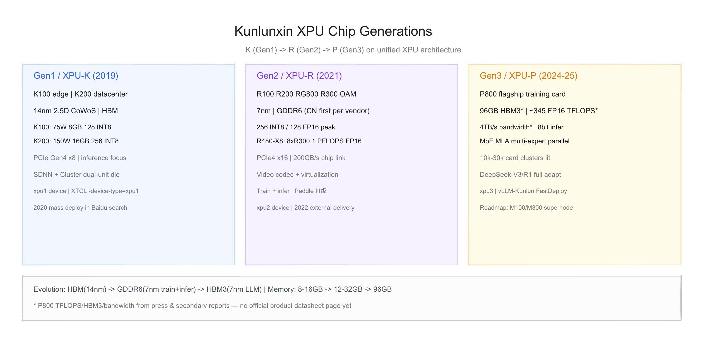
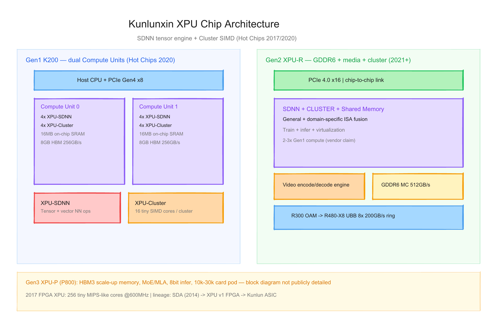
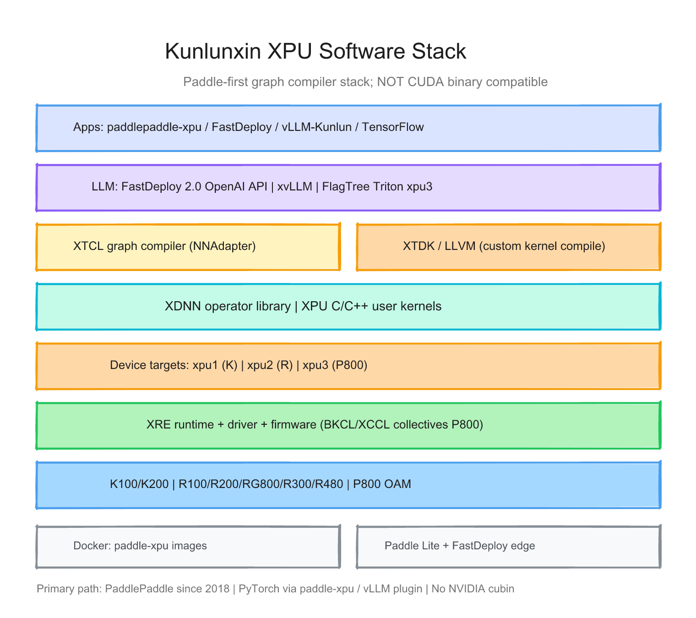

# 昆仑芯（Kunlunxin）每代 XPU 的硬件与软件调研报告

> 截至日期：2026 年 6 月 26 日。昆仑芯（北京）科技股份有限公司前身为百度智能芯片及架构部，2021 年 4 月独立融资。产品线基于 2017 年 [Hot Chips](https://www.nextplatform.com/ai/2017/08/22/an-early-look-at-baidus-custom-ai-and-analytics-processor/1647047) 发布的自研 **XPU（eXtra Processing Unit）** 架构，已完成 **三代** AI 计算芯片商业化：**昆仑芯 1 代（K 系列，2019）**、**昆仑芯 2 代（R 系列，2021）**、**昆仑芯 3 代（P 系列，2024）**。软件栈以 **飞桨（PaddlePaddle）** 为主路径，图编译器 **XTCL** + 运行时 **XRE** + 算子库 **XDNN** 构成全栈。本报告按「硬件架构 + 软件栈」梳理每代差异，并给出三张架构图。

---

## 一、世代总览

| 代际 | 架构 | 代表 SKU | 工艺 | 显存 | FP16 峰值 | INT8 峰值 | 互联 | 主用途 | 量产/发布 |
|---|---|---|---|---|---|---|---|---|---|
| **Gen 1** | XPU-K | **K100** / **K200** | 14nm | 8 / 16 GB **HBM** | 32 / 64 TFLOPS | 128 / 256 TOPS | PCIe 4.0 ×8 | 边缘/云推理 | 2019；2020 百度大规模部署 |
| **Gen 2** | XPU-R | **R100** / **R200** / **RG800** / **R300** OAM / **R480-X8** | 7nm | 12–32 GB **GDDR6** | 64–128 TFLOPS | 128–256 TOPS | PCIe 4.0 ×16；片间 200 GB/s | 训推通用 + 视频 AI | 2021 量产；2022 外部交付 |
| **Gen 3** | XPU-P | **P800** | 7nm* | **96 GB HBM3*** | **~345 TFLOPS*** | — | 万卡集群互联 | 大模型训推 | 2024 发布；2025 万卡点亮 |

\* Gen 3 工艺节点、HBM3 容量、345 TFLOPS、4 TB/s 带宽等数字来自 [新闻稿](https://www.kunlunxin.com/news/4477.html) 与 [二级市场/行业分析](https://www.huangwei.com/rpts/20260103_20260103kunlun.html)，**官网尚无独立 P800 产品规格页**。

**命名注意**：「昆仑 1/2/3 代」指芯片代际；**K/R/P** 为加速卡系列前缀。**R300** 为 OAM 模组（非独立 PCIe 卡），通过 **R480-X8** 基板 8 卡互联。**xpu1/xpu2/xpu3** 为 XTCL 设备类型，分别对应 K / R / P 代（[Paddle XTCL 文档](https://www.paddlepaddle.org.cn/inference/demo_guides/kunlunxin_xtcl.html)）。

代际间最关键趋势：**HBM（14nm 推理）→ GDDR6（7nm 训推通用 + 视频）→ HBM3（7nm 大模型）**；算力从 **256 TOPS INT8** 跃升到 **~345 TFLOPS FP16**；软件从 **Paddle 适配** 演进到 **FastDeploy + vLLM-Kunlun + Triton/FlagTree**。



---

## 二、硬件架构演进

### 2.1 XPU 架构起源（2017 FPGA → 2019 ASIC）

昆仑芯 XPU 架构在 [Hot Chips 2017](https://www.nextplatform.com/ai/2017/08/22/an-early-look-at-baidus-custom-ai-and-analytics-processor/1647047) 以 **FPGA 验证** 形式首次公开，设计目标为兼顾 **CPU 级灵活性** 与 **专用逻辑效率**，面向搜索、广告、语音、自动驾驶等 **多样化 AI 负载**。

> 「The XPU has 256 cores clustered with one shared memory for data synchronization… The cores are small with no cache or OS and can be interfaced with a domain specific ISA.」

2018 年启动 ASIC 流片；2019 年 **昆仑芯 1 代** 量产，2020 年在百度搜索引擎等场景 **大规模部署**（[Supplyframe 行业分析](https://cn.supplyframe.com/article/8208.html)）。

**核心计算块**（延续至 Kunlun ASIC，[Hot Chips 2020 PDF](https://www.hc32.hotchips.org/assets/program/conference/day2/HotChips2020_ML_Inference_Baidu_Kunlun_v5.pdf)）：

| 模块 | 功能 |
|---|---|
| **XPU-SDNN** | Software-Defined Neural Network engine；面向张量/向量运算（卷积、矩阵乘） |
| **XPU-Cluster** | 16 个 tiny core + SIMD；面向标量/向量通用计算 |
| **On-chip SRAM** | 片上共享内存，低延迟同步 |
| **Multi-port MC** | 内存控制器，连接 HBM / GDDR6 |

### 2.2 Gen 1 — XPU-K / 昆仑芯 1 代（K100、K200，2019）

**整体结构**：14nm FinFET + **2.5D CoWoS** 封装；双 Compute Unit 各含 4 SDNN + 4 Cluster + 8GB HBM（K200 合计 16GB）。

#### K100 — 边缘推理

| 项目 | 参数 |
|---|---|
| TDP | **75 W**（半高半长单槽） |
| 显存 | **8 GB HBM**，256 GB/s |
| 算力 | INT8 **128 TOPS** / FP16 **32 TFLOPS** / FP32 **8 TFLOPS** |
| 互联 | PCIe Gen4 ×8 |
| 应用 | **推理**（智慧物流/工业/园区） |

来源：[K100 产品页](https://www.kunlunxin.com/product/687.html)

#### K200 — 云数据中心

| 项目 | 参数 |
|---|---|
| TDP | **150 W**（全高全长双槽） |
| 显存 | **16 GB HBM**，512 GB/s |
| 算力 | INT8 **256 TOPS** / FP16 **64 TFLOPS** / FP32 **16 TFLOPS** |
| 互联 | PCIe Gen4 ×8 |
| 应用 | **推理 + 训练** |

来源：[K200 产品页](https://www.kunlunxin.com/product/686.html)、[Hot Chips 2020](https://www.hc32.hotchips.org/assets/program/conference/day2/HotChips2020_ML_Inference_Baidu_Kunlun_v5.pdf)

> 「Two units, each unit has 8GB HBM, 256GB/s, 16MB on-chip memory, 4 XPU-SDNN and 4 XPU-Cluster.」

**定位**：完成国产 AI 芯片 **从 0 到 1**；以 **推理** 为主验证 XPU 架构，支撑百度搜索、小度等业务。

### 2.3 Gen 2 — XPU-R / 昆仑芯 2 代（R 系列，2021）

**整体结构**：7nm；**国内业界率先支持 GDDR6**（[官网核心技术页](https://www.kunlunxin.com/%E6%A0%B8%E5%BF%83%E6%8A%80%E6%9C%AF)）；相对 Gen 1 **算力提升 2–3 倍**（[2 代芯片页](https://www.kunlunxin.com/product/2873.html)）。架构块保留 **SDNN + CLUSTER + Shared Memory + Memory Controller**，新增 **视频编解码**、**虚拟化**、**片间互联**。

**官网架构块**（[核心技术](https://www.kunlunxin.com/%E6%A0%B8%E5%BF%83%E6%8A%80%E6%9C%AF)）：
- **SDNN**：自研张量计算单元，加速卷积/矩阵乘
- **CLUSTER**：自研 SIMD 指令集，标量+向量
- **Shared Memory**：片上共享，高并发低延迟
- **GDDR6 + Memory Controller**
- **PCIe 4.0 ×16** + **片间互联**

#### R100 — 边缘推理（Gen 2 低功耗 SKU）

| 项目 | 参数 |
|---|---|
| TDP | **75 W** 或 **100 W**† |
| 显存 | **12 GB GDDR6**，384 GB/s |
| 算力 | INT8 **128–170 TOPS** / FP16 **64–85 TFLOPS**† |
| 视频 | 84 路 1080P@30fps 解码 |
| 形态 | 半高半长单槽 |

† 官网表格并列两档算力/功耗，可能为 **75W / 100W SKU 变体**（[R100 产品页](https://www.kunlunxin.com/product/2837.html)）。

#### R200 系列 — 数据中心训推

| 项目 | R200 | R200-8F |
|---|---|---|
| TDP | 150 W | 160 W |
| 显存 | 16 GB GDDR6 | **32 GB GDDR6** |
| 算力 | INT8 256 / FP16 128 / FP32 32 | 同左 |
| 带宽 | 512 GB/s | 512 GB/s |
| 视频 | 108 路解码 / 27 路编码 | 同左 |

来源：[R200 产品页](https://www.kunlunxin.com/product/274.html)

#### RG800 — 单槽高密度训推

| 项目 | 参数 |
|---|---|
| TDP | **130 W**（全高全长 **单槽**） |
| 显存 | 32 GB GDDR6 |
| 算力 | 同 R200（256 INT8 / 128 FP16） |
| 视频 | **140 路** 1080P 解码 |

来源：[RG800 产品页](https://www.kunlunxin.com/product/2842.html)

#### R300 OAM + R480-X8 — 集群训推

**R300**：昆仑芯 2 代 **OAM 模组**（32 GB GDDR6），无独立 PCIe 产品页；通过 **R480 通用基板** 实现片间互联。

**R480-X8**（[产品页](https://www.kunlunxin.com/product/272.html)、[PDF 规格书](https://www.kunlunxin.com/wp-content/uploads/2023/02/r480..pdf)）：

| 项目 | 参数 |
|---|---|
| 结构 | OCP-OAI 标准 UBB，**8× R300** OAM |
| 聚合算力 | FP16 **1 PFLOPS** / INT8 **2 POPS** |
| 聚合显存 | 32 GB × 8 = **256 GB** GDDR6 |
| 片间互联 | **200 GB/s** 双向聚合；8 卡 2 通信环路 |
| 应用 | 大型模型 **训练 + 推理** |

> 「R480-X8是基于多芯片间高速互联技术，单机可提供高达1 Peta Ops @FP16的AI算力和256G显存。」

**定位**：Gen 2 将 XPU 从 **推理芯片** 扩展为 **训推通用**；与飞桨完成 **III 级兼容性测试**（[新闻](https://www.kunlunxin.com/news/790.html)），基于 R200/R300 搭建 CI/CD 流水线。



### 2.4 Gen 3 — XPU-P / 昆仑芯 3 代（P800，2024–2025）

**整体结构**：新一代 **XPU-P** 架构，面向 **大模型训练与推理**；2024 年发布，2025 年 **万卡集群点亮**（[新闻](https://www.kunlunxin.com/news/4477.html)）。

**已公开 claim**（多为新闻稿/客户案例，非 datasheet）：

| 维度 | 公开信息 | 来源层级 |
|---|---|---|
| 架构 | XPU-P | Tier 1 新闻 |
| 显存 | **优于同类 20%–50%**；行业分析称 **96 GB HBM3** | Tier 1 + Tier 2 |
| 算力 | 行业分析 **~345 TFLOPS FP16** | Tier 2，未独立验证 |
| 带宽 | 行业分析 **4 TB/s** | Tier 2 |
| 特性 | **8bit 推理**、**MLA**、**多专家并行**、MoE 友好 | Tier 1 |
| 部署 | 单机 **8 卡** 跑 DeepSeek-V3/R1 **671B**；**32 台** 全参训练 | Tier 1 |
| 集群 | **1 万卡** 点亮 → **3 万卡**（2025 初） | Tier 1 |

> 「昆仑芯P800基于新一代自研架构XPU-P，显存规格优于同类主流GPU20%-50%，对MoE架构更加友好，且率先支持8bit推理，全面支持MLA、多专家并行等特性。」（[招商银行项目新闻](https://www.kunlunxin.com/news/4469.html)）

**软件侧代号**：XTCL/FlagTree 称 **xpu3** / **Kunlun3**（[FlagTree 文档](https://docs.flagos.io/projects/FlagTree/en/latest/getting_started/multi-backend-prebuilt-docker-image-install/install-xpu.html)）；vLLM-Kunlun 要求 **Kunlun3 P800**（[GitHub](https://github.com/baidu/vLLM-Kunlun)）。

**Roadmap（未量产）**：行业报道称 **M100（2026）**、**M300（2027）** 及超节点产品（[投资研究报告](https://www.huangwei.com/rpts/20260103_20260103kunlun.html)）——**仅路线图信号，规格未公开**。

---

## 三、软件栈演进

### 3.1 核心原则：Paddle 主路径 + 图编译器，非 CUDA 二进制兼容

昆仑芯软件栈品牌为 **昆仑芯 SDK**，从底层驱动到上层模型转换提供全栈工具（[官网](https://www.kunlunxin.com/%E6%A0%B8%E5%BF%83%E6%8A%80%E6%9C%AF)）。与 NVIDIA CUDA **无 cubin/PTX 二进制兼容**；开发者通过 **XTCL 图编译** 或 **XPU C/C++ 自定义 kernel**  targeting 硬件。



**Hot Chips 2020 软件栈概览**（[PDF](https://www.hc32.hotchips.org/assets/program/conference/day2/HotChips2020_ML_Inference_Baidu_Kunlun_v5.pdf)）：

```
Application / Framework (Paddle, TF, PyTorch)
        ↓
Graph Compiler + Libraries + User-written kernels
        ↓
Kunlun Runtime / Compiler
        ↓
Kunlun Driver
        ↓
Kunlun Chip
```

### 3.2 核心组件

| 组件 | 作用 | 说明 |
|---|---|---|
| **XRE** | XPU Runtime Environment | 驱动 + 基础运行时；Docker 预装（[P800 安装文档](https://www.paddlepaddle.org.cn/documentation/zh/hardware_support/xpu/xpu-p800_install_cn.html)） |
| **XTCL** | XPU Tensor Compilation Library | 图编译引擎；Paddle 算子 → NNAdapter → XTCL 组网（[XTCL 指南](https://www.paddlepaddle.org.cn/inference/demo_guides/kunlunxin_xtcl.html)） |
| **XDNN** | Deep Learning Library | 常用 DNN 算子 API |
| **XTDK** | Development Kit | 基于 LLVM 的 kernel 编译工具链（FlagTree 依赖 **XTDK-llvm19**） |
| **BKCL / XCCL** | Collective | P800 分布式通信（Paddle 编译选项 `WITH_XPU_BKCL`） |

**设备类型映射**（[XTCL 文档](https://www.paddlepaddle.org.cn/inference/demo_guides/kunlunxin_xtcl.html)）：

| XTCL device-type | 硬件 |
|---|---|
| **xpu1** | K100、K200（昆仑芯 1 代） |
| **xpu2** | R200 等（昆仑芯 2 代） |
| **xpu3** | P800（昆仑芯 3 代） |

环境变量示例：
```
KUNLUNXIN_XTCL_DEVICE_TARGET="xpu -libs=xdnn -device-type=xpu2"
```

### 3.3 与 NVIDIA 生态的映射（概念层）

| NVIDIA | 昆仑芯 | 差异 |
|---|---|---|
| CUDA Driver | XRE + Kunlun Driver | 独立驱动栈 |
| nvcc / CUDA C | **XTDK** + **XPU C/C++** | 非 PTX 路径 |
| cuDNN | **XDNN** | 算子库 |
| TensorRT | **XTCL** 图优化 + **FastDeploy** | 编译期图融合 |
| NCCL | **BKCL / XCCL** | P800 集群 |
| Triton (GPU) | **FlagTree** / **Triton xpu3** | P800 定制后端 |
| nvidia-smi | （无公开等价通用工具名） | — |

### 3.4 框架支持演进

**PaddlePaddle（主路径，2018 起）**  
- 昆仑芯 + 飞桨 **端到端** 方案；R 系列 **III 级兼容**（[新闻](https://www.kunlunxin.com/news/790.html)）  
- P800：`paddlepaddle-xpu` wheel + 官方 Docker（[P800 安装](https://www.paddlepaddle.org.cn/documentation/zh/hardware_support/xpu/xpu-p800_install_cn.html)）  
- 验证环境示例：XRE **5.7.0**、XCCL **3.0.4.7**、XDNN dev/20251213

**FastDeploy（大模型推理，P800 主力）**  
- `fastdeploy-xpu` 专包；OpenAI API 兼容（[FastDeploy 昆仑芯](https://paddlepaddle.github.io/FastDeploy/zh/get_started/installation/kunlunxin_xpu/)）  
- FastDeploy 2.0 统一 vLLM 式接口，支持 ERNIE-4.5-300B 等在 P800 部署（[ERNIE Blog](https://yiyan.baidu.com/blog/zh/posts/fastdeploy2.0/)）  
- P800 驱动 ≥ **5.0.21.26**，固件 ≥ **1.48**

**vLLM-Kunlun（社区硬件插件，P800）**  
- [baidu/vLLM-Kunlun](https://github.com/baidu/vLLM-Kunlun) 遵循 vLLM RFC #11162  
- 支持 Qwen/DeepSeek/Llama/MoE 等；**Piecewise Kunlun Graph**、AWQ 量化  
- 要求 PyTorch ≥ 2.5.1、Python ≥ 3.10

**TensorFlow / PyTorch**  
- Hot Chips 2020 称支持 TF/PyTorch（经图编译器）  
- 当前公开文档以 **Paddle 定制 wheel** 为主；PyTorch 多经 Paddle 生态或 vLLM 插件间接支持

**Paddle Lite（边缘）**  
- NNAdapter + XTCL 子图接入；xpu1/xpu2 设备（[XTCL 指南](https://www.paddlepaddle.org.cn/inference/demo_guides/kunlunxin_xtcl.html)）

**Triton / FlagTree（Kernel 开发）**  
- FlagTree `flagtree+xpu3.0` 基于 Triton 3.0（[FlagOS 文档](https://docs.flagos.io/projects/FlagTree/en/latest/getting_started/multi-backend-prebuilt-docker-image-install/install-xpu.html)）  
- 测试前需 `export XPU_EVENT_KL3_ENABLE=1`

### 3.5 硬件代际 × 软件里程碑

| 里程碑 | 目标硬件 | 内容 |
|---|---|---|
| XTCL xpu1 | K100/K200 | Paddle Lite 边缘部署；`-device-type=xpu1` |
| XTCL xpu2 + III 级 | R200/R300 | 飞桨 III 级兼容；R200/R300 CI/CD |
| XRE 3.x | R 系列 | Ubuntu/CentOS 驱动包 |
| XRE 5.x + paddle-xpu | **P800** | 大模型训练推理；BKCL/XCCL RDMA |
| fastdeploy-xpu 2.5+ | P800 | LLM serving；OpenAI API |
| vLLM-Kunlun 0.10+ | P800 | 社区 vLLM 插件；MoE/量化 |
| FlagTree xpu3 | P800 | Triton kernel 开发 |

### 3.6 软件栈 × 硬件矩阵

| 能力 | K100/K200 | R100/R200/RG800 | R480-X8 | P800 |
|---|---|---|---|---|
| XTCL xpu1/xpu2/xpu3 | xpu1 | xpu2 | xpu2 | xpu3 |
| Paddle 训练 | 有限 | ✅ III 级 | ✅ | ✅ 主力 |
| Paddle 推理 | ✅ | ✅ | ✅ | ✅ |
| FastDeploy LLM | — | 部分 | 部分 | ✅ 主力 |
| vLLM-Kunlun | — | — | — | ✅ |
| 视频编解码 API | — | ✅ | ✅ | 待确认 |
| 8bit 推理 | — | — | — | ✅（官方 claim） |
| FlagTree Triton | — | — | — | ✅ xpu3 |

---

## 四、设计哲学的三次转向

**第一次（昆仑芯 1 代 / XPU-K）**：从 **FPGA 验证** 到 **14nm ASIC 量产**——确立 **SDNN + Cluster** 异构计算模型，HBM + 2.5D 封装，以 **推理** 在百度内部规模化验证 XPU。

**第二次（昆仑芯 2 代 / XPU-R）**：**训推合一 + 生态开放**——7nm + **GDDR6** 降本；视频编解码、虚拟化、OAM 集群（R480-X8）；飞桨 **III 级** 兼容，向金融/互联网/交通等行业 **外部交付**。

**第三次（昆仑芯 3 代 / XPU-P）**：**大模型时代**——HBM3 大容量、MoE/MLA/8bit、**万卡集群**工程化；软件 **FastDeploy + vLLM-Kunlun** 对齐社区 LLM serving；DeepSeek/文心/Qwen 全栈适配。

---

## 五、与外部生态及验证缺口

**生态**  
- 百度内部：搜索、小度、文心、自动驾驶、百舸平台  
- 外部：招商银行、中国移动集采、智慧金融/工业等（[新闻](https://www.kunlunxin.com/news/4469.html)）  
- 开源：[vLLM-Kunlun](https://github.com/baidu/vLLM-Kunlun)、Paddle 硬件文档、FlagTree

**相对 NVIDIA 的能力边界**  
- 优势：飞桨深度优化、百度内部 **万卡** 工程验证、P800 大显存叙事  
- 风险：**非 CUDA 生态**、框架以 Paddle 为主、Gen 3 规格 **缺少官方 datasheet**、社区 PyTorch 原生支持弱于 Paddle

**本报告标注的验证缺口**  
1. **P800** 无官网产品规格页；96GB HBM3 / 345 TFLOPS / 4 TB/s 来自 Tier 2  
2. **R100** 算力/功耗表格双档口径未官方解释  
3. **R300** 无独立规格页，仅通过 R480-X8 间接描述  
4. Gen 2 官网 **已删除具体工艺节点**（[与非网](https://www.eefocus.com/article/1820205.html) 提及）  
5. **M100/M300** 仅路线图，无硅规格  
6. SDNN/Cluster **绝对数量** Gen 2/3 未公开更新

---

## 六、参考来源

- [昆仑芯官网](https://www.kunlunxin.com/)
- [昆仑芯核心技术（架构块 + 路线图）](https://www.kunlunxin.com/%E6%A0%B8%E5%BF%83%E6%8A%80%E6%9C%AF)
- [K100 产品页](https://www.kunlunxin.com/product/687.html)
- [K200 产品页](https://www.kunlunxin.com/product/686.html)
- [昆仑芯 2 代 AI 芯片](https://www.kunlunxin.com/product/2873.html)
- [R100 产品页](https://www.kunlunxin.com/product/2837.html)
- [R200 系列产品页](https://www.kunlunxin.com/product/274.html)
- [RG800 产品页](https://www.kunlunxin.com/product/2842.html)
- [R480-X8 产品页](https://www.kunlunxin.com/product/272.html)
- [R480-X8 PDF 规格书](https://www.kunlunxin.com/wp-content/uploads/2023/02/r480..pdf)
- [Hot Chips 2020 Kunlun PDF](https://www.hc32.hotchips.org/assets/program/conference/day2/HotChips2020_ML_Inference_Baidu_Kunlun_v5.pdf)
- [Hot Chips 2017 XPU 报道 (The Next Platform)](https://www.nextplatform.com/ai/2017/08/22/an-early-look-at-baidus-custom-ai-and-analytics-processor/1647047)
- [飞桨昆仑芯 XPU 文档索引](https://www.paddlepaddle.org.cn/documentation/zh/hardware_support/xpu/index_cn.html)
- [P800 安装说明](https://www.paddlepaddle.org.cn/documentation/zh/hardware_support/xpu/xpu-p800_install_cn.html)
- [XTCL + Paddle Lite 指南](https://www.paddlepaddle.org.cn/inference/demo_guides/kunlunxin_xtcl.html)
- [FastDeploy 昆仑芯安装](https://paddlepaddle.github.io/FastDeploy/zh/get_started/installation/kunlunxin_xpu/)
- [vLLM-Kunlun (baidu)](https://github.com/baidu/vLLM-Kunlun)
- [FlagTree XPU 安装](https://docs.flagos.io/projects/FlagTree/en/latest/getting_started/multi-backend-prebuilt-docker-image-install/install-xpu.html)
- [P800 DeepSeek 适配新闻](https://www.kunlunxin.com/news/4477.html)
- [P800 万卡集群 / 招商银行案例](https://www.kunlunxin.com/news/4469.html)
- [飞桨 III 级兼容新闻](https://www.kunlunxin.com/news/790.html)

---

## 附：架构图索引

本报告配套三张架构图，已 inline 在对应章节中。源文件（可编辑）和 PNG 预览均位于 `assets/`：

| 图 | 预览 | 源文件 |
|---|---|---|
| XPU 世代演进（K / R / P） | `assets/kunlunxin_hw_generations.png` | `assets/kunlunxin_hw_generations.excalidraw` |
| 芯片架构（Gen1 dual-unit vs Gen2 XPU-R） | `assets/kunlunxin_chip_architecture.png` | `assets/kunlunxin_chip_architecture.excalidraw` |
| XPU 软件栈层级 | `assets/kunlunxin_software_stack.png` | `assets/kunlunxin_software_stack.excalidraw` |
