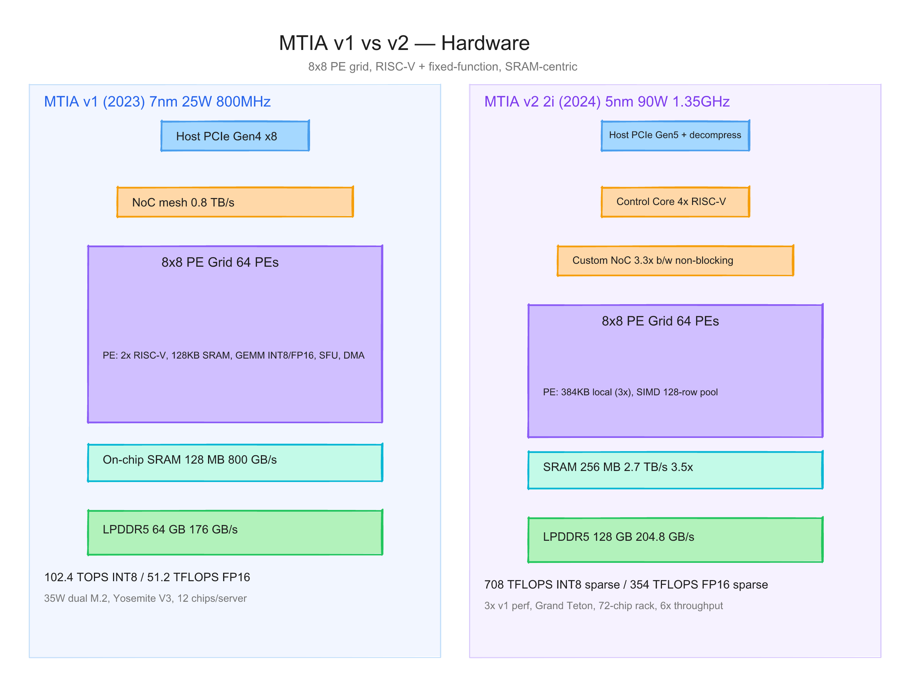
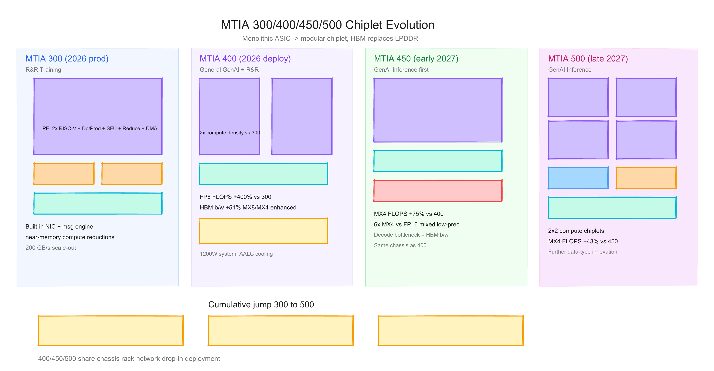
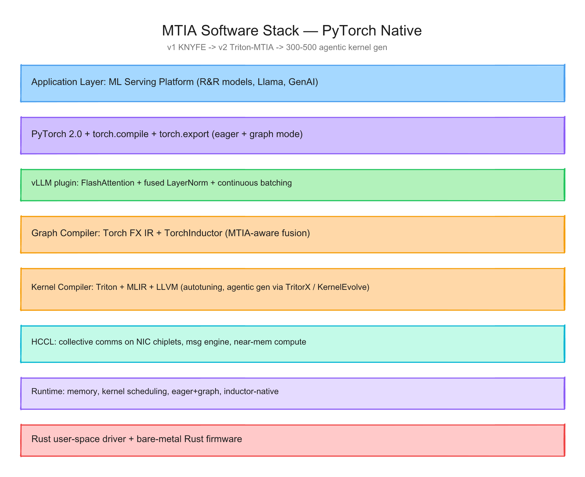

# Meta MTIA 每代芯片的硬件与软件调研报告

> 截至日期：2026 年 6 月 26 日。MTIA 全称 Meta Training and Inference Accelerator，Meta 自研、与 Broadcom 合作制造的 AI 推理/训练加速器家族。截至本期，已公开 6 代：v1（MTIA 100）、v2（MTIA 200 / 2i）、MTIA 300、400、450、500。本报告按"硬件架构 + 软件栈"两条线梳理每代差异，并给出三张架构图。

---

## 一、世代总览

| 代号 | 别名 | 工艺 | 频率 | TDP | 主用途 | 状态 |
|---|---|---|---|---|---|---|
| MTIA v1 | MTIA 100 | TSMC 7nm | 800 MHz | 25 W | R&R 推理 | 2023 量产，已部署数十万片 |
| MTIA v2 | MTIA 200 / 2i | TSMC 5nm | 1.35 GHz | 90 W | R&R 推理（LC + HC 模型）| 2024 量产，9 个月内上 16 区域 |
| MTIA 300 | — | 5nm 优化 | — | — | R&R 训练 | 2026 量产 |
| MTIA 400 | — | chiplet | — | 1200 W（系统级）| 通用 GenAI + R&R | 实验室测试完毕，2026 进数据中心 |
| MTIA 450 | — | chiplet | — | — | GenAI 推理优先 | 2027 初量产部署 |
| MTIA 500 | — | chiplet（2×2 compute）| — | — | GenAI 推理 | 2027 量产部署 |

代际间最关键的趋势：从单片 ASIC 走向 chiplet；从 LPDDR5 走向 HBM；从 R&R 推理扩展到 GenAI 推理和训练；发布节奏从一年一代压缩到约半年一代。

---

## 二、硬件架构演进

### 2.1 MTIA v1（MTIA 100，2023）

**整体结构**：单片 ASIC，8×8 网格共 64 个 Processing Element（PE），mesh 互联。PE 阵列被 128 MB on-chip SRAM 包围，对外通过 16 通道 LPDDR5 提供 64 GB 容量和 176 GB/s 带宽。

**Processing Element**：每个 PE 内含两颗 RISC-V 核心（一颗标准、一颗带向量扩展）和一组固定功能单元——FP16/INT8 矩阵乘、非线性函数、数据搬运。每个 PE 自带 128 KB 本地 SRAM。固定功能单元的设计逻辑：把 DLRM 推理里最热的几个算子直接做进硅，让 RISC-V 核心只承担控制任务。

**封装与互联**：35 W 双 M.2 卡，每张卡装 2 颗芯片。Yosemite V3 服务器（OCP 标准）装 12 颗加速器，通过 PCIe Gen4 x8 接 host 和彼此互联。整个服务器约 780 W，与一颗 Hopper SXM5 持平。

**规格摘要**（[Meta 官方 blog](https://ai.meta.com/blog/meta-training-inference-accelerator-AI-MTIA/)）：
- 102.4 TOPS INT8 / 51.2 TFLOPS FP16
- 128 MB on-chip SRAM，800 GB/s 带宽
- 64 GB LPDDR5，176 GB/s
- 25 W TDP，800 MHz

### 2.2 MTIA v2（MTIA 200 / 2i，2024）

**关键变化**：从 7nm 升 5nm，频率从 800 MHz 升 1.35 GHz，TDP 从 25 W 升 90 W。8×8 PE 结构保留，但每个 PE 内部扩大：本地存储从 128 KB 升 384 KB（3×）；on-chip SRAM 从 128 MB 升 256 MB，带宽从 800 GB/s 升 2.7 TB/s（3.5×）；LPDDR5 容量从 64 GB 升 128 GB，带宽从 176 GB/s 升 204.8 GB/s（+16.4%）。

**NoC 重做**：[ISCA'25 论文](https://aisystemcodesign.github.io/papers/MTIA-ISCA25.pdf)显示 MTIA 2i 引入定制 NoC，带宽 3.3× 于 v1，非阻塞架构，源端做 leaky-bucket 流控和包分片来平滑流量。NoC 通过 die 四边的 crossbar 与 SRAM 和内存控制器相连。

**新增组件**：
- **Host Interface** 升级到 PCIe Gen5，并加入 host-to-accelerator 解压引擎，把 PCIe 实际带宽撑大。
- **Control Core**：四核 RISC-V，协调 64 个 PE。
- **SIMD Engine**：新增指令支持 128 行 embedding pooling（v1 是 32 行），减少指令数量。

**服务器设计**：用 OCP Grand Teton 平台，与 GPU 服务器共用机箱。每服务器两颗 CPU socket，每个 socket 通过 PCIe switch 接 6 个加速器模块。每个 rack 容纳 72 颗加速器，PCIe Gen5 fabric。

**性能数字**（[Meta blog](https://ai.meta.com/blog/next-generation-meta-training-inference-accelerator-AI-MTIA/)）：
- 708 TFLOPS INT8（稀疏）/ 354 TFLOPS INT8（稠密）
- 354 TFLOPS FP16 稀疏 / 177 TFLOPS FP16 稠密
- 整体性能约为 v1 的 3×；72 颗 v2 组成的 rack 在 R&R 模型上吞吐 6× 于 v1 系统，perf-per-watt 提升 1.5×

### 2.3 MTIA 300（2026 量产）

**定位转向**：第一代明确支持 R&R 训练。新引入三件事——built-in NIC chiplet、专用 message engine 卸载 collective 通信、近内存计算（near-memory compute）做 reduction-heavy collective。

**chiplet 拆分**：1 颗 compute chiplet + 2 颗 network chiplet + 多堆 HBM。Compute chiplet 内是 PE 网格（含冗余 PE 提升良率）。

**PE 内部更新**：
- 两颗 RISC-V 向量核心
- Dot Product Engine（矩阵乘）
- Special Function Unit（激活和 elementwise）
- Reduction Engine（累加 + 跨 PE 通信）
- DMA engine（本地 scratchpad 进出数据）

### 2.4 MTIA 400（2026 部署中）

**性能跃迁**：FP8 FLOPS 较 300 提升 400%，HBM 带宽提升 51%。是 MTIA 家族里**第一片追求"raw performance 与商业旗舰对打"的芯片**——之前都是 cost-effectiveness 优先。

**结构**：2 颗 compute chiplet（compute density 翻倍）+ HBM。支持增强版 MX8/MX4 低精度格式。

**scale-up domain**：72 颗 MTIA 400 通过 switched backplane 组成单 rack scale-up domain。系统级 TDP 1200 W。Air-Assisted Liquid Cooling（AALC）允许在 legacy 数据中心快速部署。

### 2.5 MTIA 450（2027 初量产）

**GenAI 推理优先**：四项针对性优化：
1. HBM 带宽相对 400 翻倍（decode 阶段瓶颈是 HBM 带宽，不是 FLOPS）。
2. MX4 FLOPS 提升 75%（MoE FFN 算力加速）。
3. 硬件加速 attention 和 FFN（缓解 Softmax、FlashAttention 瓶颈）。
4. 自定义低精度数据类型，MX4 FLOPS 是 FP16/BF16 的 6×，混合低精度计算不需要 software 层做类型转换。

### 2.6 MTIA 500（2027 量产）

**modular 走到极致**：2×2 配置的 4 颗 smaller compute chiplet + 多堆 HBM + 2 颗 network chiplet + 1 颗 SoC chiplet（提供 PCIe 接 host 和 scale-out NIC）。

**指标提升**：HBM 带宽 +50%、HBM 容量 +80%、MX4 FLOPS +43%。继续做 hardware 加速和数据类型创新，针对 GenAI 推理新观察到的瓶颈。

**整体演进**：从 300 到 500，HBM 带宽 ×4.5，compute FLOPS ×25（从 300 的 MX8 到 500 的 MX4）。

### 2.7 互联与系统

400 / 450 / 500 共享同一 chassis、rack 和网络架构——这是 Meta "半年一代"节奏的关键。新 chip 直接 drop-in 到现有物理 footprint。Scale-out 网络 200 GB/s（MTIA 300 因 scale-up domain 较小，配置更高 scale-out 带宽补偿）。

---

## 三、软件栈演进

### 3.1 核心原则：PyTorch-native

Meta 是 PyTorch 的发源地，MTIA 软件栈从第一天就围绕 PyTorch 设计，不给开发者换框架的理由。这一原则贯穿 6 代。具体含义：

- **eager 和 graph 模式都支持**——很多 AI 芯片只支持 static graph，但 PyTorch 用户习惯 eager，MTIA 把这看作硬约束。
- **同份生产代码可以同时在 GPU 和 MTIA 上跑**，迁移成本接近零。
- **torch.compile 和 torch.export 是 onboard 入口**，不需要 MTIA 专用重写。

### 3.2 MTIA v1 软件栈（2023）

层次（自顶向下，[ISCA'23 论文](http://firoozshahian.com/publications/3579371.3589348.pdf)）：

1. **ML Serving Platform**：硬件无关的应用层。
2. **PyTorch Runtime**：MTIA Tensors、host 端内存分配器、CUDA-like streaming API。支持 eager 和 graph 模式，支持模型 partition 跨多卡。
3. **Compiler 上层**：基于 PyTorch FX IR 做模型级变换和优化。
4. **Compiler 下层**：LLVM IR + 自定义扩展，支持 MTIA ISA。
5. **KNYFE DSL**：kernel 开发专用 DSL，用简短的高层描述生成低层优化 C++ 代码，调用硬件专用 API 实现 ML 算子。
6. **Runtime / Firmware**：管理设备执行、内存、调度。

v1 期已经在为 PyTorch 2.0 铺路——TorchDynamo、TorchInductor 集成、Triton DSL 扩展、MLIR 作为内部 IR 都在路线图上。

### 3.3 MTIA v2 软件栈（2024）

最大的变化：**Triton-MTIA 后端上线**。

[Triton](https://openai.com/research/triton) 是 OpenAI 开源的 GPU kernel DSL。Meta 发现 Triton 语言本身足够硬件无关，可以适配非 GPU 架构。Triton-MTIA 后端做以下事：
- 最大化硬件利用率
- 暴露 tuning knobs 给 Triton 和 MTIA 的 auto-tuning 基础设施
- 同时支持 AOT 和 JIT 工作流（通过 TorchInductor）
- 大幅扩展 PyTorch 算子覆盖

[Meta blog](https://ai.meta.com/blog/next-generation-meta-training-inference-accelerator-AI-MTIA/)指出，Triton-MTIA 让 kernel authoring 效率"dramatically improved"。还有一项工程价值：因为 v1 已经把整个软件栈接到硅上，v2 first silicon 到生产模型跑起来只用 9 个月。

### 3.4 MTIA 300–500 软件栈（2026 统一）

2026 年 Meta 公布的[完整软件栈](https://ai.meta.com/blog/meta-mtia-scale-ai-chips-for-billions/)是对 v1/v2 经验的整合，所有 chip generation 共享同一编程体验。

**关键组件**：

**Compilers**
- Graph compiler：基于 Torch FX IR 和 TorchInductor。
- Kernel compiler 和 lower-level backend：基于 Triton、MLIR、LLVM，针对 MTIA 优化。
- 对 TorchInductor 的 Triton codegen 和 kernel fusion 做了 MTIA-aware 改造。
- 引入 MTIA-aware MLIR dialects 和 Triton DSL 扩展（性能关键 kernel 可选）。
- Compiler stack 内置 autotuning，自动尝试多种编译策略。

**Kernel Authoring**
- 编译器驱动的 kernel 生成和 fusion。
- 同时支持自动生成和手写 kernel（Triton 或 C++）。
- **Agentic AI 系统**自动生成 kernel——参考 TritorX 和 KernelEvolve 两篇论文。

**HCCL（Hoot Collective Communications Library）**
- 类似 GPU 的 NCCL，但有几项不同：
- 利用 MTIA chip 内置的 network chiplet，collective 卸载到专用 message engine。
- 近内存计算加速 reduction-heavy collective。
- 支持计算和 collective kernel 融合，降低 latency。
- 传输栈针对低延迟事务优化，整条数据路径从 host stack 卸载。

**Runtime & Firmware**
- 管理设备内存、kernel 调度、跨设备协调。
- 支持 eager 和 graph 模式。
- Inductor-native、eager-style graph 模式，把 compute 和 collective 一起 capture 和 schedule——这是 GPU-like 体验的关键。
- **Rust-based 用户态 driver**，不走传统 in-kernel Linux driver。
- **Firmware 用 bare-metal Rust 写**，内存和线程安全 built-in，低延迟。

**vLLM 支持**
- vLLM plugin 架构允许 MTIA 插入。
- MTIA plugin 替换关键算子（FlashAttention、fused LayerNorm）为 MTIA 专用 kernel。
- Graph 模式通过 custom torch.compile backend 支持。
- 继承 vLLM 的 prefill-decode 分离和 continuous batching。

**Production Tools**
- 监控、profiling、debugging 工具，对标主流 GPU。
- 独特能力：full-stack at-scale observability，跨 host 和 device，跨 software、firmware、hardware。
- Debugger 支持细到 PE 级的 breakpoint 和 coordinated stepping。

### 3.5 软件栈演进的核心逻辑

把三代软件栈放在一起看：

| 维度 | v1 | v2 | 300-500 |
|---|---|---|---|
| 入口 | PyTorch eager + FX | PyTorch 2.0 + TorchInductor | torch.compile / torch.export |
| Kernel DSL | KNYFE | Triton-MTIA | Triton + MLIR + agentic 生成 |
| Driver | 传统 | 传统 | 用户态 Rust |
| Firmware | C | C | bare-metal Rust |
| 集合通信 | 自家 | 自家 | HCCL（用 network chiplet）|
| LLM serving | 未明确 | 未明确 | vLLM plugin |

最重要的趋势：**编译器层逐渐接管更多工作，kernel 越来越自动生成**。从 v1 的 KNYFE 手写，到 v2 的 Triton-MTIA 半自动，再到 300-500 的 agentic AI 自动生成，开发效率的提升是几何级的。

---

## 四、设计哲学的三次转向

把六代芯片放一起，能看到 Meta 三次明确的设计哲学转向。

**第一次（v1 → v2）**：从"做出能用的推理芯片"到"做对 R&R 推理最优的芯片"。v2 不追求通用性，明确写"SRAM 容量相对典型 GPU 偏大，让低 batch size 也能高利用率"。

**第二次（v2 → 300/400）**：从单片 ASIC 到 chiplet。这是工程节奏的转向——单片 ASIC 一代要 18-24 个月，chiplet 化后每 6 个月可以只升级其中一个 die。Meta 把"chip 设计 vs 模型演化"的速度差作为头号问题来解。

**第三次（450/500）**：从"先训再推"到"inference first"。主流 GPU 是为大模型预训练设计的，再被勉强用于推理——成本结构对推理不友好。Meta 反过来：450 和 500 先优化 GenAI 推理，再倒推到其他 workload。HBM 带宽优先于 FLOPS，因为 decode 阶段的瓶颈是 HBM 不是算力。

---

## 五、与外部生态的关系

- **Broadcom**：六代芯片全部与 Broadcom 合作制造。Broadcom 提供 silicon implementation、Tomahawk 网络 silicon、packaging。
- **TSMC**：v1 7nm，v2 5nm，后续节点未明确公开。
- **OCP**：Yosemite V3（v1）、Grand Teton（v2）、共享 chassis（400-500）。
- **AMD**：2026 年 3 月 Meta 公布 1000 亿美元 AI 基础设施协议，AMD 是合作方。MTIA 与 AMD GPU 在 Meta 内部是并存关系，不是替代。
- **Nvidia**：Meta 仍然在用 Nvidia GPU，MTIA 的定位是"complementary"，不是替代整个 GPU 池。

---

## 六、参考来源

- [MTIA v1 blog (Meta, 2023)](https://ai.meta.com/blog/meta-training-inference-accelerator-AI-MTIA/)
- [MTIA v1 paper (ISCA'23)](http://firoozshahian.com/publications/3579371.3589348.pdf)
- [MTIA v2 blog (Meta, 2024-04)](https://ai.meta.com/blog/next-generation-meta-training-inference-accelerator-AI-MTIA/)
- [MTIA v2 paper (ISCA'25)](https://aisystemcodesign.github.io/papers/MTIA-ISCA25.pdf)
- [Four MTIA Chips in Two Years (Meta, 2026-03)](https://ai.meta.com/blog/meta-mtia-scale-ai-chips-for-billions/)
- [Expanding Meta's Custom Silicon (Meta, 2026-03)](https://about.fb.com/news/2026/03/expanding-metas-custom-silicon-to-power-our-ai-workloads/)
- [Tom's Hardware coverage](https://www.tomshardware.com/tech-industry/semiconductors/meta-reveals-four-new-mtia-chips-built-for-ai-inference)
- [The Next Platform: MTIA v1](https://www.nextplatform.com/ai/2023/05/18/meta-platforms-crafts-homegrown-ai-inference-chip-ai-training-next/1637530)
- [The Next Platform: MTIA v2](https://www.nextplatform.com/ai/2024/04/11/with-mtia-v2-chip-meta-can-do-ai-inference-but-not-training/1654250)

---

## 附：架构图索引

本报告配套三张架构图，已 inline 在对应章节中。源文件（可编辑）和 PNG 预览均位于 `assets/`：

| 图 | 预览 | 源文件 |
|---|---|---|
| MTIA v1/v2 硬件对比 | `assets/meta_mtia_hw_v1_v2.png` | `assets/meta_mtia_hw_v1_v2.excalidraw` |
| MTIA 300–500 chiplet 演进 | `assets/meta_mtia_chiplet_300_500.png` | `assets/meta_mtia_chiplet_300_500.excalidraw` |
| MTIA 软件栈层级 | `assets/meta_mtia_software_stack.png` | `assets/meta_mtia_software_stack.excalidraw` |
