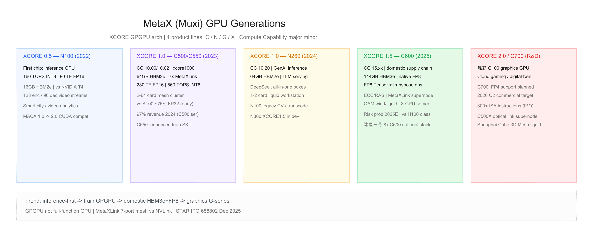
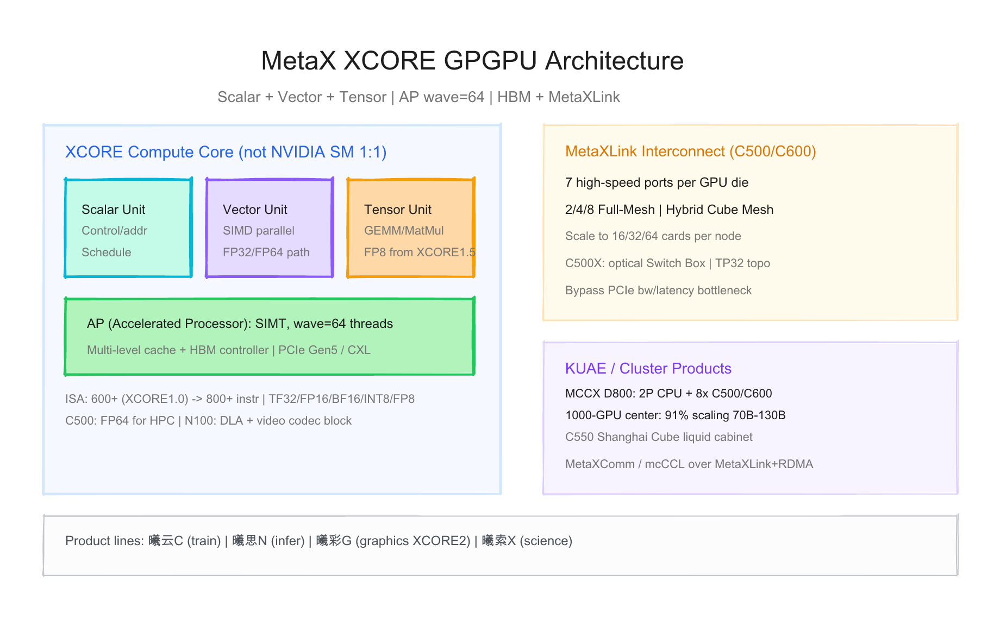
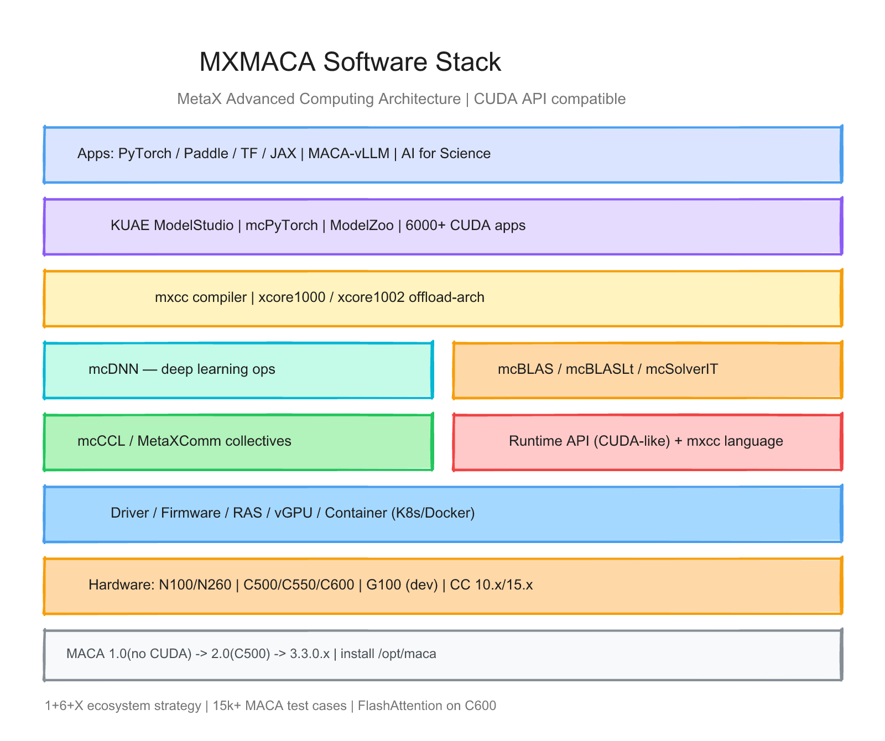

# 沐曦（MetaX）每代 GPU 的硬件与软件调研报告

> 截至日期：2026 年 6 月 26 日。沐曦集成电路（MetaX，688802.SH）成立于 2020 年 9 月，定位 **GPGPU（通用 GPU）**——专注 **AI 训练/推理与通用计算**，**不做** 摩尔线程式「全功能游戏显卡」主线。自研 **XCORE** 架构及 **MXISA** 指令集，软件 **MXMACA** 在 API 层兼容 **CUDA**。产品矩阵：**曦云 C**（训推一体）、**曦思 N**（推理）、**曦彩 G**（图形，在研）、**曦索 X**（科学智算）。公开硅代际按 **XCORE 版本**：**0.5（N100）→ 1.0（C500/C550/N260）→ 1.5（C600/N300）→ 2.0（G100/C700 在研）**。2025 年 12 月科创板上市。本报告按「硬件架构 + 软件栈」梳理代际差异，并给出三张架构图。

---

## 一、世代总览

| 阶段 | XCORE | 芯片/SKU | Compute Capability | 内存 | 峰值算力（公开） | 互联 | 形态 | 发布/状态 |
|---|---|---|---|---|---|---|---|---|
| **Gen0.5** | **XCORE 0.5** | **曦思 N100** | — | **16 GB** HBM2e | INT8 **160 TOPS** / FP16 **80 TF** | PCIe | 推理卡 | **2022-01 流片；2023-04 量产** |
| **Gen1.0** | **XCORE 1.0** | **曦云 C500** | **10.00** | **64 GB** HBM2e | FP16 **280 TF**；INT8 **560 TOPS** | **7× MetaXLink** | PCIe Gen5 | **2024-02 量产** |
| **Gen1.0** | XCORE 1.0 | **曦云 C550** | **10.02** | 64 GB HBM2e | 增强训练算力（未单列 TF） | MetaXLink | PCIe / 集群 | **2024** |
| **Gen1.0** | XCORE 1.0 | **曦思 N260** | **10.20** | **64 GB** HBM2e | 多精度混合（未单列） | PCIe | 推理/一体机 | **2024–2025** |
| **Gen1.5** | **XCORE 1.5** | **曦云 C600** | **15.xx** | **144 GB** HBM3e | **FP8** 原生（峰值未全公开） | MetaXLink 超节点 | **OAM** 风/液冷 | **2024-10 流片；2025 风险量产** |
| **Gen1.5** | XCORE 1.5 | **曦思 N300** | 15.xx | **HBM3** | — | — | 云端推理 | **在研** |
| **Gen2.0** | **XCORE 2.0** | **曦彩 G100** | — | — | 图形渲染 | — | GPU | **IP 验证完成；在研** |
| **规划** | XCORE 1.5+ | **曦云 C700** | — | — | **FP4** 等 | — | — | **2026 Q2E 商用** |

**命名注意**：
- **XCORE** 为计算架构品牌；**曦云/曦思/曦彩** 为产品线，**非**严格一一对应单一 die。
- **Compute Capability** `major.minor`：C500 系 **10.xx**（`xcore1000`/`xcore1002`）；C600 系 **15.xx**（[编程指南](https://developer.metax-tech.com/api/client/document/preview/693/split_files/%E7%BC%96%E7%A8%8B%E6%8E%A5%E5%8F%A3.html)）。
- **C550** 为 C500 同架构增强 SKU，非新 major 代际。
- 2024 年 **C500 系列占收入约 97%**（[icspec](https://spec.icspec.com/blog/16906)）。

代际间关键趋势：**推理片 N100 打通路 → XCORE1.0 训推 C500+MetaXLink 千卡 → XCORE1.5 国产链+HBM3e+FP8 → XCORE2.0 补图形 G 系列**；软件 **MACA 1.0→2.0 CUDA 兼容→3.3 万卡生态**。



---

## 二、硬件架构演进

### 2.1 设计哲学 — GPGPU + MetaXLink，对标 CUDA 生态

沐曦与摩尔线程「全功能 GPU」分野：沐曦 **刻意规避图形渲染难点**，在 **GPGPU + HBM + 多卡互联** 上追求极致（[36氪](https://36kr.com/p/3526576044579714)）。

| 维度 | 沐曦 MetaX | 摩尔线程 | 华为 Ascend |
|---|---|---|---|
| 路线 | **纯 GPGPU** | 全功能 GPU | DSA NPU |
| 图形 | **曦彩 G 在研** | 原生 DX/Vulkan | 无 |
| 编程 | **MXMACA ≈ CUDA** | MUSA/Musify | CANN/HIP 类 |
| 互联 | **MetaXLink 7 口 Mesh** | MTLink | HCCL/UB |
| HPC | **FP64 保留（C500）** | 有限 | 非重点 |

**XCORE 计算单元**（[博客园 C500 分析](https://www.cnblogs.com/mysterious-llama/articles/20198696)）：

| 单元 | 作用 |
|---|---|
| **Scalar** | 控制流、地址、调度 |
| **Vector** | SIMD 并行，FP32/FP64 通用计算 |
| **Tensor** | 矩阵乘加，AI 训练/推理主力 |

**执行模型**：**AP（Accelerated Processor）** + **SIMT**，**wave = 64 线程**（与 AMD waveSize 一致，[Runtime API 指南](https://developer.metax-tech.com/api/client/document/preview/567/C500_RuntimeAPIProgrammingGuide_CN.html)）。XCORE **不宜与 NVIDIA SM 一一对应**——公开资料未披露寄存器/L1/L2 完整层级。



### 2.2 XCORE 0.5 — 曦思 N100（2022）

公司 **首款交付流片** 产品（[招股书梳理](https://pdf.dfcfw.com/pdf/H3_AP202507071704423677_1.pdf)）。

| 项目 | N100 |
|---|---|
| 架构 | **XCORE 0.5** + **MXN100** 异构处理器 |
| 算力 | INT8 **160 TOPS**；FP16/BF16 **80 TFLOPS** |
| 显存 | **16 GB HBM2e** |
| 视频 | **128 路编码 / 96 路解码**；HEVC/H.264/AV1/AVS2；**8K** |
| 对标 | **NVIDIA T4**（官方称 2× 业务支撑，[品佳 QA](https://edit.wpgdadawant.com/uploads/news_file/blog/2023/10811/tech_files/sv-1689905488.pdf)） |
| 场景 | 智慧城市、交通、视频结构化、转码 |
| DLA | 高并发、低时延深度学习加速器 |

**意义**：打通 **流片→量产→销售** 全流程；**MACA 1.0** 尚未 CUDA 兼容，**MACA 2.0** 随 C500 起兼容。

### 2.3 XCORE 1.0 — 曦云 C500 / C550（2023–2024）

2024 年 2 月 **C500 正式量产**（招股书），为当前 **绝对主力**。

| 项目 | C500 | C550 |
|---|---|---|
| CC | **10.00** | **10.02** |
| 编译目标 | `xcore1000` | `xcore1002` |
| 显存 | **64 GB HBM2e** | 64 GB HBM2e |
| MetaXLink | **7 端口**；2–**64 卡**拓扑 | 同左，面向 **大模型训练集群** |
| FP32 Vector | **18 TFLOPS** | 增强 |
| FP32 Matrix | **36 TFLOPS** | — |
| TF32 | **140 TFLOPS** | — |
| FP16/BF16 | **280 TFLOPS** | — |
| INT8 | **560 TOPS** | — |
| FP64 | 支持（HPC） | — |
| 接口 | **PCIe Gen5**、**CXL** | — |
| 对标 | **A100 ~75% FP32**（早期媒体）；训练场景 **优于 H20**（观察者网 Tier 2） | 集群训练 SKU |

**MetaXLink**（[114ic](https://www.114ic.com/info/393190.html)）：
- 突破 **PCIe 带宽/时延** 瓶颈；宣称带宽 **看齐 H200 叙事**
- 支持 **Full-Mesh、Hybrid Cube Mesh、TP32** 等拓扑
- **C500X**：光链 **Switch Box** 超节点（[驱动文档](https://developer.metax-tech.com/api/client/document/preview/773/split_files/%E9%A9%B1%E5%8A%A8%E4%B8%8E%E5%9B%BA%E4%BB%B6%E5%8A%9F%E8%83%BD%E4%BE%9D%E8%B5%96.html)）
- **C550 Shanghai Cube**：液冷整机柜；**3D Mesh** 超节点

**集群**：与新华三等合作 **KUAE 千卡**；**70B–130B** LLM 线性加速比 **91%**（[钛媒体](https://www.tmtpost.com/6842788.html)）。

### 2.4 XCORE 1.0 — 曦思 N260（2024–2025）

面向 **生成式 AI 推理** 的 N 系迭代（CC **10.20**）。

| 项目 | N260 |
|---|---|
| 显存 | **64 GB HBM2e** |
| 场景 | **DeepSeek 等 LLM 一体机**、液冷工作站（1–2 卡） |
| 与 N100 | 从传统 CV/视频 → **大模型推理** |

**在研 N300**：**XCORE 1.5** + **HBM3** + 国产供应链，云端智算中心。

### 2.5 XCORE 1.5 — 曦云 C600（2024–2025）

2024 年 2 月立项，**10 月流片**；2025 年 7 月 **WAIC** 发布（[新浪](https://finance.sina.com.cn/tech/discovery/2025-07-28/doc-infhzpnq4817114.shtml)）。

| 项目 | C600 |
|---|---|
| CC | **15.xx**（新 major 代际） |
| 架构增量 | **FP8 Tensor** + **Tensor 转置** 指令 |
| 显存 | **144 GB HBM3e** |
| 供应链 | **全国产** 设计/制造/封测闭环（官方叙事） |
| 可靠性 | **ECC/RAS** |
| 形态 | **OAM**；风冷/液冷；**沐星一号** 8×C600 服务器 |
| 软件 | **6000+ CUDA 应用**、**1000+ 模型**原生适配（招股书 Tier 2） |
| 状态 | 2025 年底 **风险量产**；功能验证中 |

**相对 C500**：算力、容量、带宽、低精度全面提升；**卡间带宽略有下降、功耗上升**（[观察者网](https://www.guancha.cn/economy/2025_08_29_788160_3.shtml)）。

**C600 公开峰值**：招股书未给完整 TFLOPS 表；媒体未统一口径——本报告 **不臆测 FP8 TF 数值**。

### 2.6 XCORE 2.0 / 规划 — 曦彩 G100、曦云 C700

| 产品 | 状态 | 要点 |
|---|---|---|
| **曦彩 G100** | XCORE **2.0**；GPU IP 设计验证完成 | 云游戏、数字孪生、云渲染、影视制图 |
| **曦云 C700** | 2025 年 4 月立项 | **FP4** 等扩展低精度；**2026 Q2** 商业化目标（招股书） |
| **曦索 X** | 官网列产品线 | AI for Science（细节少） |

**ISA 演进**：XCORE 1.0 **600+** 指令 → 全系列 **800+**（招股书）；支持 **TF32/FP16/BF16/FP8/FP6/FP4** 等精度路线图。

---

## 三、软件栈演进

### 3.1 全栈分层 — MXMACA 异构计算平台

```
行业应用 / KUAE ModelStudio / 智算中心运营
        ↓
PyTorch / Paddle / TF / JAX / MACA-vLLM / AI4Science
        ↓
mcPyTorch | ModelZoo | 6000+ CUDA 应用兼容
        ↓
mxcc 编译器 (xcore1000/1002/15xx) + MXMACA 语言层
        ↓
mcDNN | mcBLAS/Lt | mcSolverIT | mcCCL(MetaXComm)
        ↓
Runtime API（CUDA-like）| 驱动 / 固件 / RAS / vGPU
        ↓
曦思 N / 曦云 C / 曦彩 G GPU
```



入口：[MXMACA 平台](https://www.metax-tech.com/platform.html) | [SDK 文档](https://developer.metax-tech.com/) | 典型安装路径 **`/opt/maca`**

### 3.2 核心组件

| 组件 | 作用 |
|---|---|
| **MXMACA Driver** | 内核态/用户态驱动；设备内存、kernel 启动、多卡管理 |
| **mxcc** | 编译器；`--offload-arch=xcore1000` 等 |
| **Runtime API** | CUDA 风格 API；设备/Stream/Event/Graph |
| **mcDNN** | 深度学习原语 |
| **mcBLAS / mcBLASLt** | 线性代数 |
| **mcCCL / MetaXComm** | 多卡集合通信；适配 **MetaXLink 拓扑感知** |
| **mcPyTorch** | PyTorch 后端移植 |
| **MACA-vLLM** | LLM 推理服务 |
| **ModelZoo** | 预优化模型（N100 起） |

### 3.3 MACA 版本里程碑

| 版本 | 时期 | 里程碑 |
|---|---|---|
| **MACA 1.0** | N100 早期 | **无 CUDA 兼容**；不可与 CUDA 并行部署 |
| **MACA 2.0** | 2023 C500 | **CUDA 兼容**；C500 验证 |
| **MACA 3.x** | 2024–2025 | vLLM、FlashAttention、PagedAttention；**MACA 3.3.0.X** 技术报告 |
| **C600 Beta** | 2025E | 对标国际高端 GPU 软件（官方 roadmap） |

**MXMACA 3.3.0.X**（[官方技术报告](https://www.metax-tech.com/ndetail/12532.html)）：
- **15000+** MACA 测试用例 + **10000+** 行业场景用例
- C 系列单产品测试 **60000+ GPU·小时**
- **「1+6+X」** 生态战略

### 3.4 编程模型要点

- **SIMT + wave64**：kernel 以 64 线程为一 wave 调度
- **动态并行**：支持 device-side kernel launch（Runtime API 文档）
- **容器/K8s**：Docker 部署；国产 OS 内核广泛适配
- **精度**：C500 完整 **FP64→INT8**；C600 增 **FP8**；C700 规划 **FP4**

### 3.5 硬件代际 × 软件能力矩阵

| 能力 | N100 | C500/C550 | N260 | C600 | G100 |
|---|---|---|---|---|---|
| MXMACA | 1.0→2.0 | **3.x 主力** | 3.x | 3.x+ | 未量产 |
| CUDA API 兼容 | ❌→✅ | ✅ | ✅ | ✅ 增强 | — |
| mcDNN / mcBLAS | 基础 | ✅ | ✅ | ✅ FP8 | — |
| mcCCL/MetaXComm | 有限 | ✅ 千卡 | ✅ | ✅ 万卡 | — |
| PyTorch | 适配 | ✅ mcPyTorch | ✅ | ✅ | — |
| vLLM / SGLang | — | MACA-vLLM | ✅ | ✅ day-zero 叙事 | — |
| FlashAttention | — | 部分 | ✅ | ✅ 优化 | — |
| AI4Science | — | ✅ 手册 | — | ✅ | — |
| 图形 API | — | — | — | — | **DX/Vulkan 目标** |

---

## 四、设计哲学的四次转向

**第一次（N100 / XCORE 0.5，2022）**：**推理片打头阵**——16GB HBM + 视频编解码 + T4 对标；验证供应链与 MACA 0→1；传统 AI / 智慧城市现金牛。

**第二次（C500 / XCORE 1.0，2023–2024）**：**训推 GPGPU 主战场**——64GB HBM2e + **7×MetaXLink** 千卡；MACA 2.0 **CUDA 兼容**；FP64 保留争 HPC；**97% 收入**集中 C 系列。

**第三次（C600 / XCORE 1.5，2024–2025）**：**国产旗舰 + FP8**——144GB HBM3e、全国产链、OAM 形态；从「能用」迈向「对标 H100 类」；**N 系升级到 N260/N300** 争 GenAI 推理一体机。

**第四次（G100/C700 / XCORE 2.0，2025+）**：**补全图形与下一代精度**——曦彩 G 覆盖渲染；C700 **FP4**；MetaXLink 超节点与 **10 万卡** 叙事（行业 PPT 级，待验证）。

---

## 五、与外部生态及验证缺口

**生态**
- 2023 年 10 月 **美国实体清单**（[Wikipedia 摩尔线程条目同批次](https://zh.wikipedia.org/zh-cn/%E6%91%A9%E5%B0%94%E7%BA%BF%E7%A8%8B) 亦提及沐曦）
- 2025 年 12 月 **科创板上市** 688802；截至 2025-03 **累计出货 25000+ 颗**（招股书）
- 客户：国家/运营商智算平台、互联网厂商（未逐一 Tier-1 验证）

**相对 NVIDIA 的能力边界**
- 优势：**MetaXLink 多口 Mesh**、**64GB→144GB 大显存**、**FP64 HPC**、**CUDA API 迁移叙事**
- 风险：**kernel 覆盖率/多卡效率** 与 CUDA 生态差距（[观察者网](https://www.guancha.cn/economy/2025_08_29_788160_3.shtml)）；**C600 峰值 TFLOPS 未完整公开**；**图形线尚未量产**；公司 **仍亏损**

**本报告标注的验证缺口**
1. **C550** 相对 C500 的精确算力提升无官方单表
2. **C600** FP8/FP16 峰值 TFLOPS、TDP、MetaXLink 带宽 **无统一官方 datasheet**
3. **N260/N300** 算力数字缺失
4. **XCORE 内部缓存/SP 数量** 未公开，不能与 SM 严格对比
5. **MetaXLink vs H200 带宽** 为营销口径，缺独立 benchmark
6. **91% 千卡扩展比** 为 vendor 特定模型/集群配置
7. **C700/G100** 仅招股书与发布会信息
8. **S5000 级 FP8 1000TF** 属摩尔线程，勿与沐曦 C600 混淆

---

## 六、参考来源

- [沐曦官网 MXMACA 平台](https://www.metax-tech.com/platform.html)
- [MACA 3.3.0.X 技术报告](https://www.metax-tech.com/ndetail/12532.html)
- [曦云 C500 Runtime API 编程指南](https://developer.metax-tech.com/api/client/document/preview/567/C500_RuntimeAPIProgrammingGuide_CN.html)
- [Compute Capability / xcore 编译选项](https://developer.metax-tech.com/api/client/document/preview/693/split_files/%E7%BC%96%E7%A8%8B%E6%8E%A5%E5%8F%A3.html)
- [AI4Science 用户手册](https://developer.metax-tech.com/api/client/document/preview/1028/split_files/%E6%A6%82%E8%BF%B0.html)
- [C500 驱动固件依赖](https://developer.metax-tech.com/api/client/document/preview/773/split_files/%E9%A9%B1%E5%8A%A8%E4%B8%8E%E5%9B%BA%E4%BB%B6%E5%8A%9F%E8%83%BD%E4%BE%9D%E8%B5%96.html)
- [模力方舟 C500 规格](https://moark.com/docs/compute/clusters_gpu/mx_gpu)
- [C500 vs A100/H100 架构比较](https://www.cnblogs.com/mysterious-llama/articles/20198696)
- [招股书梳理之沐曦篇 PDF](https://pdf.dfcfw.com/pdf/H3_AP202507071704423677_1.pdf)
- [icspec 沐曦产品矩阵](https://spec.icspec.com/blog/16906)
- [N100 安博会新闻](https://www.metax-tech.com/ndetail/12469.html)
- [N100 产品 QA PDF](https://edit.wpgdadawant.com/uploads/news_file/blog/2023/10811/tech_files/sv-1689905488.pdf)
- [S4000/KUAE 钛媒体](https://www.tmtpost.com/6842788.html)（注：属摩尔线程，勿混淆）
- [C600 WAIC 发布 — 新浪](https://finance.sina.com.cn/tech/discovery/2025-07-28/doc-infhzpnq4817114.shtml)
- [C600 全国产发布 — 腾讯新闻](https://news.qq.com/rain/a/20251020A086BQ00)
- [观察者网 产品竞争分析](https://www.guancha.cn/economy/2025_08_29_788160_3.shtml)
- [36氪 GPGPU 路线对比](https://36kr.com/p/3526576044579714)
- [MetaXLink 技术 — 114ic](https://www.114ic.com/info/393190.html)
- [MetaXComm 拓扑 — 技术栈](https://jishuzhan.net/article/2034070120599977986)
- [雷峰网 上市隐忧](https://www.leiphone.com/category/chips/o1apUBq0YiiWmc40.html)

---

## 附：架构图索引

| 图 | 预览 | 源文件 |
|---|---|---|
| XCORE 世代演进（N100→C500→N260→C600→G/C700） | `assets/metax_hw_generations.png` | `assets/metax_hw_generations.excalidraw` |
| XCORE 架构 + MetaXLink/KUAE | `assets/metax_chip_architecture.png` | `assets/metax_chip_architecture.excalidraw` |
| MXMACA 软件栈 | `assets/metax_software_stack.png` | `assets/metax_software_stack.excalidraw` |
