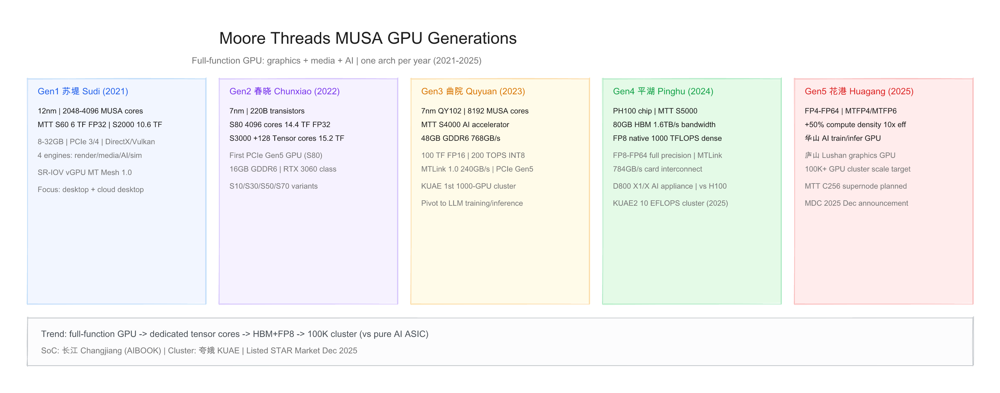
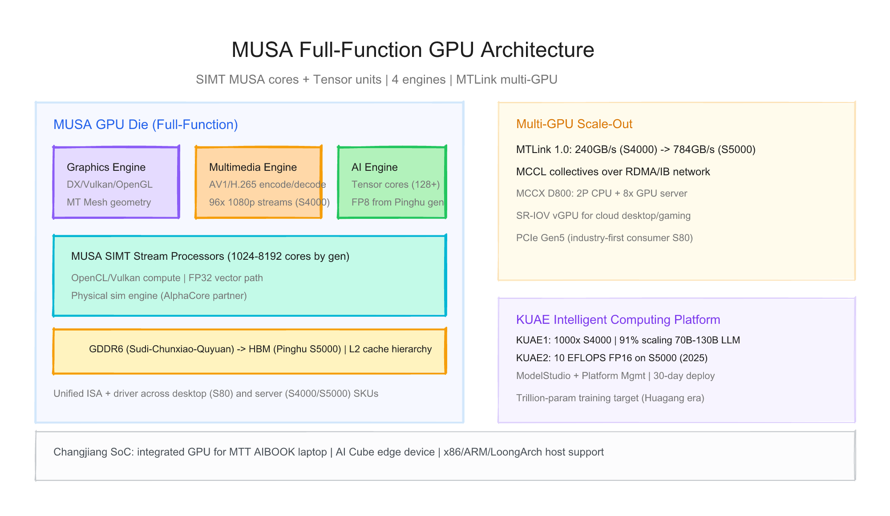
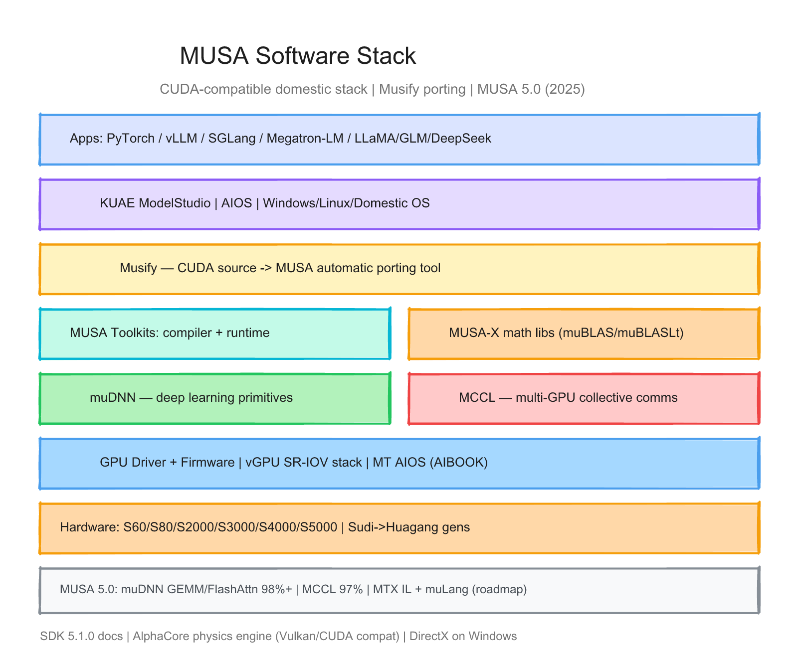

# 摩尔线程（Moore Threads）每代 GPU 的硬件与软件调研报告

> 截至日期：2026 年 6 月 26 日。摩尔线程（Moore Threads，688795.SH）成立于 2020 年 10 月，定位 **全功能 GPU（Full-Function GPU）**——同时覆盖 **3D 图形、视频编解码、AI 计算与物理仿真**，而非纯 AI ASIC。自研 **MUSA（Moore Threads Unified System Architecture，摩尔线程统一系统架构）** 按 **「一年一代」** 迭代：**苏堤（2021）→ 春晓（2022）→ 曲院（2023）→ 平湖（2024）→ 花港（2025）**。软件 **MUSA SDK** 提供 **Musify CUDA 迁移**、**muDNN/MCCL** 与 **KUAE 夸娥** 千卡智算平台。2025 年 12 月科创板上市。本报告按「硬件架构 + 软件栈」梳理五代 MUSA 与代表 SKU，并给出三张架构图。

---

## 一、世代总览

| 阶段 | 架构代号 | 代表芯片 | 工艺 | MUSA 核心 | 代表产品 | 峰值算力（公开） | 内存 | 主用途 | 发布 |
|---|---|---|---|---|---|---|---|---|---|
| **Gen1** | **苏堤 Sudi** | — | **12nm** | **2048–4096** | **S60 / S2000** | FP32 **6 / 10.6 TF** | 8–32 GB GDDR | 桌面/云桌面 | **2021–2022** |
| **Gen2** | **春晓 Chunxiao** | 220B 晶体管 | **7nm** | **4096** + **128 Tensor** | **S80 / S3000** | FP32 **14.4 / 15.2 TF** | 16–32 GB GDDR6 | 游戏/云渲染 | **2022-11** |
| **Gen3** | **曲院 Quyuan** | QY102 | **7nm** | **8192** | **S4000** | FP16 **100 TF**；INT8 **200 TOPS** | **48 GB** GDDR6 | 大模型训推 | **2023-12** |
| **Gen4** | **平湖 Pinghu** | PH100 | **7nm** | （未公开 SP 数） | **S5000** | **FP8 1000 TF** 稠密 | **80 GB HBM** | AI 训推一体 | **2024–2025** |
| **Gen5** | **花港 Huagang** | — | — | — | **华山 / 庐山** | FP4–FP64（未公开 TF） | （未公开） | 训推 + 图形 | **2025-12** |
| **SoC** | MUSA 衍生 | **长江 Changjiang** | — | 集成 GPU | **AIBOOK / AI Cube** | — | — | 端侧开发 | **2025** |

**命名注意**：
- **MUSA** 既是 **指令集/驱动/编程模型** 的统一品牌，也是各代架构的中文诗名总称（苏堤、春晓等）。
- 桌面线 **MTT S 系列**（S10→S80）与服务器线 **S2000/S3000/S4000/S5000** 可 **跨代混用芯片**（如 S50 仍用 12nm 苏堤）。
- **S5000** 在招股书中为 **未单独发产品页的平湖架构卡**，已用于 **D800 X1/X 一体机** 与 **KUAE2**；2025 年 12 月 MDC 大会首次公开参数。
- **华山**（AI 训推）、**庐山**（图形）为 **花港** 架构下两条产品线，规格尚未完整披露。

代际间关键趋势：**全功能 GPU 验证 → PCIe Gen5 消费卡 → 曲院转向 LLM → 平湖 HBM+原生 FP8 → 花港 FP4/十万卡集群**；软件从 **MUSA 1.0** 演进到 **MUSA 5.0 + Musify + vLLM 生态**。



---

## 二、硬件架构演进

### 2.1 设计哲学 — 全功能 GPU vs 纯 AI 加速器

摩尔线程与寒武纪、燧原等 **纯 AI 芯片** 路线不同，强调 **一张卡干多件事**（[EET 苏堤解析](https://www.eet-china.com/mp/a122563.html)）：

| 引擎 | 能力 | 典型场景 |
|---|---|---|
| **现代图形渲染引擎** | DirectX、Vulkan、OpenGL | 桌面、云游戏、数字孪生 |
| **智能多媒体引擎** | AV1/H.265 编解码 | 视频云、96 路 1080p（S4000） |
| **AI 计算加速引擎** | Tensor Core + SIMT | LLM 训推、推理 |
| **物理仿真与科学计算** | OpenCL、AlphaCore 合作 | HPC、元宇宙 |

| 维度 | 摩尔线程 MUSA GPU | 华为 Ascend NPU | NVIDIA GPU |
|---|---|---|---|
| 图形 | **原生 DX/Vulkan** | 无 | 原生 |
| AI | Tensor + SIMT | Da Vinci Cube | Tensor Core + CUDA |
| 定位 | **国产化全功能** | DSA 训练/推理 | 通用 CUDA 生态 |
| 互联 | **MTLink** | HCCS/UB | NVLink |

> 「MUSA 是统一系统架构，包括统一的编程模型、软件运行库、驱动程序框架、指令集架构和芯片架构。」（[2022 春季发布会](https://m.guokr.com/article/461214/)）

### 2.2 Gen1 — 苏堤 Sudi（2021–2022）

2022 年 3 月随 **MTT S60 / S2000** 发布（[果壳](https://m.guokr.com/article/461214/)），12nm，国内首批支持 **DirectX** 的国产桌面 GPU。

| 项目 | MTT S60 | MTT S2000 |
|---|---|---|
| MUSA 核心 | **2048** | **4096** |
| FP32 | **6 TFLOPS** | **10.6–12 TFLOPS** |
| 显存 | **8 GB** LPDDR4X | **32 GB** GDDR6 |
| 功耗 | 70 W | 150 W（被动散热） |
| 特色 | 8K 显示、AV1 编解码 | **SR-IOV vGPU**（MT Mesh 1.0） |
| API | DX/Vulkan/OpenGL | + OpenCL |

**意义**：证明 **极短周期 GPU 量产**；**云桌面/安卓云游戏** 为首个规模化场景；S10/S30/S50 等为苏堤降规 SKU。

### 2.3 Gen2 — 春晓 Chunxiao（2022）

2022 年 11 月发布 **MTT S80 / S3000**（[InfoQ](https://www.infoq.cn/article/4m8jpvwfmj7hdszgk9sr)），**7nm**，**220 亿** 晶体管。

| 项目 | MTT S80（消费） | MTT S3000（服务器） |
|---|---|---|
| MUSA 核心 | **4096** | **4096** |
| Tensor 核心 | — | **128** 专用张量单元 |
| 频率 | **1.8 GHz** | **1.9 GHz** |
| FP32 | **14.4 TFLOPS** | **15.2 TFLOPS** |
| 显存 | **16 GB** GDDR6 | **32 GB** GDDR6 |
| 互联 | **PCIe Gen5 ×16**（业界首款消费级 Gen5） | PCIe Gen5 |
| 定位 | 国潮游戏卡，对标 **RTX 3060** 级 | 云渲染/AI 推理 |

**S70/S50/S30/S10**：春晓或苏堤降规，覆盖 **2–11.2 TF** FP32 档位（[Wikipedia](https://zh.wikipedia.org/zh-cn/%E6%91%A9%E5%B0%94%E7%BA%BF%E7%A8%8B)）。



### 2.4 Gen3 — 曲院 Quyuan（2023）

2023 年 12 月发布 **MTT S4000**（[钛媒体](https://www.tmtpost.com/6842788.html)），公司 **战略重心转向 AI 智算**（[证券时报](https://www.stcn.com/article/detail/3364328.html)）。

| 项目 | MTT S4000 |
|---|---|
| 芯片 | **QY102**，**8192** MUSA 核心 |
| FP32 / TF32 | **25 / 50 TFLOPS** |
| FP16 / BF16 | **100 TFLOPS** |
| INT8 | **200 TOPS** |
| 显存 | **48 GB** GDDR6，**768 GB/s** |
| 片间互联 | **MTLink 1.0**，**240 GB/s** |
| 接口 | **PCIe Gen5** ×16 |
| TDP | **450 W** |
| 对比上代 S3000 | 显存 +50%，带宽 +71%，FP32 +64% |

**KUAE 1.0**：首个 **全国产千卡** 智算中心（1000× S4000），**70B–130B** 模型训练线性加速比 **91%**，最高扩展 **3096 GPU / 300 PFLOPS FP16**（vendor）。

### 2.5 Gen4 — 平湖 Pinghu（2024–2025）

**MTT S5000** 为第四代 **PH100** 芯片的旗舰智算卡（[第一财经](https://www.yicai.com/news/103085173.html)），2025 年参数全面公开。

| 项目 | MTT S5000 |
|---|---|
| 精度 | **FP8–FP64** 全精度；**硬件原生 FP8 Tensor Core** |
| FP8 稠密算力 | **1000 TFLOPS**（1 PFLOPS 级） |
| 显存 | **80 GB HBM**，**1.6 TB/s** |
| 卡间互联 | **784 GB/s**（MTLink） |
| 对比 S4000 | 显存 **+67%**，带宽 **+113%** |
| 生态 | PyTorch、Megatron-LM、**vLLM**、**SGLang** day-zero |
| 产品形态 | **MCCX D800 X1/X** 一体机；**KUAE2** 万卡集群 **10 EFLOPS FP16** |

**实战叙事**（2025 MDC，Tier 2）：
- 与 **硅基流动**：DeepSeek-R1 671B 单卡 prefill **>4000 tok/s**、decode **>1000 tok/s**
- **GLM-5** day-0 适配
- 相对 H20 在部分互联网场景 **~1.5×** 性价比（vendor/媒体，待独立验证）

### 2.6 Gen5 — 花港 Huagang（2025）

2025 年 12 月 **MUSA 开发者大会（MDC 2025）** 发布（[腾讯新闻](https://news.qq.com/rain/a/20251220A06JRT00)）：

| 项目 | 花港 Huagang |
|---|---|
| 精度 | **FP4–FP64**；**MTFP4/MTFP6** + MXFP/NVFP 兼容 |
| 算力密度 | **+50%**（vendor） |
| 能效 | **10×** vs 前代（vendor） |
| 集群 | 目标 **10 万卡+** 智算集群 |
| 产品 | **华山**—AI 训推一体；**庐山 Lushan**—高性能图形 |
| 对比叙事 | 算力/互联介于 **Hopper–Blackwell** 之间（未指名具体 NVIDIA SKU） |
| 超节点 | **MTT C256** supernode 规划 |

**910D 级竞品对标**：媒体称华山支持 **FP6/FP4**，领先部分国产同行仅 FP8（[南方都市报](https://m.mp.oeeee.com/a/BAAFRD0000202512201496681.html)，Tier 2）。

### 2.7 周边产品线

| 产品 | 说明 |
|---|---|
| **长江 Changjiang SoC** | 集成 GPU，驱动 **MTT AIBOOK** AI 算力本、**AI Cube** 迷你设备 |
| **AlphaCore** | 物理引擎，布料/流体/生物仿真，宣称较 Houdini **5–10×** |
| **DIGITALME** | 数字人解决方案 |
| **MTT X 系列** | 专业工作站显卡（官网分类） |

---

## 三、软件栈演进

### 3.1 全栈分层 — MUSA SDK + KUAE 平台

```
应用 / KUAE ModelStudio / MindIE 类推理服务
        ↓
PyTorch / vLLM / SGLang / Megatron-LM / TensorFlow
        ↓
Musify（CUDA → MUSA 源码迁移）
        ↓
MUSA SDK 5.x：Toolkits + muDNN + MCCL + MUSA-X（muBLAS/Lt）
        ↓
GPU Driver / vGPU / Firmware
        ↓
MTT S 系列 / S2000–S5000（苏堤→花港）
```



文档入口：[MUSA SDK 5.1.0](https://docs.mthreads.com/en/musa-sdk/musa-sdk-doc-online/) | [MUSA SDK 产品页](https://www.mthreads.com/product/MUSASDK)

### 3.2 核心组件

| 组件 | 作用 |
|---|---|
| **MUSA Toolkits** | 编译器、运行时、设备管理 |
| **Musify / MUSIFY** | CUDA 代码 **零成本迁移**（官方叙事） |
| **muDNN** | 深度学习原语；MUSA 5.0 宣称 GEMM/FlashAttention **>98%** 效率 |
| **MCCL** | 多卡集合通信，对标 NCCL；通信效率 **97%**（MDC 2025） |
| **muBLAS / muBLASLt** | 线性代数 |
| **MUSA-X** | 基础数学加速库 |
| **GPU 驱动** | Windows/Linux；支持 **x86/ARM/LoongArch** |
| **vGPU** | SR-IOV 硬件虚拟化（苏堤起） |

**规划组件**（MDC 2025）：**MTX** 跨代中间表示；**muLang** 渲染+AI 融合语言。

### 3.3 KUAE 夸娥智算平台

| 版本 | 底座 | 规模 | 能力 |
|---|---|---|---|
| **KUAE 1.0** | **S4000** | **1000 GPU** 起 | 70B–130B LLM，91% 扩展比 |
| **KUAE 2.0** | **S5000** | **万卡** | **10 EFLOPS FP16**；万亿参数训练 |
| 交付 | MCCX D800 8 卡服务器 | **30 天** 建设周期（vendor） | ModelStudio + Platform |

组成：**KUAE 计算集群** + **RDMA 网络** + 分布式存储 + 集群管理平台。

### 3.4 软件版本 × 硬件里程碑

| 里程碑 | 时期 | 硬件 | 内容 |
|---|---|---|---|
| MUSA 架构发布 | 2022-03 | 苏堤 | 统一 ISA/驱动；DirectX |
| CANN 对标物出现 | 2022–2023 | 春晓 | OpenCL + 初步 AI 算子 |
| **Musify** | 2023–2024 | 曲院 | CUDA 迁移工具推广 |
| KUAE 1.0 | 2023-12 | S4000 | 千卡智算中心 |
| PyTorch/vLLM 原生 | 2024–2025 | 平湖 S5000 | 大模型 day-zero |
| **MUSA 5.0** | 2025-12 | S5000/花港 | 全栈升级；开源计划 |
| MUSA SDK **5.1.0** | 2025 | 全代 | muDNN/MCCL 文档完善 |

### 3.5 硬件代际 × 软件能力矩阵

| 能力 | 苏堤 | 春晓 | 曲院 S4000 | 平湖 S5000 | 花港 |
|---|---|---|---|---|---|
| DirectX/Vulkan | ✅ | ✅ | ✅ | ✅ | ✅ 庐山 |
| OpenCL | ✅ | ✅ | ✅ | ✅ | ✅ |
| Musify/CUDA 迁移 | 早期 | ✅ | ✅ 主力 | ✅ | ✅ |
| muDNN | 基础 | ✅ | ✅ | ✅ FP8 | ✅ FP4/6 |
| MCCL 分布式 | 有限 | ✅ | ✅ 千卡 | ✅ 万卡 | 10 万卡目标 |
| vLLM/SGLang | — | — | 适配中 | ✅ day-zero | ✅ |
| FP8 硬件 | ❌ | ❌ | ❌ | ✅ 原生 | ✅ |
| FP4/6 | ❌ | ❌ | ❌ | ❌ | ✅ MTFP |
| vGPU SR-IOV | ✅ | ✅ | ✅ | ✅ | ✅ |

---

## 四、设计哲学的五次转向

**第一次（苏堤，2021–2022）**：**全功能 GPU 国产化**——12nm 下同时做图形+多媒体+AI；**SR-IOV 云桌面** 为首个落地场景；MUSA 统一端云 ISA。

**第二次（春晓，2022）**：**消费级突破**——7nm、**PCIe Gen5 S80**、RTX 3060 级 FP32；128 Tensor 核引入服务器 **S3000**。

**第三次（曲院，2023）**：**AI 智算 pivot**——8192 核 **S4000**、MTLink、**KUAE 千卡**；从「能玩游戏的 GPU」转向「能训 LLM 的 GPU」。

**第四次（平湖，2024–2025）**：**对标 H100 单卡规格**——**HBM + 原生 FP8 + 1000 TFLOPS**；**S5000** 进一体机与万卡集群；DeepSeek/GLM day-0 生态。

**第五次（花港，2025）**：**平台化与超大规模**——**华山/庐山** 双产品线、**FP4/6**、**10 万卡** 与 **C256 超节点**；MUSA 5.0 软件 moat 叙事。

---

## 五、与外部生态及验证缺口

**生态**
- 2023 年 10 月美国 **实体清单**（[Wikipedia](https://zh.wikipedia.org/zh-cn/%E6%91%A9%E5%B0%94%E7%BA%BF%E7%A8%8B)）限制先进制造与 EDA 获取
- 2025 年 12 月 **科创板上市**（688795），国产 GPU 首家
- 客户：智源、硅基流动、互联网厂商等（MDC 2025 案例，Tier 2）

**相对 NVIDIA / 国产 NPU 的边界**
- 优势：**全功能**（图形+AI）、**Musify CUDA 迁移**、**信创 OS/CPU 适配**、S5000 **HBM 容量** 叙事
- 风险：**单卡算力仍落后 1–2 代**、MTLink **240–784 GB/s** vs NVLink 900 GB/s+、**FP8 1000 TF** 为 peak 稠密、实际 LLM 利用率待 Tier-4 验证、**花港/华山** 规格未完整公开、公司 **尚未盈利**

**本报告标注的验证缺口**
1. **PH100 / QY102** die 面积、晶体管数、Exact SP 数官方未披露
2. **S5000 FP16/BF16** 峰值未单独公布（仅 FP8 1000 TF 为官方互动平台口径）
3. **花港/华山/庐山** 无公开 datasheet
4. **HBM 来源** 与制程节点（7nm 哪家 foundry）招股书外信息不一致
5. **1.5× H20**、**>4000 tok/s** 等为 vendor/合作方测试，缺 MLPerf 等独立基准
6. **S2000 FP32** 官网 10.6 TF vs EET 12 TF 表述不一
7. **910D 对标 S5000** 为媒体测试传闻，非官方规格

---

## 六、参考来源

- [摩尔线程官网产品中心](https://www.mthreads.com/product/category/all)
- [MUSA SDK 5.1.0 文档](https://docs.mthreads.com/en/musa-sdk/musa-sdk-doc-online/)
- [MUSA SDK 产品页](https://www.mthreads.com/product/MUSASDK)
- [2022 春季发布会 — 果壳](https://m.guokr.com/article/461214/)
- [苏堤 GPU 浅析 — EET-China](https://www.eet-china.com/mp/a122563.html)
- [春晓 S80/S3000 — InfoQ](https://www.infoq.cn/article/4m8jpvwfmj7hdszgk9sr)
- [S4000 + KUAE — 钛媒体](https://www.tmtpost.com/6842788.html)
- [S4000 发布 — 腾讯新闻](https://news.qq.com/rain/a/20231221A09ZVY00)
- [S4000 — Wccftech](https://wccftech.com/moore-threads-mtt-s4000-gpu-48-gb-memory-200-tops-ai-gen5-ready/)
- [S5000 FP8 1000TF — 第一财经](https://www.yicai.com/news/103085173.html)
- [S5000 参数 — cnBeta](https://www.cnbeta.com.tw/articles/tech/1549624.htm)
- [MDC 2025 花港 — 腾讯新闻](https://news.qq.com/rain/a/20251220A06JRT00)
- [MDC 2025 — 界面新闻](https://m.jiemian.com/article/13792747.html)
- [MDC 2025 — 南方都市报](https://m.mp.oeeee.com/a/BAAFRD0000202512201496681.html)
- [招股相关 — 证券时报](https://www.stcn.com/article/detail/3364328.html)
- [IPO — 新浪科技](https://finance.sina.com.cn/tech/roll/2025-06-30/doc-infcwqxy9526567.shtml)
- [Musify — Tom's Hardware](https://www.tomshardware.com/pc-components/gpus/chinas-moore-threads-polishes-homegrown-cuda-alternative-musa-supports-porting-cuda-code-using-musify-toolkit)
- [Wikipedia 摩尔线程](https://zh.wikipedia.org/zh-cn/%E6%91%A9%E5%B0%94%E7%BA%BF%E7%A8%8B)
- [2026 国产算力追踪 — Tier 3 汇总](https://jiawentechq.com/articles/2026-%E5%9B%BD%E4%BA%A7-ai-%E7%AE%97%E5%8A%9B%E8%BF%BD%E8%B8%AA%EF%BC%88%E5%8D%8E%E4%B8%BA%E6%98%87%E8%85%BE%E3%80%81%E5%AF%92%E6%AD%A6%E7%BA%AA%E3%80%81%E6%91%A9%E5%B0%94%E7%BA%BF%E7%A8%8B...%EF%BC%89)

---

## 附：架构图索引

| 图 | 预览 | 源文件 |
|---|---|---|
| MUSA 世代演进（苏堤→花港） | `assets/moore_threads_hw_generations.png` | `assets/moore_threads_hw_generations.excalidraw` |
| 全功能 GPU 架构 + KUAE 集群 | `assets/moore_threads_chip_architecture.png` | `assets/moore_threads_chip_architecture.excalidraw` |
| MUSA 软件栈 | `assets/moore_threads_software_stack.png` | `assets/moore_threads_software_stack.excalidraw` |
