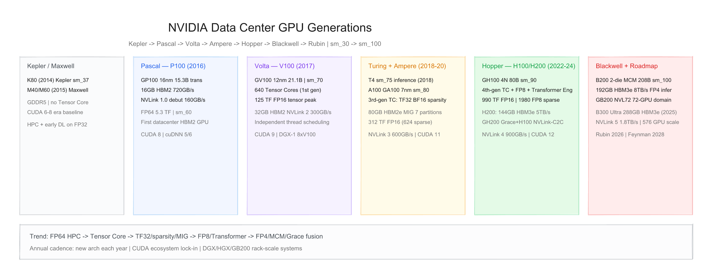
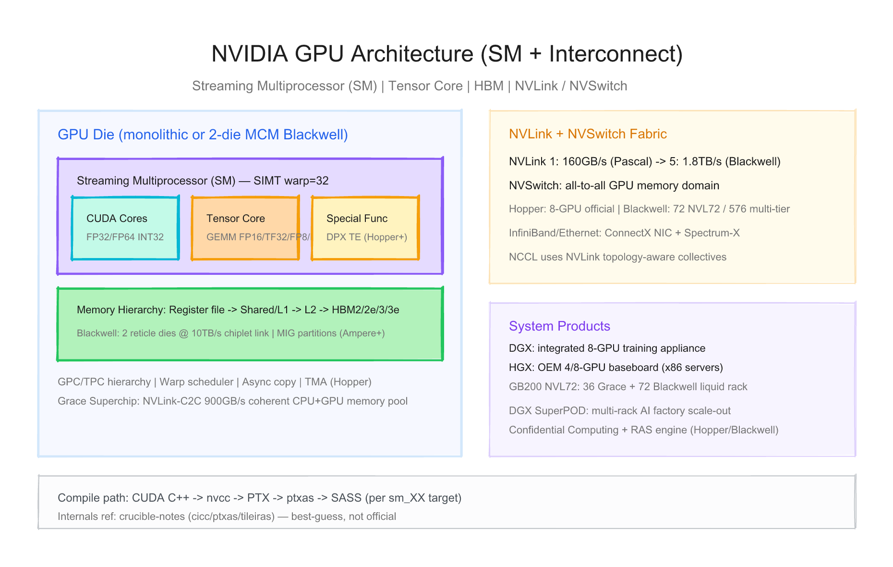
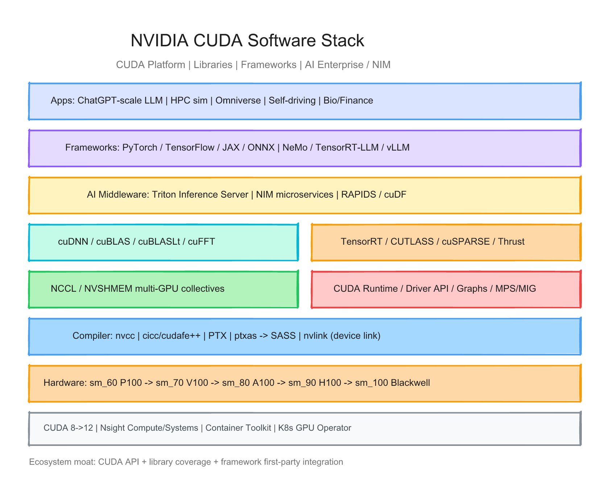

# NVIDIA 数据中心 GPU 每代芯片的硬件与软件调研报告

> 截至日期：2026 年 6 月 26 日。NVIDIA 数据中心 GPU 自 **Kepler/Maxwell** 奠基，经 **Pascal → Volta → Turing/Ampere → Hopper → Blackwell** 演进到 **Rubin/Feynman** 路线图。软件以 **CUDA** 平台为核心，**Tensor Core** 自 Volta 起定义 AI 算力叙事，**NVLink/NVSwitch** 支撑千卡/万卡扩展，**Grace CPU + NVLink-C2C** 自 Hopper 时代引入 CPU-GPU 融合。本报告聚焦**数据中心/AI 加速器**主线（Tesla / HGX / DGX / Grace Blackwell），按「硬件架构 + 软件栈」梳理代际差异，并给出三张架构图。**Internals 层**（PTX/SASS 编译 pipeline）见 `rules/skills/reference_crucible_notes.md`，与本文产品层分节。

---

## 一、世代总览

| 阶段 | 架构 | 代表 SKU | Compute Cap. | 工艺 | 晶体管 | 内存 | 峰值带宽 | Tensor 峰值（公开） | NVLink | TDP | 发布 |
|---|---|---|---|---|---|---|---|---|---|---|---|
| **Kepler** | Kepler | **K80** | sm_37 | 28nm | — | 24 GB GDDR5 | ~480 GB/s | 无 TC | — | 300 W | **2014** |
| **Maxwell** | Maxwell | **M40/M60** | sm_52 | 28nm | — | 24 GB GDDR5 | ~288 GB/s | 无 TC | — | 250 W | **2015** |
| **Pascal** | Pascal | **P100** | **sm_60** | **16nm** | **15.3B** | **16 GB** HBM2 | **720 GB/s** | FP16 21 TF（无 TC） | **v1 160 GB/s** | 300 W | **2016** |
| **Volta** | Volta | **V100** | **sm_70** | **12nm** | **21.1B** | **32 GB** HBM2 | **900 GB/s** | **125 TF** FP16 | **v2 300 GB/s** | 300 W | **2017** |
| **Turing** | Turing | **T4** | **sm_75** | 12nm | — | 16 GB GDDR6 | 300 GB/s | INT8 130 TOPS | — | 70 W | **2018** |
| **Ampere** | Ampere | **A100** | **sm_80** | **7nm** | **54.2B** | **80 GB** HBM2e | **2.0 TB/s** | **312 TF** FP16（624 稀疏） | **v3 600 GB/s** | 400 W | **2020** |
| **Hopper** | Hopper | **H100** | **sm_90** | **4N** | **80B** | **80 GB** HBM3 | **3.35 TB/s** | **990 TF** FP16（1980 FP8） | **v4 900 GB/s** | 700 W | **2022** |
| **Hopper+** | Hopper | **H200** | sm_90 | 4N | 80B | **144 GB** HBM3e | **~5 TB/s** | 同 H100 | v4 + C2C | 700 W | **2024** |
| **Hopper+** | Grace Hopper | **GH200** | sm_90 | 4N | 80B | 144 GB + **480 GB** LPDDR5X | 5 TB/s + 0.5 TB/s | 同 H100 | **NVLink-C2C 900 GB/s** | — | **2023** |
| **Blackwell** | Blackwell | **B200** | **sm_100** | **4NP** | **208B**（2×die） | **192 GB** HBM3e | **8 TB/s** | **2250+ TF** FP16（4500+ FP8） | **v5 1.8 TB/s** | 1000 W | **2024–25** |
| **Blackwell** | Grace Blackwell | **GB200** | sm_100 | 4NP | 208B×2 GPU | 384 GB HBM3e + 480 GB LPDDR5X | — | 同 B200 | C2C + v5 | ~2700 W | **2025** |
| **Blackwell Ultra** | Blackwell | **B300** | sm_100 | 4NP | 208B | **288 GB** HBM3e | 8 TB/s | 增强 FP4 | v5 | 1000 W | **2025 H2** |
| **规划** | **Rubin** | VR300 等 | — | — | — | **HBM4** | — | — | **NVLink 6** | — | **2026** |
| **规划** | **Rubin Ultra** | — | — | — | 4 chiplets | **1 TB** HBM4E | — | — | NVLink 7 | — | **2027** |
| **规划** | **Feynman** | — | — | 3D stacking | — | 定制 HBM | — | — | CPO NVSwitch | — | **2028** |

**命名注意**：
- **Tesla** 为早期数据中心品牌；现以 **HGX/DGX/GB200 NVL** 系统形态为主。
- **T4** 属 Turing 推理卡，与 **A100** 训练主力分线；Turing 亦含 RTX 20 消费级（本报告不展开）。
- **H200/GH200** 为 Hopper **内存 refresh**，非新 major 架构。
- **B100** 为 Blackwell 单 die、~700 W 降配 SKU，兼容 HGX H100 插槽。
- **sm_XX** 为 PTX/SASS 编译目标；Blackwell 为 **sm_100**（[CUDA Toolkit 文档](https://docs.nvidia.com/cuda/)）。

代际间关键趋势：**HBM + NVLink 奠基 → Tensor Core → TF32/稀疏/MIG → FP8/Transformer Engine → FP4/MCM/Grace 融合 → HBM4/chiplet 超节点**；软件 **CUDA 8→12** 与库/框架深度绑定。



---

## 二、硬件架构演进

### 2.1 设计哲学 — SIMT GPGPU + Tensor Core + 机架级扩展

NVIDIA 数据中心 GPU 走 **SIMT（warp=32）+ 专用 Tensor Core** 的通用加速路线，相对专用 AI 芯片（Cerebras、Graphcore 等）强调：

| 维度 | NVIDIA 数据中心 GPU | 典型专用 AI 加速器 |
|---|---|---|
| 编程模型 | **CUDA** 开放 API（闭源实现）+ 丰富库 | 厂商专有编译器/图编译 |
| AI 单元 | **Tensor Core**（Volta 起，逐代扩展精度） | 脉动阵列 / SRAM 近存 |
| 内存 | **HBM** 栈 + 大 L2；Grace 融合 **LPDDR5X** | 片上 SRAM 或 HBM 为主 |
| 扩展 | **NVLink/NVSwitch** + **NCCL** + InfiniBand | 专有互联 |
| 形态 | PCIe / SXM / OAM 类 HGX / **整柜 NVL72** | appliance 为主 |
| 精度演进 | FP64 HPC → FP16/TF32 → **FP8 → FP4** | 常聚焦 INT8/FP8 |

> 「Each generation built upon the last, removing the next bottleneck — be it precision, memory size, or data transfer.」（综合 [ServerSimply 代际分析](https://www.serversimply.com/blog/evolution-of-nvidia-data-center-gpus)）



### 2.2 Kepler / Maxwell（2012–2015）— 前 Tensor 时代

| 项目 | K80 (Kepler) | M40 (Maxwell) |
|---|---|---|
| 定位 | 双芯 HPC/训练 | 推理/训练 |
| 内存 | 24 GB GDDR5 | 24 GB GDDR5 |
| FP64 | 1/3 速率 | 1/32 速率 |
| Tensor Core | ❌ | ❌ |
| 意义 | 深度学习早期用 FP32 CUDA Core 训练 | 能效改进；仍为 GDDR |

**软件**：CUDA 6–8；**cuDNN** 2.x–5.x 奠定 DL 原语；无 Tensor Core 专用路径。

### 2.3 Pascal — Tesla P100（2016）

Pascal 为现代数据中心 GPU 奠基（[NVIDIA P100 白皮书](https://images.nvidia.com/content/pdf/tesla/whitepaper/pascal-architecture-whitepaper.pdf)）。

| 项目 | P100 (GP100) |
|---|---|
| 工艺 | TSMC **16nm**，**15.3B** 晶体管 |
| 内存 | **16 GB HBM2**，**720 GB/s** |
| 算力 | FP64 **5.3 TF**；FP32 **10.6 TF**；FP16 **21.2 TF** |
| 互联 | **NVLink 1.0**  debut，**160 GB/s** 双向 |
| SM | **sm_60**；56 SM（P100 SXM2） |
| TDP | 300 W |

**意义**：首次 **HBM2 + NVLink**；FP16 2× FP32 速率预示 AI 低精度趋势；**无 Tensor Core**。

### 2.4 Volta — Tesla V100（2017）

Volta 引入 **Tensor Core**，重塑 AI 算力定义（[Volta 架构白皮书](https://images.nvidia.com/content/volta-architecture/pdf/volta-architecture-whitepaper.pdf)）。

| 项目 | V100 (GV100) |
|---|---|
| 工艺 | TSMC **12nm**，**21.1B** 晶体管，815 mm² |
| Tensor Core | **640 个**（每 SM 8 个）；**125 TFLOPS FP16** |
| CUDA Core | 5120 FP32；**独立线程调度** |
| 内存 | **16/32 GB HBM2**，**900 GB/s** |
| 互联 | **NVLink 2.0**，**300 GB/s** |
| SM | **sm_70**；80 SM |
| TDP | 300 W |

**意义**：AI 训练 **~12×** Pascal 级 tensor 吞吐（vendor）；DGX-1 **8×V100** 成为 AI 实验室标配。

### 2.5 Turing — Tesla T4（2018）

Turing 面向**推理**优化，引入 INT8/INT4 Tensor Core（消费级 RTX 20 同架构）。

| 项目 | T4 |
|---|---|
| SM | **sm_75** |
| 内存 | 16 GB GDDR6 |
| TDP | **70 W** 单槽 |
| 场景 | 云端推理、视频、推荐 |
| 算力 | INT8 **130 TOPS**；FP16 **65 TF** |

**意义**：推理 SKU 与训练 **V100/A100** 分线；**TensorRT** 深度优化 INT8 部署。

### 2.6 Ampere — A100（2020）

Ampere 为 2020–2022 AI  boom 主力（GPT-3 等）。

| 项目 | A100 (GA100) |
|---|---|
| 工艺 | TSMC **7nm**，**54.2B** 晶体管 |
| SM | **108 SM**，**sm_80** |
| Tensor Core | **3rd-gen**：**TF32**、**BF16**、**FP64 TC**、**结构化稀疏** |
| 算力 | FP32 19.5 TF；Tensor **312 TF FP16**（稀疏 **624 TF**） |
| 内存 | **40→80 GB** HBM2e，**2.0 TB/s**；**40 MB L2** |
| **MIG** | 最多 **7** 实例分区 |
| 互联 | **NVLink 3**，**600 GB/s** |
| TDP | 400 W (SXM4) |

**意义**：**MIG** 多租户云；**TF32** 无需改代码加速 FP32 训练；**稀疏** 2× 推理吞吐。

### 2.7 Hopper — H100 / H200 / GH200（2022–2024）

Hopper 针对 **Transformer** 与大模型优化（[Hopper 架构白皮书](https://resources.nvidia.com/en-us-tensor-core/nvidia-h100-tensor-co)）。

| 项目 | H100 (GH100) | H200 | GH200 Superchip |
|---|---|---|---|
| 工艺 | TSMC **4N**，**80B** 晶体管 | 同 H100 | Grace **72 核** + H200 |
| SM | **132 SM**，**sm_90** | 同左 | 同左 |
| Tensor Core | **4th-gen** + **FP8** + **Transformer Engine** | 同左 | 同左 |
| 算力 | **990 TF FP16**（**1980 FP8** 稀疏） | 同左 | 同左 |
| 内存 | **80 GB HBM3**，3.35 TB/s | **144 GB HBM3e**，~5 TB/s | **624 GB** 统一池（144+480 GB） |
| 新特性 | **Confidential Computing**、**DPX**、**TMA** | 内存 refresh | **NVLink-C2C 900 GB/s** |
| 互联 | **NVLink 4**，900 GB/s | 同左 | CPU-GPU 相干 |
| TDP | 700 W (SXM5) | 700 W | — |

**Transformer Engine**：软硬件协同在 **FP8/FP16** 间动态选精度，官方称 LLM 训练 **9×**、推理 **30×** vs A100（特定模型/workload，Tier 1）。

**H200 NVL**：多卡 PCIe 模块，**564 GB** 合计 HBM3e，共享内存域做大模型推理。

### 2.8 Blackwell — B200 / B300 / GB200（2024–2025）

Blackwell 为 **MCM 双 die** 旗舰，融合 Grace CPU（[Blackwell 架构页](https://www.nvidia.com/en-us/data-center/technologies/blackwell-architecture/)）。

| 项目 | B200 | B300 (Ultra) | GB200 Superchip | GB200 NVL72 |
|---|---|---|---|---|
| 封装 | **2× reticle die**，10 TB/s die间互联 | 同左，**12-high HBM** | **2× B200 + Grace** | **36× GB200** 机架 |
| 晶体管 | **208B** | 208B | — | 72 GPU + 36 CPU |
| 内存 | **192 GB HBM3e**，**8 TB/s** | **288 GB HBM3e** | **864 GB** 统一池/GPU 模块 | **13.5 TB** HBM（rack 叙事） |
| Tensor | **FP4** 推理；**2250+ TF FP16** | +50% 内存 | 同 B200 | **30×** LLM 推理 vs H100（vendor） |
| 互联 | **NVLink 5**，**1.8 TB/s** | 同左 | C2C 900 GB/s | **130 TB/s** NVLink 域带宽 |
| TDP | **1000 W** (SXM6) | 1000 W | ~1700–2700 W | 液冷整柜 |
| 新引擎 | **RAS**、**解压缩引擎** | 同左 | — | AI factory 形态 |

**B100**：单 die、~700 W，**HGX 兼容** H100 系统升级路径。

**GB300 NVL72 / NVL144**：B300 Ultra 机架；官方称 FP4 推理 **1.1 EF**、FP8 训练 **360 PF**（dense，vendor PPT 级）。

### 2.9 路线图 — Rubin / Feynman（2026–2028）

| 产品 | 时间 | 要点（公开 roadmap） |
|---|---|---|
| **Vera Rubin** | **2026 H2** | **HBM4**；**NVLink 6**；与 Vera CPU 配对 |
| **Rubin Ultra** | **2027 H2** | **4 compute chiplets**；**1 TB HBM4E**；Kyber **NVL144** |
| **Feynman** | **2028** | **3D die stacking**；定制 HBM；**CPO NVSwitch** |
| **Groq LPU** | 2026+ | 2025 GTC 后 NVIDIA 路线图纳入 **LPU** 线（推理专用，与 GPU 并列） |

（来源：[Next Platform 2028 roadmap](https://www.nextplatform.com/2025/03/19/nvidia-draws-gpu-system-roadmap-out-to-2028/)、[DCD GTC 2026](https://www.datacenterdynamics.com/en/news/nvidia-updates-data-center-product-roadmap-following-lpu-launch-at-gtc-2026/)）

---

## 三、软件栈演进

### 3.1 全栈分层 — CUDA 平台

```
行业应用 / DGX Cloud / Omniverse / 自动驾驶 / 生物信息
        ↓
PyTorch / TensorFlow / JAX / NeMo / TensorRT-LLM / vLLM / Triton
        ↓
cuDNN | cuBLAS/Lt | TensorRT | CUTLASS | RAPIDS
        ↓
NCCL | NVSHMEM | cuTENSOR | Thrust
        ↓
CUDA Runtime / Driver | CUDA Graphs | MPS | MIG 管理
        ↓
nvcc → cicc/cudafe++ → PTX → ptxas → SASS | nvlink
        ↓
GPU Driver (内核模块) + 固件 + Confidential Computing
        ↓
P100 → V100 → A100 → H100 → B200 (sm_60 → sm_100)
```



入口：[CUDA Toolkit](https://developer.nvidia.com/cuda-toolkit) | [CUDA 文档](https://docs.nvidia.com/cuda/) | [NVIDIA AI Enterprise](https://www.nvidia.com/en-us/data-center/products/ai-enterprise/)

### 3.2 核心组件

| 组件 | 作用 |
|---|---|
| **CUDA Driver / Runtime** | 设备管理、内存、kernel 启动、Stream/Event/Graph |
| **nvcc + ptxas** | CUDA C++ → **PTX** → **SASS**；按 **sm_XX** 多架构 fatbin |
| **cuDNN** | 深度学习原语（conv、RNN、attention 等） |
| **cuBLAS / cuBLASLt** | GEMM；Lt 支持融合与低精度 |
| **TensorRT** | 推理图优化、INT8/FP8 量化、engine 部署 |
| **NCCL** | 多 GPU **AllReduce** 等；NVLink 拓扑感知 |
| **CUTLASS** | 模板化 GEMM/Tensor Core kernel 构建块 |
| **Transformer Engine** | FP8/FP4 训练推理库（Hopper/Blackwell） |
| **TensorRT-LLM** | LLM 推理优化（PagedAttention、量化） |
| **NeMo** | 大模型训练框架（Megatron 集成） |
| **Triton Inference Server** | 多框架 serving |
| **Nsight Compute/Systems** | Kernel 级 / 系统级 profiling |

**Internals 参考**（非官方，需标注可信度）：crucible-notes 覆盖 **cicc**、**cudafe++**、**ptxas**（159-phase pipeline）、**tileiras**（Cuda Tile IR）、**nvlink** device linker — 见 [`reference_crucible_notes.md`](../../rules/skills/reference_crucible_notes.md)。

### 3.3 CUDA 版本 × 硬件代际里程碑

| CUDA 版本 | 时期 | 硬件支持 | 里程碑 |
|---|---|---|---|
| **CUDA 8** | 2016 | **Pascal P100** | Unified Memory 增强；配合 cuDNN 5 |
| **CUDA 9** | 2017 | **Volta V100** | **Cooperative Groups**；Tensor Core API |
| **CUDA 10** | 2018 | **Turing T4/RTX** | CUDA Graphs 雏形 |
| **CUDA 11** | 2020 | **Ampere A100** | **MIG**、**TF32**、**稀疏**、cuBLASLt 主力 |
| **CUDA 12** | 2022+ | **Hopper H100**、**Blackwell** | **FP8**、**TMA**、sm_90/sm_100、**Grace** 支持 |
| **CUDA 12.x+** | 2024–25 | H200、B200 | Transformer Engine 2.0、**FP4**、Confidential Computing |

### 3.4 框架与生态

| 能力 | 说明 |
|---|---|
| **PyTorch** | NVIDIA 深度 upstream 合作；**CUDA 12 + cuDNN 9** 为 H100/B200 默认栈 |
| **TensorFlow / JAX** | CUDA/cuDNN 后端；JAX 通过 PJRT/XLA GPU |
| **vLLM / SGLang** | TensorRT-LLM、FlashAttention-2/3 与 Hopper/Blackwell 对齐 |
| **容器** | **NGC** 镜像；**NVIDIA Container Toolkit** |
| **K8s** | **GPU Operator**、MIG 设备插件、DGX K8S 参考架构 |
| **虚拟化** | **vGPU**、MIG 分区、Confidential Computing VM |
| **HPC** | **CUDA Fortran**、OpenACC、cuSOLVER、NVHPC SDK |

### 3.5 硬件代际 × 软件能力矩阵

| 能力 | P100 | V100 | A100 | H100 | B200 |
|---|---|---|---|---|---|
| CUDA Core GEMM | ✅ | ✅ | ✅ | ✅ | ✅ |
| Tensor Core | ❌ | ✅ FP16 | ✅ TF32/BF16/稀疏 | ✅ **FP8** | ✅ **FP4** |
| cuDNN 深度优化 | 基础 | ✅ | ✅ | ✅ Flash/FA | ✅ TE 2.0 |
| NCCL 千卡 | 有限 | ✅ | ✅ | ✅ | ✅ NVL72 |
| MIG 分区 | ❌ | ❌ | ✅ 7 | ✅ | ✅ |
| TF32 | ❌ | ❌ | ✅ | ✅ | ✅ |
| FP8 训练/推理 | ❌ | ❌ | ❌ | ✅ TE | ✅ |
| FP4 推理 | ❌ | ❌ | ❌ | ❌ | ✅ |
| Confidential Computing | ❌ | ❌ | ❌ | ✅ | ✅ |
| Grace 统一内存 | ❌ | ❌ | ❌ | ✅ GH200 | ✅ GB200 |
| TensorRT-LLM | — | 早期 | ✅ | ✅ | ✅ day-zero |

---

## 四、设计哲学的七次转向

**第一次（Kepler/Maxwell，2012–2015）**：用 **GDDR + 大量 CUDA Core** 验证 GPU 通用计算与早期 DL；**无专用 AI 单元**。

**第二次（Pascal P100，2016）**：**HBM2 + NVLink** 奠基数据中心形态；FP16 2× 速率；仍为向量路径做 AI。

**第三次（Volta V100，2017）**：**Tensor Core** 诞生——矩阵乘加硬件化，AI 算力与 HPC FP64 并存。

**第四次（Turing T4 + Ampere A100，2018–2020）**：**推理/训练分 SKU**；**TF32、稀疏、MIG** 对齐云化与 LLM 前夜；7nm 规模跃迁。

**第五次（Hopper H100，2022）**：**FP8 + Transformer Engine** 对准大模型；**Confidential Computing**；**Grace + NVLink-C2C** 开启 CPU-GPU 融合。

**第六次（Blackwell B200/GB200，2024–2025）**：**MCM 双 die** 突破 reticle；**FP4** 推理；**NVLink 5 + NVL72 机架** 把 GPU 堆栈从卡级推到 **AI factory** 级。

**第七次（Rubin/Feynman，2026+）**：**HBM4/chiplet/CPO** 继续抬内存墙与互联带宽；**LPU** 与 GPU 并列，推理/workload 进一步分化。

---

## 五、与外部生态及验证缺口

**生态**
- 云：AWS/Azure/GCP/OCI 全系列 **A100/H100/B200** 实例
- 超算：**Frontier 之后** 大量系统仍用 NVIDIA（Selene、Alps 等）；**Grace Hopper** 进入 NERSC、JSC
- 框架：**CUDA 优先** 仍是 industry default；AMD ROCm、Intel XPU 为追赶者

**竞争格局**
- 优势：**CUDA 生态锁-in**、**全栈（硅+互联+软件+系统）**、**年度 cadence**、**LLM 优化深度**
- 风险：**供应/地缘政治**、**1000W+ 功耗与液冷基础设施**、**peak TFLOPS vs real workload** 差距、**闭源栈** 审计难度

**本报告标注的验证缺口**
1. **Kepler/Maxwell** 早期 Tesla 仅摘要；现代 AI 栈已不官方支持
2. **Blackwell 2250/4500 TF** 等为 vendor peak；**FP4 精度损失** 依模型而异
3. **GB200 30×/25× 能效** 为特定 LLM 与 NVL72 配置（Tier 1 marketing）
4. **Rubin/Feynman/LPU** 仅 roadmap/PPT，无量产 silicon 独立评测
5. **sm_100 内部 SM 数/L2 容量** 以 Nsight 与官方 whitepaper 为准；本报告不与 AMD CU 严格对比
6. **B100 vs B200** 单 die 性能比无完整 public datasheet
7. crucible-notes **PTX/SASS pipeline** 为逆向重建，**不可**作为官方行为依据
8. **576 GPU NVLink 域** 为多 tier 理论上限，实际集群拓扑依 NVSwitch 代数而异

---

## 六、参考来源

- [NVIDIA Blackwell Architecture](https://www.nvidia.com/en-us/data-center/technologies/blackwell-architecture/)
- [NVIDIA Hopper H100 Tensor Core GPU](https://resources.nvidia.com/en-us-tensor-core/nvidia-h100-tensor-co)
- [Pascal Architecture Whitepaper](https://images.nvidia.com/content/pdf/tesla/whitepaper/pascal-architecture-whitepaper.pdf)
- [Volta Architecture Whitepaper](https://images.nvidia.com/content/volta-architecture/pdf/volta-architecture-whitepaper.pdf)
- [CUDA Toolkit Documentation](https://docs.nvidia.com/cuda/)
- [CUDA GPU Feature List / Compute Capability](https://docs.nvidia.com/cuda/cuda-c-programming-guide/index.html#compute-capabilities)
- [ServerSimply: Pascal to Grace Blackwell Evolution](https://www.serversimply.com/blog/evolution-of-nvidia-data-center-gpus)
- [Next Platform: GPU Roadmap to 2028](https://www.nextplatform.com/2025/03/19/nvidia-draws-gpu-system-roadmap-out-to-2028/)
- [Next Platform: AI System Roadmap 2026](https://www.nextplatform.com/compute/2026/03/19/driving-down-the-ai-system-roadmap-with-nvidia/5210195)
- [DCD: GTC 2026 Roadmap Update](https://www.datacenterdynamics.com/en/news/nvidia-updates-data-center-product-roadmap-following-lpu-launch-at-gtc-2026/)
- [Wikipedia: CUDA](https://en.wikipedia.org/wiki/CUDA)
- [Wikipedia: Nvidia Tesla](https://en.wikipedia.org/wiki/Nvidia_Tesla)
- [Crucible Notes CUDA toolchain](https://gh.evko.io/crucible-notes/)（internals，非官方）
- 本 workspace：[`rules/skills/reference_crucible_notes.md`](../../rules/skills/reference_crucible_notes.md)

---

## 附：架构图索引

| 图 | 预览 | 源文件 |
|---|---|---|
| GPU 世代演进（Kepler → Blackwell → Rubin） | `assets/nvidia_gpu_hw_generations.png` | `assets/nvidia_gpu_hw_generations.excalidraw` |
| SM/Tensor Core + NVLink 集群 | `assets/nvidia_gpu_chip_architecture.png` | `assets/nvidia_gpu_chip_architecture.excalidraw` |
| CUDA 软件栈 | `assets/nvidia_gpu_software_stack.png` | `assets/nvidia_gpu_software_stack.excalidraw` |
