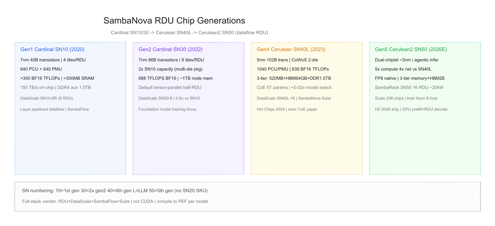
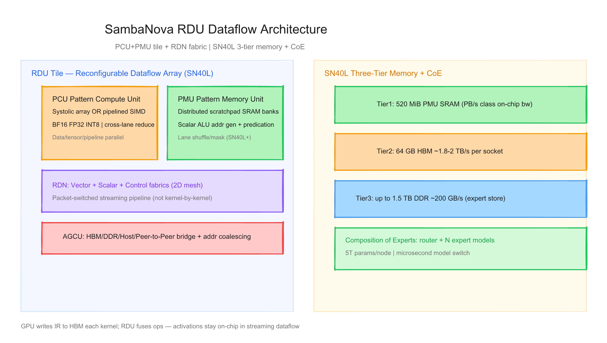
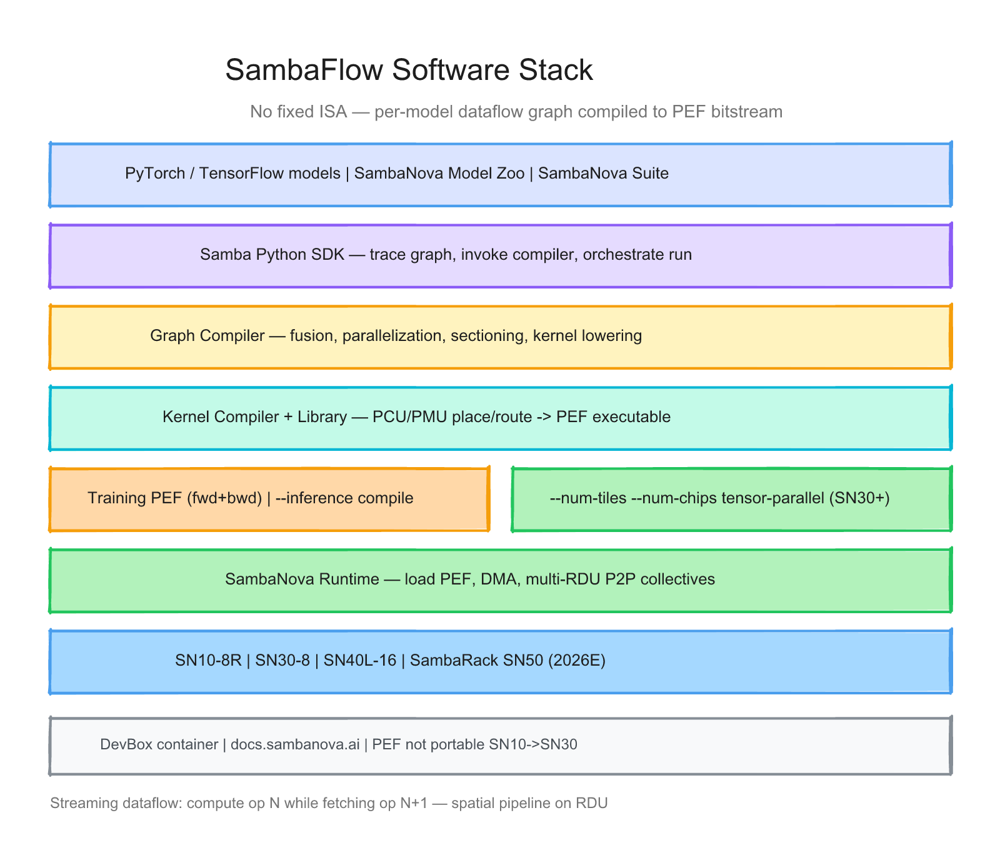

# SambaNova 每代 RDU 的硬件与软件调研报告

> 截至日期：2026 年 6 月 26 日。SambaNova Systems 成立于 2017 年（斯坦福团队），走 **可重构数据流（Reconfigurable Dataflow）** 路线：自研 **RDU（Reconfigurable Dataflow Unit）** 处理器，以 **PCU/PMU 空间流水线** 替代 GPU 式 kernel-by-kernel 执行，减少中间激活写回 HBM。软件 **SambaFlow** 将 PyTorch/TensorFlow 模型编译为 **PEF（Portable Executable Format）** 数据流 bitstream——**无固定 ISA**，每模型单独映射。截至本期公开四代硅：**Cardinal SN10 → SN30 → Cerulean SN40L → Cerulean2 SN50（2026E 出货）**；系统品牌 **DataScale / SambaRack**，全栈 **SambaNova Suite**。本报告按「硬件架构 + 软件栈」梳理代际差异，并给出三张架构图。

---

## 一、世代总览

| 阶段 | 芯片系列 | 系统 | 工艺 | 晶体管 | PCU/PMU | 峰值算力 | 内存层次 | 主用途 | 状态 |
|---|---|---|---|---|---|---|---|---|---|
| **Gen1** | **Cardinal SN10** | **DataScale SN10-8R** | **7nm** | **40B** | **640+640** | **>300** BF16 TFLOPS | **>300 MB** SRAM + DDR4 | 训推 | **2020 量产** |
| **Gen2** | **Cardinal SN30** | **DataScale SN30-8** | **7nm** | **86B** | 2× SN10 级 | **688** BF16 TFLOPS | 2× SRAM + **~1 TB** 节点 DDR | 基础模型训练 | **2022 发货** |
| **Gen4*** | **Cerulean SN40L** | **DataScale SN40L-16** | **5nm** | **102B** | **1040+1040** | **638** BF16 TFLOPS | **520MB+HBM64GB+DDR1.5TB** | LLM 训推 + **CoE** | **2023 发布** |
| **Gen5** | **Cerulean2 SN50** | **SambaRack SN50** | **~3nm**† | — | dual-chiplet | **5× SN40L** 算力‡ | 3-tier + **FP8** | **Agentic 推理** | **2026 H2 出货** |

\* **SN 编号规则**：**10** = 第 1 代；**30** = 第 2 代（容量 **2×**，非「第 30 代」）；**40** = **第 4 代**（跳过 SN20 产品名）；**L** = LLM 优化；**50** = 第 5 代（[Next Platform](https://www.nextplatform.com/ai/2023/09/20/sambanova-tackles-generative-ai-with-new-chip-and-new-approach/1639711)）。  
† SN50 工艺：官方未发 Hot Chips 级 die shot；行业分析估 **TSMC 3nm**（Tier 2）。  
‡ SN50 **5× 计算、4× 网络带宽** 相对 SN40L（[官方 Blog](https://sambanova.ai/blog/introducing-the-sn50-rdu-purpose-built-for-agentic-inference)）；绝对 PFLOPS 待 datasheet。

**命名注意**：架构色系 **Cardinal（SN10/30）→ Cerulean（SN40L）→ Cerulean2（SN50）**；SambaNova **不卖裸片**，售 **DataScale / SambaRack 整机 + SambaNova Suite 软件订阅**。

代际间关键趋势：**片上 SRAM 数据流 → 多 die 翻倍（SN30）→ 三档内存 + HBM + Composition of Experts（SN40L）→ Agentic 推理 + Intel 异构蓝图（SN50）**；软件从 **Layer 级 PEF** 演进到 **CoE 多模型微秒切换 + tensor parallel 编译选项**。

---

## 二、硬件架构演进

### 2.1 设计哲学 — 数据流 vs Kernel-by-Kernel

SambaNova 与 NVIDIA GPU 的根本差异：**不做 SIMT + 固定 ISA**，而为每个模型生成 **空间数据流图**，算子以 **流水线** 在 PCU/PMU 上串联，计算 op *N* 的同时并行取 op *N+1* 的数据（[Dataflow Architecture](https://sambanova.ai/products/dataflow-architecture)）。

| 维度 | SambaNova RDU | 典型 GPU |
|---|---|---|
| 执行模型 | **Streaming spatial dataflow** | Kernel launch 循环 |
| 中间激活 | 尽量留 **片上 PMU SRAM** | 每 kernel 写回 HBM |
| 编程 | **SambaFlow 编译为 PEF** | CUDA 手写/库调用 |
| ISA | **无固定 ISA** | PTX/SASS |
| 内存 | SN40L：**SRAM + HBM + DDR** 三档 | 主要 HBM |
| 多模型 | **CoE** 微秒级切换（SN40L+） | 多进程/多卡成本高 |

> 「Instead of operating kernel-by-kernel, dataflow is enabled through a grid of PCUs and PMUs… parallelization of memory and compute on-chip keeps all intermediate activations local.」（SambaNova 官方）

### 2.2 通用 RDU 微架构块

**Tile 组成**（[Hot Chips 33 SN10](https://hc33.hotchips.org/assets/program/conference/day2/SambaNova%20HotChips%202021%20Aug%2023%20v1.pdf)、[arxiv SN40L](https://arxiv.org/html/2405.07518v2)）：

| 模块 | 全称 | 功能 |
|---|---|---|
| **PCU** | Pattern Compute Unit | 可配置 **systolic array** 或 **pipelined SIMD**；BF16/FP32/INT8；cross-lane reduction |
| **PMU** | Pattern Memory Unit | 分布式 **scratchpad SRAM**；标量 ALU 地址生成；bank 交织与 predication |
| **AGCU** | Address Generation & Coalescing Unit | 访问 **HBM/DDR/Host/远端 RDU**；DMA 合并 |
| **RDN** | Reconfigurable Dataflow Network | **Vector + Scalar + Control** 三 fabric；2D mesh 包交换 |
| **TLN** | Top Level Network | Tile 到 Host/Memory/P2P 接口 |

**SN10 奠基**（2019 tape-out，2020 量产）：
- **TSMC 7nm**，**40B** 晶体管，**50 km** 连线
- **640 PCU + 640 PMU**，**>300 BF16 TFLOPS**，**>300 MB** 片上内存，**150 TB/s** 片上带宽
- **4 tiles/RDU**；**DataScale SN10-8R**：**8× RDU**，**12 TB** DDR4（48 通道），**32× PCIe Gen4 x16**

### 2.3 Gen1 — Cardinal SN10 + DataScale SN10-8R（2020）

[Hot Chips 33](https://hc33.hotchips.org/assets/program/conference/day2/SambaNova%20HotChips%202021%20Aug%2023%20v1.pdf) 定稿：

| 项目 | 规格 |
|---|---|
| PCU | 可重构 SIMD；BF16（FP32 accumulate）；FP32/INT32/INT16/INT8 |
| PMU | 内存变换操作；与 PCU 一一配对 |
| 互联 | 可编程 **packet-switched** fabric；独立 Data/Control 总线 |
| AGCU | 跨 RDU/Host 透明寻址与 coalescing |
| 系统 | ¼ rack；8 RDU；面向训练 **与** 推理 |

**意义**：首个商用 **RDU**；证明 dataflow 在 dense/sparse 线性代数上可编程。

### 2.4 Gen2 — Cardinal SN30 + DataScale SN30-8（2022）

2022 年 9 月发布（[HPCwire](https://www.hpcwire.com/2022/09/14/sambanova-launches-second-gen-datascale-system/)，[Next Platform](https://www.nextplatform.com/ai/2022/09/17/sambanova-doubles-up-chips-to-chase-ai-foundation-models/1631996)）：

| 项目 | SN30 vs SN10 |
|---|---|
| 设计 | **2× SN10 容量**（multi-die 封装，两枚增强 die 合为 SN30 socket） |
| 晶体管 | **86B** |
| Tiles | **8 tiles/RDU**（SN10 为 4） |
| 算力 | **688 TFLOPS BF16** |
| 内存 | 节点 **~1 TB** DDR（vendor 称 **12.8× DGX A100 80GB**） |
| 性能 | 相对 SN10 **2–6×**；GPT-3 13B 训练 **6× DGX A100**（vendor benchmark） |
| 编译 | 默认 **tensor parallel** 半 RDU 双副本；batch 须为偶数 |

> 「A PEF built on SN10 is not expected to run unmodified on an SN30.」（[官方迁移文档](https://docs-legacy.sambanova.ai/developer/latest/transition-to-sn30.html)）

### 2.5 Gen4 — Cerulean SN40L + DataScale SN40L-16（2023）

2023 年 9 月发布（[Business Wire](https://www.businesswire.com/news/home/20230919534495/en/SambaNova-Unveils-New-AI-Chip-the-SN40L-Powering-its-Full-Stack-AI-Platform)），[Hot Chips 2024](https://hc2024.hotchips.org/assets/program/conference/day1/48_HC2024.Sambanova.Prabhakar.final-withoutvideo.pdf) + [arxiv 2405.07518](https://arxiv.org/html/2405.07518v2) 详述：

| 项目 | SN40L |
|---|---|
| 工艺/封装 | **TSMC 5nm (5FF)**；**CoWoS** **2-die**（RDD ×2 + HBM） |
| 晶体管 | **102B** |
| PCU/PMU | **1040 + 1040** |
| 算力 | **638 BF16 TFLOPS**（<2 GHz） |
| **三档内存** | **520 MiB** PMU SRAM；**64 GiB HBM**（~**1.8–2 TB/s**）；**1.5 TiB DDR**（~**200 GB/s**） |
| Die-to-Die | Tile 间直连 stream，不经 off-chip |
| P2P | 多 socket **RDU-RDU** 集合通信原语 |
| 系统 | **DataScale SN40L-16**：**16× SN40L**；8GB 总 SRAM / 1TB HBM / 12TB DDR（[Product Collateral](https://sambanova.ai/hubfs/23945802/downloads/Product%20Collateral/SambaNova_DataSheet_DataScale_SN30_09132022_EN-1.pdf) 系列 datasheet） |

**相对 SN10 增强**（arxiv §IV-E）：
- 首款 **HBM** tier；**动态 packet 目的地**（split 等）；PMU **lane shuffle/mask**
- 改进 **di/dt** 电压管理（SN10 曾损失至多 **25%** 性能）

**Composition of Experts（CoE）**：
- **N 个完整 expert 模型** + 路由器；单节点可达 **5 trillion parameters**（存储于 DDR/HBM 组合）
- **256k+** 序列长度；**Llama2-7B expert 切换 <0.02s**（vendor）
- Samba-CoE（150×7B experts）相对 DGX H100 **3.7×**、A100 **6.6×**（arxiv，8-socket 节点）

### 2.6 Gen5 — Cerulean2 SN50 + SambaRack SN50（2026E）

2026 年官方发布 **第五代 SN50**（[Blog](https://sambanova.ai/blog/introducing-the-sn50-rdu-purpose-built-for-agentic-inference)），**2026 H2** 出货：

| 项目 | 公开信息 |
|---|---|
| 定位 | **Agentic AI 推理**；decode 吞吐 / 低延迟 / TCO |
| 架构 | **Dual-chiplet**；**Cerulean 2** 演进；**原生 FP8** |
| 性能 | **5× 计算、4× 网络带宽** vs SN40L |
| 系统 | **SambaRack SN50**：**16× SN50**；**~20 kW** **风冷** |
| 规模 | 最多 **256 chips** 多 rack；**10T 参数 / 10M token context**（vendor 产品页） |
| 生态 | **Intel 合作**：GPU **prefill** + SN50 **decode** + **Xeon 6** agent 编排（[Press 2026-04](https://sambanova.ai/press/sambanova-announces-collaboration-with-intel-on-ai-solution)） |

**注意**：SN50 缺 Hot Chips 级晶体管/绝对 TFLOPS 表；部分参数来自 Tier 2 分析（如 HBM2E 选型、~1.6 PF FP16 估测）。

---

## 三、软件栈演进

### 3.1 核心原则：SambaFlow = 图编译 + 空间映射

**SambaFlow™** 全栈（[架构文档](https://docs-legacy.sambanova.ai/developer/latest/sambaflow-intro.html)）：

> 「The RDU does not have a fixed Instruction Set Architecture… programmed specifically for each model resulting in a highly optimized, application-specific accelerator.」（[OSTI RDA 白皮书](https://www.osti.gov/servlets/purl/1798044)）

**编译流水线**（[Compiler Overview](https://docs-legacy.sambanova.ai/developer/latest/compiler-overview.html)）：

1. **Samba Python SDK**：PyTorch 模型 tracing
2. **Graph Compiler**：算子融合、并行化、sectioning、dataflow pipeline 构建
3. **Kernel Compiler + Library**：PCU/PMU place & route → **bitfile**
4. 输出 **PEF**：训练（forward+backward）或 **`--inference`** 仅推理

### 3.2 核心组件

| 组件 | 作用 |
|---|---|
| **Samba** | Python 前端：编译、训练/推理 orchestration |
| **Graph Compiler** | ML 图 → RDU kernel 图 + 调度 |
| **Kernel Compiler** | Kernel 图 → 物理 PCU/PMU 映射 |
| **Kernel Library** | Gemm 等 RDU 优化算子 |
| **SambaNova Runtime** | 加载 PEF、DMA、fault 管理 |
| **Model Zoo** | 公开 GitHub 模型 + **DevBox** 容器 |
| **SambaNova Suite** | SN40L 起 **chip-to-model** 企业全栈（on-prem/cloud） |

### 3.3 编译与运行关键选项

| 选项 | 说明 |
|---|---|
| `--pef-name` | 指定 PEF 输出 |
| `--inference` | 仅编译推理图 |
| `--num-tiles=N` | 使用 N 个 tile（SN10 默认 4，SN30 默认 8） |
| `--num-chips=1` | 单 RDU 4 tiles |
| `--tensor-parallel=batch` | SN30 默认半芯片 tensor parallel |
| PEF 可移植性 | **SN10 PEF 不可直接跑 SN30**；迁移需重编译 + 新 human decision 文件 |

**执行模式**：
- **Streaming dataflow**：tile 化 tensor 在 PCU/PMU pipeline 中流式处理（SN40L 论文核心）
- **Multi-section / meta-pipelining**：大图分 section 顺序驻留 RDU

### 3.4 框架与产品生态

**训练/微调**  
- PyTorch、TensorFlow 输入（[RDA Blog](https://sambanova.ai/blog/accelerating-scientific-applications-with-sambanova-reconfigurable-dataflow-architecture)）  
- Model Zoo + Hugging Face checkpoint 微调  
- 科学计算扩展 API（非 ML 数据流）

**推理**  
- SN40L 起：**SambaNova Suite** 托管开源模型 + 企业 fine-tune（客户保留模型所有权）  
- SN50：**SambaRack** 大规模 token 生成；与 Intel 异构 **prefill/decode** 分工

**不支持**：原生 **CUDA**；迁移需 SambaFlow 编译链与 RDU 定制 Model Zoo 代码。

### 3.5 硬件代际 × 软件里程碑

| 里程碑 | 硬件 | 内容 |
|---|---|---|
| SambaFlow 1.x | SN10 | PEF 训练/推理；4-tile 默认 |
| SN30 迁移指南 | SN30 | 8-tile；tensor parallel；PEF 不兼容 |
| CoE + 三档内存 runtime | SN40L | DDR↔HBM 管理；多模型切换 |
| SambaNova Suite | SN40L | 全栈 LLM 平台 |
| Agentic inference stack | SN50 | SambaRack；Intel 联合参考架构 |

### 3.6 软件栈 × 硬件矩阵

| 能力 | SN10 | SN30 | SN40L | SN50 |
|---|---|---|---|---|
| SambaFlow PEF | ✅ | ✅ 重编译 | ✅ | 规划中 |
| PyTorch/TF | ✅ | ✅ | ✅ | ✅ |
| Tensor parallel 编译 | 有限 | ✅ 默认 | ✅ | — |
| `--inference` | ✅ | ✅ | ✅ | ✅ |
| CoE 多模型 | — | — | ✅ **主力** | ✅ 增强 |
| Model Zoo / DevBox | ✅ | ✅ | ✅ | ✅ |
| Suite 全栈 | — | — | ✅ | ✅ |
| 云/API 推理 | — | — | 部分 | Agentic 重点 |

---

## 四、设计哲学的三次转向

**第一次（SN10 / Cardinal，2020）**：**数据流立旗**——用 PCU/PMU + packet fabric 把神经网络 **空间流水线化**；640 对计算/内存单元证明「少搬数据多算数」；DataScale 8-RDU ¼ rack 可交付。

**第二次（SN30，2022）**：**容量翻倍追基础模型**——multi-die 封装 **2× tile**；688 TFLOPS + **1 TB** 级 DDR 追 GPT 类训练；软件引入 **tensor parallel 编译默认**，但 **PEF 跨代不兼容** 增加迁移成本。

**第三次（SN40L CoE → SN50 Agentic，2023–2026）**：**内存墙 + 多模型**——**HBM+DDR+SRAM 三档** 支撑 **5T 参数 CoE** 与微秒切换；SN50 转向 **agentic decode 经济学**，与 Intel/GPU **异构分工**，从「训练向 GPU 挑战」转向「推理 TCO 主导」。

---

## 五、与外部生态及验证缺口

**生态**  
- 客户：企业 Global 2000、国家实验室、主权 AI（G42 等）；**不售芯片**  
- 文档：[docs.sambanova.ai](https://docs.sambanova.ai) / [docs-legacy.sambanova.ai](https://docs-legacy.sambanova.ai)  
- 开源：Model Zoo（GitHub）；arxiv CoE 论文可复现叙事

**相对 GPU 的能力边界**  
- 优势：**算子融合 / 零中间写回** 叙事、CoE 多模型、SN40L 三档内存、整机交付  
- 风险：**非 CUDA**、**PEF 绑定代际**、benchmark 多为 vendor、SN50 规格未 fully disclosed、市场份额远小于 NVIDIA

**本报告标注的验证缺口**  
1. **无 SN20** 产品——SN 编号与「代际」易混淆  
2. **SN30 = 2× SN10 die** 为 Next Platform 推断 + 官方「doubled」表述，缺 public die map  
3. **SN50** 绝对 TFLOPS/晶体管/工艺 **无 Tier-1 datasheet**  
4. **688 vs 638 TFLOPS**：SN30 算力高于 SN40L 峰值——代际优化目标从 raw TFLOPS 转向 **memory/CoE**  
5. GPT/DGX **6×** 等为 vendor benchmark（Tier 1 PR）  
6. SambaRack **10M token context** 为产品页叙事，缺独立验证  
7. DataScale SN40L-16 datasheet PDF 文件名仍含 **SN30** 字符串（ collateral 命名混乱）

---

## 六、参考来源

- [Hot Chips 33 SN10 PDF](https://hc33.hotchips.org/assets/program/conference/day2/SambaNova%20HotChips%202021%20Aug%2023%20v1.pdf)
- [HPCwire SN30 发布](https://www.hpcwire.com/2022/09/14/sambanova-launches-second-gen-datascale-system/)
- [Next Platform SN30 深度](https://www.nextplatform.com/ai/2022/09/17/sambanova-doubles-up-chips-to-chase-ai-foundation-models/1631996)
- [SN30 迁移文档](https://docs-legacy.sambanova.ai/developer/latest/transition-to-sn30.html)
- [SN40L Business Wire](https://www.businesswire.com/news/home/20230919534495/en/SambaNova-Unveils-New-AI-Chip-the-SN40L-Powering-its-Full-Stack-AI-Platform)
- [arxiv SN40L CoE 论文](https://arxiv.org/html/2405.07518v2)
- [Hot Chips 2024 SN40L PDF](https://hc2024.hotchips.org/assets/program/conference/day1/48_HC2024.Sambanova.Prabhakar.final-withoutvideo.pdf)
- [Dataflow Architecture 产品页](https://sambanova.ai/products/dataflow-architecture)
- [SambaFlow 架构文档](https://docs-legacy.sambanova.ai/developer/latest/sambaflow-intro.html)
- [Compiler Overview](https://docs-legacy.sambanova.ai/developer/latest/compiler-overview.html)
- [RDA 科学计算 Blog](https://sambanova.ai/blog/accelerating-scientific-applications-with-sambanova-reconfigurable-dataflow-architecture)
- [OSTI RDA 白皮书](https://www.osti.gov/servlets/purl/1798044)
- [SN50 发布 Blog](https://sambanova.ai/blog/introducing-the-sn50-rdu-purpose-built-for-agentic-inference)
- [SN50 RDU 产品页](https://sambanova.ai/products/rdu-ai-chips)
- [SambaRack 产品页](https://sambanova.ai/products/sambarack)
- [Intel 合作 Press Release](https://sambanova.ai/press/sambanova-announces-collaboration-with-intel-on-ai-solution)
- [Next Platform SN40L 分析](https://www.nextplatform.com/ai/2023/09/20/sambanova-tackles-generative-ai-with-new-chip-and-new-approach/1639711)

---

## 附：架构图索引

| 图 | 预览 | 源文件 |
|---|---|---|
| RDU 世代演进（SN10→SN50） | `assets/sambanova_rdu_hw_generations.png` | `assets/sambanova_rdu_hw_generations.excalidraw` |
| 数据流芯片架构（PCU/PMU/RDN + CoE 内存） | `assets/sambanova_rdu_chip_architecture.png` | `assets/sambanova_rdu_chip_architecture.excalidraw` |
| SambaFlow 软件栈层级 | `assets/sambanova_rdu_software_stack.png` | `assets/sambanova_rdu_software_stack.excalidraw` |
